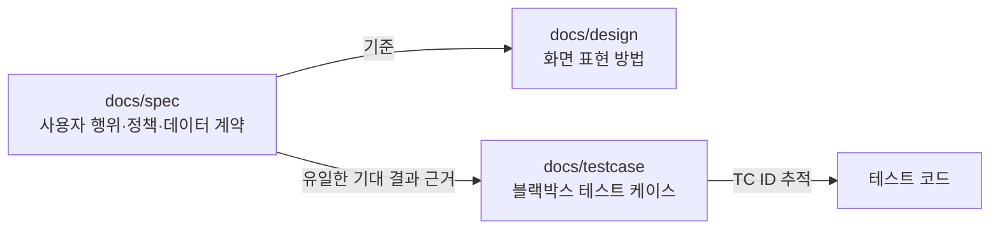

# 제품 문서

문서는 종류마다 소유 범위가 다르다. 같은 내용을 두 문서에 적지 않고, 그 내용을 소유한 문서를 링크한다.

| 문서 | 소유 범위 | 관리 스킬 |
| --- | --- | --- |
| [docs/spec](spec/README.md) | 사용자 행위, 관찰 가능한 결과, 제품 정책, 데이터 계약 | `spec-wave` |
| [docs/design](design/README.md) | 화면 구조, 조작 수단, 적응형 배치, 시각 표현, 문구와 접근성 이름 | `design-wave` |
| [docs/testcase](testcase/README.md) | 스펙 기준의 블랙박스 테스트 케이스와 고유 ID | `testcase-wave` |
| [docs/reference](reference/README.md) | 특정 화면이나 기능에 묶이지 않는 참고 자료 | 없음 |

## 문서 사이의 규칙

- 디자인은 스펙의 행위, 결과, 상태, 정책을 바꾸지 않는다. 스펙과 충돌하면 스펙을 기준으로 한다.
- 테스트 케이스는 스펙을 기대 결과의 유일한 근거로 삼고, 구현 용어를 쓰지 않는다.
- 스펙에 없는 제품 판단이 필요하면 디자인이나 테스트 케이스에서 추정하지 않고 스펙을 먼저 확정한다.
- 여러 화면이 공유하는 행동은 공통 스펙 문서가 소유하고, 각 화면 문서는 적용되는 부분만 다룬다.
