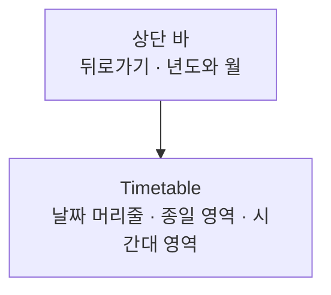

# CalendarTimetable 디자인

기준 스펙: [CalendarTimetable 화면 스펙](../spec/client/calendar-timetable.md)

## 화면 구조

화면 위쪽에는 상단 바를 두고, 그 아래 나머지 영역 전체를 [Timetable 컴포넌트 디자인](timetable.md)으로 채운다.

Timetable은 시스템 내비게이션 바 위에서 끝나므로, 마지막 시간대까지 시스템 바에 가리지 않고 스크롤된다.

## 상단 바

상단 바 왼쪽에는 뒤로가기 버튼을 두고, 그 오른쪽에 표시 중인 날짜의 년도와 월을 제목으로 표시한다. 제목 형식은 [CalendarHome 디자인](calendar-home.md)의 `문구`에 있는 년도와 월 표시와 같다. 주간 형식에서는 그 주 일요일의 년도와 월을 표시한다.

뒤로가기 버튼이나 시스템 뒤로가기를 사용하면 캘린더 홈 화면으로 돌아간다.

## 종일 메모

종일 아이템으로 놓인 메모는 [CalendarText 컴포넌트 디자인](calendar-text.md)으로 표시하고, 배경에는 메모의 표시 색상을 쓴다.

## 하루 일정 블록

시각 아이템으로 놓인 하루 일정은 차지하는 자리를 채우는 블록으로 표시한다.

블록은 [공통 스타일](styles.md)의 `캘린더 아이템 모양`을 쓰고, 배경에는 메모의 표시 색상을 쓴다. 블록 안에는 `4dp` 안쪽 여백을 두고 메모 제목을 Material 3의 작은 레이블 글자 스타일로 위쪽부터 표시한다. 제목이 블록에 모두 들어가지 않으면 들어가는 줄까지만 표시하고 마지막 줄 끝을 말줄임표로 줄인다. 글자색은 [CalendarText 컴포넌트 디자인](calendar-text.md)의 색상 규칙처럼 배경색의 밝기에 맞춘다.

## 메모 선택 조작

하루 일정 블록과 종일 메모는 각각 하나의 클릭 영역으로 제공한다. 누르면 `캘린더 아이템 모양` 안에 물결 효과를 표시하고 스펙의 메모 선택을 실행한다.

화면 낭독 도구에는 메모를 메모 제목을 이름으로 가진 버튼으로 알린다.

## 키보드 조작

물리 키보드가 있는 환경에서는 왼쪽 방향키로 이전, 오른쪽 방향키로 다음 페이지로 Timetable 이동을 요청한다. 이동 범위를 벗어나는 방향키 입력은 무시한다.

## 불러오는 중과 빈 상태

메모를 불러오는 동안과 메모가 없을 때, 조회에 실패했을 때는 모두 [Timetable 컴포넌트 디자인](timetable.md)의 `빈 시간표`를 그대로 보여 준다. 메모가 준비되면 해당 자리에 나타난다.

## 문구

상단 바의 접근성 이름은 다음과 같다.

| 문구 | 한국어 | 그 외 기본 |
| --- | --- | --- |
| 뒤로가기 접근성 이름 | `뒤로가기` | `Navigate up` |
