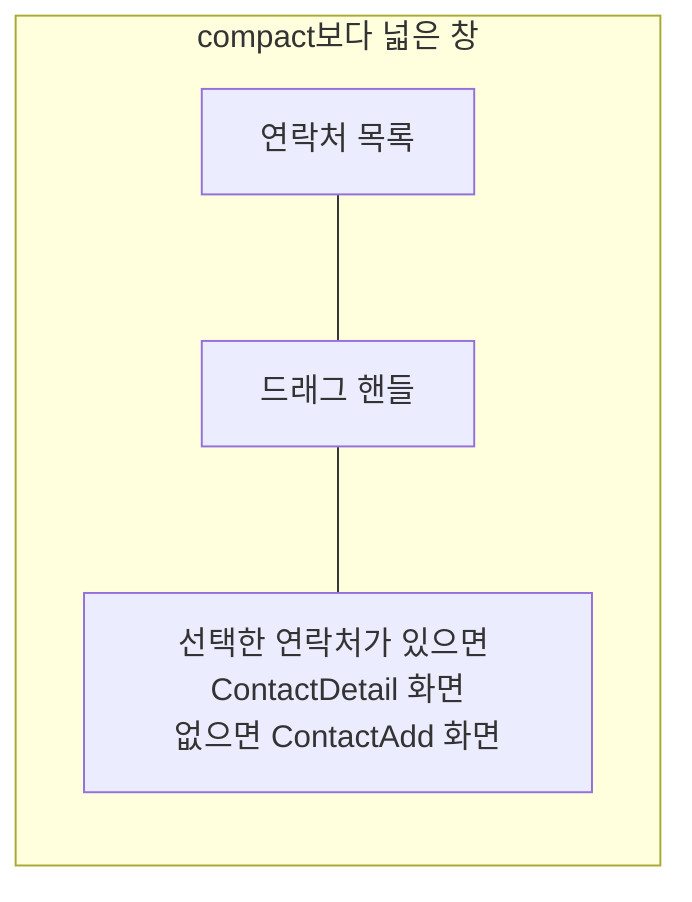

# Contact 목록·상세 배치 디자인

기준 스펙: [Contact 목록·상세 배치 스펙](../spec/contact-list-detail.md)

배치, 크기 조절, 버튼 노출, 진행과 피드백, 조절 상태 표시의 공통 표현은 [목록·상세 배치 공통 디자인](./list-detail-pane.md)을 따른다.

## 두 영역에 두는 화면

목록 영역에는 [ContactHome 화면](./contact-home.md)의 연락처 목록을 두고, 상세 영역에는 선택한 연락처의 [ContactDetail 화면](./contact-detail.md)을 표시한다. 선택한 연락처가 없으면 [ContactAdd 화면](./contact-add.md)을 표시한다. 두 영역은 각각 자기 상단 바를 갖는다.

상세 영역에 아이콘과 안내만 두는 [목록·상세 배치 공통 디자인](./list-detail-pane.md)의 `선택 전 상세`는 이 배치에서 쓰지 않는다. 선택 전 자리를 연락처 추가가 채우므로 사용자가 목록을 떠나지 않고 곧바로 입력할 수 있고, 비어 있는 안내 자리를 보지 않기 때문이다.

연락처 목록의 격자는 상세 영역과 자리를 나눠 좁아져도 [ContactHome 화면 디자인](./contact-home.md)의 2열 고정 격자를 유지하며, 상세 영역에 놓인 화면의 입력도 상세 영역 폭에 맞춰 함께 좁아진다.

## 상세 영역의 전환

목록에서 연락처를 누르면 상세 영역이 그 연락처의 ContactDetail 화면으로 바뀐다. 상세 영역에서 시스템 뒤로가기를 사용하거나 그 연락처를 삭제하면 상세 영역이 ContactAdd 화면으로 되돌아간다.

목록에서 연락처 추가 버튼을 누르면 상세 영역이 ContactAdd 화면으로 바뀐다. 버튼의 노출 조건은 [목록·상세 배치 공통 디자인](./list-detail-pane.md)의 `버튼 노출`을 따르므로, 상세 영역에 이미 ContactAdd가 놓여 있는 동안에는 버튼을 표시하지 않는다.

목록 영역 상단 바의 뒤로가기 버튼을 누르면 상세 영역만 ContactAdd 화면으로 되돌리지 않고 두 영역을 함께 닫아 `더보기` 화면을 표시한다. 두 영역은 하나의 화면처럼 함께 사라진다.

상세 영역의 화면이 바뀔 때는 교차 전환을 쓰고, 목록 영역과 드래그 핸들의 자리와 너비 비율은 그대로 둔다. ContactAdd로 되돌아갈 때는 이전에 입력하던 내용을 복원하지 않고 빈 입력으로 시작한다.

목록의 정렬 줄은 [목록 정렬 디자인](./list-sort.md)에 따라 목록 영역 안에만 두고 상세 영역에는 두지 않는다. 상세 영역에 어느 화면이 놓여 있어도 정렬 줄의 자리와 표현은 바뀌지 않는다.

목록의 당김 새로고침과 진행 표시도 [ContactHome 화면 디자인](./contact-home.md)의 `새로고침`에 따라 목록 영역 안에만 두고 상세 영역에는 두지 않는다.
