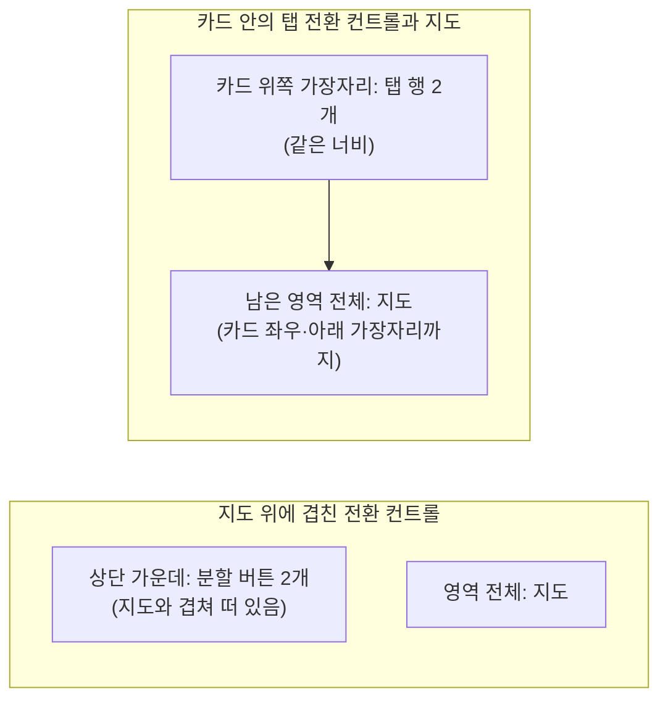

# DiaryMap 컴포넌트 디자인

기준 스펙: [DiaryMap 컴포넌트 스펙](../spec/diary-map.md)

## 구성

DiaryMap은 배치된 영역 전체를 채우고, 배치된 영역의 크기가 바뀌면 변경된 영역 전체를 채운다.

전환 컨트롤에는 네이버와 Google 두 항목을 좌우로 나란히 표시하고, 항상 하나만 선택된 상태로 표시한다. DiaryMap이 처음 표시되면 스펙에서 정한 초기 제공자 항목을 선택된 상태로 표시한다.

전환 컨트롤의 표현과 배치는 스펙의 전환 컨트롤 배치에 따라 두 가지로 나뉘며, 배치하는 화면이 지정하지 않으면 환경별 기본 구성을 쓴다.

| 환경 | 기본 구성 |
| --- | --- |
| Android | 지도 위에 겹친 전환 컨트롤 |
| iOS | 지도 위에 겹친 전환 컨트롤 |
| 웹 | 카드 안의 탭 전환 컨트롤과 지도 |
| JVM 데스크톱 | 카드 안의 탭 전환 컨트롤과 지도 |

두 구성의 배치는 다음과 같다.

### 지도 위에 겹친 전환 컨트롤

지도가 영역 전체를 채운다.

지도 위 상단 가운데에는 지도 제공자를 고르는 전환 컨트롤을 지도와 겹쳐 표시한다. 전환 컨트롤은 영역 위쪽 가장자리에서 여백을 두고 떠 있게 한다.

전환 컨트롤은 좌우로 이어 붙인 두 개의 분할 버튼으로 표시하고, 선택된 항목은 채워진 배경으로 구분한다.

### 카드 안의 탭 전환 컨트롤과 지도

영역 전체를 카드로 채우고, 카드 안에 위에서 아래로 전환 컨트롤과 지도를 배치한다. 전환 컨트롤과 지도는 겹치지 않는다.

전환 컨트롤은 카드 위쪽 가장자리에 붙는 탭 행으로 표시한다. 두 항목이 카드 너비를 같은 너비로 나누고, 선택된 항목은 항목 아래에 붙는 강조 표시로 구분한다. 탭 행의 배경색은 탭 행 컴포넌트의 기본 색을 그대로 쓴다.

지도는 탭 행 아래에 남은 영역 전체를 차지하고 카드의 좌우와 아래 가장자리까지 채운다. 지도는 앱 화면과 별도의 표시 계층에 그려져 카드의 둥근 모서리로 잘리지 않으므로, 카드 아래쪽 두 모서리는 지도의 사각 모서리가 덮은 모습으로 표시된다.

전환 컨트롤이 차지하는 높이만큼 지도 영역이 줄어들며, 영역의 크기가 바뀌면 탭 행 높이를 뺀 나머지를 지도가 다시 채운다.

## 지도 위에 겹치는 앱 표시

JVM 데스크톱에서 스펙의 `지도 위에 겹치는 앱 표시`에 따라 지도를 표시하지 않는 동안, 지도 영역은 지도가 준비되는 동안과 같은 모습으로 비워 둔다. 카드와 탭 행은 그대로 표시하고, 지도 영역에 안내 문구나 진행 표시를 두지 않는다.

비워 둔 지도 영역은 다른 앱 표시와 같은 표시 계층에 놓인다. 다이얼로그가 열려 화면이 어두워지면 지도 영역도 함께 어두워지고, 그 위에 열린 다이얼로그나 메뉴는 지도 영역과 겹치는 부분까지 온전히 표시된다.

지도가 사라지고 다시 나타날 때 전환 애니메이션은 두지 않는다. 표시가 닫히면 보고 있던 지도가 바로 같은 자리에 나타난다.

## 초기 지도 위치와 확대 수준

배치한 화면이 초기 위치를 지정하면 그 위도와 경도를 지도 영역 가운데에 두고, 확대 레벨 15로 표시한다. 확대 레벨 15는 네이버 지도와 Google 지도에서 모두 동네의 도로와 건물 윤곽을 구분할 수 있는 수준이다.

초기 위치를 지정하지 않으면 확대 수준도 지정하지 않고, 선택한 제공자가 그 환경에서 사용하는 기본 위치와 기본 확대 수준을 그대로 쓴다.

초기 위치는 지도가 만들어질 때 한 번만 적용한다. 지도가 표시된 뒤에 초기 위치가 바뀌어도 보고 있는 지도를 움직이지 않는다. 지도가 표시된 뒤에 지도를 옮기는 것은 배치한 화면이 옮길 위치를 지정할 때만 일어나며, 이때는 확대 수준을 바꾸지 않고 지정한 위치만 지도 가운데로 옮긴다.

제공자를 전환할 때는 모든 환경에서 전환 직전 지도 가운데의 위도·경도와 확대 수준을 새 지도의 시작 값으로 그대로 넘긴다. 전환 순간에 지도를 다시 움직이는 애니메이션은 두지 않고, 새 지도가 처음부터 그 자리에서 그려지게 한다.

지도 위에는 선택한 제공자가 그 환경에서 제공하는 지도 컨트롤을 함께 표시한다. 전환 컨트롤을 지도와 겹쳐 표시하는 환경에서 지도 컨트롤이 제공자 전환 컨트롤과 겹치면 제공자 전환 컨트롤을 위에 표시한다. 카드 안에 탭으로 표시하는 환경은 전환 컨트롤이 지도와 겹치지 않아 지도 컨트롤을 가리지 않는다.

지도가 준비되는 동안이나 표시할 수 없을 때는 지도 영역을 비워 두되 제공자 전환 컨트롤은 계속 표시한다. 카드 안에 탭으로 표시하는 환경에서는 지도 영역이 비어 있어도 탭 행과 카드는 그대로 표시한다.

## 지점 표시와 선택 조작

지점 선택을 사용하는 화면에서는 지도를 누른 자리에 지점 표시를 둔다. 지점 표시는 선택한 제공자가 그 환경에서 제공하는 기본 마커 모양을 그대로 쓰고, 마커의 아래 꼭지점이 고른 좌표를 가리키게 놓는다. 제공자와 환경에 따라 마커 모양과 색이 다른 것을 앱에서 다시 맞추지 않는다.

지점 표시는 지도와 같은 표시 계층에 그려지므로 지도를 이동하거나 확대·축소하면 지도와 함께 움직인다. 지점 표시를 눌러도 정보 창을 열지 않고 아무 동작도 하지 않는다.

지점을 처음 두거나 다른 자리로 옮길 때는 지점 표시가 나타나거나 사라지는 애니메이션을 두지 않고 바로 그 자리에 표시한다. 배치한 화면이 지도를 함께 옮기도록 지정하면 지도는 새 위치로 움직이는 애니메이션 없이 바로 그 위치를 가운데에 둔다.

지도를 눌러 지점을 고르는 조작은 환경별로 다음과 같다.

| 환경 | 지점 선택 조작 |
| --- | --- |
| Android | 지도를 한 번 탭 |
| iOS | 지도를 한 번 탭 |
| 웹 | 지도를 마우스로 한 번 클릭 |
| JVM 데스크톱 | 지도를 마우스로 한 번 클릭 |

지도를 끌어 이동하거나 확대·축소하는 조작은 지점 선택으로 다루지 않는다. 지도를 두 번 눌러 확대하는 제공자 기본 조작도 그대로 두며, 이 조작으로는 지점을 만들지 않는다.

Google 지도 웹과 JVM 데스크톱에서 지도 위 장소 아이콘을 클릭하면 장소 정보 창 대신 그 자리의 지점 선택이 일어난다.

## 핀 표시

핀 표시를 사용하는 화면에서는 전달된 각 핀을 마커와 라벨로 표시한다.

마커는 전달된 색을 반영해 표시하고, 제공자와 환경에 상관없이 마커의 아래 꼭지점이 핀의 좌표를 가리키게 놓는다. 마커 모양은 제공자별로 다음과 같이 정하며, 두 제공자의 마커 모양이 서로 다른 것은 지점 표시와 같은 기준으로 허용한다.

네이버 지도는 색을 입히기 위해 제공자가 제공하는 기본 마커에 전달된 색을 입혀 표시한다. 그런 기본 마커를 제공하지 않는 환경에서는 같은 자리에 앱 마커를 전달된 색으로 채워 그린다.

Google 지도는 모든 환경에서 제공자 기본 마커 대신 앱 마커를 전달된 색으로 채워 그린다. 색을 입힐 수 있는 환경에서도 앱 마커를 써서, 환경에 따라 Google 지도의 핀 모양이 달라 보이지 않게 한다.

앱 마커는 장소를 나타내는 물방울 모양을 쓰고 가운데를 둥글게 비워 지도 바탕이 비쳐 보이게 한다. 앱 마커를 쓰는 모든 제공자와 환경은 같은 모양과 같은 크기로 그린다.

라벨은 전달된 문구를 마커 아래에 작은 글씨로 항상 표시한다. 제공자가 마커 캡션 표시를 제공하는 환경에서는 그 캡션 표현을 그대로 쓰고, 제공하지 않는 환경에서는 지도 위에서 읽을 수 있도록 그에 준하는 작은 글씨로 표시한다. 라벨 문구는 줄이거나 바꾸지 않는다.

핀은 지도와 같은 표시 계층에 그려져 지도를 이동하거나 확대·축소하면 지도와 함께 움직인다.

핀 목록이 바뀔 때 핀이 나타나거나 사라지는 애니메이션은 두지 않는다. 핀이나 라벨이 서로 겹치면 제공자의 기본 겹침 표시를 그대로 두고 앱에서 따로 정리하지 않는다.

지점 표시와 핀이 한 지도에 함께 표시되면 두 표시를 서로 구분할 수 있도록 지점 표시는 색을 입히지 않은 제공자 기본 마커를 그대로 쓴다.

핀의 접근성 이름은 라벨 문구를 그대로 쓴다.

## 핀 선택

핀 선택을 사용하는 화면에서는 마커와 라벨 전체를 누를 수 있는 자리로 두어, 사용자가 마커의 좁은 꼭지점을 정확히 겨누지 않아도 핀을 고를 수 있게 한다.

핀을 눌러도 제공자의 정보 창은 열지 않는다. 정보 창 대신 배치한 화면의 동작이 일어나므로, 제공자가 마커 누르기에 붙여 두는 기본 정보 창은 사용하지 않는다.

핀을 누르는 동안 마커나 라벨의 색, 크기와 자리는 바뀌지 않고 어느 핀이 골라져 있음을 지도 위에 남기지 않는다. 고른 결과는 배치한 화면의 표현으로만 나타난다.

핀 선택을 사용하지 않는 화면에서는 핀을 눌러도 정보 창을 열지 않고 아무 동작도 하지 않는다.

핀 선택을 사용하는 화면에서 핀의 접근성 요소는 누를 수 있는 요소로 제공하고, 접근성 이름은 `핀 표시`와 같이 라벨 문구를 그대로 쓴다.

## 지도 컨트롤

네이버 지도에서 표시하는 컨트롤은 다음과 같다.

| 지도 컨트롤 | Android | iOS | 웹 | JVM 데스크톱 |
| --- | --- | --- | --- | --- |
| 나침반 | 표시 | 표시 | 미제공 | 미제공 |
| 축척 바 | 표시 | 표시 | 표시 | 표시 |
| 확대·축소 버튼 | 표시 | 표시 | 표시 | 표시 |
| 실내지도 층 선택 | 실내지도에서 표시 | 실내지도에서 표시 | 미제공 | 미제공 |
| 현 위치 버튼 | 위치 권한이 허용되면 표시 | 위치 권한이 허용되면 표시 | 미제공 | 미제공 |
| 지도 유형 선택 | 미제공 | 미제공 | 표시 | 표시 |
| 저작권 정보 | 표시 | 표시 | 표시 | 표시 |
| 제공자 로고 | 표시 | 표시 | 표시 | 표시 |

Google 지도에서 표시하는 컨트롤은 다음과 같다.

| 지도 컨트롤 | Android | iOS | 웹 | JVM 데스크톱 |
| --- | --- | --- | --- | --- |
| 나침반 | 지도를 회전했을 때 표시 | 지도를 회전했을 때 표시 | 미제공 | 미제공 |
| 축척 | 미제공 | 미제공 | 표시 | 표시 |
| 확대·축소 버튼 | 표시 | 미제공 | 표시 | 표시 |
| 실내지도 층 선택 | 실내지도에서 표시 | 실내지도에서 표시 | 미제공 | 미제공 |
| 현 위치 버튼 | 위치 권한이 허용되면 표시 | 위치 권한이 허용되면 표시 | 미제공 | 미제공 |
| 지도 유형 선택 | 미제공 | 미제공 | 표시 | 표시 |
| 지도 도구 모음 | 표시 | 미제공 | 미제공 | 미제공 |
| 거리뷰 | 미제공 | 미제공 | 표시 | 표시 |
| 전체 화면 | 미제공 | 미제공 | 표시 | 표시 |
| 시점 조정 | 미제공 | 미제공 | 표시 | 표시 |
| 제공자 로고와 저작권 정보 | 표시 | 표시 | 표시 | 표시 |

Google 지도의 지도 도구 모음 동작은 기준 스펙을 따른다.

### 현 위치 표시

위치 권한이 허용되어 있으면 Android와 iOS의 두 제공자 지도 모두에 현 위치 점과 현 위치 버튼을 함께 표시하고, 허용되어 있지 않으면 둘 다 표시하지 않는다. 표시하지 않는 동안 그 자리에 대신 두는 안내나 비활성 버튼은 없으며, 나머지 지도 컨트롤의 자리도 바꾸지 않는다.

현 위치 점은 선택한 제공자가 그 환경에서 쓰는 기본 표현을 그대로 쓴다. 점의 모양과 색, 정확도를 나타내는 원, 방향 표시가 제공자와 환경에 따라 다른 것을 앱에서 다시 맞추지 않는다. 현 위치 점은 지도와 같은 표시 계층에 그려지므로 지도를 이동하거나 확대·축소하면 지도와 함께 움직인다.

현 위치 버튼의 자리와 아이콘도 제공자 기본값을 그대로 쓴다. 현 위치 버튼이 제공자 전환 컨트롤과 겹치면 다른 지도 컨트롤과 같게 제공자 전환 컨트롤을 위에 표시한다.

버튼을 눌렀을 때의 표현은 제공자마다 다르다. Google 지도는 지도를 현 위치로 한 번 옮기고 버튼 표현은 그대로 둔다. 네이버 지도는 누를 때마다 제공자가 정한 추적 상태로 바뀌고 버튼 표현도 그 상태를 따라 바뀐다.

현 위치 점과 현 위치 버튼에는 앱이 별도의 접근성 이름을 두지 않고 제공자가 제공하는 기본 표현을 그대로 둔다.

## 지도 조작

Android와 iOS에서는 지도를 끌어 이동하고 오므리거나 벌리는 기본 조작으로 확대·축소한다. 두 손가락으로 지도를 돌려 회전하고 두 손가락으로 밀어 기울일 수 있다.

웹과 JVM 데스크톱에서는 지도를 끌어 이동하고 마우스 휠이나 지도 위 확대·축소 조작으로 확대·축소한다. 지도에 초점이 있으면 방향키로 이동할 수 있고, 지도를 끌다가 놓으면 지도가 잠시 밀려서 멈춘다.

Google 지도 웹과 JVM 데스크톱에서는 지도 위 장소 아이콘을 선택해 해당 장소의 정보를 볼 수 있다. 지점 선택을 사용하는 화면에서의 예외는 지점 표시와 선택 조작을 따른다.

## 문구와 접근성

| 문구 | 한국어 | 그 외 기본 |
| --- | --- | --- |
| 네이버 지도 항목 이름 | `네이버` | `Naver` |
| Google 지도 항목 이름 | `Google` | `Google` |
| 전환 컨트롤 접근성 이름 | `지도 제공자` | `Map provider` |

지점 표시에는 별도의 접근성 이름을 두지 않고 제공자 기본 마커의 표현을 그대로 둔다. 핀의 접근성 이름은 `핀 표시`를 따른다.

두 구성은 같은 항목 이름과 같은 전환 컨트롤 접근성 이름을 쓴다. 항목 이름은 아이콘 없이 문구만 표시한다.

지도 영역 자체의 접근성 이름은 컴포넌트를 배치한 화면이 정한다.
