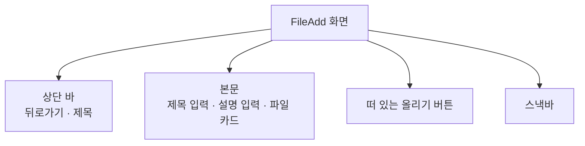

# FileAdd 화면 디자인

기준 스펙: [FileAdd 화면 스펙](../spec/client/file-add.md)

화면 구조, 표시 영역과 소프트 키보드, 초점과 단축키는 [항목 추가 화면 공통 디자인](./entity-add.md)을 따른다. 진행과 피드백은 기준 스펙이 올리기 결과를 알리도록 정했으므로 공통 디자인의 `진행과 피드백` 대신 이 문서의 `진행과 피드백`을 따른다.

## 화면 구조

FileAdd 화면은 FileHome 위에 단독으로 표시하고, 상단 바 시작 쪽에 뒤로가기 버튼을 항상 둔다. 창 너비와 관계없이 목록과 함께 나누어 표시하지 않는다.

본문에는 제목 입력, 설명 입력, 파일 카드를 위에서부터 순서대로 배치한다. 올리기 동작은 본문 오른쪽 아래의 떠 있는 버튼으로 표시하고 업로드를 뜻하는 위쪽 화살표 아이콘을 쓴다.

반드시 입력하는 제목을 맨 위에 두고, 제목을 보조하는 설명을 그 아래에 둔다. 파일 카드는 고른 파일에 따라 내용만 바뀌고 높이는 같으므로 마지막에 두어도 위쪽 입력의 자리가 흔들리지 않는다. 진입할 때의 입력 초점은 맨 위의 제목 입력에 둔다. 이 화면에는 태그 입력을 두지 않는다.

제목 입력의 구성은 [제목 입력 디자인](./title-input.md)을, 설명 입력의 구성은 [설명 입력 컴포넌트 디자인](./description-input.md)을 따른다.

## 파일 카드

파일 카드는 본문 가로 폭을 모두 쓰는 외곽선 카드 하나에 Material 3 목록 항목 한 줄을 담는다.

| 요소 | 고른 파일이 없음 | 고른 파일이 있음 |
| --- | --- | --- |
| 시작 쪽 아이콘 | 파일 아이콘, 본문 보조 색 | 파일 아이콘, 본문 보조 색 |
| 제목 줄 | `고른 파일 없음`, 본문 보조 색 | 파일 이름. 한 줄을 넘으면 끝을 말줄임한다 |
| 보조 줄 | 두지 않는다 | 파일 크기 |
| 끝 쪽 | `파일 고르기` 아이콘 버튼 | `파일 고르기` 아이콘 버튼 |

아이콘은 [FileHome 화면 디자인](./file-home.md)의 목록 줄과 같은 파일 아이콘을 쓴다. 파일 크기는 [FileHome 화면 디자인](./file-home.md)의 `파일 목록`이 정한 크기 표기를 그대로 쓴다.

`파일 고르기` 버튼은 열린 폴더 아이콘만 표시하는 아이콘 버튼이다. 버튼은 목록 항목 밖 카드의 끝 쪽에 세로 가운데로 두고, 카드 끝 가장자리와의 사이에 [항목 간격](./dimens.md)을 둔다. 목록 항목은 버튼을 뺀 나머지 폭을 쓴다. 버튼의 설명 표시는 [아이콘 버튼 설명 디자인](./icon-button-tooltip.md)을 따른다.

카드의 최소 높이는 고른 파일과 관계없이 Material 3 두 줄 목록 항목의 높이인 `72dp`로 둔다. 파일을 고르거나 비울 때 카드 높이가 바뀌지 않게 하기 위해서다. 글자 크기를 키워 두 줄이 이 높이를 넘으면 카드가 내용만큼 늘어난다. 고른 파일이 없을 때는 보조 줄을 두지 않고 `고른 파일 없음` 한 줄을 이 높이의 세로 가운데에 둔다.

`파일 고르기` 버튼을 누르면 플랫폼이 제공하는 파일 선택 도구를 연다.

| 플랫폼 | 파일 선택 도구 |
| --- | --- |
| Android | 시스템 문서 선택 화면. 모든 종류의 파일을 보여 준다 |
| iOS | 시스템 파일 선택 화면. 모든 종류의 파일을 보여 준다 |
| JVM 데스크톱 | 운영체제의 파일 열기 대화상자. 파일 종류를 거르지 않는다 |
| 웹 | 브라우저의 파일 선택 창. 파일 종류를 거르지 않는다 |

 버튼은 고른 파일이 있어도 같은 라벨과 자리로 두고, 올리는 중에도 누를 수 있다. 카드의 나머지 영역은 누를 수 있는 자리로 두지 않는다. 고른 파일만 비우는 컨트롤은 두지 않는다.

## 진행과 피드백

올리는 중인 파일이 있는 동안에는 올리기 버튼의 아이콘 자리를 [진행 표시 크기](./dimens.md)의 원형 진행 표시로 바꾸고, 버튼의 크기와 자리는 그대로 둔다. 진행 표시에는 진행률을 나타내지 않는다. 진행 중에도 버튼을 흐리게 표시하지 않고 접근성 이름도 그대로 유지하며, 눌러도 아무 일이 일어나지 않는다. 입력과 `파일 고르기` 버튼은 잠그거나 흐리게 바꾸지 않는다.

올리기를 시작하면 제목, 설명을 비우고 파일 카드를 `고른 파일 없음`으로 되돌린다. 설명 입력은 입력 페이지로 애니메이션 없이 돌아간다. 입력 초점은 제목 입력으로 옮긴다. 시작만으로는 스낵바를 표시하지 않는다.

미입력 안내, 파일을 고를 때의 안내와 올리기 결과는 모두 스낵바로 표시하고 동작 버튼은 두지 않는다. 표시 시간은 Material 기본의 짧은 표시 시간이다. 새 안내를 표시할 때 이미 보이는 스낵바가 있으면 표시 시간이 지나기를 기다리지 않고 즉시 새 안내로 바꾼다. 스낵바는 올리기 버튼을 가리지 않도록 버튼 위에 표시한다.

화면이 회전하거나 시스템이 화면을 재생성하면 보이던 스낵바는 닫히고 다시 나타나지 않는다.

## 표시 영역과 소프트 키보드

배치는 창 너비, 창 높이와 기기 자세에 따라 달라지지 않는다.

## 문구와 접근성

[항목 추가 화면 공통 디자인](./entity-add.md)의 `문구와 접근성`에 더해 한국어 환경과 그 외 기본 환경에서는 다음 문구를 사용한다.

| 문구 | 한국어 | 그 외 기본 |
| --- | --- | --- |
| 상단 바 제목 | `파일 추가` | `Add File` |
| 올리기 버튼 접근성 이름 | `파일 올리기` | `Upload file` |
| 고른 파일이 없을 때 파일 카드 제목 줄 | `고른 파일 없음` | `No file selected` |
| 파일 고르기 버튼 접근성 이름 | `파일 고르기` | `Choose file` |
| 제목 미입력 안내 | `제목을 입력해 주세요.` | `Please enter a title.` |
| 파일 미선택 안내 | `파일을 골라 주세요.` | `Please choose a file.` |
| 파일을 읽지 못함 안내 | `파일을 읽지 못했습니다.` | `Couldn't read the file.` |
| 크기 초과 안내 | `50MB 이하 파일만 올릴 수 있습니다.` | `Only files up to 50 MB can be uploaded.` |
| 올리기 성공 안내 | `파일을 올렸습니다.` | `File uploaded.` |
| 올리기 실패 안내 | `파일을 올리지 못했습니다.` | `Couldn't upload the file.` |

크기 초과 안내와 올리기 실패 안내는 [FileHome 화면 디자인](./file-home.md)의 같은 안내와 같은 문구다. 크기 초과 안내는 파일을 고를 때와 올리기 결과에 모두 쓴다.

접근성에는 파일 카드의 아이콘, 제목 줄과 보조 줄을 하나로 묶어 파일 이름과 크기, 또는 `고른 파일 없음`을 이어서 읽게 하고, `파일 고르기` 버튼은 따로 초점을 받게 한다. 올리는 중에는 올리기 버튼이 처리 중임을 낭독 도구에 알리고 버튼의 이름은 바꾸지 않는다.
