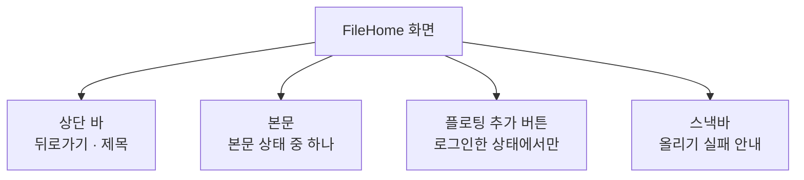

# FileHome 화면 디자인

기준 스펙: [FileHome 화면 스펙](../spec/client/file-home.md), [파일 보관 스펙](../spec/client/file-storage.md)

## 화면 구조

FileHome 화면은 `더보기`에서 이어지는 세부 화면으로 단독 표시하고, 공통 내비게이션 영역은 [TopLevelNavigation 디자인](./top-level-navigation.md)의 `세부 화면에서의 노출`에 따라 숨긴다.

화면 상단에는 상단 바를 두고, 시작 쪽에 뒤로가기 동작을, 그 바로 뒤에 `파일` 제목을 시작 쪽에 맞춰 표시한다. 상단 바 끝 쪽에는 동작을 두지 않는다.

상단 바 아래 본문은 남은 영역 전체를 차지하고, 계정 상태와 목록 상태에 따라 `본문 상태`의 표시 하나로 채운다. 로그인한 상태에서는 본문 오른쪽 아래에 파일 추가를 실행하는 플로팅 액션 버튼을 겹쳐 표시한다.

## 본문 상태

| 상태 | 본문 | 추가 버튼 |
| --- | --- | --- |
| 계정 상태를 확인하는 중 | 비워 둔다 | 두지 않는다 |
| 게스트 | 가운데에 `로그인 안내` | 두지 않는다 |
| 목록을 처음 불러오는 중 | 가운데에 로딩 표시 | 둔다 |
| 처음 불러오기 실패 | 가운데에 불러오기 실패 문구와 다시 시도 버튼 | 둔다 |
| 불러온 파일이 없음 | 가운데에 `빈 상태` | 둔다 |
| 불러온 파일이 있음 | `파일 목록` | 둔다 |

올리기에 성공해 파일 목록을 처음부터 다시 불러오는 동안에는 본문을 로딩 표시로 바꾸지 않고 파일 목록을 그대로 둔다. 목록의 계정이 바뀌면 이전 계정의 파일 목록을 지우고 `목록을 처음 불러오는 중` 상태로 표시한다.

본문 상태가 바뀔 때는 이전 표시가 사라지면서 다음 표시가 나타나는 교차 페이드로 전환한다. 지속 시간과 완급은 전환 기본값을 따른다. 전환하는 동안에도 상단 바와 추가 버튼은 자리를 옮기지 않는다.

가운데에 두는 표시는 본문 영역의 가로와 세로 가운데에 놓고, 좌우에 [화면 가로 여백](./dimens.md), 위아래에 [화면 세로 여백](./dimens.md)을 둔다. 문구는 가운데 정렬하고, 한 줄에 들어가지 않으면 줄바꿈하며 말줄임하지 않는다.

처음 불러오기 실패 상태에서는 실패 문구 아래에 [항목 간격](./dimens.md)을 두고 외곽선 형태의 다시 시도 버튼을 놓는다. 다시 시도 버튼을 누르면 본문이 곧바로 로딩 표시로 바뀐다. 로딩 표시는 [HolidayHome 화면 디자인](./holiday-home.md)이 본문을 준비하는 동안 쓰는 것과 같은 표시다. 실패 문구는 본문 보조 색, 본문 기본 글자 크기로 표시하고 아이콘은 두지 않는다.

## 로그인 안내와 빈 상태

로그인 안내와 빈 상태는 [목록 빈 상태 디자인](./list-empty-state.md)의 `빈 상태 구성`과 같은 형태로 표시한다. 배경 도형에 담은 아이콘을 위에, 제목 문구와 보조 문구를 아래에 세로로 잇는다. 두 표시 모두 MoreHome의 `파일` 바로가기와 같은 파일 아이콘을 쓴다.

로그인 안내에는 버튼이나 링크를 두지 않는다. 기준 스펙이 이 화면에서 로그인으로 이동하는 동작을 두지 않았기 때문이다.

빈 상태에도 버튼을 두지 않는다. 파일을 올리는 조작은 플로팅 추가 버튼이 담당한다.

## 파일 목록

파일은 한 열의 세로 목록으로 표시한다. 창 너비와 관계없이 한 줄에 파일 하나를 두고, 줄은 본문 너비 전체를 쓴다. 파일 이름이 길 수 있어 여러 열로 나누면 이름이 더 많이 잘리기 때문이다.

각 줄은 Material 3 목록 항목 형태로 표시한다.

| 요소 | 표시 |
| --- | --- |
| 시작 쪽 아이콘 | 파일 아이콘, 본문 보조 색. 파일 형식과 관계없이 같은 아이콘을 쓴다 |
| 제목 줄 | 파일 이름, 목록 항목의 기본 제목 글자 크기. 한 줄을 넘으면 끝을 말줄임한다 |
| 보조 줄 | `크기 · 올린 날짜 올린 시각`, 목록 항목의 기본 보조 글자 크기와 본문 보조 색 |

크기는 1024를 단위로 올림 없이 `B`, `KB`, `MB` 중 1 이상이 되는 가장 큰 단위로 나타낸다. `B`는 정수로, `KB`와 `MB`는 소수점 아래 한 자리까지 나타내며 끝자리가 0이어도 그대로 둔다. 예: `512 B`, `1.0 KB`, `23.4 MB`.

올린 날짜와 시각은 기기의 시간대로 바꿔, 앱이 날짜와 시각을 나타낼 때 쓰는 공통 형식으로 표시한다. 예: 한국어 `2026. 9. 26. 오후 3:05`, 그 외 기본 `Sep 26, 2026 3:05 PM`.

줄 사이에는 구분선이나 간격을 두지 않는다. 목록의 위아래에는 [화면 세로 여백](./dimens.md)을 둔다. 줄은 목록 항목의 기본 안쪽 여백을 쓰므로 좌우 바깥 여백은 따로 두지 않는다.

이번 범위에서는 줄을 누를 수 있는 자리로 두지 않는다. 눌림 표현이 없고, 키보드 초점도 받지 않는다. 옆으로 미는 조작에도 반응하지 않는다.

접근성에는 한 줄을 하나의 항목으로 묶어 파일 이름, 크기, 올린 날짜와 시각을 이어서 읽게 한다.

### 이어서 불러오기

이어서 불러오는 동안에는 목록 마지막 줄 아래에 원형 진행 표시를 가운데에 둔다. 이어서 불러오기에 실패하면 같은 자리를 이어서 불러오기 실패 문구와 텍스트 형태의 다시 시도 버튼으로 바꾸고, 두 요소를 가로로 가운데에 나란히 둔다. 다시 시도 버튼을 누르면 그 자리가 곧바로 원형 진행 표시로 바뀐다. 이 자리의 위아래에는 [화면 세로 여백](./dimens.md)을 둔다.

목록에 아직 불러오지 않은 파일의 자리 표시는 두지 않는다.

## 파일 추가 버튼

플로팅 추가 버튼은 본문 오른쪽 아래에 두고 추가를 뜻하는 더하기 아이콘을 표시한다. 목록의 상태와 관계없이 같은 자리에 같은 모양으로 표시한다. 계정 상태가 사용자로 정해질 때 나타나는 전환은 두지 않는다. 버튼의 설명 표시는 [아이콘 버튼 설명 디자인](./icon-button-tooltip.md)을 따른다.

버튼을 누르면 플랫폼이 제공하는 파일 선택 도구를 연다.

| 플랫폼 | 파일 선택 도구 |
| --- | --- |
| Android | 시스템 문서 선택 화면. 모든 종류의 파일을 보여 준다 |
| iOS | 시스템 파일 선택 화면. 모든 종류의 파일을 보여 준다 |
| JVM 데스크톱 | 운영체제의 파일 열기 대화상자. 파일 종류를 거르지 않는다 |
| 웹 | 브라우저의 파일 선택 창. 파일 종류를 거르지 않는다 |

파일을 올리는 동안에는 버튼의 아이콘 자리를 [진행 표시 크기](./dimens.md)의 원형 진행 표시로 바꾸고 버튼의 크기와 자리는 그대로 둔다. 진행 표시에는 진행률을 나타내지 않는다. 진행 중에도 버튼을 흐리게 표시하지 않고 접근성 이름도 그대로 유지하며, 눌러도 아무 일이 일어나지 않는다.

올리는 동안 계정이 다른 사용자로 바뀌어 올리기가 중단되면 아이콘 자리는 알림 없이 더하기 아이콘으로 돌아온다. 게스트가 되면 버튼 자체가 사라진다.

올리기에 성공하면 아이콘 자리가 더하기 아이콘으로 돌아오고, 목록이 처음부터 다시 나타나며 맨 위로 스크롤한다.

## 피드백

올리기 실패 안내와, 파일 목록이 표시된 상태에서 다시 불러오기에 실패했다는 안내는 스낵바로 표시한다. 다시 불러오기 실패 안내는 처음 불러오기 실패 문구와 같은 문구를 쓴다. 새 안내를 표시할 때 이미 보이는 스낵바가 있으면 표시 시간이 지나기를 기다리지 않고 즉시 새 안내로 바꾼다. 스낵바에는 동작 버튼을 두지 않는다.

올리기 성공은 스낵바로 알리지 않는다. 목록 맨 위에 올린 파일이 나타나는 것으로 확인한다.

## 시스템 영역

본문, 플로팅 추가 버튼과 스낵바는 상태 표시 영역, 시스템 탐색 영역과 디스플레이 컷아웃처럼 기기가 가리는 영역을 침범하지 않게 배치한다. 스낵바는 화면 아래쪽에 두고 플로팅 추가 버튼을 가리지 않도록 버튼 위에 표시한다.

## 적응형 배치

창 너비와 자세에 따라 구성을 바꾸지 않는다. 어느 창 크기에서도 한 열 목록과 오른쪽 아래 추가 버튼을 유지한다.

## 문구와 접근성

한국어 환경과 그 외 기본 환경에서 다음 문구를 사용한다.

| 항목 | 한국어 | 그 외 기본 |
| --- | --- | --- |
| 상단 바 제목 | `파일` | `Files` |
| 뒤로가기 접근성 이름 | `뒤로가기` | `Navigate up` |
| 추가 버튼 접근성 이름 | `파일 추가` | `Add file` |
| 로그인 안내 제목 | `로그인이 필요합니다` | `Sign in required` |
| 로그인 안내 보조 문구 | `로그인하면 파일을 올리고 확인할 수 있습니다` | `Sign in to upload and view your files` |
| 빈 상태 제목 | `아직 올린 파일이 없습니다` | `No files yet` |
| 빈 상태 보조 문구 | `추가 버튼으로 파일을 올릴 수 있습니다` | `Use the add button to upload a file` |
| 처음 불러오기 실패 문구, 다시 불러오기 실패 안내 | `파일을 불러오지 못했습니다` | `Couldn't load files` |
| 이어서 불러오기 실패 문구 | `더 불러오지 못했습니다` | `Couldn't load more` |
| 다시 시도 버튼 | `다시 시도` | `Retry` |
| 크기 초과 안내 | `50MB 이하 파일만 올릴 수 있습니다.` | `Only files up to 50 MB can be uploaded.` |
| 올리기 실패 안내 | `파일을 올리지 못했습니다.` | `Couldn't upload the file.` |
