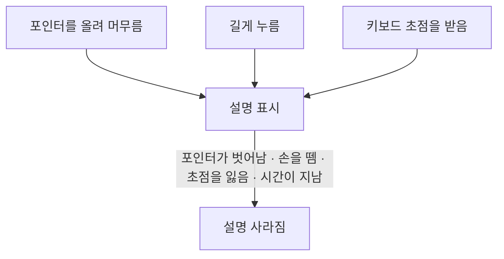

# 아이콘 버튼 설명 디자인

이 문서는 아이콘만 표시하는 공통 버튼에 그 버튼이 무엇을 하는지 알려 주는 설명 표시를 소유한다. 각 버튼을 어디에 두는지와 버튼의 접근성 이름 문구는 그 버튼을 쓰는 화면 디자인이 소유하고, 이 문서는 설명이 나타나는 계기와 표현만 정한다.

이 문서는 이미 있는 버튼의 표현만 다루고 사용자 행위나 제품 정책을 새로 정의하지 않으므로 기준 스펙을 두지 않는다.

## 적용 대상

아이콘만 표시하고 글자 라벨을 두지 않는 공통 버튼에 설명을 둔다. 지우기, 복사, 삭제, 완료, 뒤로가기, 외부로 열기, 검색, 설정 버튼과 떠 있는 추가 버튼, 떠 있는 확인 버튼이 대상이다.

접근성 이름을 두지 않은 버튼에는 설명도 두지 않는다. 설명 문구는 접근성 이름과 같은 문구를 쓰므로, 이름이 없으면 보여 줄 문구도 없다.

글자 라벨을 함께 표시하는 버튼, 칩, 탭, 목록 항목에는 설명을 두지 않는다. 화면에 이미 이름이 적혀 있어 같은 문구를 두 번 보여 주게 된다.

## 표시 계기

포인터를 버튼 위에 올려 머무르거나, 손가락으로 버튼을 길게 누르거나, 키보드 초점이 버튼으로 오면 설명을 표시한다.

버튼을 짧게 누르면 설명을 표시하지 않고 버튼 동작을 곧바로 실행한다. 길게 눌러 설명을 표시했을 때는 버튼 동작을 실행하지 않는다.

같은 시점에 설명은 하나만 표시한다. 다른 버튼의 설명이 나타나면 앞서 표시하던 설명은 사라진다.

## 표현

설명은 버튼 위쪽에 본문과 겹쳐 표시하고, 위쪽에 자리가 없으면 아래쪽에 표시한다. 좌우로 표시 영역을 벗어나면 벗어나지 않는 쪽으로 붙여 표시한다.

설명은 버튼과 그 주변 요소의 자리를 옮기지 않는다. 나타나고 사라지는 동안에도 아래에 있는 내용은 움직이지 않는다.

설명의 배경 색, 글자 색, 모서리, 최대 폭, 나타나고 사라지는 모션과 스스로 사라지기까지의 시간은 Material 3 설명 표시의 기본값을 그대로 사용하고 별도 수치를 정하지 않는다.

진행 표시로 아이콘이 바뀐 버튼에도 같은 설명을 그대로 유지한다. 진행 중에 버튼의 이름이 사라지지 않게 한다.

## 문구

설명 문구는 그 버튼의 접근성 이름과 같은 문구를 사용하고 설명만을 위한 문구를 따로 만들지 않는다. 접근성 이름은 각 화면 디자인이 소유한다.

## 접근성

설명은 화면 낭독 도구에 버튼 이름을 대신 전달하지 않는다. 낭독 도구는 설명이 표시되는지와 무관하게 버튼의 접근성 이름을 읽는다.

설명이 나타나도 초점은 버튼에 남는다. 설명 자체는 초점을 받지 않고, 키보드로 설명 안을 이동하지 않는다.

## 참고

- [Tooltips](https://developer.android.com/develop/ui/compose/components/tooltip)
