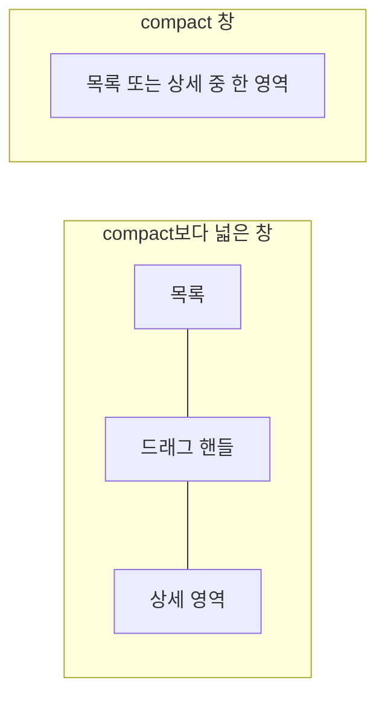

# 목록·상세 배치 공통 디자인

이 문서는 목록과 상세 영역을 함께 표시하는 화면들이 공통으로 사용하는 배치와 크기 조절 표현을 다룬다. 어떤 화면을 목록과 상세에 두는지, 어떤 버튼을 감추고 표시하는지, 조절한 비율을 언제 기본값으로 되돌리는지는 화면마다 다르므로 각 배치 디자인 문서에서 다룬다.

이 문서를 따르는 배치 디자인은 다음과 같다.

- [Contact 목록·상세 배치 디자인](./contact-list-detail.md)
- [Memo 목록·상세 배치 디자인](./memo-list-detail.md)
- [Playlist 목록·상세 배치 디자인](./playlist-list-detail.md)
- [Routine 목록·상세 배치 디자인](./routine-list-detail.md)
- [Setting 목록·상세 배치 디자인](./setting-list-detail.md)
- [Tag 목록·상세 배치 디자인](./tag-list-detail.md)
- [TagMemoFinishedList 목록·상세 배치 디자인](./tag-memo-finished-list-detail.md)
- [Web 목록·상세 배치 디자인](./web-list-detail.md)

기준 스펙: [목록·상세 배치 공통 스펙](../spec/list-detail-pane.md)

## 적응형 배치

창 너비가 compact보다 넓으면 목록을 왼쪽에, 상세 영역을 오른쪽에 함께 표시한다. 처음 표시할 때 두 영역의 너비 비율은 1:1이다.

창 너비가 compact이면 목록이나 상세 중 한 영역만 표시한다.

배치를 가르는 기준은 창 너비뿐이며 창 높이는 배치를 바꾸지 않는다. 기준은 [장소 보기 모드 디자인](./place-view-mode.md)의 적응형 배치와 같으므로, 접는 화면을 펼친 창처럼 medium 너비인 창에서도 두 영역을 좌우로 함께 표시한다.

## 크기 조절

목록과 상세 영역을 함께 표시할 때 두 영역 사이에 세로 방향의 드래그 핸들을 배치한다. 한 영역만 표시할 때는 드래그 핸들을 표시하지 않는다.

사용자는 핸들을 좌우로 끌어 두 영역의 너비 비율을 조절한다. 드래그하는 동안 핸들 위치에 맞춰 두 영역의 너비를 즉시 바꾸고, 핸들을 놓으면 그 위치의 비율을 유지한다.

핸들은 표시 범위 안에서 연속적으로 움직이며 별도의 스냅 지점은 두지 않는다.

## 조절 상태의 표시

기준 스펙의 `유지와 초기화 기준`이 비율을 유지한다고 정한 동안에는 마지막 핸들 위치와 두 영역의 너비 비율을 그대로 표시한다.

같은 절이 정한 초기화 시점에는 핸들을 가운데에 두고 두 영역을 기본 너비 비율인 1:1로 표시한다.

## 버튼 노출

목록과 상세 영역을 함께 표시하는 동안 상세 영역에 놓인 화면의 상단 바에는 뒤로가기 버튼을 표시하지 않는다. 상단 바 제목과 그 화면이 제공하는 동작 버튼은 그대로 표시한다.

목록 화면이 상단 바에 두는 뒤로가기 버튼과 정렬 줄 같은 목록 자체의 컨트롤은 함께 표시하는 동안에도 그대로 표시한다.

상세 영역에 추가 화면이 이미 놓여 있는 동안에는 목록 화면의 추가 버튼과 추가 단축키를 제공하지 않는다. 같은 화면을 다시 여는 수단을 두지 않기 위한 것이며, 판정 기준은 기준 스펙의 `추가 진입 수단`을 따른다.

상세 영역에 추가가 아닌 화면이 놓여 있는 동안에는 목록 화면의 추가 버튼을 표시하고, 누르면 상세 영역을 추가 화면으로 바꾼다.

## 선택 전 상세

상세를 아직 선택하지 않은 상태를 두는 배치에서는 상세 영역 중앙에 그 대상을 나타내는 아이콘과 무엇을 선택하라는 안내를 세로로 배치한다.

아이콘은 [목록 빈 상태 디자인](./list-empty-state.md)의 배경 도형에 담고, 도형의 크기·모양·색과 아이콘 크기, 아이콘과 안내 사이 간격, 안내의 색과 타이포그래피도 그 문서를 따른다. 안내는 가운데 정렬하고, 폭이 좁아 한 줄에 들어가지 않으면 줄바꿈해 여러 줄로 표시한다.

배경 도형은 빈 목록에서와 같은 이유로 둔다. 선택 전 상세와 목록 빈 상태는 아직 볼 내용이 없는 자리라는 점이 같으므로 같은 표현을 쓴다.

배경 도형과 아이콘은 안내 문구와 같은 의미를 반복하는 장식이므로 접근성 이름을 두지 않는다.

선택 전 상세에는 누르거나 입력할 수 있는 컨트롤을 두지 않는다.

어떤 아이콘과 문구를 쓰는지는 각 배치 디자인 문서가 정한다.

## 진행과 피드백

상세 영역에 놓인 화면의 스낵바는 상세 영역 안 아래쪽에 표시하고, 목록의 진행 표시는 목록 영역 안에 표시한다. 두 표시는 서로의 영역을 넘어가지 않아 함께 나타나도 겹치지 않는다.

## 단독 표시

한 영역만 표시해 각 화면을 단독으로 표시할 때는 해당 화면 디자인에 정의된 버튼을 그대로 표시한다.
