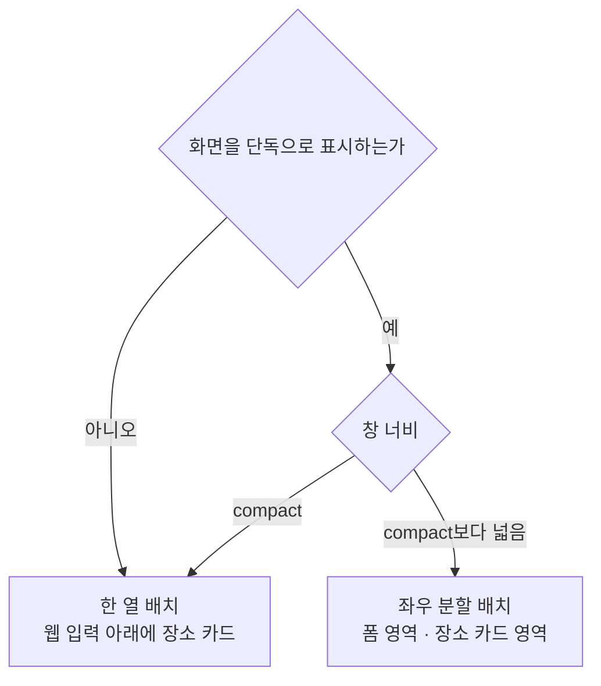

# 메모 본문 배치 디자인

기준 스펙: [MemoAdd 화면 스펙](../spec/memo-add.md), [MemoDetail 화면 스펙](../spec/memo-detail.md)

이 문서는 MemoAdd 화면과 MemoDetail 화면이 함께 쓰는 본문의 구성과 적응형 배치, 본문 위에 떠 있는 동작 버튼의 자리, 표시 영역과 소프트 키보드 대응을 소유한다. 각 화면의 진입별 표시 방식, 상단 바, 동작 버튼의 표시 조건과 아이콘·문구, 입력의 초기 상태와 피드백은 각 화면 디자인이 소유한다.

## 이 문서를 참조하는 문서

- [MemoAdd 화면 디자인](./memo-add.md)
- [MemoDetail 화면 디자인](./memo-detail.md)

## 구성과 순서

본문에는 제목 입력, 설명 입력, 컬러 입력, 날짜·시간 입력, 태그 입력, 웹 입력, 장소 카드를 이 순서로 둔다. 각 요소 사이에는 [공통 구성요소 간격](./dimens.md)을 둔다.

설명, 컬러, 날짜·시간, 태그 입력, 웹 입력과 장소 카드의 세부 표현은 각각 [설명 입력 컴포넌트 디자인](./description-input.md), [DiaryColorInput 컴포넌트 디자인](./diary-color-input.md), [DiaryDateTimeInput 컴포넌트 디자인](./diary-date-time-input.md), [메모 태그 입력 컴포넌트 디자인](./memo-tag-input.md), [메모 웹 입력 컴포넌트 디자인](./memo-web-input.md), [메모 장소 카드 컴포넌트 디자인](./memo-place-card.md)을 따른다.

웹 입력은 태그 입력 바로 아래에 둔다. 두 입력은 같은 구성의 칩 영역을 쓰고 메모에 연결하는 대상만 다르므로 이어 두고, 지도를 함께 두는 장소 카드는 그 뒤에 둔다. 칩 영역이 둘 이어져 폼이 길어지므로 사용자는 폼 영역을 세로로 스크롤해 장소 카드까지 확인한다.

## 적응형 배치

화면을 단독으로 표시하고 창 너비가 compact보다 넓으면 본문을 좌우로 나눠 폼 영역을 시작 쪽에, 장소 카드 영역을 끝 쪽에 둔다. 폼 영역에는 제목 입력부터 웹 입력까지를 `구성과 순서`대로 세로로 두고, 장소 카드 영역에는 장소 카드만 둔다. 두 영역의 너비 비율은 1:1이며 사용자가 비율을 바꾸는 핸들은 두지 않는다. 두 영역은 본문 높이 전체를 채운다.

폼 영역을 시작 쪽에 두는 이유는 사용자가 먼저 읽고 고치는 대상이 메모의 내용이고, 장소 카드는 그 내용을 확인하며 참고하는 표시이기 때문이다. 이는 [WebDetail 화면 디자인](./web-detail.md)이 수정 폼을 시작 쪽에, 웹 페이지를 끝 쪽에 두는 기준과 같다.

창 너비가 compact이거나 화면을 목록·상세 배치의 상세 영역으로 표시하면 본문을 한 열로 두고 웹 입력 아래 마지막에 장소 카드를 둔다. 상세 영역은 이미 창을 목록과 나눠 쓰고 있어 그 안을 다시 좌우로 나누면 양쪽 모두 쓸 만한 폭을 갖지 못한다. 각 화면을 언제 단독으로 표시하는지는 [MemoAdd 화면 디자인](./memo-add.md)과 [MemoDetail 화면 디자인](./memo-detail.md)의 적응형 화면 구조를 따른다.

배치를 가르는 기준은 화면을 단독으로 표시하는지와 창 너비뿐이며, 창 높이는 배치를 바꾸지 않는다. 창 너비 기준은 [목록·상세 배치 공통 디자인](./list-detail-pane.md)과 [PlaceAdd 화면 디자인](./place-add.md)의 적응형 배치와 같다.

배치가 바뀌어도 입력 내용, 폼에서 보고 있던 자리, 태그·웹·장소 선택, 장소 카드의 지도가 보고 있던 위치와 확대 수준은 그대로 둔다.

## 영역 여백과 스크롤

폼 영역 바깥에는 [공통 화면 가로 여백과 화면 세로 여백](./dimens.md)을 둔다. 폼 영역의 내용이 영역 높이를 넘으면 폼 영역 안에서 세로로 스크롤한다.

좌우로 나눈 장소 카드 영역은 위·아래와 끝 쪽에 같은 화면 여백을 두고 시작 쪽에는 여백을 두지 않아, 두 영역 사이의 간격은 폼 영역의 끝 쪽 여백인 화면 가로 여백 하나가 된다.

장소 카드 영역은 스크롤하지 않고 자리에 고정하며 장소 카드가 영역 높이를 모두 채운다. 카드 안에서 지도와 칩 영역이 그 높이를 나누는 방식은 [메모 장소 카드 컴포넌트 디자인](./memo-place-card.md)을 따른다. 이렇게 두면 지도를 끄는 조작과 폼을 스크롤하는 조작이 서로 섞이지 않는다.

한 열 배치에서는 장소 카드도 폼과 같은 열에서 함께 스크롤한다.

폼 영역 안의 태그 입력과 웹 입력, 장소 카드의 칩 영역은 따로 스크롤하지 않고 칩 수에 따라 높이가 늘어난다. 사용자가 폼의 어느 요소를 잡아도 같은 폼 스크롤이 움직이므로, 칩 위를 잡았을 때만 화면이 움직이지 않는 일이 생기지 않는다. 칩 영역의 높이 기준은 [공통 여백과 간격 디자인](./dimens.md)을 따른다.

## 떠 있는 동작 버튼

MemoAdd 화면의 추가 버튼과 MemoDetail 화면의 수정 버튼은 배치와 관계없이 화면 끝 쪽 아래 모서리에 떠 있는 버튼으로 둔다. 앱의 다른 화면과 같은 자리에 두어 창 너비가 바뀌어 배치가 달라져도 버튼을 찾는 자리가 바뀌지 않게 한다. 이는 [PlaceAdd 화면 디자인](./place-add.md)과 [PlaceDetail 화면 디자인](./place-detail.md)이 지도와 입력을 좌우로 나눈 채 떠 있는 버튼을 화면 모서리에 두는 기준과 같다.

본문을 좌우로 나눈 배치에서는 이 자리가 장소 카드 영역 위이므로 버튼이 칩 영역의 끝 쪽 아래와 겹친다. 칩 영역 높이가 버튼 높이보다 크므로 지도 영역은 가려지지 않는다. 칩이 적으면 칩 영역 가운데에 모여 버튼과 겹치지 않고, 칩이 많아 칩 영역을 채우면 겹치는 자리의 칩은 칩 영역을 스크롤해 버튼 밖에서 누른다.

스낵바는 배치와 관계없이 화면 아래쪽에 두고, 떠 있는 버튼을 가리지 않도록 버튼 위에 표시한다.

## 표시 영역과 소프트 키보드

본문, 떠 있는 동작 버튼과 스낵바는 상태 표시 영역, 시스템 탐색 영역과 카메라 컷아웃 등 기기가 가리는 영역과 겹치지 않게 배치한다.

제목이나 설명을 입력해 소프트 키보드가 나타나면 본문, 떠 있는 동작 버튼과 스낵바를 키보드 위 영역에 맞춰 표시한다. 입력 전체 높이가 표시 영역보다 크면 폼 영역을 세로로 스크롤할 수 있게 해 가려질 수 있는 입력도 키보드 위에서 확인하고 조작할 수 있게 한다. 좌우로 나눈 배치에서는 장소 카드 영역도 함께 줄어든 높이에 맞춘다.

소프트 키보드가 닫히면 표시 영역을 키보드가 나타나기 전 상태로 되돌린다.
