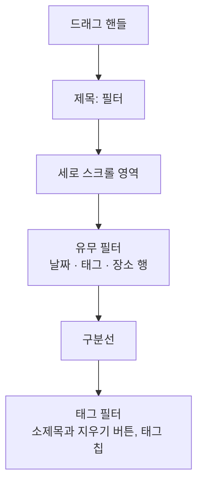
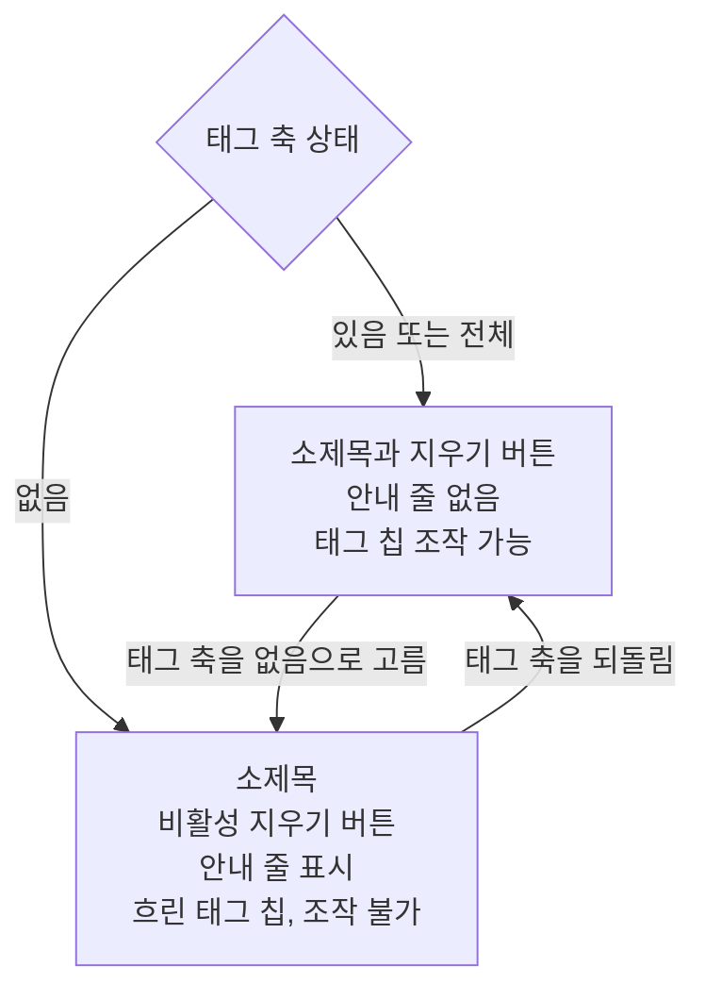

# MemoHome 목록 디자인

기준 스펙: [MemoHome 목록 스펙](../spec/memo-home.md)

## 상단 바 액션 배치

상단 바의 끝 쪽에는 검색 아이콘 버튼과 필터 아이콘 버튼을 이 순서로 나란히 배치한다. 필터를 가장 끝에 두어 기존 위치를 유지하고, 검색 버튼을 액션의 첫 자리에 둔다.

검색 버튼을 액션의 첫 자리에 두는 것은 [TagHome 목록 디자인](./tag-home.md)과 [PlaceHome 화면 디자인](./place-home.md)도 같으므로, 사용자는 어느 화면에서도 같은 자리에서 검색을 찾는다.

두 버튼 모두 아이콘만 표시하고 라벨은 표시하지 않는다. 완료된 메모 진입은 상단 바에 두지 않고 `완료된 메모 진입`의 자리에 둔다.

## 검색 진입

검색 아이콘 버튼에는 돋보기 아이콘을 표시하고 기본 상단 바 아이콘 색을 사용한다. 배지나 숫자는 표시하지 않는다.

버튼을 누르면 [SearchHome 화면](./search-home.md)을 창 너비와 관계없이 단독으로 표시하고, 메모 탭이 선택된 상태로 시작한다.

목록이 비어 있어도, 필터를 적용해 두었어도 버튼은 같은 모양으로 표시하며 비활성 표현을 사용하지 않는다. 필터를 적용해 두었을 때 필터 버튼이 주요 색으로 바뀌는 것과 달리 검색 버튼의 색은 바뀌지 않는다.

## 완료된 메모 진입

목록 위 정렬 줄의 끝 쪽에 완료된 메모 진입 버튼을 둔다. 버튼의 해부구조, 자리와 폭, 상태, 조작과 접근성은 [목록 진입 버튼 디자인](./list-entry-button.md)을 따른다.

버튼의 라벨에는 `문구와 접근성`의 완료된 메모 진입 라벨을 쓴다.

버튼을 누르면 MemoFinishedList 화면을 창 너비와 관계없이 단독으로 표시한다. 화면의 구조와 문구는 [MemoFinishedList 화면 디자인](./memo-finished-list.md)을 따른다.

## 필터 진입

필터 아이콘 버튼은 상단 바의 가장 끝에 배치한다.

버튼의 아이콘과 Bottom Sheet의 표시, 닫는 조작, 필터 반영 전환, 적응형 배치는 [필터 Bottom Sheet 디자인](./filter-bottom-sheet.md)을 따른다. 다만 MemoHome의 Bottom Sheet는 태그 필터에 더해 유무 필터를 함께 담으므로, 아래의 `필터 Bottom Sheet 구성`이 이 화면의 내용과 배치를 소유한다.

필터 아이콘 버튼은 유무 필터의 세 축이 모두 `전체`이고 선택한 태그가 하나도 없으면 기본 상단 바 아이콘 색을 사용한다. 세 축 중 하나라도 `전체`가 아니거나 선택한 태그가 하나 이상이면 아이콘을 주요 색으로 표시한다. 어떤 필터가 적용되었는지는 아이콘으로 구분하지 않고 배지도 표시하지 않는다.

필터 아이콘 버튼을 누르면 목록과 넓은 화면의 상세 영역을 어둡게 처리한 배경 아래에 그대로 유지한 채 필터 Bottom Sheet를 표시한다. 태그 칩의 표현과 선택 조작은 [태그 필터 디자인](./tag-filter.md)을 따른다.

## 필터 Bottom Sheet 구성

Bottom Sheet 상단에는 드래그 핸들을 표시하고, 그 아래에 `필터` 제목을 배치한다. 별도 닫기 버튼은 표시하지 않는다.

제목 아래에는 유무 필터 영역과 태그 필터 영역을 이 순서로 세로로 잇는다. 두 영역 사이에는 좌우를 제목 영역과 맞춘 구분선을 두어 서로 다른 방식의 필터임을 드러낸다.

제목만 Bottom Sheet 위쪽에 고정하고, 유무 필터 영역과 태그 필터 영역은 하나의 세로 스크롤 영역에 함께 둔다. 내용이 표시 영역보다 길면 두 영역이 함께 스크롤된다.

## 유무 필터 영역

날짜, 태그, 장소를 이 순서로 한 축에 한 행씩 세로로 배치하고, 행 사이에는 [공통 항목 간격](./dimens.md)을 둔다.

각 행에는 왼쪽에 축 이름을 표시하고, 오른쪽 남은 폭에 `있음`, `없음`, `전체`를 이 순서로 담은 3분할 세그먼트 버튼을 배치한다. 세 버튼은 같은 폭으로 나누고, 세그먼트 버튼 행은 행의 남은 폭을 모두 사용한다. 축 이름과 세그먼트 버튼 행 사이에는 [공통 구성요소 간격](./dimens.md)을 둔다.

세그먼트 버튼에는 선택을 나타내는 체크 아이콘을 표시하지 않고 라벨만 표시한다. 좁은 창에서도 세 라벨이 줄어들지 않고 한 줄로 보이게 하기 위해서다. 선택된 버튼은 Material 기본 선택 컨테이너 색과 그 위에서 읽을 수 있는 라벨 색으로 표시한다.

각 행에서는 항상 한 버튼만 선택된 상태로 보이며, 선택되지 않은 상태는 없다. 어떤 축도 고르지 않은 처음 상태에서는 세 행 모두 `전체`가 선택된 상태로 표시한다.

버튼을 누르면 그 행의 선택을 즉시 갱신하고 Bottom Sheet는 열린 상태를 유지한다. 이미 선택된 버튼을 다시 눌러도 선택은 바뀌지 않는다. 선택이 바뀔 때 컨테이너 색 전환은 Material 기본 모션을 따르고 별도 수치를 정하지 않는다.

키보드나 포인터를 사용하는 환경에서는 세그먼트 버튼에 차례로 초점을 이동할 수 있고, `Enter` 또는 `Space`로 선택한다.

## 태그 필터 영역

구분선 아래에 `태그 필터` 소제목을 두고, 그 아래에 태그 칩을 배치한다. 소제목은 Bottom Sheet 제목보다 작은 글씨로 표시해 하위 영역임을 드러낸다.

소제목과 같은 줄의 오른쪽 끝에는 선택 전체 해제 버튼을 둔다. 이 버튼의 표현과 조작, 라벨과 접근성 이름은 [태그 필터 디자인](./tag-filter.md)의 `선택 전체 해제 버튼`을 따른다. 이 버튼은 태그 필터 선택만 되돌리고 유무 필터의 세그먼트 버튼은 바꾸지 않는다.

태그 칩의 표현, 선택 조작, 조회 중 표시는 [태그 필터 디자인](./tag-filter.md)의 `태그 필터 Bottom Sheet`를 따른다. 다만 태그 영역만 따로 스크롤하지 않고 `필터 Bottom Sheet 구성`의 스크롤 영역을 함께 사용한다.

## 태그 필터가 적용되지 않는 상태

태그 축이 `없음`이면 태그 필터가 목록에 적용되지 않는다. 이때 태그 필터 영역을 숨기지 않고 자리와 순서를 그대로 둔 채 적용되지 않는 상태로 표시해, 사용자가 무엇을 되돌리면 다시 적용되는지 같은 Bottom Sheet 안에서 확인할 수 있게 한다.

소제목 줄 아래, 태그 칩 위에 적용되지 않는 이유를 알리는 한 줄 안내를 둔다. 안내는 소제목보다 작은 글씨와 보조 색으로 표시하고, 소제목 줄과 태그 칩 사이에 [공통 항목 간격](./dimens.md)을 둔다. 태그 축이 `없음`이 아니면 이 줄은 표시하지 않는다.

태그 칩과 선택 전체 해제 버튼은 Material 기본 비활성 표현으로 표시한다. 태그 칩은 선택한 태그의 컬러 채움과 선택하지 않은 태그의 원형 표시를 그대로 유지한 채 영역 전체를 [공통 스타일](./styles.md)의 `흐림`으로 표시해, 유지된 선택은 그대로 읽히면서 지금 조작할 수 없다는 것만 드러낸다.

비활성인 동안 태그 칩과 선택 전체 해제 버튼은 눌러도 반응하지 않고 누름 표현도 나타나지 않으며, 키보드와 포인터의 초점 이동에서도 건너뛴다. 유무 필터의 세그먼트 버튼은 영향을 받지 않아 사용자는 태그 축을 바로 되돌릴 수 있다.

태그 추가 칩도 태그 칩과 같이 비활성으로 두어 영역의 `흐림`을 함께 받고, 눌러도 반응하지 않으며 초점 이동에서 건너뛴다. 칩 자체의 표현은 태그 칩처럼 활성 때와 같게 두어 흐림이 두 번 겹치지 않게 한다.

태그 축을 `있음`이나 `전체`로 되돌리면 안내 줄이 사라지고 태그 칩과 선택 전체 해제 버튼이 즉시 활성으로 돌아온다. 활성과 비활성 사이의 색 전환은 Material 기본 모션을 따르고 별도 수치를 정하지 않는다.

## 정렬 줄

정렬 줄은 상단 바 바로 아래, 메모 목록 위에 둔다. 완료된 메모 진입 버튼과 같은 줄을 쓰고 정렬 컨트롤을 시작 쪽에, 완료된 메모 진입 버튼을 끝 쪽에 둔다. 정렬 줄과 정렬 선택 Bottom Sheet의 구조, 조작, 아이콘과 문구는 [목록 정렬 디자인](./list-sort.md)을 따른다.

## 메모 카드

메모는 카드 형태로 표시하고 카드 사이에는 세로로 [공통 항목 간격](./dimens.md)을 둔다. 카드 가장자리와 내용 사이의 여백은 [공통 스타일](./styles.md)의 `카드 내용`을 따른다.

각 카드에는 메모 제목을 표시하고, 제목 왼쪽에는 메모에 저장된 컬러로 채운 작은 원형 표시를 둔다. 원형 표시와 제목·기간 글 묶음 사이에는 [공통 여백과 간격](./dimens.md)의 `컬러 원형 표시 간격`을 둔다.

메모 제목은 한 줄을 유지한다. 제목이 카드에서 사용할 수 있는 폭을 넘으면 기본 이동 속도와 간격으로 가로 이동을 시작하고, 카드가 표시되는 동안 횟수 제한 없이 반복한다. 접근성에는 생략하지 않은 전체 제목을 제공한다.

기간이 있는 메모는 제목 아래에 제목보다 작은 글씨로 기간을 표시한다. 기간이 없는 메모는 제목만 표시한다.

이 카드는 [MemoFinishedList 화면 디자인](./memo-finished-list.md), [TagDetail 메모 탭 디자인](./tag-detail-memo.md), [TagMemoFinishedList 화면 디자인](./tag-memo-finished-list.md)의 메모 목록과 [SearchHome 화면 디자인](./search-home.md)의 메모 결과에도 같은 형태로 쓴다.

아직 준비되지 않은 자리에는 [페이지 조회 목록의 자리 표시 디자인](./paged-list-placeholder.md)에 따라 자리 표시 카드를 표시한다.

## 빈 상태

표시할 메모가 하나도 없으면 목록 자리에 [목록 빈 상태 디자인](./list-empty-state.md)의 빈 상태를 표시한다. 이때 날짜 헤더도 함께 사라진다.

빈 상태의 아이콘과 문구는 필터를 적용해 두었는지에 따라 달라진다. 필터 적용 여부의 기준은 `필터 진입`에서 필터 아이콘 버튼을 주요 색으로 표시하는 기준과 같다.

| 상태 | 아이콘 | 제목 문구 |
| --- | --- | --- |
| 필터 아이콘이 기본 색인 상태 | 메모 아이콘 | `아직 메모가 없습니다` |
| 필터 아이콘이 주요 색인 상태 | 필터 아이콘 | `조건에 맞는 메모가 없습니다` |

두 빈 상태 사이의 전환과 목록과의 전환, 정확한 문구는 [목록 빈 상태 디자인](./list-empty-state.md)을 따른다.

빈 상태에서도 상단 바의 검색 버튼과 필터 버튼, 정렬 줄의 완료된 메모 진입 버튼, 떠 있는 메모 추가 버튼은 같은 자리에 그대로 표시한다.

## 날짜 헤더

기간이 있는 메모 카드는 시작 날짜가 같은 것끼리 모으고, 각 묶음 위에 시작 날짜를 나타내는 날짜 헤더를 표시한다. 날짜 헤더 글의 위아래에는 `4dp` 여백을 둔다.

목록을 스크롤하면 현재 보고 있는 묶음의 날짜 헤더를 목록 위쪽에 고정한다. 다음 묶음의 헤더가 올라오면 고정된 자리를 넘겨준다.

기간이 없는 메모 카드는 목록 맨 위에 헤더 없이 모아 표시한다. 이 구간을 보는 동안에는 고정 날짜 헤더를 표시하지 않는다.

자리 표시 카드는 날짜 헤더 없이 표시하고, 내용이 준비되면 해당 묶음의 날짜 헤더와 함께 표시한다.

## 기간과 날짜 문구

날짜와 시간 표기는 [DiaryDateTimeInput 컴포넌트 디자인](./diary-date-time-input.md)의 표시 형식을 따른다.

기간은 시작과 종료를 `~`로 이어 표시하되, 반복되는 날짜는 생략한다. 오전·오후 문구는 시작과 종료가 같은 날이어도 생략하지 않는다.

| 기간 | 한국어 | 그 외 기본 |
| --- | --- | --- |
| 종일이고 시작과 종료가 같은 날 | `2026. 7. 19.` | `Jul 19, 2026` |
| 종일이고 시작과 종료가 다른 날 | `2026. 7. 19. ~ 2026. 7. 21.` | `Jul 19, 2026 ~ Jul 21, 2026` |
| 종일이 아니고 시작과 종료가 같은 날 | `2026. 7. 19. 오후 1:30 ~ 오후 3:00` | `Jul 19, 2026 1:30 PM ~ 3:00 PM` |
| 종일이 아니고 시작과 종료가 다른 날 | `2026. 7. 19. 오후 1:30 ~ 2026. 7. 20. 오전 9:00` | `Jul 19, 2026 1:30 PM ~ Jul 20, 2026 9:00 AM` |

그룹 날짜가 오늘이면 날짜 대신 오늘 문구를 표시한다.

## 완료와 삭제 제스처

사용자는 메모 카드를 왼쪽에서 오른쪽으로 스와이프해 완료하고, 오른쪽에서 왼쪽으로 스와이프해 삭제한다.

스와이프 중 상태 아이콘, 완료·삭제 기준, 취소와 비활성 표현은 [SwipeToFinishAndDelete 컴포넌트 디자인](./swipe-to-finish-and-delete.md)을 따른다.

완료 또는 삭제가 성립하면 카드를 목록에서 없애고, 결과 안내와 실행 취소 동작을 스낵바로 표시한다.

## 문구와 접근성

한국어 환경과 그 외 기본 환경에서 다음 문구를 사용한다. 태그 칩의 문구는 [태그 필터 디자인](./tag-filter.md)의 `문구와 접근성`을 따르고, 이 화면에서 다른 필터 문구는 아래 표를 따른다.

| 항목 | 한국어 | 그 외 기본 |
| --- | --- | --- |
| 필터 버튼 접근성 이름 | `필터` | `Filter` |
| 필터 적용 상태 접근성 설명 | `필터 적용됨` | `Filter applied` |
| Bottom Sheet 제목 | `필터` | `Filter` |
| 태그 칩 영역 소제목 | `태그 필터` | `Tag Filter` |
| 태그 필터 미적용 안내 | `태그 축이 없음이면 태그 필터는 적용되지 않습니다.` | `Tag filter is not applied while the tag axis is Without.` |
| 날짜 축 이름 | `날짜` | `Date` |
| 태그 축 이름 | `태그` | `Tag` |
| 장소 축 이름 | `장소` | `Place` |
| 있음 상태 | `있음` | `With` |
| 없음 상태 | `없음` | `Without` |
| 전체 상태 | `전체` | `All` |
| 완료된 메모 진입 라벨 | `완료된 메모` | `Finished memos` |
| 검색 버튼 접근성 이름 | `검색` | `Search` |
| 오늘 날짜 헤더 | `오늘` | `Today` |
| 완료 안내 | `메모가 완료되었습니다.` | `Memo finished.` |
| 삭제 안내 | `메모가 삭제되었습니다.` | `Memo deleted.` |
| 실행 취소 동작 | `실행 취소` | `Undo` |
| 완료 스와이프 아이콘 접근성 이름 | `메모 완료` | `Finish memo` |
| 삭제 스와이프 아이콘 접근성 이름 | `메모 삭제` | `Delete memo` |

유무 필터의 세그먼트 버튼은 라벨만으로는 어느 축의 상태인지 알 수 없으므로, 접근성 이름에 축 이름과 상태 라벨을 이 순서로 이어 읽힌다. 예를 들어 날짜 축의 세 버튼은 `날짜 있음`, `날짜 없음`, `날짜 전체`로, 그 외 기본 환경에서는 `Date With`, `Date Without`, `Date All`로 읽는다.

## 참고

- [Canonical layouts](https://developer.android.com/develop/adaptive-apps/guides/canonical-layouts)
- [Segmented buttons](https://developer.android.com/develop/ui/compose/components/segmented-button)
