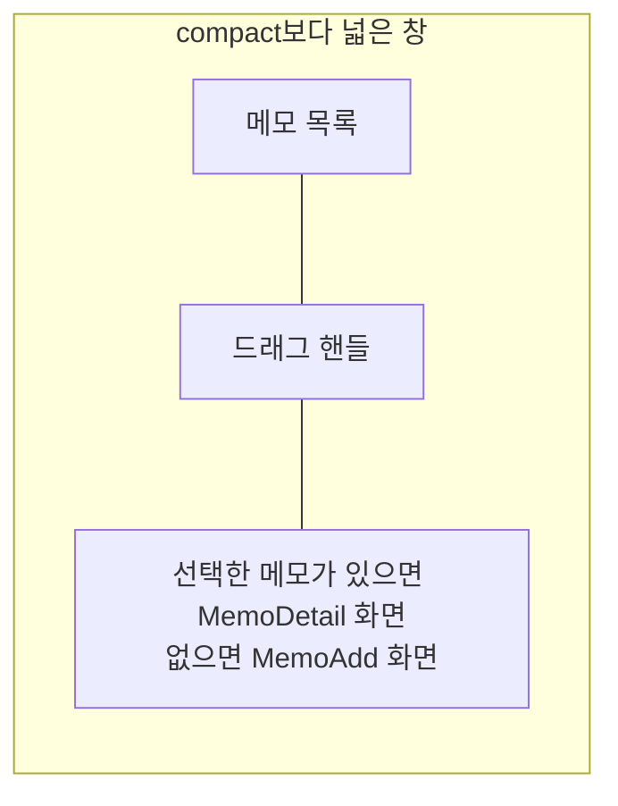

# Memo 목록·상세 배치 디자인

기준 스펙: [Memo 목록·상세 배치 스펙](../spec/client/memo-list-detail.md)

배치, 크기 조절, 버튼 노출과 조절 상태 표시의 공통 표현은 [목록·상세 배치 공통 디자인](./list-detail-pane.md)을 따른다.

## 두 영역에 두는 화면

목록 영역에는 [MemoHome 목록](./memo-home.md)을 두고, 상세 영역에는 선택한 메모의 [MemoDetail 화면](./memo-detail.md)을 표시한다. 선택한 메모가 없으면 [MemoAdd 화면](./memo-add.md)을 표시한다. 두 영역은 각각 자기 상단 바를 갖는다.

상세 영역에 아이콘과 안내만 두는 [목록·상세 배치 공통 디자인](./list-detail-pane.md)의 `선택 전 상세`는 이 배치에서 쓰지 않는다. 선택 전 자리를 메모 추가가 채우므로 사용자가 목록을 떠나지 않고 곧바로 입력할 수 있다.

상세 영역에 놓인 MemoAdd 화면과 MemoDetail 화면의 본문은 창 너비와 관계없이 [메모 본문 배치 디자인](./memo-form.md)의 `적응형 배치`에 따라 한 열로 둔다.

## 상세 영역의 전환

목록에서 메모 카드를 누르면 상세 영역이 그 메모의 MemoDetail 화면으로 바뀐다. 상세 영역에서 시스템 뒤로가기를 사용하거나 그 메모를 삭제하면 상세 영역이 그 전에 놓였던 화면으로, 없으면 MemoAdd 화면으로 되돌아간다.

목록의 떠 있는 메모 추가 버튼을 누르면 상세 영역이 MemoAdd 화면으로 바뀐다. 버튼과 추가 단축키의 노출 조건은 [목록·상세 배치 공통 디자인](./list-detail-pane.md)의 `버튼 노출`을 따르므로, 상세 영역에 이미 MemoAdd가 놓여 있는 동안에는 버튼을 표시하지 않는다.

상세 영역의 화면이 바뀌어도 목록 영역과 드래그 핸들의 자리와 너비 비율은 그대로 둔다.

필터 Bottom Sheet를 여는 동안에는 목록 영역과 상세 영역을 함께 어둡게 처리한 배경 아래에 그대로 둔다. 표현은 [MemoHome 목록 디자인](./memo-home.md)의 `필터 진입`을 따른다.

목록의 정렬 줄과 당김 새로고침, 진행 표시는 목록 영역 안에만 두고 상세 영역에는 두지 않는다. 당김과 진행 표시를 두는 영역은 [새로고침 디자인](./sync-refresh.md)의 `적응형 배치`를 따른다.
