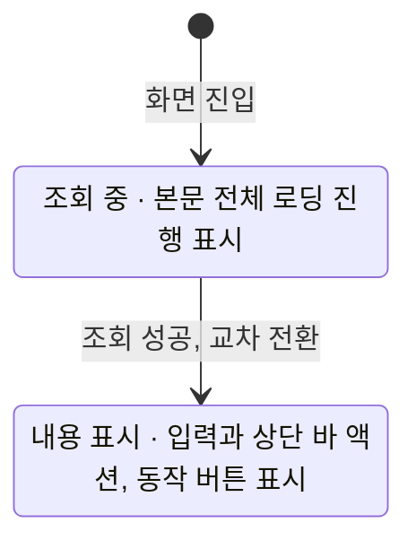

# MusicDetail 화면 디자인

기준 스펙: [MusicDetail 화면 스펙](../spec/music-detail.md), [Playlist 목록·상세 배치 스펙](../spec/playlist-list-detail.md)

## 화면 구조

MusicDetail 화면은 창 너비에 따라 단독으로 표시하거나 [Playlist 목록·상세 배치 디자인](./playlist-list-detail.md)에 따라 곡 목록과 함께 상세 영역에 표시한다. 공통 내비게이션 영역은 [TopLevelNavigation 디자인](./top-level-navigation.md)에 따라 숨긴다.

화면 상단에는 저장된 곡 제목을 제목으로 두는 상단 바를 둔다. 뒤로가기 버튼의 노출 조건은 [목록·상세 배치 공통 디자인](./list-detail-pane.md)의 `버튼 노출`을 따르므로, 단독으로 표시할 때만 뒤로가기 버튼을 둔다.

조회가 완료되면 상단 바 끝 쪽에 외부로 열기 버튼과 삭제 버튼을 이 순서로 둔다. 되돌릴 수 없는 삭제를 모서리에 고정해 두어 다른 액션이 늘어도 삭제 버튼의 자리가 바뀌지 않게 한다. 이는 [WebDetail 화면 디자인](./web-detail.md)의 상단 바 액션 배치와 같은 기준이다. 상단 바에는 수정 동작을 실행하는 컨트롤을 두지 않고, 수정은 `수정 버튼`에 따라 본문에 떠 있는 버튼으로 제공한다.

상단 바의 곡 제목은 한 줄을 유지한다. 제목이 사용할 수 있는 폭을 넘으면 기본 이동 속도와 간격으로 가로 이동을 시작하고, 화면에 표시되는 동안 횟수 제한 없이 반복한다. 접근성에는 생략하지 않은 전체 제목을 제공한다. 이는 [PlaylistHome 화면 디자인](./playlist-home.md)의 곡 카드 제목과 같은 기준이다.

본문에는 링크 입력, 단일 줄 제목 입력, 단일 줄 가수 입력을 위에서부터 이 순서로 둔다. 입력의 순서와 그 이유, 링크 카드의 구성과 조작, 소프트 키보드 요청, 입력 사이 간격은 모두 [MusicAdd 화면 디자인](./music-add.md)의 `화면 구조`, `링크 입력`, `불러오기 버튼`, `썸네일 미리보기`를 따른다. 두 화면이 같은 자리에 같은 입력을 두어 사용자가 곡을 추가할 때와 고칠 때 같은 방식으로 조작한다. 이 화면에도 태그 입력을 두지 않는다.

본문 바깥에는 [공통 화면 가로 여백과 세로 여백](./dimens.md)을 둔다. 본문의 내용이 화면 높이를 넘으면 본문 안에서 세로로 스크롤한다.

## 진입 시 표시 내용

조회가 완료되면 링크, 제목, 가수 입력에 저장된 값을 채우고, 링크 카드의 썸네일 미리보기에는 저장된 썸네일을 표시한다.

저장된 링크가 비어 있으면 링크 입력을 비운 채로 두고, 저장된 썸네일이 비어 있으면 [MusicAdd 화면 디자인](./music-add.md)의 `썸네일 미리보기`와 같게 미리보기 자리를 카드에서 완전히 비운다.

저장된 값이 이미 채워져 있어도 입력을 읽기 전용으로 바꾸지 않으며, 링크 입력의 지우기 버튼과 불러오기 버튼도 그대로 제공한다.

입력이 비어 있는 상태에 오류 색이나 필수 표시를 상시로 두지 않는다. 링크나 제목이나 가수를 비운 채 수정하면 저장된 기존 값이 쓰이므로 사용자가 고쳐야 하는 상태가 아니다.

## 다시 불러오기

링크 카드 안의 불러오기 버튼은 [MusicAdd 화면 디자인](./music-add.md)의 `불러오기 버튼`과 같은 자리에 같은 모양과 라벨로 둔다. 같은 조작이 두 화면에서 다르게 보이지 않게 하기 위한 것이며, 이 화면이라고 해서 `다시 불러오기`로 라벨을 바꾸지 않는다.

불러오기를 처리하는 동안의 표현과 실패 안내도 [MusicAdd 화면 디자인](./music-add.md)의 `진행과 피드백`을 따른다. 처리 중에도 입력과 상단 바 액션과 수정 버튼을 잠그거나 흐리게 바꾸지 않는다.

불러오기에 성공하면 제목 입력과 가수 입력의 값과 썸네일 미리보기가 불러온 영상의 값으로 바뀐다. 값이 바뀌는 것이 결과를 충분히 알리므로 성공 스낵바를 표시하지 않는다.

저장된 썸네일이 없어 미리보기가 없던 카드에 썸네일이 채워지면 카드가 그만큼 아래로 늘어나며, 높이가 바뀔 때의 전환은 [MusicAdd 화면 디자인](./music-add.md)의 `썸네일 미리보기`를 따른다.

## 수정 버튼

수정 버튼은 본문의 끝 쪽 아래 모서리에 떠 있는 버튼으로 두고 체크 아이콘을 쓴다. 이는 [ContactDetail 화면 디자인](./contact-detail.md), [WebDetail 화면 디자인](./web-detail.md), [PlaceDetail 화면 디자인](./place-detail.md)의 수정 버튼과 같은 표현이다.

수정 버튼은 입력 내용이나 미리보기의 썸네일이 저장 내용과 다를 때만 표시하며, 나타나고 사라지는 표현은 [나타나고 사라지는 버튼 디자인](./button-visibility.md)을 따른다. 링크가 YouTube 영상 링크가 아니어도 저장 내용과 다르므로 버튼을 표시하고, 링크 형식 안내는 수정을 실행한 시점에만 제공한다.

수정을 처리하는 동안에는 수정 버튼의 체크 아이콘을 진행 표시로 바꾼다. 처리 중에도 입력을 잠그거나 흐리게 바꾸지 않으며, 상단 바의 두 버튼과 서로를 비활성으로 만들지 않는다.

물리 키보드 환경에서는 수정 버튼이 표시된 동안 `Cmd` 또는 `Meta`와 `Enter`를 함께 눌러 수정 반영을 실행할 수 있다. 이는 [항목 추가 화면 공통 디자인](./entity-add.md)의 `초점과 키보드 단축키`가 정한 추가 실행 단축키와 같은 기준이다.

본문의 마지막 입력이 수정 버튼에 가리지 않게 배치한다.

## 상단 바 액션

외부로 열기 버튼에는 앱 밖으로 나가는 것을 뜻하는 바깥쪽 화살표가 있는 사각형 아이콘을 쓴다. 누르면 곧바로 앱 밖에서 열리므로 진행 표시나 눌린 상태를 남기지 않고, 앱 밖에서 열지 못했을 때도 화면을 그대로 둔다. 이는 [WebDetail 화면 디자인](./web-detail.md)의 외부로 열기 버튼과 같은 표현이다.

저장된 링크가 비어 있으면 외부로 열기 버튼을 아예 표시하지 않고 비활성으로 두지 않는다. 열 주소가 없는 것은 그 곡이 가진 상태이고 사용자가 이 버튼으로 고칠 수 있는 것이 아니므로, 누를 수 없는 버튼을 남겨 두지 않는다. 사용자가 링크를 채워 수정하면 버튼이 나타나며, 나타나고 사라지는 표현은 [나타나고 사라지는 버튼 디자인](./button-visibility.md)을 따른다.

삭제 버튼에는 휴지통 아이콘을 쓰고, 삭제를 처리하는 동안 아이콘을 진행 표시로 바꾼다. 표현과 크기는 [WebDetail 화면 디자인](./web-detail.md)의 삭제 버튼과 같다.

삭제 전에 확인 대화상자를 두지 않으며, 이는 [ContactDetail 화면 디자인](./contact-detail.md)과 [WebDetail 화면 디자인](./web-detail.md)의 삭제와 같은 기준이다.

삭제를 처리하는 동안에도 외부로 열기 버튼과 뒤로가기 버튼, 본문의 입력, 불러오기 버튼과 수정 버튼은 그대로 누를 수 있고 어떤 요소도 비활성으로 표시하지 않는다. 삭제에 실패하면 삭제 버튼의 진행 표시만 아이콘으로 되돌리고 별도의 안내는 표시하지 않는다.

삭제에 성공하면 단독으로 표시하고 있었으면 진입하기 전 화면으로 돌아가고, 목록과 함께 표시하고 있었으면 상세 영역이 [Playlist 목록·상세 배치 디자인](./playlist-list-detail.md)의 선택 전 표시로 되돌아간다.

## 상태 전환과 표시

곡을 조회하는 동안에는 본문 가운데에 로딩 진행 표시를 두고 어떤 입력도 표시하지 않으며, 상단 바에도 곡 제목과 외부로 열기 버튼, 삭제 버튼을 표시하지 않는다. 수정 버튼도 표시하지 않는다. 이는 [ContactDetail 화면 디자인](./contact-detail.md)의 조회 중 표현과 같은 기준이다.

조회에 성공하면 입력과 상단 바 액션을 표시하고 로딩 진행 표시를 감춘다. 두 상태 사이에는 교차 전환을 쓴다.

곡을 조회할 수 없거나 조회에 실패하면 조회 중 표시를 그대로 유지하고, 실패 안내나 다시 시도 버튼을 두지 않는다.

대상 곡이 다른 경로에서 삭제 상태가 되어도 내용 표시 상태를 그대로 두고, 삭제되었음을 알리는 표시나 비활성 표현을 두지 않는다.

## 진행과 피드백

수정 성공, 링크 형식 안내와 불러오기 실패 안내는 모두 스낵바로 표시한다. 목록과 함께 표시할 때 스낵바를 두는 자리는 [목록·상세 배치 공통 디자인](./list-detail-pane.md)의 `진행과 피드백`을 따른다.

새 피드백을 표시할 때 이미 보이는 스낵바가 있으면 표시 시간이 지나기를 기다리지 않고 즉시 새 피드백으로 바꾼다. 이는 [MusicAdd 화면 디자인](./music-add.md)이 따르는 [항목 추가 화면 공통 디자인](./entity-add.md)의 피드백과 같은 기준이다.

링크 형식 안내도 수정을 실행한 결과로 판단하므로 수정 처리와 같은 진행 표시를 거친 뒤 피드백을 표시하고, 입력 초점을 링크 입력으로 옮긴다.

링크나 제목이나 가수를 비운 채 수정해 저장된 기존 값이 유지되는 경우에는 별도의 안내를 표시하지 않고 수정 성공 피드백만 표시한다.

수정에 성공해도 입력 내용을 비우거나 되돌리지 않으며, 수정 버튼은 입력이 저장 내용과 같아졌으므로 사라진다. 상단 바 제목은 새로 저장된 제목으로 바뀐다.

## 표시 영역과 소프트 키보드

본문, 수정 버튼과 스낵바는 상태 표시 영역, 시스템 탐색 영역과 카메라 컷아웃 등 기기가 가리는 영역을 침범하지 않게 배치한다.

소프트 키보드가 나타나면 본문을 키보드 위 영역에 맞춰 배치한다. 초점을 옮길 때의 스크롤과 키보드 표현은 [항목 추가 화면 공통 디자인](./entity-add.md)의 `초점과 키보드 단축키`를 따른다. 진입할 때는 어느 입력에도 초점을 두지 않으므로 소프트 키보드도 열지 않는다.

## 적응형 배치

본문의 배치는 창 너비, 창 높이와 기기 자세에 따라 달라지지 않으며, 상세 영역과 자리를 나눠 좁아져도 입력의 순서와 구성은 그대로 둔다. 이는 [MusicAdd 화면 디자인](./music-add.md)의 `표시 영역과 소프트 키보드`와 같은 기준이다.

목록과 자리를 나눠 쓰는 배치와 그 자리에서의 버튼 노출은 [Playlist 목록·상세 배치 디자인](./playlist-list-detail.md)이 정한다.

외부로 열기는 플랫폼마다 그 플랫폼이 웹 주소를 여는 기본 방법을 사용한다. 어느 앱이나 창에서 열리는지는 플랫폼과 사용자 설정이 정하며 이 화면에서 정하지 않는다.

## 문구와 접근성

한국어 환경과 그 외 기본 환경에서 다음 문구를 사용한다.

| 항목 | 한국어 | 그 외 기본 |
| --- | --- | --- |
| 상단 바 제목 | 저장된 곡 제목 | 저장된 곡 제목 |
| 뒤로가기 버튼 접근성 이름 | `뒤로가기` | `Navigate up` |
| 외부로 열기 버튼 접근성 이름 | `외부로 열기` | `Open externally` |
| 삭제 버튼 접근성 이름 | `곡 삭제` | `Delete music` |
| 수정 버튼 접근성 이름 | `곡 수정` | `Update music` |
| 수정 성공 안내 | `곡이 수정되었습니다.` | `Music updated.` |

링크 입력과 가수 입력의 이름, 불러오기 버튼의 라벨과 접근성 이름, 썸네일 미리보기의 접근성 이름, 링크 형식 안내와 불러오기 실패 안내 문구는 [MusicAdd 화면 디자인](./music-add.md)의 문구를 그대로 쓴다. 같은 입력과 같은 판단 기준을 두 화면에서 다른 문구로 안내하지 않는다.

제목 입력의 이름과 표현은 그 입력 컴포넌트의 디자인을 따른다.

상단 바 제목은 저장된 제목을 그대로 읽히게 두고 별도의 접근성 이름을 두지 않는다.
