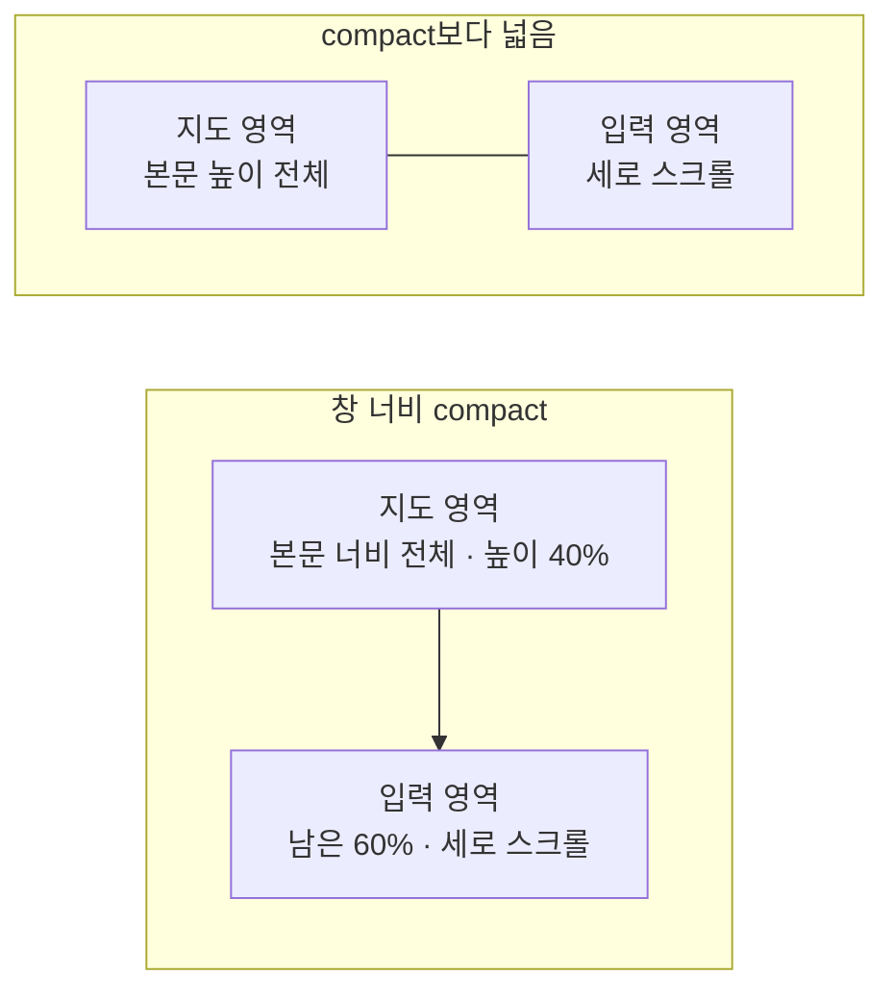

# PlaceAdd 화면 디자인

기준 스펙: [PlaceAdd 화면 스펙](../spec/place-add.md)

화면 구조, 태그 입력의 자리, 표시 영역과 소프트 키보드, 초점과 단축키, 진행과 피드백의 공통 표현은 [항목 추가 화면 공통 디자인](./entity-add.md)을 따른다.

## 화면 구조

PlaceAdd 화면은 창 너비와 관계없이 단독으로 표시한다.

상단 바 끝 쪽에는 장소 검색 버튼을 둔다. 검색 버튼의 아이콘과 감추는 조건은 [장소 검색 다이얼로그 디자인](./place-search-dialog.md)의 `여는 컨트롤`을 따른다.

본문은 지도 영역과 입력 영역으로 나눈다. 지도 영역에는 지점 선택을 사용하는 공용 지도 컴포넌트를 배치하고, 입력 영역에는 단일 줄 제목 입력, 설명 입력, 단일 줄 주소 입력, 위도 입력, 경도 입력, 컬러 입력, 태그 입력을 순서대로 배치하고 각 입력 사이에 [공통 구성요소 간격](./dimens.md)을 둔다. 추가 동작은 떠 있는 버튼으로 표시한다.

태그 입력을 입력 영역 가장 마지막에 두는 기준은 [항목 추가 화면 공통 디자인](./entity-add.md)의 `태그 입력의 자리`를 따른다. 태그 입력의 구성과 조작은 [항목 태그 입력 컴포넌트 디자인](./entity-tag-input.md)을 따른다.

지도 영역은 스크롤하지 않고 자리에 고정하며, 입력 영역만 세로로 스크롤한다. 이렇게 두면 지도를 끄는 조작과 입력 영역을 스크롤하는 조작이 서로 섞이지 않고, 사용자가 좌표를 입력하는 동안에도 지점 표시가 계속 보인다.

## 적응형 배치

창 너비가 compact이면 본문을 위아래로 나눠 지도 영역을 위에, 입력 영역을 아래에 둔다. 지도 영역은 본문 너비 전체를 채우고 본문 높이의 `40%`를 차지하며, 입력 영역이 남은 `60%`를 채운다. 본문 높이에 따라 지도를 숨기거나 높이를 고정 값으로 제한하지 않는다.

창 너비가 compact보다 넓으면 본문을 좌우로 나눠 지도 영역을 시작 쪽에, 입력 영역을 끝 쪽에 둔다. 두 영역의 너비 비율은 1:1이며 사용자가 비율을 바꾸는 핸들은 두지 않는다. 지도 영역은 본문 높이 전체를 채운다.

배치를 가르는 기준은 창 너비 하나이며, 창 높이는 배치를 바꾸지 않는다.

기본 지도를 확인하기 전이거나 읽지 못해 지도를 표시하지 않는 동안에는 지도 영역을 비워 두고 입력 영역의 자리와 크기는 바꾸지 않는다. 별도의 로딩 표시나 오류 안내도 배치하지 않는다.

## 지도에서 좌표 선택

지도 영역의 지도와 지도 제공자 전환 컨트롤의 구성, 지점 표시의 모양과 지점을 고르는 조작은 [DiaryMap 컴포넌트 디자인](./diary-map.md)을 따른다.

지도를 눌러 좌표를 고르면 위도 입력과 경도 입력의 값을 그 좌표로 바꾼다. 두 입력에 채우는 값은 소수점 여섯째 자리까지 반올림한 십진수로 표시하고, 소수점 아래 끝자리의 `0`은 그대로 남긴다. 소수점 여섯째 자리는 지도에서 고른 지점과 표시된 값이 사람이 볼 수 있는 범위에서 어긋나지 않는 자리수다.

지도를 눌러 좌표를 고를 때는 입력 영역을 스크롤하지 않는다. 소프트 키보드가 열려 있으면 열린 상태를 그대로 둔다.

지도 영역에는 지도가 좌표 선택 수단임을 알리는 안내 문구를 상시로 표시하지 않는다.

## 주소 입력

주소는 단일 줄 텍스트 입력으로 배치하고 설명 입력 아래, 위도 입력 위에 둔다. 주소는 좌표가 가리키는 곳의 정보이므로 좌표 입력과 붙여 두어 검색으로 함께 채워지는 값이 한 묶음으로 보이게 한다.

주소 입력은 입력 영역 가로 폭을 모두 사용하고, 일반 텍스트에 맞춘 소프트 키보드를 요청한다. 입력한 값이 있으면 내용을 한 번에 지우는 지우기 버튼을 오른쪽에 표시하고, 나타나고 사라지는 표현은 [나타나고 사라지는 버튼 디자인](./button-visibility.md)을 따른다. 이는 위도·경도 입력의 지우기 버튼과 같은 표현이다.

주소는 비어 있어도 되는 값이므로 비어 있는 상태에 오류 색이나 필수 표시를 두지 않는다.

장소 검색에서 고른 장소의 주소가 채워질 때도 입력을 읽기 전용으로 바꾸지 않으며, 사용자는 채워진 값을 이어서 고치거나 지울 수 있다.

## 좌표 입력

위도와 경도는 각각 독립된 단일 줄 텍스트 입력으로 배치하고, 위도를 경도보다 위에 둔다. 두 입력은 입력 영역 가로 폭을 모두 사용하며 서로 같은 크기로 표시한다.

두 입력은 지도에서 고른 좌표를 표시하는 자리와 사용자가 좌표를 직접 입력하는 자리를 겸한다. 지도에서 고른 값이 채워져 있어도 입력을 읽기 전용으로 바꾸지 않는다.

두 입력에는 부호를 포함한 십진수 입력에 맞춘 소프트 키보드를 요청해 숫자, 소수점과 음수 기호를 바로 입력할 수 있게 한다. 남반구와 서반구 좌표를 입력해야 하므로 음수 기호가 없는 십진수 키보드는 사용하지 않는다. 입력한 값이 있으면 내용을 한 번에 지우는 지우기 버튼을 오른쪽에 표시한다.

소프트 키보드 종류는 입력기에 대한 요청일 뿐이므로 값의 형식을 보장하지 않는다. 물리 키보드나 소프트 키보드가 없는 환경에서는 어떤 글자든 들어올 수 있으므로, 좌표는 추가를 실행하는 시점에 십진수로 읽을 수 있는지 판단한다.

두 입력은 처음에 비어 있는 상태로 시작하지만 장소를 추가하려면 두 값이 모두 필요하다. 입력 중에는 오류 색을 상시로 표시하지 않는다.

입력 중에는 값의 형식이나 범위를 검사해 막지 않는다. 형식과 범위에 대한 안내는 추가를 실행한 시점에 스낵바로 제공한다.

## 직접 입력한 좌표의 지도 반영

사용자가 위도나 경도를 직접 입력해 좌표가 성립하면 지점 표시를 그 자리로 옮기고 지도도 그 자리를 가운데로 옮긴다. 확대 수준은 사용자가 보고 있던 수준을 그대로 둔다.

반영 시점은 기준 스펙을 따르며, 반영을 기다리는 동안 지도 위에 진행 표시나 안내를 두지 않는다.

좌표가 성립하지 않아 지점 표시를 지울 때도 지도 위에 오류 표시를 두지 않는다.

## 표시 영역과 소프트 키보드

소프트 키보드가 나타나면 세 요소를 키보드 위 영역에 맞춰 배치한다. 지도 영역은 본문 높이의 비율을 유지하므로 줄어든 본문에 맞춰 함께 줄어들고, 사용자는 키보드가 열린 채로 좌표를 입력하면서 지점 표시를 볼 수 있다. 입력 컴포넌트의 전체 높이가 입력 영역보다 크면 입력 영역을 세로로 스크롤할 수 있게 한다. 키보드가 닫히면 원래 표시 영역으로 되돌린다.

고른 태그가 늘어 태그 입력의 칩 영역이 커지면 입력 컴포넌트 전체 높이도 함께 커지므로, 키보드가 열린 상태에서는 입력 영역을 세로로 스크롤해 가려진 입력에 닿는다. 칩 영역의 높이 기준은 [항목 태그 입력 컴포넌트 디자인](./entity-tag-input.md)을 따른다.

## 진행과 피드백

좌표 오류도 장소 추가를 실행한 결과로 판단하므로 추가 처리와 같은 진행 표시를 거친 뒤 피드백을 표시한다.

좌표를 비워 둔 경우, 숫자로 읽을 수 없는 경우와 범위를 벗어난 경우를 문구로 구분하지 않는다. 하나의 안내에 지도에서 위치를 고르는 방법과 위도·경도의 유효 범위를 함께 담아 사용자가 무엇을 고쳐야 하는지 알 수 있게 한다.

추가에 성공하면 지도 영역의 지도는 보고 있던 자리에 그대로 두고 지점 표시만 사라지게 한다. 지도를 다른 곳으로 옮기는 표현은 두지 않는다. 태그 입력의 칩 영역은 고른 태그를 그대로 유지한다.

## 문구와 접근성

[항목 추가 화면 공통 디자인](./entity-add.md)의 `문구와 접근성`에 더해 한국어 환경과 그 외 기본 환경에서는 다음 문구를 사용한다.

| 문구 | 한국어 | 그 외 기본 |
| --- | --- | --- |
| 상단 바 제목 | `장소 추가` | `Add Place` |
| 추가 버튼 접근성 이름 | `장소 추가` | `Add place` |
| 검색 버튼 접근성 이름 | [장소 검색 다이얼로그 디자인](./place-search-dialog.md)을 따름 | 같음 |
| 주소 입력 이름 | `주소` | `Address` |
| 위도 입력 이름 | `위도` | `Latitude` |
| 경도 입력 이름 | `경도` | `Longitude` |
| 지도 영역 접근성 이름 | `장소 위치 지도` | `Place location map` |
| 추가 성공 안내 | `장소가 추가되었습니다.` | `Place added.` |
| 제목 미입력 안내 | `제목을 입력해 주세요.` | `Please enter a title.` |
| 좌표 오류 안내 | `지도에서 위치를 선택하거나, 위도는 -90에서 90, 경도는 -180에서 180 사이의 숫자로 입력해 주세요.` | `Select a location on the map, or enter a latitude between -90 and 90 and a longitude between -180 and 180.` |

제목 입력과 설명 입력의 이름과 표현은 각 입력 컴포넌트의 디자인을 따르고, 컬러 입력은 [DiaryColorInput 컴포넌트 디자인](./diary-color-input.md)을 따른다.

지도 영역의 지점 표시와 지도 제공자 전환 컨트롤의 문구와 접근성 이름은 [DiaryMap 컴포넌트 디자인](./diary-map.md)을 따른다.

태그 입력의 칩 라벨과 태그 선택 목록의 문구는 [항목 태그 입력 컴포넌트 디자인](./entity-tag-input.md)을 따른다.
