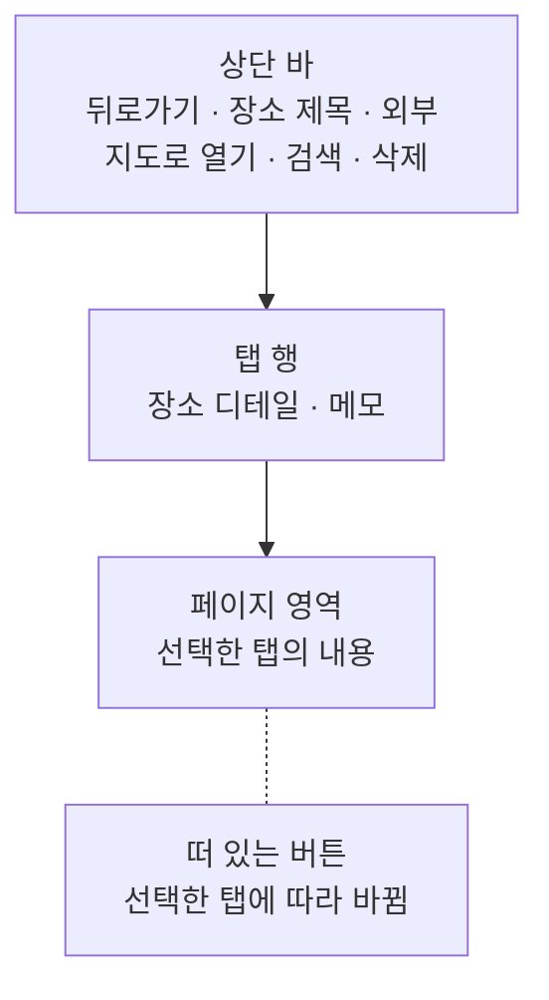
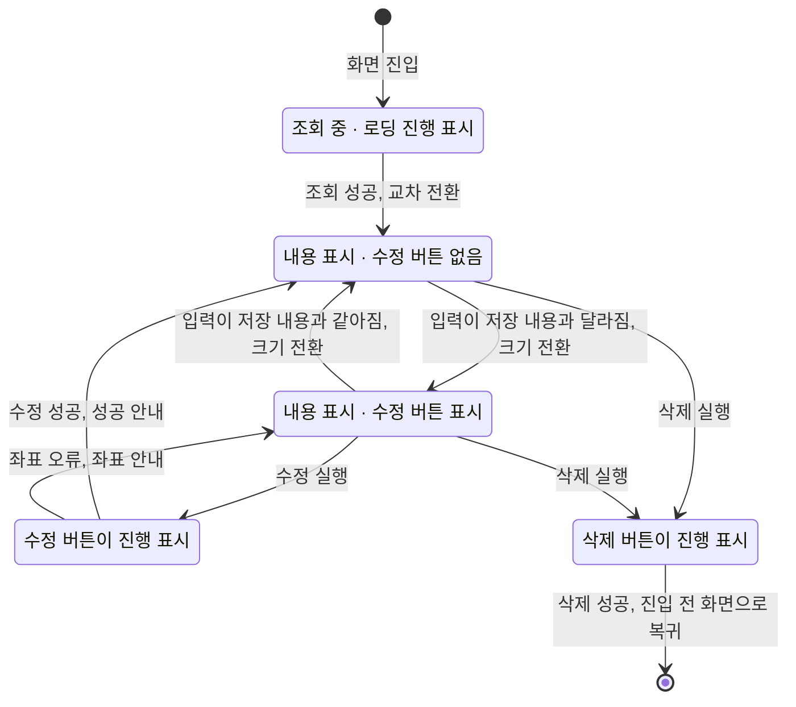

# PlaceDetail 화면 디자인

기준 스펙: [PlaceDetail 화면 스펙](../spec/place-detail.md)

## 화면 구조

PlaceDetail 화면은 PlaceHome에서 이어지는 세부 화면으로 단독 표시하며, 공통 내비게이션 영역은 숨긴다. 장소 화면은 목록과 상세를 한 화면에 함께 배치하지 않으므로 창 너비와 관계없이 단독으로 표시한다.

화면 상단에는 저장된 장소 제목과 뒤로가기 버튼이 있는 상단 바를 둔다. 조회가 완료되면 상단 바 끝 쪽에 외부 지도로 열기 버튼과 장소 검색 버튼과 삭제 버튼을 이 순서로 둔다. 되돌릴 수 없는 삭제를 모서리에 고정해 두어 액션이 늘어도 삭제 버튼의 자리가 바뀌지 않게 하고, 새 액션은 안쪽에 넣어 이미 쓰던 검색 버튼과 삭제 버튼의 상대 자리를 유지한다. 검색 버튼의 아이콘과 감추는 조건은 [장소 검색 다이얼로그 디자인](./place-search-dialog.md)의 `여는 컨트롤`을 따른다. 각 액션의 표현은 `상단 바 액션`을 따른다. 세 버튼은 선택한 탭과 관계없이 같은 자리에 그대로 표시하며, 상단 바에는 한 탭에서만 쓰는 동작을 두지 않는다.

상단 바의 장소 제목은 한 줄을 유지한다. 제목이 사용 가능한 폭을 넘으면 기본 이동 속도와 간격으로 가로 이동을 시작하고, 화면에 표시되는 동안 횟수 제한 없이 반복한다. 접근성에는 생략하지 않은 전체 제목을 제공한다. 이는 [장소 보기 모드 디자인](./place-view-mode.md)의 장소 카드 제목과 같은 기준이다.

화면은 위에서부터 상단 바, 탭 행, 페이지 영역을 세로로 쌓는다. 떠 있는 버튼과 스낵바는 페이지 영역 위에 겹쳐 표시하고 두 탭이 함께 사용한다. 이는 [TagDetail 화면 디자인](./tag-detail.md)의 화면 구조와 같은 기준이다.

## 탭 행

상단 바 바로 아래에 탭 행을 둔다. 탭 행은 화면의 가로 폭을 모두 차지하고, 두 탭이 왼쪽부터 장소 디테일, 메모 순서로 폭을 균등하게 나눠 가진다. 탭 순서는 페이지 순서와 같게 둔다.

각 탭은 아이콘만 표시하고 라벨 문구는 두지 않는다. 장소 디테일 탭에는 [목록 빈 상태 디자인](./list-empty-state.md)의 목록 모드 장소 목록 빈 상태가 쓰는 장소 아이콘을, 메모 탭에는 [MemoHome 목록 디자인](./memo-home.md)의 메모 아이콘을 쓴다. 선택된 탭의 강조 표시는 Material 기본 탭 표현을 따른다.

탭 행은 장소 조회 상태와 관계없이 항상 같은 모양으로 표시하고, 비활성 표현을 사용하지 않는다.

## 탭 전환

사용자는 탭 행에서 보고 싶은 탭을 선택해 두 탭을 오간다. 페이지 영역이 선택한 탭으로 가로로 미끄러지며 전환되고, 이미 보고 있는 탭을 다시 선택하면 아무 변화도 일어나지 않는다.

페이지 영역 위에서 좌우로 스와이프해도 탭은 전환되지 않는다. 장소 디테일 탭의 지도는 좌우로 끌어 옮기는 조작을 받으므로, 지도 위의 끌기와 탭 전환 스와이프를 구분할 수 없기 때문이다. 이는 스와이프로도 전환하는 [TagDetail 화면 디자인](./tag-detail.md)의 `페이지 전환`과 다른 기준이다.

## 장소 디테일 탭

장소 디테일 탭의 본문 영역 구성과 입력 순서, 입력 사이 간격, 스크롤 규칙, 창 너비에 따른 적응형 배치, 지도를 표시하지 않는 동안의 지도 영역 처리는 [PlaceAdd 화면 디자인](./place-add.md)의 `화면 구조`와 `적응형 배치`를 따른다. 두 화면이 같은 자리에 같은 입력을 두어 사용자가 장소를 추가할 때와 고칠 때 같은 방식으로 조작한다. 탭 행은 지도 영역과 입력 영역 위에 놓이고, 두 영역의 비율은 탭 행을 뺀 페이지 영역 높이를 기준으로 나눈다.

PlaceAdd와 다른 점은 화면이 탭 행을 갖는다는 것과, 장소 디테일 탭에 떠 있는 버튼이 추가가 아니라 수정 동작이라는 것이다.

## 메모 탭

메모 탭 안의 정렬 줄, 목록, 빈 상태, 완료·삭제 제스처와 피드백, 새로고침, 단축키의 표현은 [항목 상세 메모 탭 공통 디자인](./entity-detail-memo.md)을 따른다. 이 목록의 빈 상태 문구는 [목록 빈 상태 디자인](./list-empty-state.md)의 문구 표가 `PlaceDetail 메모 탭의 장소별 메모 목록`으로 정한다.

메모 탭에서 이동한 MemoAdd 화면과 MemoDetail 화면은 창 너비와 관계없이 단독으로 표시한다.

## 진입 시 표시 내용

조회가 완료되면 제목, 설명, 주소, 컬러 입력에 저장된 값을 채우고, 위도와 경도 입력에 저장된 좌표를 채우며, 태그 입력에 저장된 연결을 채운다. 좌표를 입력에 표시하는 자리수는 [PlaceAdd 화면 디자인](./place-add.md)의 `지도에서 좌표 선택`과 같다.

입력 영역의 구성과 순서는 [PlaceAdd 화면 디자인](./place-add.md)의 `화면 구조`를 따르므로, 태그 입력도 그 문서와 같이 입력 영역 가장 마지막에 둔다. 두 화면이 같은 자리에 같은 입력을 두어 사용자가 장소를 추가할 때와 고칠 때 같은 방식으로 조작한다.

지도는 저장된 좌표를 지도 영역 가운데에 두고 시작하며, 그 자리에 지점 표시를 함께 둔다. 초기 확대 수준은 [DiaryMap 컴포넌트 디자인](./diary-map.md)의 초기 지도 위치와 확대 수준을 따른다.

## 상단 바 액션

외부 지도로 열기 버튼에는 앱 밖으로 나가는 것을 뜻하는 바깥쪽 화살표가 있는 사각형 아이콘을 쓴다. 이는 [WebDetail 화면 디자인](./web-detail.md)의 `상단 바 액션`이 쓰는 외부로 열기 버튼과 같은 아이콘이다. 지금 어느 지도가 열리는지는 아이콘으로 구분하지 않고 접근성 이름으로만 구분한다.

버튼은 조회가 완료되면 지도를 표시하는지와 관계없이 둔다. 지금 열리는 지도가 어느 제공자인지는 버튼의 접근성 이름으로 알 수 있으므로, 지도와 전환 컨트롤이 보이지 않는 동안에도 사용자가 무엇이 열릴지 알고 누를 수 있다.

누르면 곧바로 앱 밖에서 열리므로 진행 표시나 눌린 상태를 남기지 않고, 앱 밖에서 열지 못했을 때도 화면을 그대로 둔다. 지도가 열려도 상단 바와 본문, 지도 영역의 표시는 바뀌지 않는다.

지도 앱으로 열리든 웹 지도로 열리든 버튼의 표현은 같다. 지도 앱을 열지 못해 웹 지도로 이어서 열 때도 그 사이에 진행 표시나 안내를 두지 않으므로, 사용자는 버튼을 한 번 누른 결과로 한 번만 앱 밖으로 나간다.

좌표 입력이 비어 있거나 숫자로 읽을 수 없거나 유효 범위를 벗어나도 버튼을 비활성으로 표시하지 않는다. 성립하지 않는 좌표는 버튼을 누른 시점에 스낵바로 안내하며, 안내 문구는 수정을 실행했을 때의 좌표 안내와 같다.

삭제를 처리하는 동안에도 외부 지도로 열기 버튼과 검색 버튼을 그대로 누를 수 있고 어떤 요소도 비활성으로 표시하지 않는다.

## 좌표 수정

지도에서 좌표를 고르는 조작, 위도·경도 입력의 구성과 소프트 키보드, 직접 입력한 값이 지도와 지점 표시에 반영되는 표현은 모두 [PlaceAdd 화면 디자인](./place-add.md)의 `지도에서 좌표 선택`, `좌표 입력`, `직접 입력한 좌표의 지도 반영`을 따른다.

저장된 좌표가 이미 채워져 있어도 두 입력을 읽기 전용으로 바꾸지 않으며, 값을 지우는 지우기 버튼도 그대로 제공한다.

주소 입력의 구성과 지우기 버튼, 검색으로 채워진 값의 표현은 [PlaceAdd 화면 디자인](./place-add.md)의 `주소 입력`을 따르며, 저장된 주소가 채워져 있어도 같은 기준을 적용한다.

## 태그 입력

태그 입력의 구성과 조작은 [항목 태그 입력 컴포넌트 디자인](./entity-tag-input.md)을 따른다.

칩 영역에는 저장된 연결을 그대로 표시하고, 사용자가 항목을 누르면 저장된 연결이 곧바로 바뀌어 칩 영역에 이어서 나타난다. 반영에는 진행 표시를 두지 않으므로 수정 버튼과 삭제 버튼의 진행 표시와 섞이지 않는다.

태그를 연결하거나 해제해도 수정 버튼의 표시 여부는 바뀌지 않는다. 칩이 늘거나 줄어 칩 영역의 높이가 바뀌면 뒤에 이어지는 입력이 그만큼 밀리지만, 다른 입력에 넣은 값과 지도 영역의 표시는 그대로 둔다.

태그 칩을 누르면 그 태그의 TagDetail 화면으로 이동하고, 뒤로가면 이 장소의 상세로 돌아온다. 이동한 화면은 태그 디테일 탭이 선택된 상태로 시작한다.

조회 중에는 태그 입력을 표시하지 않는다. 조회 상태에 따른 표시는 `상태 전환과 동작 표시`를 따른다.

## 떠 있는 버튼

떠 있는 버튼은 선택한 탭에 따라 하나만 표시한다.

| 선택한 탭 | 떠 있는 버튼 | 표시 조건 |
| --- | --- | --- |
| 장소 디테일 탭 | 수정 버튼 | 입력 내용과 저장 내용이 다를 때만 |
| 메모 탭 | 메모 추가 버튼 | 항상 |

두 버튼은 페이지 영역의 끝 쪽 아래 모서리에 같은 자리로 둔다. 탭을 전환할 때는 [나타나고 사라지는 버튼 디자인](./button-visibility.md)의 전환으로 이전 탭의 버튼이 사라지고 새 탭의 버튼이 나타난다. 장소 디테일 탭에서 수정 버튼을 표시하던 중 메모 탭으로 전환하면 수정 버튼이 사라지고 메모 추가 버튼이 나타나며, 돌아오면 수정 버튼이 다시 나타난다.

메모 추가 버튼의 아이콘과 접근성 이름은 [항목 상세 메모 탭 공통 디자인](./entity-detail-memo.md)의 `메모 추가`를 따른다.

## 표시 영역과 소프트 키보드

상단 바, 탭 행, 페이지 영역, 떠 있는 버튼과 스낵바는 상태 표시 영역, 시스템 탐색 영역과 카메라 컷아웃 등 기기가 가리는 영역을 침범하지 않게 배치한다.

소프트 키보드가 나타났을 때의 배치와 지도 영역, 입력 영역의 스크롤은 [PlaceAdd 화면 디자인](./place-add.md)의 `표시 영역과 소프트 키보드`를 따른다. 상단 바와 탭 행은 함께 스크롤되지 않고 자리를 지킨다.

## 상태 전환과 동작 표시

조회 중에는 장소 디테일 탭 본문에 로딩 진행 표시를 두고 지도 영역, 입력 영역, 수정 버튼과 삭제 버튼을 표시하지 않는다. 검색 버튼과 외부 지도로 열기 버튼도 같은 기준으로 표시하지 않는다. 상단 바에도 장소 제목을 표시하지 않는다.

조회 중에도 탭 행과 메모 탭은 그대로 표시한다. 메모 탭을 선택한 동안에는 메모 추가 버튼도 그대로 표시한다.

조회 중 상태와 내용 표시 상태는 서로 겹쳐 바뀌는 교차 전환을 사용한다. 이 전환은 장소 디테일 탭 안에서만 일어나고 상단 바, 탭 행과 메모 탭의 표시는 바꾸지 않는다.

수정 버튼은 입력 내용과 저장 내용이 다를 때만 표시하며, 나타나고 사라지는 표현은 [나타나고 사라지는 버튼 디자인](./button-visibility.md)을 따른다. 좌표 입력이 비어 있거나 숫자로 읽을 수 없어도 저장 내용과 다르므로 버튼을 표시하고, 성립하지 않는 좌표는 수정을 실행한 시점에 스낵바로 안내한다.

수정 또는 삭제를 처리하는 동안에는 해당 버튼의 아이콘을 진행 표시로 바꾼다. 두 동작은 서로를 비활성으로 만들지 않는다.

삭제에 성공하면 진입하기 전 화면으로 돌아간다. 삭제 전에 확인 대화상자를 두지 않으며, 이는 [TagDetail 화면 디자인](./tag-detail.md)의 삭제와 같은 기준이다.

물리 키보드 환경에서는 선택한 탭에 따라 다음 단축키를 제공한다.

| 선택한 탭 | 단축키 | 동작 |
| --- | --- | --- |
| 장소 디테일 탭 | `Command + Enter` | 수정 반영 |
| 메모 탭 | `Command + A` | 메모 추가 |

수정 단축키는 수정 버튼이 표시된 동안에만 처리한다. 한 번에 한 탭만 선택되므로 두 단축키가 겹쳐 처리되지 않는다.

초점을 어느 입력에 두고 언제 옮기는지는 기준 스펙이 정한다. 진입할 때는 초점을 두지 않으므로 소프트 키보드도 열지 않는다.

## 진행과 피드백

수정 성공과 좌표 오류 피드백은 모두 스낵바로 표시한다. 스낵바는 두 탭이 함께 사용하므로 메모 탭에서 발생한 완료·삭제 피드백도 같은 자리에 표시한다.

좌표 오류도 수정을 실행한 결과로 판단하므로 수정 처리와 같은 진행 표시를 거친 뒤 피드백을 표시한다.

외부 지도로 열기에서 나오는 좌표 오류는 진행 표시를 거치지 않고 곧바로 표시한다. 앱 밖으로 나가는 동작에는 처리 시간이 없기 때문이다.

제목을 비운 채 수정해 저장된 제목이 유지되는 경우에는 별도의 안내를 표시하지 않고 수정 성공 피드백만 표시한다.

수정에 성공하면 지도는 보고 있던 자리에 그대로 두고 지점 표시도 그대로 둔다. 지도를 새 좌표로 다시 옮기는 표현은 두지 않는다.

태그 연결과 해제에는 성공이나 실패 피드백을 스낵바로 표시하지 않는다. 사용자가 누른 결과가 칩 영역과 목록의 체크 표시에 곧바로 나타나므로 별도의 안내를 두지 않는다.

## 문구와 접근성

탭은 아이콘만 표시하므로 각 탭 아이콘에 접근성 이름을 둔다. 선택된 탭은 선택 상태로 읽히게 한다.

한국어 환경과 그 외 기본 환경에서는 다음 문구를 사용한다.

| 문구 | 한국어 | 그 외 기본 |
| --- | --- | --- |
| 상단 바 제목 | 저장된 장소 제목 | 저장된 장소 제목 |
| 장소 디테일 탭 접근성 이름 | `장소 디테일` | `Place detail` |
| 메모 탭 접근성 이름 | `메모` | `Memo` |
| 뒤로가기 버튼 접근성 이름 | `뒤로가기` | `Navigate up` |
| 수정 버튼 접근성 이름 | `장소 수정` | `Update place` |
| 삭제 버튼 접근성 이름 | `장소 삭제` | `Delete place` |
| 검색 버튼 접근성 이름 | [장소 검색 다이얼로그 디자인](./place-search-dialog.md)을 따름 | 같음 |
| 외부 지도로 열기 버튼 접근성 이름 (네이버 지도 선택) | `네이버 지도에서 열기` | `Open in Naver Map` |
| 외부 지도로 열기 버튼 접근성 이름 (Google 지도 선택) | `Google 지도에서 열기` | `Open in Google Maps` |
| 수정 성공 안내 | `장소가 수정되었습니다.` | `Place updated.` |

주소 입력, 위도 입력과 경도 입력의 이름, 지도 영역의 접근성 이름과 좌표 오류 안내 문구는 [PlaceAdd 화면 디자인](./place-add.md)의 문구를 그대로 쓴다. 같은 좌표 입력과 같은 판단 기준을 두 화면에서 다른 문구로 안내하지 않는다.

제목 입력과 설명 입력의 이름과 표현은 각 입력 컴포넌트의 디자인을 따르고, 컬러 입력은 [DiaryColorInput 컴포넌트 디자인](./diary-color-input.md)을 따른다.

지도 영역의 지점 표시와 지도 제공자 전환 컨트롤의 문구와 접근성 이름은 [DiaryMap 컴포넌트 디자인](./diary-map.md)을 따른다.

외부 지도로 열기 버튼의 접근성 이름은 지금 선택된 제공자에 따라 바뀌며, 제공자를 부르는 이름은 [DiaryMap 컴포넌트 디자인](./diary-map.md)의 전환 컨트롤 문구와 같게 쓴다.

외부 지도로 열기가 지도 앱과 웹 주소 중 무엇을 여는지는 기준 스펙의 `여는 수단`이 정하며, 버튼의 아이콘과 접근성 이름은 어느 쪽으로 열리는지에 따라 달라지지 않는다. 웹 주소는 플랫폼마다 그 플랫폼이 웹 주소를 여는 기본 방법으로 열고, 어느 앱이나 창에서 열리는지는 플랫폼과 사용자 설정이 정하며 이 화면에서 정하지 않는다. 웹 주소를 여는 기준은 [WebDetail 화면 디자인](./web-detail.md)의 외부로 열기와 같다.

태그 입력의 칩 라벨과 태그 선택 목록의 문구는 [항목 태그 입력 컴포넌트 디자인](./entity-tag-input.md)을 따른다.
