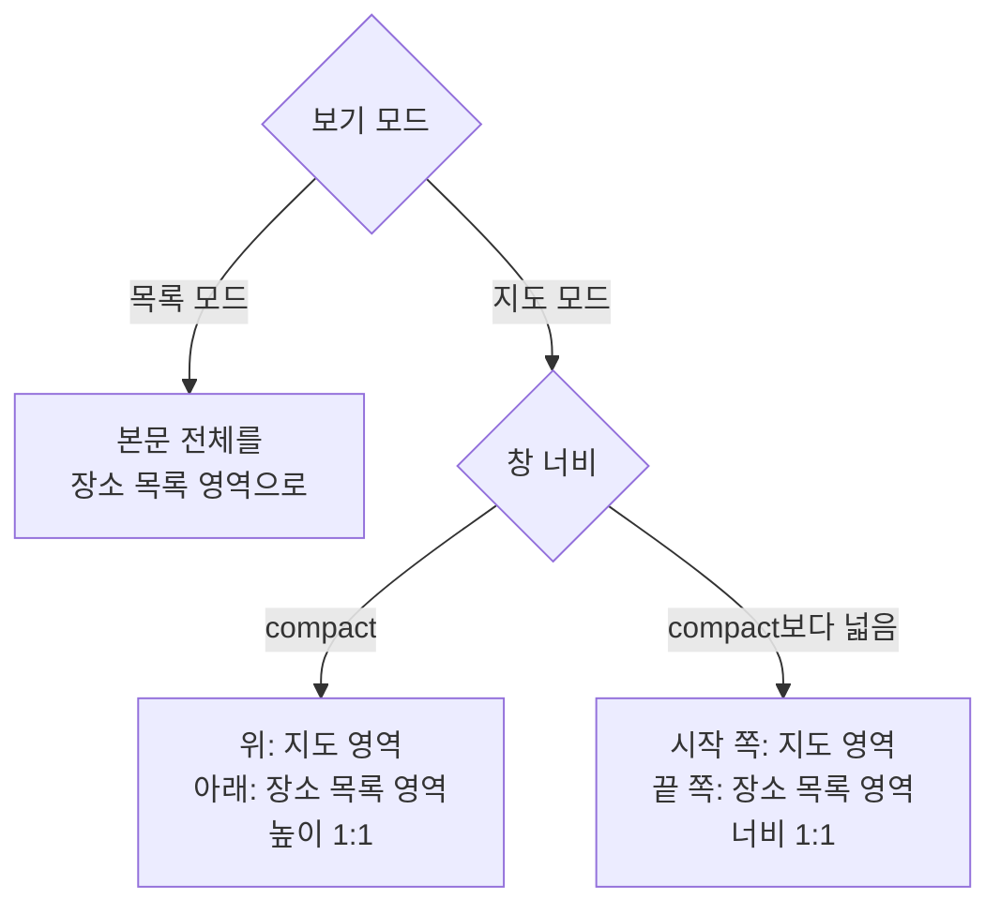

# 장소 보기 모드 디자인

기준 스펙: [장소 보기 모드 스펙](../spec/place-view-mode.md)

이 문서는 장소 목록을 목록 모드와 지도 모드로 함께 보여 주는 자리의 영역 분할과 적응형 배치, 두 모드를 오가는 전환 표현, 장소 격자와 장소 카드, 지도 핀, 정렬 줄과 빈 상태와 새로고침이 놓이는 자리를 소유한다.

전환 컨트롤을 어느 자리에 두는지, 그 자리에서 어떤 모양으로 두는지와 보기 모드 밖에서 함께 두는 컨트롤은 각 적용 대상 디자인이 소유한다. 적용 대상은 [장소 보기 모드 스펙](../spec/place-view-mode.md)의 `적용 대상`을 따른다.

## 이 문서를 참조하는 문서

- [PlaceHome 화면 디자인](./place-home.md)
- [TagDetail 장소 탭 디자인](./tag-detail-place.md)
- [SearchHome 화면 디자인](./search-home.md)
- [목록 빈 상태 디자인](./list-empty-state.md)
- [목록 정렬 디자인](./list-sort.md)
- [새로고침 디자인](./sync-refresh.md)
- [페이지 조회 목록의 자리 표시 디자인](./paged-list-placeholder.md)

## 본문 구성

본문의 구성은 보기 모드에 따라 다르다. 지도 모드에서는 본문을 지도 영역과 장소 목록 영역으로 나누고, 목록 모드에서는 본문 전체를 장소 목록 영역 하나로 채운다.

지도 영역에는 공용 지도 컴포넌트를 배치하고, 공용 지도 컴포넌트에는 지도와 지도 제공자 전환 컨트롤을 함께 표시한다. 지도와 전환 컨트롤의 표현은 [DiaryMap 컴포넌트 디자인](./diary-map.md)을 따른다.

본문의 지도는 사용자의 현재 위치를 지도 영역 가운데에 두고 시작한다. 현재 위치를 확인하지 못했을 때의 표시와 초기 확대 수준은 [DiaryMap 컴포넌트 디자인](./diary-map.md)의 초기 지도 위치와 확대 수준을 따른다. 현재 위치를 확인하지 못해도 그 사실을 알리는 문구나 아이콘은 지도 위에 표시하지 않는다.

지도 모드에서 사용자가 고른 기본 지도와 현재 위치를 확인하기 전이거나 기본 지도를 읽지 못한 상태에서는 지도와 전환 컨트롤, 장소 목록 영역을 모두 표시하지 않는다. 별도의 로딩 표시나 오류 안내도 배치하지 않는다. 목록 모드의 본문은 이 상태와 관계없이 그대로 표시한다.

이 상태에서도 보기 모드 전환 컨트롤은 같은 자리에 그대로 표시한다. 전환 컨트롤이 사라지면 사용자가 목록 모드로 되돌아갈 방법이 없어지기 때문이며, 그 컨트롤을 어느 자리에 두는지는 각 적용 대상 디자인이 정한다.

## 적응형 배치

지도 모드에서 창 너비가 compact이면 본문을 위아래로 나눠 지도 영역을 위에, 장소 목록 영역을 아래에 둔다. 두 영역은 본문 너비 전체를 채우고 본문 높이를 `1:1`로 나눈다.

지도 모드에서 창 너비가 compact보다 넓으면 본문을 좌우로 나눠 지도 영역을 시작 쪽에, 장소 목록 영역을 끝 쪽에 둔다. 두 영역의 너비 비율은 `1:1`이며 사용자가 비율을 바꾸는 핸들은 두지 않는다. 두 영역은 본문 높이 전체를 채운다. 세로로 긴 지도를 그대로 두는 대신 좌우로 나누면, 넓은 창에서 지도와 목록이 각각 쓸 만한 크기를 함께 가진다.

목록 모드에서는 창 너비와 관계없이 장소 목록 영역이 본문 전체를 채운다.

배치를 가르는 기준은 보기 모드와 창 너비이며, 창 높이는 배치를 바꾸지 않는다. 배치가 바뀌어도 지도가 보고 있던 위치와 확대 수준, 사용자가 고른 지도 제공자는 그대로 둔다.

지도 모드의 기준은 [PlaceAdd 화면 디자인](./place-add.md)의 적응형 배치와 같으므로, 지도를 두는 화면을 오갈 때 지도가 놓이는 자리가 창 너비에 따라 같은 방식으로 바뀐다.

## 보기 모드 전환 표현

모드를 바꿀 때 본문은 이전 모드의 배치가 사라지면서 새 모드의 배치가 나타나는 교차 페이드로 전환한다. 전환 컨트롤의 아이콘도 같은 교차 페이드로 바뀐다. 지속 시간과 완급은 전환 기본값을 따르고 이 문서에서 따로 정하지 않는다. 영역이 자리를 옮기는 이동 애니메이션은 두지 않는다.

전환 컨트롤에는 지금 누르면 이동할 모드를 나타내는 아이콘을 표시한다. 지도 모드에서는 가로 줄이 쌓인 목록 아이콘을, 목록 모드에서는 접힌 지도 아이콘을 표시한다. 두 아이콘은 [목록 빈 상태 디자인](./list-empty-state.md)의 지도 아이콘과 장소 목록 아이콘, `더보기`의 장소 메뉴 아이콘과 같은 아이콘을 쓴다.

전환 컨트롤에는 배지나 숫자를 두지 않고, 지도가 표시되지 않는 동안에도 비활성 표현을 사용하지 않는다.

전환하는 동안에도 사용자는 전환 컨트롤과 장소 추가 버튼을 조작할 수 있고, 두 요소는 자리를 옮기지 않는다.

## 정렬 줄

정렬 줄은 장소 목록 영역 맨 위, 장소 격자 위에 둔다. 정렬 줄과 정렬 선택 Bottom Sheet의 구조, 조작, 아이콘과 문구는 [목록 정렬 디자인](./list-sort.md)을 따르고, 보기 모드에 따라 정렬 줄이 놓이는 자리는 그 문서의 `정렬 줄의 자리`가 소유한다.

정렬 줄은 지도 영역에는 두지 않으며, 보기 모드를 바꿔도 컨트롤의 표시 내용은 바뀌지 않는다.

## 장소 목록 격자

장소 목록 영역은 자기 영역 너비 전체를 채우는 2열 지그재그 격자로 배치하며, 항목 간격과 영역 바깥 여백은 [공통 여백과 간격 디자인](./dimens.md)의 화면 공통 여백과 항목 간격을 따른다. 주소가 있는 카드와 없는 카드의 높이가 서로 다르므로, 각 열은 앞 카드 바로 아래에서 이어져 카드 사이에 빈 공간이 생기지 않는다.

두 보기 모드는 같은 격자와 같은 장소 카드를 쓰고 격자에 넣는 장소만 다르다. 격자는 어느 창 너비에서도 2열을 유지하므로 넓은 창에서는 카드가 함께 넓어진다.

격자에서는 카드를 누르는 조작만 받는다. 카드를 옆으로 미는 조작에는 반응하지 않으며, 장소의 삭제는 [PlaceDetail 화면 디자인](./place-detail.md)의 상단 바 액션에서만 제공한다.

목록 모드에서 아직 준비되지 않은 자리에는 [페이지 조회 목록의 자리 표시 디자인](./paged-list-placeholder.md)에 따라 자리 표시 카드를 표시한다. 이 목록의 자리 표시 카드는 컬러 원형 표시와 제목, 주소를 비워 두고 제목만 있는 카드와 같은 높이를 차지한다. 지도 모드의 목록은 페이지로 나누지 않으므로 자리 표시 카드를 두지 않는다.

## 장소 카드

각 장소는 카드로 표시한다. 카드에는 장소 제목을 표시하고 그 왼쪽에는 저장된 컬러로 채운 작은 원형 표시를 둔다. 카드 가장자리와 내용 사이의 여백은 [공통 스타일](./styles.md)의 `카드 내용`을 따른다.

원형 표시는 제목 줄이 아니라 제목과 주소를 합친 글 묶음 전체의 세로 가운데에 둔다. 주소가 없어 제목 한 줄만 있는 카드에서는 결과적으로 제목 줄의 세로 가운데가 된다.

장소 제목은 한 줄을 유지한다. 제목이 카드에서 사용할 수 있는 폭을 넘으면 기본 이동 속도와 간격으로 가로 이동을 시작하고, 카드가 표시되는 동안 횟수 제한 없이 반복한다. 접근성에는 생략하지 않은 전체 제목을 제공한다.

주소가 있는 장소는 제목 아래에 제목보다 작은 글씨로 주소를 한 줄로 표시한다. 주소가 폭을 넘을 때도 제목과 같은 기본 이동 속도와 간격으로 가로 이동을 시작하고 카드가 표시되는 동안 횟수 제한 없이 반복한다. 접근성에는 생략하지 않은 전체 주소를 제공한다. 주소가 비어 있는 장소는 제목만 표시한다.

카드 전체를 누를 수 있는 자리로 두고, 누르면 그 장소의 [PlaceDetail 화면](./place-detail.md)으로 이동한다. 누르는 동안에는 카드에 기본 눌림 표현만 두고 선택된 상태로 남기는 표시는 두지 않는다.

카드에는 카드가 누를 수 있는 요소임을 알리는 별도의 접근성 이름을 두지 않고, 카드에 표시한 제목과 주소를 접근성 이름으로 그대로 쓴다. 자리 표시 카드의 접근성 처리는 [페이지 조회 목록의 자리 표시 디자인](./paged-list-placeholder.md)을 따른다.

이 카드는 보기 모드를 쓰지 않는 [SearchHome 화면 디자인](./search-home.md)의 장소 결과에도 같은 형태로 쓴다.

## 지도 핀

지도 핀은 지도 모드에만 있다. 목록 모드에서는 지도 영역이 없으므로 핀도 표시하지 않는다.

지도 영역에는 목록과 같은 장소를 핀으로 표시한다. 핀의 색은 장소의 컬러이고 라벨은 장소의 제목이다.

핀의 마커와 라벨 표현, 겹침 처리와 애니메이션은 [DiaryMap 컴포넌트 디자인](./diary-map.md)의 핀 표시를 따른다. 핀의 접근성 이름과 지도 제공자 전환 컨트롤의 문구와 표현도 그 문서를 따른다.

보이는 영역이 바뀌어 목록이 갱신되면 핀도 같은 장소들로 함께 갱신되며, 갱신 시 핀 이동 애니메이션은 지정하지 않는다.

지도 영역은 핀 선택을 사용하는 상태로 배치한다. 사용자가 핀을 누르면 그 장소의 [PlaceDetail 화면](./place-detail.md)으로 이동하며, 누를 수 있는 자리와 누르는 동안의 표현은 [DiaryMap 컴포넌트 디자인](./diary-map.md)의 핀 선택을 따른다. 핀을 눌러 이동할 때 지도 영역에는 이동을 알리는 표시를 두지 않는다.

## 빈 상태

목록이 비어 있는 동안에는 카드를 표시하지 않고 격자 자리에 [목록 빈 상태 디자인](./list-empty-state.md)의 빈 상태를 표시한다. 별도의 로딩 표시는 배치하지 않는다. 목록이 갱신될 때 카드 이동 애니메이션은 지정하지 않는다.

두 보기 모드는 서로 다른 아이콘과 문구를 사용하며, 각 목록의 아이콘과 문구는 [목록 빈 상태 디자인](./list-empty-state.md)의 아이콘 표와 문구 표가 소유한다.

지도 모드에서 사용자가 지도를 옮겨 보이는 영역이 바뀌면 빈 상태와 격자가 [목록 빈 상태 디자인](./list-empty-state.md)의 교차 페이드로 오간다. 지도 영역과 지도 핀은 이 전환에 영향을 받지 않는다.

지도 모드에서 지도와 목록 영역을 모두 표시하지 않는 동안, 그리고 지도가 보이는 영역을 아직 확인하지 못한 동안에는 빈 상태도 표시하지 않는다.

빈 상태에서도 전환 컨트롤과 장소 추가 버튼은 같은 자리에 그대로 표시한다.

## 새로고침

지도 모드에서는 장소 목록 영역만 [새로고침 디자인](./sync-refresh.md)의 당김 새로고침 컨테이너로 감싼다. 지도 영역은 감싸지 않으므로 지도를 위아래로 끄는 조작은 지도를 옮기기만 하고 새로고침을 시작하지 않는다.

목록 모드에서는 본문 전체가 장소 목록 영역이므로 본문 전체가 당김 새로고침 컨테이너가 된다.

진행 표시는 장소 목록 영역의 위쪽 가로 가운데에 겹쳐 표시하고 격자를 밀어내지 않는다. 진행 표시의 모양과 크기, 임계값, 나타나고 사라지는 모션, 진행 중 조작 가능 여부는 [새로고침 디자인](./sync-refresh.md)을 그대로 따르며 이 문서에서 따로 정하지 않는다.

격자는 맨 위에 있을 때만 당김이 시작된다. 격자 대신 빈 상태를 표시하는 동안에는 스크롤할 것이 없으므로 당김이 곧바로 시작된다.

지도 모드에서 지도와 목록 영역이 표시되지 않는 동안에는 당길 자리와 진행 표시가 모두 없다. 이때 진행 표시만 따로 띄우거나 지도 영역에 옮겨 두지 않는다. 목록 모드로 바꾸면 본문 전체에서 당길 수 있다.

## 다른 요소와 겹치지 않는 배치

진행 표시는 장소 목록 영역 안에 놓이고 떠 있는 장소 추가 버튼은 본문 오른쪽 아래에 놓이므로 두 요소는 겹치지 않는다. 지도 제공자 전환 컨트롤은 어느 배치에서도 지도 영역 안에 있어 진행 표시와 겹치지 않는다.

진행 표시가 나타나 있는 동안에도 지도를 옮기고 확대·축소하는 조작, 핀과 장소 카드를 누르는 조작, 장소 추가 버튼과 보기 모드 전환 컨트롤을 누르는 조작을 모두 그대로 할 수 있으며 어떤 요소도 비활성으로 표시하지 않는다.

새로고침 중에 격자의 카드가 갱신되거나 보기 모드가 바뀌어도 진행 표시는 사라지지 않고 그 자리를 유지한다.

떠 있는 장소 추가 버튼은 본문 오른쪽 아래에 겹쳐 표시되어 장소 목록 영역과 겹친다. 버튼의 아이콘과 접근성 이름, 표시 조건은 각 적용 대상 디자인이 소유한다.

지도 영역, 장소 목록 영역과 떠 있는 버튼은 상태 표시 영역, 시스템 탐색 영역과 카메라 컷아웃 등 기기가 가리는 영역을 침범하지 않게 배치한다.

## 문구와 접근성

전환 컨트롤의 접근성 이름은 한국어 환경과 그 외 기본 환경에서 다음 문구를 사용한다. 어느 적용 대상에서도 같은 문구를 쓴다.

| 항목 | 한국어 | 그 외 기본 |
| --- | --- | --- |
| 지도 모드에서 전환 컨트롤 접근성 이름 | `목록으로 보기` | `Show list` |
| 목록 모드에서 전환 컨트롤 접근성 이름 | `지도로 보기` | `Show map` |

전환 컨트롤의 접근성 이름은 지금 어떤 모드인지가 아니라 누르면 이동할 모드를 알린다. 아이콘이 가리키는 대상과 접근성 이름이 같은 모드를 가리킨다.

보기 모드가 바뀌면 화면 낭독 도구가 바뀐 본문 내용을 읽는다.
