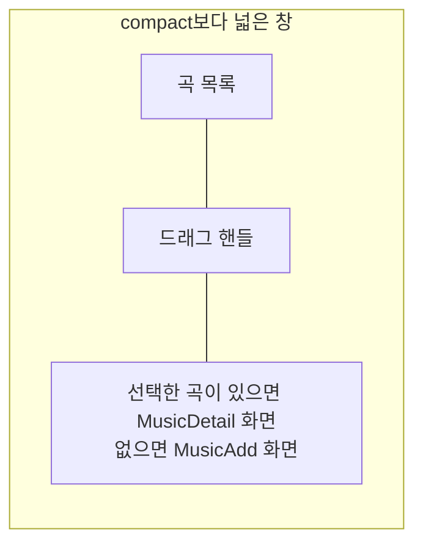

# Playlist 목록·상세 배치 디자인

기준 스펙: [Playlist 목록·상세 배치 스펙](../spec/client/playlist-list-detail.md)

배치, 크기 조절, 버튼 노출, 진행과 피드백, 조절 상태 표시의 공통 표현은 [목록·상세 배치 공통 디자인](./list-detail-pane.md)을 따른다.

## 두 영역에 두는 화면

목록 영역에는 [PlaylistHome 화면](./playlist-home.md)의 곡 목록을 두고, 상세 영역에는 선택한 곡의 [MusicDetail 화면](./music-detail.md)을 표시한다. 선택한 곡이 없으면 [MusicAdd 화면](./music-add.md)을 표시한다. 두 영역은 각각 자기 상단 바를 갖는다.

상세 영역에 아이콘과 안내만 두는 [목록·상세 배치 공통 디자인](./list-detail-pane.md)의 `선택 전 상세`는 이 배치에서 쓰지 않는다. 선택 전 자리를 곡 추가가 채우므로 사용자가 목록을 떠나지 않고 곧바로 입력할 수 있고, 비어 있는 안내 자리를 보지 않기 때문이다.

곡 목록의 격자는 상세 영역과 자리를 나눠 좁아져도 [PlaylistHome 화면 디자인](./playlist-home.md)의 2열 고정 격자를 유지하며, 상세 영역에 놓인 입력도 상세 영역 폭에 맞춰 함께 좁아진다.

## 상세 영역의 전환

목록에서 곡 카드를 누르면 상세 영역이 그 곡의 MusicDetail 화면으로 바뀐다. 상세 영역에서 시스템 뒤로가기를 사용하거나 그 곡을 삭제하면 상세 영역이 MusicAdd 화면으로 되돌아간다.

목록에서 곡 추가 버튼을 누르면 상세 영역이 MusicAdd 화면으로 바뀐다. 버튼의 노출 조건은 [목록·상세 배치 공통 디자인](./list-detail-pane.md)의 `버튼 노출`을 따르므로, 상세 영역에 이미 MusicAdd가 놓여 있는 동안에는 버튼을 표시하지 않는다. MusicDetail이 놓인 동안 곡 추가 버튼으로 연 MusicAdd에서 시스템 뒤로가기를 사용하면 상세 영역은 그 전에 보던 곡의 MusicDetail로 돌아간다.

상세 영역의 화면이 바뀔 때는 교차 전환을 쓰고, 목록 영역과 드래그 핸들의 자리와 너비 비율은 그대로 둔다. MusicAdd로 되돌아갈 때는 이전에 입력하던 내용을 복원하지 않고 빈 입력으로 시작한다.

## 버튼 노출

목록 화면의 곡 추가 버튼과 곡 추가 단축키를 언제 제공하는지는 [목록·상세 배치 공통 디자인](./list-detail-pane.md)의 `버튼 노출`을 따른다. 상세 영역에 MusicAdd가 놓여 있는 동안에는 두 수단을 모두 제공하지 않고, MusicDetail이 놓여 있는 동안에는 그대로 제공한다.

목록 영역 상단 바의 뒤로가기 버튼은 함께 표시하는 동안에도 그대로 두고, 누르면 상세 영역만 되돌리지 않고 두 영역을 함께 닫아 `더보기` 화면을 표시한다. 두 영역은 하나의 화면처럼 함께 사라진다.

목록 영역 상단 바의 다운로드 버튼도 함께 표시하는 동안 그대로 두며, 그 자리와 표현은 [PlaylistHome 화면 디자인](./playlist-home.md)의 `상단 바 다운로드 버튼`을 따른다. 상세 영역에 놓인 MusicAdd와 MusicDetail의 상단 바에는 다운로드 버튼을 두지 않는다.

상세 영역에 놓인 MusicAdd와 MusicDetail의 상단 바에는 뒤로가기 버튼을 표시하지 않는다. 상단 바 제목과 본문의 불러오기 버튼, 곡 추가와 곡 수정을 실행하는 떠 있는 버튼, MusicDetail 상단 바의 외부로 열기 버튼과 삭제 버튼은 그대로 표시한다.

## 목록과 상세의 표시

목록의 정렬 줄은 [목록 정렬 디자인](./list-sort.md)에 따라 목록 영역 안에만 두고 상세 영역에는 두지 않는다. 정렬 선택 Bottom Sheet도 그 문서를 따라 창 전체를 기준으로 표시하며, 상세 영역과 자리를 나누지 않는다.

목록의 당김 새로고침과 진행 표시는 [새로고침 디자인](./sync-refresh.md)의 `적응형 배치`에 따라 목록 영역 안에만 두고 상세 영역에는 두지 않는다.

MusicAdd와 MusicDetail의 피드백 스낵바는 [목록·상세 배치 공통 디자인](./list-detail-pane.md)의 `진행과 피드백`에 따라 상세 영역 안 아래쪽에 표시한다. 곡을 추가하거나 수정한 뒤의 성공 피드백이 목록 영역을 가리지 않으므로, 사용자는 방금 추가하거나 수정한 곡이 목록에 반영되는 것을 같은 화면에서 확인한다.

곡을 추가하거나 수정하거나 삭제해 목록이 갱신될 때 목록 영역과 드래그 핸들의 자리와 너비 비율은 그대로 둔다.
