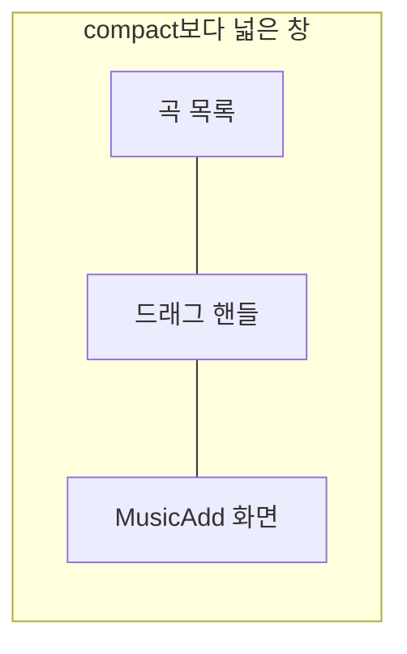

# Playlist 목록·상세 배치 디자인

기준 스펙: [Playlist 목록·상세 배치 스펙](../spec/playlist-list-detail.md)

배치, 크기 조절, 버튼 노출, 진행과 피드백, 조절 상태 표시의 공통 표현은 [목록·상세 배치 공통 디자인](./list-detail-pane.md)을 따른다.

## 두 영역에 두는 화면

목록 영역에는 [PlaylistHome 화면](./playlist-home.md)의 곡 목록을 둔다. 곡 상세는 아직 제공하지 않으므로 상세 영역에는 언제나 [MusicAdd 화면](./music-add.md)을 표시한다. 두 영역은 각각 자기 상단 바를 갖는다.

상세 영역에 아이콘과 안내만 두는 [목록·상세 배치 공통 디자인](./list-detail-pane.md)의 `선택 전 상세`는 이 배치에서 쓰지 않는다. 이 목록에는 선택할 수 있는 카드가 없고 그 자리를 곡 추가가 채우므로, 사용자가 목록을 떠나지 않고 곧바로 입력한다.

곡 목록의 격자는 상세 영역과 자리를 나눠 좁아져도 [PlaylistHome 화면 디자인](./playlist-home.md)의 2열 고정 격자를 유지하며, 상세 영역에 놓인 입력도 상세 영역 폭에 맞춰 함께 좁아진다.

## 버튼 노출

상세 영역이 언제나 MusicAdd이므로 [목록·상세 배치 공통 디자인](./list-detail-pane.md)의 `버튼 노출`에 따라 목록 화면에는 곡 추가 버튼을 표시하지 않고, 곡 추가를 실행하는 단축키도 제공하지 않는다.

목록 영역 상단 바의 뒤로가기 버튼은 함께 표시하는 동안에도 그대로 두고, 누르면 상세 영역만 닫지 않고 두 영역을 함께 닫아 `더보기` 화면을 표시한다. 두 영역은 하나의 화면처럼 함께 사라진다.

상세 영역의 MusicAdd 상단 바에는 뒤로가기 버튼을 표시하지 않는다. 상단 바 제목과 본문의 불러오기 버튼, 곡 추가를 실행하는 플로팅 액션 버튼은 그대로 표시한다.

## 목록과 상세의 표시

목록의 정렬 줄은 [목록 정렬 디자인](./list-sort.md)에 따라 목록 영역 안에만 두고 상세 영역에는 두지 않는다. 정렬 선택 Bottom Sheet도 그 문서를 따라 창 전체를 기준으로 표시하며, 상세 영역과 자리를 나누지 않는다.

목록의 당김 새로고침과 진행 표시는 [새로고침 디자인](./sync-refresh.md)의 `적응형 배치`에 따라 목록 영역 안에만 두고 상세 영역에는 두지 않는다.

MusicAdd의 피드백 스낵바는 [목록·상세 배치 공통 디자인](./list-detail-pane.md)의 `진행과 피드백`에 따라 상세 영역 안 아래쪽에 표시한다. 곡을 추가한 뒤의 성공 피드백이 목록 영역을 가리지 않으므로, 사용자는 방금 추가한 곡이 목록에 나타나는 것을 같은 화면에서 확인한다.

곡을 추가해 목록이 갱신될 때 목록 영역과 드래그 핸들의 자리와 너비 비율은 그대로 둔다.
