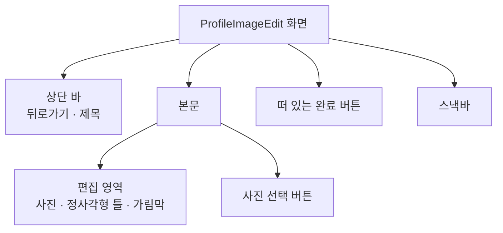
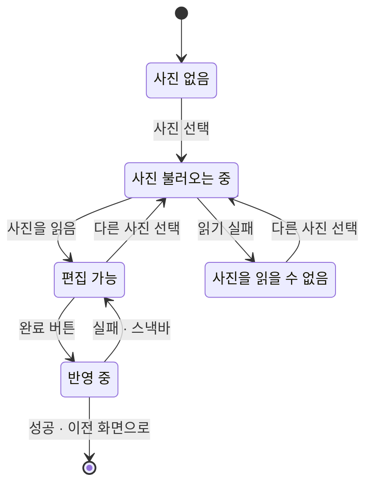

# ProfileImageEdit 화면 디자인

기준 스펙: [ProfileImageEdit 화면 스펙](../spec/profile-image-edit.md)

## 화면 구조

ProfileImageEdit 화면은 MoreHome에서 이어지는 세부 화면이며, [TopLevelNavigation 디자인](./top-level-navigation.md)의 공통 내비게이션은 표시하지 않는다.

화면 상단에는 제목과 뒤로가기 버튼이 있는 상단 바를 둔다. 상단 바에는 다른 동작 버튼을 두지 않는다.

본문은 위에서 아래로 편집 영역과 사진 선택 버튼을 두고, 두 요소 사이에 [구성요소 간격](./dimens.md)을 둔다. 본문은 좌우에 [화면 가로 여백](./dimens.md), 위아래에 [화면 세로 여백](./dimens.md)을 두고, 두 요소를 묶어 남은 높이의 세로 가운데에 배치한다.

반영을 실행하는 완료 버튼은 본문의 끝 쪽 아래 모서리에 떠 있는 버튼으로 두고 체크 아이콘을 쓴다. 이는 [ContactDetail 화면 디자인](./contact-detail.md)의 수정 버튼과 같은 표현이다.

## 편집 영역

편집 영역은 정사각형이다. 한 변은 본문의 폭과, 본문 높이에서 사진 선택 버튼과 간격을 뺀 높이 중 짧은 쪽으로 정하고, `400dp`를 넘지 않게 한다. 좁은 창에서는 폭이 한 변을 정하고, 넓은 창에서는 `400dp`로 고정되어 본문의 가로 가운데에 놓인다.

편집 영역 전체가 스펙의 남길 영역을 나타내는 틀이다. 틀은 편집 영역의 가장자리 그대로이며 별도의 안쪽 여백을 두지 않는다.

사진은 틀 뒤에 놓이고 사용자가 옮기고 키운 만큼 틀 밖으로 나갈 수 있다. 틀 밖으로 나간 부분은 편집 영역 경계에서 잘라 그리지 않고 본문 안에서는 그대로 보이되, 틀 안과 구분되도록 반투명 가림막을 덮는다. 가림막은 테마의 가림막 색을 불투명도 `60%`로 쓴다. 틀 안의 사진은 가림막 없이 원래 색으로 보인다.

틀의 테두리는 테마의 외곽선 색으로 `1dp` 두께로 그린다. 틀 안에 격자나 보조선은 두지 않는다.

편집 영역의 배경은 사진이 없는 부분이 드러나지 않도록 화면 배경색을 그대로 쓴다. 스펙에 따라 틀 안에는 항상 사진이 가득 차므로 틀 안에서는 배경이 보이지 않는다.

## 조작

사진을 옮기고 키우는 조작은 다음 수단을 제공한다.

| 수단 | 조작 |
| --- | --- |
| 터치 | 한 손가락 드래그로 옮기고, 두 손가락 핀치로 키우거나 줄인다 |
| 포인터 | 드래그로 옮기고, 스크롤 휠 또는 트랙패드 스크롤로 포인터 위치를 중심으로 키우거나 줄인다 |

조작이 스펙의 남길 영역 조건을 벗어나게 하면 그 조건에 맞는 가장 가까운 상태로 붙인다. 틀 밖으로 사진이 빠지도록 옮기면 사진 가장자리가 틀 가장자리에 붙고, 처음 상태보다 작게 줄이면 처음 상태에 머물고, 한도를 넘게 키우면 한도에 머문다. 조작이 끝난 뒤 튕겨 돌아가는 모션은 두지 않고 조작 중에 곧바로 붙인다.

물리 키보드 환경에서는 `Cmd` 또는 `Meta`와 `Enter`를 함께 눌러 반영을 실행할 수 있다. 화살표 키나 키보드만으로 사진을 옮기고 키우는 조작은 이번 범위에서 제공하지 않는다.

## 사진 선택 버튼

사진 선택 버튼은 사진 아이콘과 문구를 함께 보이는 톤 버튼이다. 편집 영역 아래에 두고 편집 영역과 같은 폭을 쓴다.

버튼을 누르면 기기의 사진 선택 도구가 열린다. 사진을 고르면 편집 영역에 그 사진이 처음 상태의 틀과 함께 나타나고, 이미 사진이 있었으면 새 사진으로 바뀌며 틀은 처음 상태로 돌아간다. 사진이 나타나거나 바뀔 때 전환 모션은 두지 않는다.

## 상태 표현

| 상태 | 편집 영역 | 완료 버튼 | 사진 선택 버튼 |
| --- | --- | --- | --- |
| 사진 없음 | 가운데에 사진 아이콘과 사진 선택 안내 문구 | 표시하지 않음 | 활성 |
| 사진 불러오는 중 | 가운데에 진행 표시 | 표시하지 않음 | 활성 |
| 편집 가능 | 사진과 틀 | 체크 아이콘 | 활성 |
| 사진을 읽을 수 없음 | 가운데에 깨진 사진 아이콘과 읽기 실패 문구 | 표시하지 않음 | 활성 |
| 반영 중 | 사진과 틀. 조작에 반응하지 않음 | 체크 아이콘을 진행 표시로 바꿈 | 비활성 |

완료 버튼이 나타나고 사라지는 표현은 [나타나고 사라지는 버튼](./button-visibility.md)을 따른다. 반영 중에 아이콘이 진행 표시로 바뀌는 것은 같은 자리의 아이콘 교체이므로 그 문서를 적용하지 않는다.

사진 없음과 사진을 읽을 수 없는 상태의 아이콘과 문구는 편집 영역 안에서 세로로 쌓고 가운데에 맞춘다. 두 상태에서는 가림막과 틀 테두리를 그리지 않는다. 사진 없음은 사진 선택 버튼과 같은 사진 아이콘을 써 무엇을 눌러야 하는지 이어 보이게 하고, 읽기 실패는 깨진 사진 아이콘으로 구분한다.

반영 중에는 사진 선택 버튼을 Material 비활성 표현으로 바꾸고, 편집 영역은 흐리게 하지 않는다. 사용자가 무엇을 반영하고 있는지 그대로 볼 수 있게 하기 위해서다. 상단 바와 뒤로가기 버튼은 그대로 활성이다.

반영 실패 안내는 스낵바로 표시한다. 새 안내를 표시할 때 이미 보이는 스낵바가 있으면 표시 시간이 지나기를 기다리지 않고 즉시 새 안내로 바꾼다.

## 표시 영역

본문, 완료 버튼과 스낵바는 상태 표시 영역, 시스템 탐색 영역과 카메라 컷아웃 등 기기가 가리는 영역을 침범하지 않게 배치한다. 스낵바는 화면 아래쪽에 두고 완료 버튼을 가리지 않도록 버튼 위에 표시한다.

이 화면에는 글자 입력이 없어 소프트 키보드가 나타나지 않는다.

## 문구와 접근성

한국어 환경과 그 외 기본 환경에서 다음 문구를 사용한다.

| 문구 | 한국어 | 그 외 기본 |
| --- | --- | --- |
| 상단 바 제목 | `프로필 이미지 편집` | `Edit profile photo` |
| 뒤로가기 버튼 접근성 이름 | `뒤로가기` | `Navigate up` |
| 편집 중인 사진 접근성 이름 | `편집 중인 사진` | `Photo being edited` |
| 사진 선택 버튼 | `사진 선택` | `Choose photo` |
| 완료 버튼 접근성 이름 | `완료` | `Done` |
| 사진 선택 안내 문구 | `사진을 선택해 주세요.` | `Choose a photo to get started.` |
| 읽기 실패 문구 | `사진을 읽을 수 없습니다.` | `Couldn't open the photo.` |
| 반영 실패 안내 | `프로필 이미지 반영에 실패했습니다.` | `Couldn't update the profile photo.` |

뒤로가기 버튼과 완료 버튼은 아이콘만 표시하므로 [아이콘 버튼 설명](./icon-button-tooltip.md)에 따라 접근성 이름과 같은 설명을 둔다. 사진 선택 버튼은 문구를 함께 표시하므로 설명을 두지 않는다.

편집 영역은 낭독 도구에 `편집 중인 사진` 하나의 요소로 읽힌다. 드래그와 핀치 조작은 낭독 도구로 대체하지 않으며, 낭독 도구 사용자는 처음 상태의 틀 그대로 완료 버튼으로 반영할 수 있다.

반영 중에 진행 표시로 바뀐 완료 버튼은 `완료` 이름을 그대로 유지한다.
