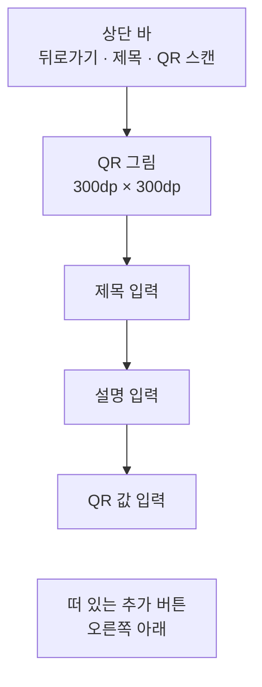

# QrAdd 화면 디자인

기준 스펙: [QrAdd 화면 스펙](../spec/client/qr-add.md)

화면 구조, 표시 영역과 소프트 키보드, 초점과 단축키, 진행과 피드백은 [항목 추가 화면 공통 디자인](./entity-add.md)을 따른다.

## 화면 구조

QrAdd 화면은 [QrHome 화면](./qr-home.md)에서 이어지는 세부 화면으로 창 너비와 관계없이 단독 표시하고, 공통 내비게이션 영역은 [TopLevelNavigation 디자인](./top-level-navigation.md)의 `세부 화면에서의 노출`에 따라 숨긴다.

화면 상단에는 상단 바를 두고, 시작 쪽에 뒤로가기 동작을, 그 바로 뒤에 제목을 시작 쪽에 맞춰 표시한다. 상단 바 끝 쪽에는 QR 스캔 버튼 하나를 둔다. QR 추가는 상단 바에 두지 않고 [항목 추가 화면 공통 디자인](./entity-add.md)의 `화면 구조`에 따라 오른쪽 아래의 떠 있는 추가 버튼으로 표시한다.

상단 바 아래 본문에는 위에서부터 QR 그림, 단일 줄 제목 입력, 설명 입력, QR 값 입력을 차례로 세로로 놓고, 각 요소 사이에는 [공통 여백과 간격](./dimens.md)의 `구성요소 간격`을 둔다. 본문 위아래에는 `화면 세로 여백`, 좌우에는 `화면 가로 여백`을 둔다. QR 그림은 가로 가운데에 맞추고, 세 입력은 본문 가로 폭을 모두 사용한다.

QR 그림을 맨 위에 두어 입력하는 동안 결과를 늘 같은 자리에서 확인하게 한다. 입력 순서는 QR을 가리키는 이름인 제목과 설명을 먼저 두고, QR에 담기는 값을 마지막에 둔다. QR 값 입력은 줄이 늘면 높이가 커지므로 마지막에 두어 제목과 설명 입력이 밀리지 않게 한다. 이 화면에는 태그 입력을 두지 않는다.

## QR 그림

QR 그림 자리는 가로 `300dp`, 세로 `300dp`의 정사각형이다. 창 크기나 입력 값의 길이와 관계없이 이 크기를 유지하고, 값이 길어지면 같은 자리 안에 더 촘촘한 QR을 그린다.

자리의 바탕, QR의 색, 가장자리 여백과 모서리는 [공통 스타일](./styles.md)의 `QR 그림`을 따른다.

값이 비어 있으면 같은 자리를 바탕색으로만 채우고 QR을 그리지 않는다. 안내 문구나 그림은 두지 않는다.

값이 바뀌면 전환 효과 없이 바로 새 QR로 바꿔 그린다. 제목과 설명을 바꿔도 QR 그림은 바뀌지 않는다.

## 제목과 설명 입력

제목 입력의 이름과 표현은 [제목 입력 디자인](./title-input.md)을, 설명 입력의 구성과 표현은 [설명 입력 컴포넌트 디자인](./description-input.md)을 따른다.

## QR 값 입력

QR 값 입력은 테두리가 있는 글자 입력으로 두고, 입력 안쪽 위에 라벨을 표시한다. 입력은 한 줄 높이로 시작하고, 줄이 늘어나면 입력 높이도 함께 늘어난다.

소프트 키보드의 줄바꿈 키와 물리 키보드의 `Enter`는 줄을 바꾼다. 입력 끝 쪽에는 지우기 버튼을 두지 않는다.

QR 하나에 담을 수 없어 받지 않는 입력은 별도 표시 없이 입력 전 값이 그대로 남는다. 오류 색이나 안내 문구로 바꾸지 않는다.

스캔 결과로 값이 바뀌면 입력 커서는 값의 끝에 둔다.

## QR 스캔 버튼

상단 바 끝 쪽의 버튼에는 QR 스캔을 뜻하는 Material Symbols `qr_code_scanner` 아이콘만 표시하고 라벨은 두지 않는다. 모양과 크기는 플랫폼 기본 아이콘 버튼을 따른다. 버튼의 이름을 알려 주는 설명 표시는 [아이콘 버튼 설명 디자인](./icon-button-tooltip.md)을 따른다.

버튼은 모든 환경에서 같은 자리에 같은 모양으로 표시하고 비활성으로 표시하지 않는다. 카메라를 사용할 수 없는 환경에서 눌러도 버튼의 모양은 바뀌지 않는다.

카메라 권한 요청에 응답하기를 기다리는 동안에도 버튼의 모양을 바꾸지 않고 진행 표시도 두지 않는다. 요청은 시스템이나 브라우저가 화면 위에 표시하므로 그동안 사용자가 버튼을 볼 일이 없다.

QR 추가를 처리하는 동안에도 QR 스캔 버튼은 모양을 바꾸지 않고 누를 수 있다.

## 진행과 피드백

카메라 권한이 허용되지 않아 QR 스캔을 시작할 수 없으면 안내를 짧게 보이는 스낵바로 화면 아래쪽에 표시한다. 스낵바에는 동작 버튼을 두지 않는다. 새 안내를 표시할 때 이미 보이는 스낵바가 있으면 표시 시간이 지나기를 기다리지 않고 즉시 새 안내로 바꾸며, 추가 결과 피드백과 같은 자리를 함께 쓴다. 이는 [항목 추가 화면 공통 디자인](./entity-add.md)의 `진행과 피드백`과 같은 기준이다.

추가에 성공하면 제목, 설명과 QR 값을 비우고 입력 초점을 제목 입력으로 옮긴다. QR 값이 비워지면서 QR 그림 자리는 바탕색으로만 남는다.

## 시스템 영역과 적응형 배치

상단 바는 상태 표시줄 영역을 피해 배치한다. 본문, 추가 버튼과 스낵바의 배치와 소프트 키보드 처리는 [항목 추가 화면 공통 디자인](./entity-add.md)의 `표시 영역과 소프트 키보드`를 따른다. 본문이 표시 영역보다 크면 본문을 세로로 스크롤하며, 본문의 마지막 입력이 추가 버튼에 가리지 않게 둔다.

창 너비, 창 높이, 자세와 입력 장치가 달라져도 요소의 순서와 QR 그림 크기는 바뀌지 않는다. 창이 넓으면 입력이 넓어지고 QR 그림은 가로 가운데에 남는다.

## 문구와 접근성

[항목 추가 화면 공통 디자인](./entity-add.md)의 `문구와 접근성`에 더해 한국어 환경과 그 외 기본 환경에서는 다음 문구를 사용한다.

| 항목 | 한국어 | 그 외 기본 |
| --- | --- | --- |
| 상단 바 제목 | `QR 추가` | `Add QR code` |
| 추가 버튼 접근성 이름 | `QR 추가` | `Add QR code` |
| QR 스캔 버튼 접근성 이름 | `QR 스캔` | `Scan QR code` |
| QR 값 입력 라벨 | `QR 값` | `QR value` |
| 추가 성공 안내 | `QR이 추가되었습니다.` | `QR code added.` |
| 제목 미입력 안내 | `제목을 입력해 주세요.` | `Please enter a title.` |
| QR 값 미입력 안내 | `QR 값을 입력해 주세요.` | `Please enter a QR value.` |
| 카메라 권한 안내 | `카메라 권한을 허용해야 QR을 스캔할 수 있습니다.` | `Allow camera access to scan QR codes.` |

QR 그림은 화면 낭독 도구가 읽지 않는다. 같은 값을 QR 값 입력이 읽어 주기 때문이다.
