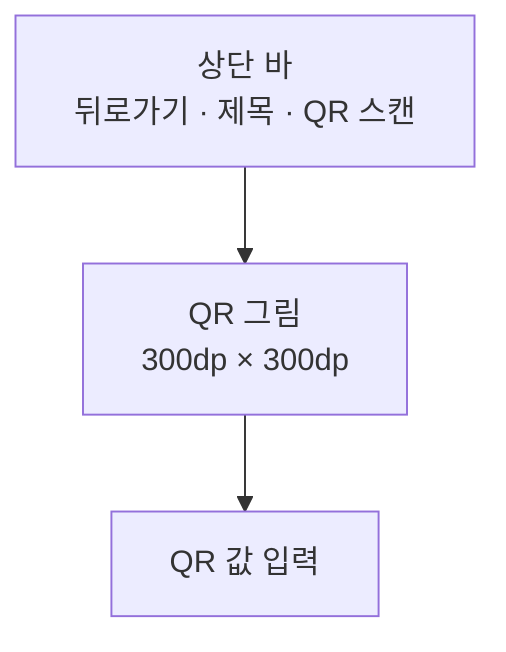

# QrAdd 화면 디자인

기준 스펙: [QrAdd 화면 스펙](../spec/client/qr-add.md)

## 화면 구조

QrAdd 화면은 [QrHome 화면](./qr-home.md)에서 이어지는 세부 화면으로 단독 표시하고, 공통 내비게이션 영역은 [TopLevelNavigation 디자인](./top-level-navigation.md)의 `세부 화면에서의 노출`에 따라 숨긴다.

화면 상단에는 상단 바를 두고, 시작 쪽에 뒤로가기 동작을, 그 바로 뒤에 제목을 시작 쪽에 맞춰 표시한다. 상단 바 끝 쪽에는 QR 스캔 버튼 하나를 둔다.

상단 바 아래 본문에는 위에서부터 QR 그림, QR 값 입력을 차례로 세로로 놓는다. 두 요소는 가로 가운데에 맞추고, 둘 사이에는 [공통 여백과 간격](./dimens.md)의 `구성요소 간격`을 둔다. 본문 위아래에는 `화면 세로 여백`, 좌우에는 `화면 가로 여백`을 둔다. 본문 아래에는 플로팅 액션 버튼을 두지 않는다.

## QR 그림

QR 그림 자리는 가로 `300dp`, 세로 `300dp`의 정사각형이다. 창 크기나 입력 값의 길이와 관계없이 이 크기를 유지하고, 값이 길어지면 같은 자리 안에 더 촘촘한 QR을 그린다.

자리 전체를 흰색으로 채우고, 그 안에 QR을 검은색으로 그린다. 스캐너가 QR의 경계를 찾을 수 있도록 QR과 자리 가장자리 사이에 `16dp`의 흰 여백을 둔다. 앱이 어두운 테마여도 흰 바탕과 검은 QR을 바꾸지 않는다. 자리의 모서리는 [Material 3](https://m3.material.io/styles/shape/corner-radius-scale)의 `medium` 모양으로 둥글린다.

값이 비어 있으면 같은 자리를 흰색으로만 채우고 QR을 그리지 않는다. 안내 문구나 그림은 두지 않는다.

값이 바뀌면 전환 효과 없이 바로 새 QR로 바꿔 그린다.

## QR 값 입력

QR 값 입력은 테두리가 있는 글자 입력으로 두고, 입력 안쪽 위에 라벨을 표시한다. 너비는 본문 좌우 여백 안을 가득 채우되 `600dp`를 넘지 않는다. 입력은 한 줄 높이로 시작하고, 줄이 늘어나면 입력 높이도 함께 늘어난다.

소프트 키보드의 줄바꿈 키와 물리 키보드의 `Enter`는 줄을 바꾼다. 입력 끝 쪽에는 지우기 버튼을 두지 않는다.

QR 하나에 담을 수 없어 받지 않는 입력은 별도 표시 없이 입력 전 값이 그대로 남는다. 오류 색이나 안내 문구로 바꾸지 않는다.

스캔 결과로 값이 바뀌면 입력 커서는 값의 끝에 둔다.

## QR 스캔 버튼

상단 바 끝 쪽의 버튼에는 QR 스캔을 뜻하는 Material Symbols `qr_code_scanner` 아이콘만 표시하고 라벨은 두지 않는다. 모양과 크기는 플랫폼 기본 아이콘 버튼을 따른다. 버튼의 이름을 알려 주는 설명 표시는 [아이콘 버튼 설명 디자인](./icon-button-tooltip.md)을 따른다.

버튼은 모든 환경에서 같은 자리에 같은 모양으로 표시하고 비활성으로 표시하지 않는다. 카메라를 사용할 수 없는 환경에서 눌러도 버튼의 모양은 바뀌지 않는다.

카메라 권한 요청에 응답하기를 기다리는 동안에도 버튼의 모양을 바꾸지 않고 진행 표시도 두지 않는다. 요청은 시스템이 화면 위에 표시하므로 그동안 사용자가 버튼을 볼 일이 없다.

## 권한 안내

카메라 권한이 허용되지 않아 QR 스캔을 시작할 수 없으면 안내를 짧게 보이는 스낵바로 화면 아래쪽에 표시한다. 스낵바에는 동작 버튼을 두지 않는다.

새 안내를 표시할 때 이미 보이는 스낵바가 있으면 표시 시간이 지나기를 기다리지 않고 즉시 새 안내로 바꾼다. 이는 [항목 추가 화면 공통 디자인](./entity-add.md)의 피드백과 같은 기준이다.

## 시스템 영역과 소프트 키보드

상단 바는 상태 표시줄 영역을 피해 배치하고, 본문과 스낵바는 내비게이션 바와 디스플레이 컷아웃 영역을 피해 배치한다.

소프트 키보드가 나타나면 본문을 키보드 위 영역에 맞춰 배치하고, 본문이 그 영역보다 크면 본문을 세로로 스크롤할 수 있게 한다. 입력 줄이 늘어 본문이 표시 영역을 넘는 경우도 같게 다룬다. 키보드가 닫히면 원래 표시 영역으로 되돌린다.

## 적응형 배치

창 너비, 창 높이, 자세와 입력 장치가 달라져도 요소의 순서와 QR 그림 크기는 바뀌지 않는다. 창이 넓으면 두 요소가 가로 가운데에 모이고, 창 높이가 본문보다 낮으면 본문을 세로로 스크롤한다.

## 문구와 접근성

한국어 환경과 그 외 기본 환경에서 다음 문구를 사용한다.

| 항목 | 한국어 | 그 외 기본 |
| --- | --- | --- |
| 상단 바 제목 | `QR 추가` | `Add QR code` |
| 뒤로가기 접근성 이름 | `뒤로가기` | `Navigate up` |
| QR 스캔 버튼 접근성 이름 | `QR 스캔` | `Scan QR code` |
| QR 값 입력 라벨 | `QR 값` | `QR value` |
| 카메라 권한 안내 | `카메라 권한을 허용해야 QR을 스캔할 수 있습니다.` | `Allow camera access to scan QR codes.` |

QR 그림은 화면 낭독 도구가 읽지 않는다. 같은 값을 QR 값 입력이 읽어 주기 때문이다.
