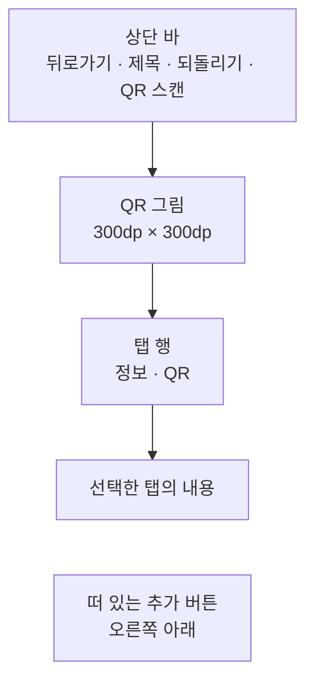

# QrAdd 화면 디자인

기준 스펙: [QrAdd 화면 스펙](../spec/client/qr-add.md)

화면 구조, 표시 영역과 소프트 키보드, 초점과 단축키, 진행과 피드백은 [항목 추가 화면 공통 디자인](./entity-add.md)을 따른다.

## 화면 구조

QrAdd 화면은 [QrHome 화면](./qr-home.md)에서 이어지는 세부 화면으로 창 너비와 관계없이 단독 표시하고, 공통 내비게이션 영역은 [TopLevelNavigation 디자인](./top-level-navigation.md)의 `세부 화면에서의 노출`에 따라 숨긴다.

화면 상단에는 상단 바를 두고, 시작 쪽에 뒤로가기 동작을, 그 바로 뒤에 제목을 시작 쪽에 맞춰 표시한다. 상단 바 끝 쪽에는 되돌리기 버튼과 QR 스캔 버튼을 이 순서로 둔다. QR 추가는 상단 바에 두지 않고 [항목 추가 화면 공통 디자인](./entity-add.md)의 `화면 구조`에 따라 오른쪽 아래의 떠 있는 추가 버튼으로 표시한다. 세 버튼은 선택한 탭과 관계없이 같은 자리에 둔다.

상단 바 아래 본문에는 위에서부터 QR 그림, 탭 행, 선택한 탭의 내용을 차례로 세로로 놓는다. QR 그림과 탭 행 사이, 탭 행과 탭 내용 사이, 탭 내용 안의 각 요소 사이에는 [공통 여백과 간격](./dimens.md)의 `구성요소 간격`을 둔다. 본문 위아래에는 `화면 세로 여백`, 좌우에는 `화면 가로 여백`을 둔다. QR 그림은 가로 가운데에 맞추고, 탭 행과 탭 내용의 입력은 본문 가로 폭을 모두 사용한다.

QR 그림을 탭 행보다 위에 두어 어느 탭에서 입력하든 결과를 늘 같은 자리에서 확인하게 한다. 이 화면에는 태그 입력을 두지 않는다.

```mermaid
flowchart TB
    top["상단 바<br/>뒤로가기 · 제목 · 되돌리기 · QR 스캔"]
    qr["QR 그림<br/>300dp × 300dp"]
    tabs["탭 행<br/>정보 · QR"]
    content["선택한 탭의 내용"]
    fab["떠 있는 추가 버튼<br/>오른쪽 아래"]
    top --> qr --> tabs --> content
    content ~~~ fab
```

본문은 QR 그림과 탭 행을 포함해 통째로 세로 스크롤한다. QR 그림과 탭 행을 고정하면 소프트 키보드가 열린 좁은 창에서 입력이 보일 자리가 남지 않기 때문이다.

## QR 그림

QR 그림 자리는 가로 `300dp`, 세로 `300dp`의 정사각형이다. 창 크기나 입력 값의 길이와 관계없이 이 크기를 유지하고, 값이 길어지면 같은 자리 안에 더 촘촘한 QR을 그린다.

자리의 바탕, QR의 색, 가장자리 여백과 모서리는 [공통 스타일](./styles.md)의 `QR 그림`을 따른다.

선택한 포맷의 QR 값이 없으면 같은 자리를 바탕색으로만 채우고 QR을 그리지 않는다. 안내 문구나 그림은 두지 않는다.

값이 바뀌거나 포맷을 바꾸면 전환 효과 없이 바로 새 QR로 바꿔 그린다. 제목과 설명을 바꾸거나 탭을 바꿔도 QR 그림은 바뀌지 않는다.

## 탭 행

탭 행은 본문 가로 폭을 모두 차지하고, 두 탭이 시작 쪽부터 정보, QR 순서로 폭을 균등하게 나눠 가진다. 각 탭에는 아이콘만 표시하고 라벨 문구는 두지 않는다. 정보 탭에는 Material Symbols `info`를, QR 탭에는 QrHome이 QR을 가리킬 때 쓰는 Material Symbols `qr_code`를 쓴다. 두 탭만 있어 아이콘으로 충분히 구분되고, 라벨을 두지 않아 탭 행 높이가 줄어 입력이 보일 자리가 늘어난다. 선택된 탭의 강조 표시는 Material 기본 탭 표현을 따르고, 화면 낭독 도구는 각 탭을 `문구와 접근성`의 접근성 이름으로 읽는다.

탭은 탭 행을 눌러서만 바꾼다. 탭 내용 위에서 좌우로 스와이프해도 탭을 바꾸지 않는다. QR 탭의 위치 포맷에는 좌우로 끄는 지도가 있고, 정보 탭의 설명 입력에는 자체 탭이 있어 스와이프 전환과 조작이 섞이기 때문이다. 탭을 바꾸면 전환 효과 없이 바로 선택한 탭의 내용을 보여 준다.

탭 행은 비활성으로 표시하지 않고, 추가를 처리하는 동안에도 누를 수 있다.

스펙이 탭을 스스로 바꾸도록 정한 경우에는 탭을 누른 것과 같은 표현으로 바꾼 뒤, 초점을 옮길 입력이 있으면 그 입력이 보이도록 본문을 스크롤한다.

## 정보 탭

정보 탭에는 단일 줄 제목 입력과 설명 입력을 위에서부터 차례로 둔다. 제목 입력의 이름과 표현은 [제목 입력 디자인](./title-input.md)을, 설명 입력의 구성과 표현은 [설명 입력 컴포넌트 디자인](./description-input.md)을 따른다.

## QR 탭

QR 탭에는 맨 위에 포맷 선택을 두고, 그 아래에 선택한 포맷의 입력을 `포맷별 입력`의 순서대로 둔다. 포맷을 바꾸면 포맷 선택 아래의 입력만 바뀌고, 포맷 선택의 자리는 그대로다.

### 포맷 선택

포맷 선택은 테두리가 있는 읽기 전용 선택 입력으로 두고, 입력 안쪽 위에 라벨을, 안쪽에 선택한 포맷 이름을, 끝 쪽에 펼침 표시를 둔다. 누르면 입력 바로 아래에 포맷 목록 메뉴를 펼치고, 목록은 스펙의 `QR 포맷` 표 순서로 모든 포맷을 한 줄에 하나씩 보여 준다. 메뉴에서 포맷을 고르면 메뉴를 닫고 포맷을 바꾼다. 메뉴 바깥을 누르거나 뒤로가기를 실행하면 포맷을 바꾸지 않고 메뉴만 닫는다.

포맷이 아홉 개라 칩을 늘어놓으면 좁은 창에서 일부 포맷이 가려지므로, 선택한 포맷 하나만 자리를 차지하고 목록은 필요할 때만 펼치는 선택 입력을 쓴다.

포맷을 바꿔도 입력 초점을 새 입력으로 옮기지 않고 소프트 키보드도 열지 않는다.

### 포맷별 입력

각 포맷의 입력은 다음 순서로 둔다. `여러 줄`로 적은 입력은 한 줄 높이로 시작해 줄이 늘면 높이도 함께 늘어나고, 소프트 키보드의 줄바꿈 키와 물리 키보드의 `Enter`가 줄을 바꾼다. 나머지는 단일 줄 입력이다. 키보드 열은 그 입력에 맞춰 요청하는 소프트 키보드 종류다.

| 포맷 | 입력(순서대로) | 키보드 |
| --- | --- | --- |
| 텍스트 | 내용(여러 줄) | 일반 텍스트 |
| URL | URL | 주소 입력 |
| 연락처 | 이름, 전화번호, 이메일, 회사, 주소(여러 줄), 웹사이트 | 이름·회사·주소는 일반 텍스트, 전화번호는 전화번호, 이메일은 이메일 주소, 웹사이트는 주소 입력 |
| Wi-Fi | 네트워크 이름, 보안 방식, 비밀번호, 숨겨진 네트워크 | 네트워크 이름은 일반 텍스트, 비밀번호는 비밀번호 |
| 위치 | 지도, 위도, 경도 | `좌표 입력`을 따름 |
| 이메일 | 받는 사람, 메일 제목, 본문(여러 줄) | 받는 사람은 이메일 주소, 나머지는 일반 텍스트 |
| 전화 | 전화번호 | 전화번호 |
| SMS | 전화번호, 메시지(여러 줄) | 전화번호는 전화번호, 메시지는 일반 텍스트 |
| 일정 | 일정 제목, 기간, 장소, 일정 설명(여러 줄) | 일반 텍스트 |

글자 입력은 모두 테두리가 있는 글자 입력으로 두고, 입력 안쪽 위에 라벨을 표시한다. 필수 입력에도 필수 표시나 오류 색을 두지 않는다. 입력 끝 쪽에는 지우기 버튼을 두지 않는다. 예외로 위도와 경도 입력은 `좌표 입력`을 따른다.

QR 하나에 담을 수 없어 받지 않는 입력은 별도 표시 없이 입력 전 값이 그대로 남는다. 오류 색이나 안내 문구로 바꾸지 않는다.

포맷을 고르거나 스캔 결과, 되돌리기, 추가 성공으로 QR 값이 바뀌어 입력이 다시 채워지면 각 글자 입력의 커서는 값의 끝에 둔다. 사용자가 입력을 고치는 동안에는 QR 값이 바뀌어도 입력 칸의 글자와 커서를 건드리지 않는다.

다른 포맷의 QR 값을 지우고 새로 쓸 때도 별도 확인이나 안내를 두지 않는다. 되돌리기 버튼이 활성으로 바뀌는 것으로 되돌릴 수 있음을 알린다.

### Wi-Fi 입력

보안 방식은 `WPA/WPA2/WPA3`, `WEP`, `없음` 세 칸이 이 순서로 붙어 있는 단일 선택 분할 버튼으로 두고, 본문 가로 폭을 모두 사용한다. 선택한 칸에는 Material 기본 선택 표현을 쓴다.

보안 방식이 `없음`이면 비밀번호 입력을 숨기고 그 자리를 비우지 않고 아래 요소를 끌어올린다. 다른 보안 방식으로 바꾸면 비밀번호 입력을 같은 자리에 다시 보여 준다.

비밀번호는 사용자가 QR에 담기는 값을 확인할 수 있도록 글자를 가리지 않고 보여 준다.

숨겨진 네트워크는 시작 쪽에 라벨을, 끝 쪽에 스위치를 두는 한 줄로 두고, 줄 전체를 눌러도 스위치를 바꾼다.

### 위치 입력

위치 포맷에서는 포맷 선택 아래에 지도를, 그 아래에 위도 입력과 경도 입력을 둔다. 지도는 본문 가로 폭을 모두 사용하고 높이는 [공통 여백과 간격](./dimens.md)의 `고정 지도 높이`로 고정한다. 지도 안에서 시작한 끌기는 지도를 옮기고 본문을 스크롤하지 않는다. 지도 바깥에서 시작한 끌기는 본문을 스크롤한다.

지도의 구성, 지도 제공자 전환 컨트롤, 지점 표시의 모양과 지점을 고르는 조작은 [DiaryMap 컴포넌트 디자인](./diary-map.md)을 따른다. 기본 지도를 확인하기 전이거나 읽지 못해 지도를 표시하지 않는 동안에는 지도 자리를 비우지 않고 위도 입력이 포맷 선택 바로 아래로 올라온다. 로딩 표시나 오류 안내는 두지 않는다.

지도를 눌러 채우는 위도·경도의 표시 형식, 지도를 누를 때 본문을 스크롤하지 않고 소프트 키보드를 그대로 두는 것, 직접 입력한 좌표를 지도에 반영하는 표현은 [PlaceAdd 화면 디자인](./place-add.md)의 `지도에서 좌표 선택`과 `직접 입력한 좌표의 지도 반영`을 따른다.

#### 좌표 입력

위도와 경도 입력의 배치, 소프트 키보드, 지우기 버튼과 입력 중 표현은 [PlaceAdd 화면 디자인](./place-add.md)의 `좌표 입력`을 따른다.

### 일정 입력

기간은 [DiaryDateTimeInput 컴포넌트 디자인](./diary-date-time-input.md)을 그대로 쓰며, 사용 여부 전환과 종일 전환도 그 디자인의 표현을 따른다.

## 되돌리기 버튼

상단 바 끝 쪽, QR 스캔 버튼 바로 앞의 버튼에는 되돌리기를 뜻하는 Material Symbols `undo` 아이콘만 표시하고 라벨은 두지 않는다. 모양과 크기는 플랫폼 기본 아이콘 버튼을 따른다. 버튼의 이름을 알려 주는 설명 표시는 [아이콘 버튼 설명 디자인](./icon-button-tooltip.md)을 따른다.

되돌릴 기록이 없으면 버튼을 숨기지 않고 Material 기본 비활성 아이콘 버튼 표현으로 둔다. 숨기면 옆의 QR 스캔 버튼 자리가 기록 유무에 따라 옮겨지기 때문이다. 비활성인 동안에는 눌러도 아무 일도 일어나지 않는다.

되돌리면 QR 탭으로 바꾸고, 바뀐 QR 값과 포맷을 전환 효과 없이 바로 보여 준다. 되돌리기는 입력 초점을 옮기지 않는다.

QR 추가를 처리하는 동안에도 되돌리기 버튼은 기록이 있으면 누를 수 있다.

## QR 스캔 버튼

상단 바 끝 쪽의 버튼에는 QR 스캔을 뜻하는 Material Symbols `qr_code_scanner` 아이콘만 표시하고 라벨은 두지 않는다. 모양과 크기는 플랫폼 기본 아이콘 버튼을 따른다. 버튼의 이름을 알려 주는 설명 표시는 [아이콘 버튼 설명 디자인](./icon-button-tooltip.md)을 따른다.

버튼은 모든 환경에서 같은 자리에 같은 모양으로 표시하고 비활성으로 표시하지 않는다. 카메라를 사용할 수 없는 환경에서 눌러도 버튼의 모양은 바뀌지 않는다.

카메라 권한 요청에 응답하기를 기다리는 동안에도 버튼의 모양을 바꾸지 않고 진행 표시도 두지 않는다. 요청은 시스템이나 브라우저가 화면 위에 표시하므로 그동안 사용자가 버튼을 볼 일이 없다.

QR 추가를 처리하는 동안에도 QR 스캔 버튼은 모양을 바꾸지 않고 누를 수 있다.

## 진행과 피드백

카메라 권한이 허용되지 않아 QR 스캔을 시작할 수 없으면 안내를 짧게 보이는 스낵바로 화면 아래쪽에 표시한다. 스낵바에는 동작 버튼을 두지 않는다. 새 안내를 표시할 때 이미 보이는 스낵바가 있으면 표시 시간이 지나기를 기다리지 않고 즉시 새 안내로 바꾸며, 추가 결과 피드백과 같은 자리를 함께 쓴다. 이는 [항목 추가 화면 공통 디자인](./entity-add.md)의 `진행과 피드백`과 같은 기준이다.

추가에 성공하면 정보 탭으로 바꾸고 제목, 설명과 QR 값을 비운 뒤 입력 초점을 제목 입력으로 옮기며, 본문을 맨 위로 스크롤한다. QR 값이 비면서 QR 그림 자리는 바탕색으로만 남고, 되돌리기 버튼은 비활성으로 바뀐다. 위치 포맷의 지도는 보고 있던 자리에 그대로 두고 지점 표시만 사라지게 한다.

## 시스템 영역과 적응형 배치

상단 바는 상태 표시줄 영역을 피해 배치한다. 본문, 추가 버튼과 스낵바의 배치와 소프트 키보드 처리는 [항목 추가 화면 공통 디자인](./entity-add.md)의 `표시 영역과 소프트 키보드`를 따른다. 본문이 표시 영역보다 크면 본문을 세로로 스크롤하며, 본문의 마지막 입력이 추가 버튼에 가리지 않게 둔다.

창 너비, 창 높이, 자세와 입력 장치가 달라져도 요소의 순서, QR 그림 크기와 지도 높이는 바뀌지 않는다. 창이 넓으면 탭 행, 입력과 지도가 넓어지고 QR 그림은 가로 가운데에 남는다.

## 문구와 접근성

[항목 추가 화면 공통 디자인](./entity-add.md)의 `문구와 접근성`에 더해 한국어 환경과 그 외 기본 환경에서는 다음 문구를 사용한다.

| 항목 | 한국어 | 그 외 기본 |
| --- | --- | --- |
| 상단 바 제목 | `QR 추가` | `Add QR code` |
| 추가 버튼 접근성 이름 | `QR 추가` | `Add QR code` |
| 되돌리기 버튼 접근성 이름 | `되돌리기` | `Undo` |
| QR 스캔 버튼 접근성 이름 | `QR 스캔` | `Scan QR code` |
| 정보 탭 접근성 이름 | `정보` | `Info` |
| QR 탭 접근성 이름 | `QR` | `QR` |
| 포맷 선택 라벨 | `포맷` | `Format` |
| 추가 성공 안내 | `QR이 추가되었습니다.` | `QR code added.` |
| 제목 미입력 안내 | `제목을 입력해 주세요.` | `Please enter a title.` |
| 카메라 권한 안내 | `카메라 권한을 허용해야 QR을 스캔할 수 있습니다.` | `Allow camera access to scan QR codes.` |
| 위치 지도 접근성 이름 | `QR 위치 지도` | `QR location map` |

포맷 이름은 다음과 같다.

| 포맷 | 한국어 | 그 외 기본 |
| --- | --- | --- |
| 텍스트 | `텍스트` | `Text` |
| URL | `URL` | `URL` |
| 연락처 | `연락처` | `Contact` |
| Wi-Fi | `Wi-Fi` | `Wi-Fi` |
| 위치 | `위치` | `Location` |
| 이메일 | `이메일` | `Email` |
| 전화 | `전화` | `Phone` |
| SMS | `SMS` | `SMS` |
| 일정 | `일정` | `Event` |

포맷별 입력의 라벨은 다음과 같다. 위도와 경도 입력의 라벨은 [PlaceAdd 화면 디자인](./place-add.md)의 `문구와 접근성`과 같다.

| 입력 | 한국어 | 그 외 기본 |
| --- | --- | --- |
| 텍스트의 내용 | `내용` | `Text` |
| URL의 URL | `URL` | `URL` |
| 연락처의 이름 | `이름` | `Name` |
| 연락처·전화·SMS의 전화번호 | `전화번호` | `Phone number` |
| 연락처의 이메일 | `이메일` | `Email` |
| 연락처의 회사 | `회사` | `Company` |
| 연락처의 주소 | `주소` | `Address` |
| 연락처의 웹사이트 | `웹사이트` | `Website` |
| Wi-Fi의 네트워크 이름 | `네트워크 이름` | `Network name` |
| Wi-Fi의 보안 방식 | `보안` | `Security` |
| Wi-Fi 보안 방식 `없음` 칸 | `없음` | `None` |
| Wi-Fi의 비밀번호 | `비밀번호` | `Password` |
| Wi-Fi의 숨겨진 네트워크 | `숨겨진 네트워크` | `Hidden network` |
| 이메일의 받는 사람 | `받는 사람` | `To` |
| 이메일의 메일 제목 | `메일 제목` | `Subject` |
| 이메일의 본문 | `본문` | `Body` |
| SMS의 메시지 | `메시지` | `Message` |
| 일정의 일정 제목 | `일정 제목` | `Event title` |
| 일정의 장소 | `장소` | `Location` |
| 일정의 일정 설명 | `일정 설명` | `Event description` |

Wi-Fi 보안 방식의 `WPA/WPA2/WPA3`와 `WEP` 칸은 어느 언어에서나 그 글자 그대로 표시한다. 이메일의 메일 제목과 일정의 일정 제목·일정 설명은 정보 탭의 제목·설명 입력과 헷갈리지 않도록 라벨에 대상을 붙인다.

QR 내용 미입력 안내는 선택한 포맷의 첫 입력에 따라 다음 문구를 사용한다.

| 첫 입력 | 한국어 | 그 외 기본 |
| --- | --- | --- |
| 텍스트의 내용 | `내용을 입력해 주세요.` | `Please enter the text.` |
| URL의 URL | `URL을 입력해 주세요.` | `Please enter a URL.` |
| 연락처의 이름 | `이름을 입력해 주세요.` | `Please enter a name.` |
| Wi-Fi의 네트워크 이름 | `네트워크 이름을 입력해 주세요.` | `Please enter a network name.` |
| 위치의 위도 | [PlaceAdd 화면 디자인](./place-add.md)의 `좌표 오류 안내`와 같음 | 같음 |
| 이메일의 받는 사람 | `받는 사람을 입력해 주세요.` | `Please enter a recipient.` |
| 전화·SMS의 전화번호 | `전화번호를 입력해 주세요.` | `Please enter a phone number.` |
| 일정의 일정 제목 | `일정 제목을 입력해 주세요.` | `Please enter an event title.` |

화면 낭독 도구는 탭 행의 각 탭을 탭으로, 선택된 탭을 선택된 상태로 읽는다. 포맷 선택은 라벨과 선택한 포맷 이름을 함께 읽고, 펼칠 수 있는 목록임을 알린다.

QR 그림은 화면 낭독 도구가 읽지 않는다. 같은 내용을 선택한 포맷의 입력이 읽어 주기 때문이다.
