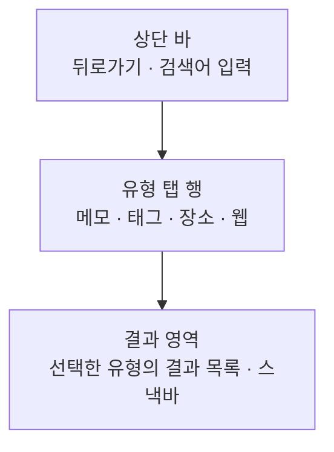

# SearchHome 화면 디자인

기준 스펙: [SearchHome 화면 스펙](../spec/client/search-home.md), [목록 빈 상태 스펙](../spec/client/list-empty-state.md), [페이지 조회 목록의 자리 표시 스펙](../spec/client/paged-list-placeholder.md), [SwipeToFinishAndDelete 컴포넌트 스펙](../spec/client/swipe-to-finish-and-delete.md)

## 화면 구조

SearchHome 화면은 `더보기`, MemoHome, TagHome, PlaceHome, WebHome에서 이어지는 세부 화면으로 단독 표시하며, 공통 내비게이션 영역은 숨긴다. 어느 화면에서 들어와도 화면 구조는 같다.

화면은 위에서 아래로 상단 바, 유형 탭 행, 결과 영역을 둔다. 세 영역은 서로 겹치지 않고 구분선을 두지 않는다. 스낵바는 결과 영역 아래쪽에 겹쳐 표시하고 네 유형이 함께 쓴다.

상단 바에는 화면 제목을 두지 않고 검색어 입력을 직접 배치한다. 이 화면에서 사용자가 하는 일이 검색 하나뿐이므로, 제목이 차지할 자리를 입력에 준다.

유형 탭 행은 상단 바 바로 아래에 붙어 가로 폭 전체를 채우고, 결과 영역이 남은 높이를 모두 채운다. 결과 영역의 바깥 여백과 항목 사이 간격은 [화면 가로 여백](./dimens.md), [화면 세로 여백](./dimens.md), [항목 간격](./dimens.md)을 따른다.

뒤로가기로 들어온 화면에 돌아가면 그 화면이 원래 두는 공통 내비게이션 영역을 다시 표시한다. `더보기`, MemoHome, TagHome에서 들어왔으면 공통 내비게이션 영역이 다시 나타나고, PlaceHome이나 WebHome에서 들어왔으면 그 화면도 세부 화면이므로 나타나지 않는다.

## 상단 바와 검색어 입력

상단 바의 시작 쪽에는 뒤로가기 아이콘 버튼을 두고, 그 옆의 남은 폭 전체를 검색어 입력이 차지한다. 상단 바에는 이 둘 말고 다른 액션을 두지 않는다.

검색어 입력의 해부구조, 조작, 접근성 문구는 [검색 입력 디자인](./search-input.md)을 따른다. 이 화면에서 사용자가 하는 일이 검색 하나뿐이므로 입력은 접거나 펼치지 않고 언제나 활성 상태로 놓이며, 시작 쪽에는 돋보기 아이콘을, 끝 쪽에는 검색어가 있을 때만 지우기 버튼을 둔다.

입력이 비어 있으면 무엇을 검색하는 자리인지 알리는 안내 문구를 자리 표시 문구로 둔다.

## 초점과 소프트 키보드

초점을 어느 입력에 두고 언제 옮기는지는 기준 스펙이 정한다. 검색어 입력에 초점이 옮겨 갈 때는 소프트 키보드를 함께 열고, 초점을 옮기지 않는 동안에는 키보드도 열지 않아 결과 영역을 가리지 않게 한다.

소프트 키보드의 종류와 동작 키의 처리는 [검색 입력 디자인](./search-input.md)을 따른다.

소프트 키보드가 열리면 결과 영역만 키보드 위 영역으로 줄어들고, 상단 바와 유형 탭 행은 자리를 옮기지 않는다. 키보드가 닫히면 결과 영역이 원래 높이로 되돌아간다.

화면은 상태 표시 영역, 시스템 탐색 영역과 카메라 컷아웃 등 기기가 가리는 영역을 침범하지 않게 배치한다.

물리 키보드 환경에서는 `Tab`으로 뒤로가기, 검색어 입력, 탭 행, 결과 항목 순서로 초점을 옮길 수 있다.

## 유형 탭 행

유형 탭 행에는 `메모`, `태그`, `장소`, `웹`을 이 순서로 배치한다. 네 항목이 가로 폭을 같은 너비로 나누고, 선택된 항목은 항목 아래에 붙는 강조 표시로 구분한다. 탭 행의 배경색과 강조 표시 색은 탭 행 컴포넌트의 기본값을 그대로 쓴다.

화면에 들어오면 진입 경로가 정한 유형이 선택된 상태로 시작한다. 어느 유형에서 시작하든 강조 표시는 처음부터 그 항목 아래에 놓이며, 다른 항목에서 옮겨 오는 이동은 보이지 않는다. 시작 유형의 기준은 [SearchHome 화면 스펙](../spec/client/search-home.md)의 `진입 경로와 시작 유형`을 따른다.

각 항목에는 유형 이름만 라벨로 표시한다. 아이콘, 결과 개수 배지, 숫자는 표시하지 않는다. 결과 개수를 라벨에 붙이면 사용자가 질의를 입력하는 동안 네 라벨의 폭이 계속 바뀐다.

결과가 하나도 없는 유형의 항목도 같은 모양으로 표시하며 비활성 표현을 사용하지 않는다.

사용자는 항목을 눌러 유형을 바꾸고, 결과 영역을 좌우로 스와이프해서도 바꾼다. 스와이프로 옮기는 동안 강조 표시가 두 항목 사이를 이어서 따라간다. 첫 유형에서 더 왼쪽으로, 마지막 유형에서 더 오른쪽으로는 넘어가지 않고 순환하지 않는다.

예외로 결과 카드 위에서 시작한 좌우 스와이프는 카드의 스와이프가 가져간다. 카드는 `완료·삭제 스와이프`에 따라 움직이고 유형은 바뀌지 않는다. 삭제만 제공하는 장소·웹 카드를 왼쪽에서 오른쪽으로 밀어 카드가 움직이지 않을 때도 유형은 바뀌지 않는다. 카드 사이나 목록 가장자리, 정렬 줄, 빈 상태처럼 카드 밖에서 시작한 스와이프와 탭 항목 선택은 그대로 유형을 바꾼다. 기준은 [TagDetail 화면 디자인](./tag-detail.md)의 `페이지 전환`과 같다.

유형이 바뀔 때 결과 영역은 가로로 밀려 들어오고 밀려 나간다. 지속 시간과 완급은 전환 기본값을 따르고 이 화면에서 따로 정하지 않는다.

## 결과 영역

결과 영역에는 선택한 유형의 결과만 세로 목록으로 표시하고, 목록 전체 높이가 영역보다 크면 세로로 스크롤할 수 있게 한다.

네 유형 모두 한 행에 항목 하나를 두는 1열 목록으로 배치한다. [TagHome 목록 디자인](./tag-home.md), [장소 보기 모드 디자인](./place-view-mode.md), [WebHome 화면 디자인](./web-home.md)의 격자 배치를 가져오지 않는 것은, 탭을 오갈 때 열 수와 항목 높이가 함께 바뀌면 결과 영역이 유형마다 다른 화면처럼 보이기 때문이다.

각 유형이 스크롤한 자리는 유형마다 따로 기억한다. 사용자가 한 유형에서 아래로 내려가 있다가 다른 유형을 보고 돌아오면 내려가 있던 자리에서 이어서 본다.

질의가 바뀌어 결과가 갈리면 목록은 맨 위에서 다시 시작한다.

질의가 비어 있는 동안에는 항목을 표시하지 않고, 안내 문구나 그림, 로딩 표시도 배치하지 않는다. 네 유형 모두 같은 빈 영역이며, 사용자가 지금 볼 것은 아직 아무것도 없다.

질의를 입력했는데 그 유형에 결과가 하나도 없으면 목록 자리에 [목록 빈 상태 디자인](./list-empty-state.md)의 빈 상태를 표시한다. 결과를 조회하지 못했을 때도 같은 표시를 쓴다. 다시 시도하는 동작은 배치하지 않는다.

빈 상태의 아이콘은 유형마다 그 유형의 목록 화면이 쓰는 아이콘을 그대로 쓰고, 문구는 네 유형이 같다. 아이콘과 문구는 [목록 빈 상태 디자인](./list-empty-state.md)이 소유한다.

| 유형 | 아이콘 |
| --- | --- |
| 메모 | 메모 아이콘 |
| 태그 | 태그 아이콘 |
| 장소 | 장소 아이콘 |
| 웹 | 웹 아이콘 |

빈 상태는 그 유형의 결과 영역 안에만 놓이며 상단 바와 유형 탭 행을 밀어내지 않는다. 사용자는 빈 상태를 보는 동안에도 질의를 이어서 고치고, 탭을 눌러 유형을 바꾸고, 결과 영역을 좌우로 스와이프한다. 스와이프로 옮기는 동안 빈 상태는 그 유형의 결과와 같이 가로로 밀려 들어오고 밀려 나간다.

빈 상태는 유형마다 따로 판정하므로, 한 유형이 빈 상태여도 다른 유형은 결과 목록을 그대로 표시한다.

질의가 바뀌어 결과가 나타나거나 사라지면 목록과 빈 상태는 [목록 빈 상태 디자인](./list-empty-state.md)의 교차 페이드로 오간다. 질의를 지워 비우면 빈 상태도 함께 사라지고 빈 영역으로 돌아간다.

아직 준비되지 않은 자리에는 [페이지 조회 목록의 자리 표시 디자인](./paged-list-placeholder.md)에 따라 자리 표시 카드를 표시한다.

## 정렬 줄

정렬 줄은 유형 탭 행 바로 아래, 그 유형의 결과 목록 위에 둔다. 유형마다 정렬 줄을 따로 두어 상단 바와 유형 탭 행을 밀어내지 않는다. 정렬 줄과 정렬 선택 Bottom Sheet의 구조, 조작, 아이콘과 문구는 [목록 정렬 디자인](./list-sort.md)을 따른다.

## 결과 카드

각 유형의 결과는 그 유형의 목록 화면이 쓰는 카드를 그대로 쓰고, 카드 사이에는 세로로 [항목 간격](./dimens.md)을 둔다.

| 유형 | 쓰는 카드 |
| --- | --- |
| 메모 | [MemoHome 목록 디자인](./memo-home.md)의 `메모 카드` |
| 태그 | [TagHome 목록 디자인](./tag-home.md)의 `목록`이 정의한 태그 카드 |
| 장소 | [장소 보기 모드 디자인](./place-view-mode.md)의 `장소 카드` |
| 웹 | [WebHome 화면 디자인](./web-home.md)의 `목록`이 정의한 웹 카드 |

카드에 무엇을 어떤 글자 크기로 표시하는지, 폭을 넘는 글을 어떻게 다루고 접근성에 무엇을 제공하는지는 각 카드 디자인이 소유하며 이 문서에서 다시 정의하지 않는다. 네 카드는 모두 제목 한 줄을 위에 두고 필요할 때만 그 아래에 보조 줄 한 줄을 두므로, 사용자가 유형을 오가도 결과 영역이 하나의 결과 목록으로 읽힌다.

메모, 태그, 장소 카드에는 제목 왼쪽에 저장된 컬러로 채운 작은 원형 표시가 함께 놓이지만, 웹 항목에는 저장된 컬러가 없어 웹 카드에는 그 표시를 두지 않는다. 각 카드 디자인이 정한 것을 그대로 쓰는 것이므로 검색 결과에서 원형 표시를 새로 만들지 않고, 그 자리를 비워 두지도 않는다.

검색 결과 전용 카드를 따로 두지 않는 것은, 같은 항목이 목록 화면과 검색 결과에서 다르게 보이지 않게 하기 위한 것이다.

자리 표시 카드의 형태도 각 카드 디자인이 정한 것을 그대로 쓴다.

메모 결과에는 [MemoHome 목록 디자인](./memo-home.md)의 날짜 헤더를 두지 않는다. 검색 결과는 시작 날짜가 아니라 제목 순서로 놓이므로 날짜로 묶이는 구간이 생기지 않는다.

카드 전체를 누를 수 있는 자리로 두고, 누르면 그 항목의 상세 화면으로 이동한다. 누르는 동안에는 카드에 기본 눌림 표현만 두고 선택된 상태로 남기는 표시는 두지 않는다. 네 유형의 카드가 모두 같으며, 웹 카드도 같은 눌림 표현을 두고 누르면 [WebDetail 화면](./web-detail.md)으로 이동한다.

결과 카드는 누르는 조작과 함께 `완료·삭제 스와이프`의 좌우 스와이프를 받는다.

## 완료·삭제 스와이프

사용자는 메모·태그 카드를 왼쪽에서 오른쪽으로 스와이프해 완료하거나 다시 시작하고, 오른쪽에서 왼쪽으로 스와이프해 삭제한다. 장소·웹 카드는 오른쪽에서 왼쪽으로 스와이프해 삭제만 하고, 왼쪽에서 오른쪽으로 미는 조작에는 움직이지 않는다.

메모·태그 결과에는 완료되지 않은 항목과 완료된 항목이 함께 놓이므로, 왼쪽에서 오른쪽 방향의 아이콘과 접근성 이름은 카드마다 그 항목의 완료 여부에 맞춘다. 스와이프 중 상태 아이콘, 실행 기준, 취소와 비활성 표현, 방향별 아이콘과 접근성 이름은 [SwipeToFinishAndDelete 컴포넌트 디자인](./swipe-to-finish-and-delete.md)을 따른다. 자리 표시 카드는 스와이프가 시작되지 않는다.

완료하거나 다시 시작한 카드는 결과에 남으므로 카드를 원래 자리로 되돌린다. 다음 스와이프에서는 바뀐 완료 여부에 맞는 아이콘을 쓴다. 삭제한 카드는 결과에서 없앤다.

동작이 성립하면 결과 안내와 실행 취소 동작을 스낵바로 표시한다. 실행 취소 동작이 있는 스낵바는 Material 기본의 긴 표시 시간을 쓴다. 이미 보이는 스낵바가 있으면 표시 시간이 지나기를 기다리지 않고 즉시 새 안내로 바꾼다. 표현은 [MemoHome 목록 디자인](./memo-home.md)의 `완료와 삭제 제스처`와 같다.

동작이 저장되지 못하면 스낵바를 표시하지 않는다.

스낵바는 결과 영역 아래쪽 가운데에 겹쳐 두고, 네 유형이 같은 자리를 쓴다. 소프트 키보드가 열려 있으면 결과 영역이 키보드 위로 줄어들므로 스낵바도 키보드 위에 놓인다. 스낵바가 보이는 동안 다른 유형으로 바꾸면 스낵바를 바로 닫는다. 질의를 고치거나 정렬을 바꾸는 동안에는 닫지 않는다.

실행 취소로 되돌아간 카드는 스와이프 전 모양으로 정렬 기준에 맞는 자리에 나타난다.

목록이 갱신될 때 카드 이동 애니메이션은 지정하지 않는다.

## 적응형 배치

화면 구조는 창 너비, 창 높이, 자세와 관계없이 같다. 넓은 창에서도 상단 바와 유형 탭 행은 가로 폭 전체를 채우고 결과 목록은 1열을 유지하며, 카드가 함께 넓어진다.

상세 화면은 창 너비와 관계없이 단독으로 표시하고 SearchHome과 나란히 두지 않는다. 목록과 상세를 함께 두는 배치는 각 목록 화면에서 열었을 때만 적용한다.

포인터를 쓰는 환경에서는 결과 영역의 좌우 스와이프 대신 탭 항목을 눌러 유형을 바꾸고, 세로 스크롤은 휠로 한다. 결과 카드를 포인터로 끌면 카드의 완료·삭제 스와이프가 동작한다.

## 문구와 접근성

한국어 환경과 그 외 기본 환경에서 다음 문구를 사용한다.

| 문구 | 한국어 | 그 외 기본 |
| --- | --- | --- |
| 뒤로가기 접근성 이름 | `뒤로가기` | `Navigate up` |
| 검색어 입력 자리 표시 문구 | `검색어를 입력하세요` | `Enter a search query` |
| 유형 탭 행 접근성 이름 | `검색 결과 유형` | `Search result type` |
| 메모 탭 이름 | `메모` | `Memo` |
| 태그 탭 이름 | `태그` | `Tag` |
| 장소 탭 이름 | `장소` | `Place` |
| 웹 탭 이름 | `웹` | `Web` |
| 메모 완료 안내 | `메모가 완료되었습니다.` | `Memo finished.` |
| 메모 다시 시작 안내 | `메모를 다시 시작했습니다.` | `Memo restarted.` |
| 메모 삭제 안내 | `메모가 삭제되었습니다.` | `Memo deleted.` |
| 태그 완료 안내 | `태그가 완료되었습니다.` | `Tag finished.` |
| 태그 다시 시작 안내 | `태그를 다시 시작했습니다.` | `Tag restarted.` |
| 태그 삭제 안내 | `태그가 삭제되었습니다.` | `Tag deleted.` |
| 장소 삭제 안내 | `장소가 삭제되었습니다.` | `Place deleted.` |
| 웹 삭제 안내 | `웹이 삭제되었습니다.` | `Web deleted.` |
| 실행 취소 동작 | `실행 취소` | `Undo` |

검색어 입력과 지우기 버튼의 접근성 문구는 [검색 입력 디자인](./search-input.md)이, 스와이프 아이콘의 접근성 이름은 [SwipeToFinishAndDelete 컴포넌트 디자인](./swipe-to-finish-and-delete.md)이 소유한다.

결과 카드에는 카드가 누를 수 있는 요소임을 알리는 별도의 접근성 이름을 두지 않고, 카드에 표시한 내용을 접근성 이름으로 그대로 쓴다. 자리 표시 카드의 접근성 처리는 [페이지 조회 목록의 자리 표시 디자인](./paged-list-placeholder.md)을 따른다.

질의가 비어 있어 아무것도 표시하지 않는 영역에는 읽을 내용이 없으므로 접근성 이름을 두지 않는다. 결과가 없어 빈 상태를 표시하는 영역의 접근성 처리는 [목록 빈 상태 디자인](./list-empty-state.md)을 따른다.
