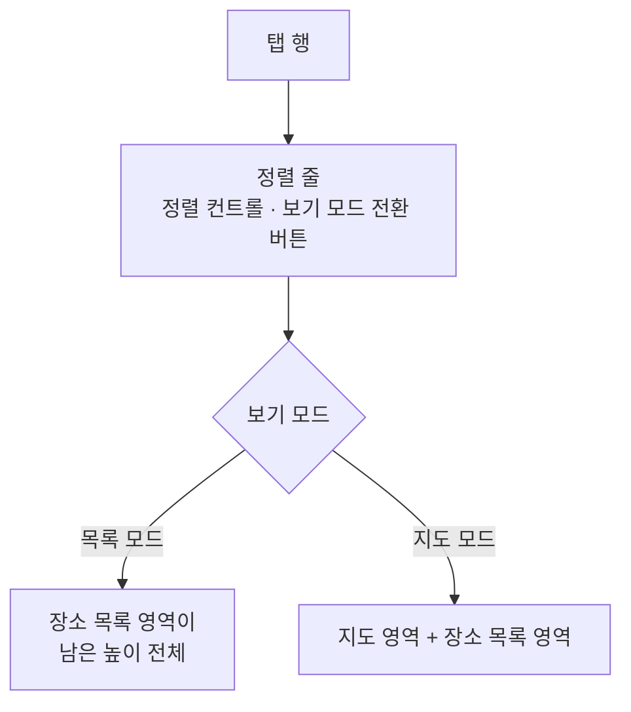

# TagDetail 장소 탭 디자인

기준 스펙: [TagDetail 장소 탭 스펙](../spec/tag-detail-place.md)

화면 전체의 구조, 상단 바, 탭 행, 페이지 전환과 떠 있는 버튼의 교체는 [TagDetail 화면 디자인](./tag-detail.md)이 소유한다. 탭 본문의 영역 분할과 적응형 배치, 보기 모드 전환 표현, 장소 격자와 장소 카드, 지도 핀, 정렬 줄과 빈 상태와 새로고침이 놓이는 자리는 [장소 보기 모드 디자인](./place-view-mode.md)이 소유한다. 이 문서는 장소 탭이 그 두 문서와 다르게 두는 것만 정한다.

## 탭 구성

장소 탭 본문은 정렬 줄과 장소 보기 모드 영역을 위에서부터 세로로 쌓는다. 메모 탭과 달리 목록 위에 완료된 항목으로 가는 진입 행을 두지 않는다. 장소에는 완료 여부가 없어 완료된 장소를 모아 보는 화면이 없기 때문이다.

장소 탭은 대상 태그의 조회 상태와 관계없이 같은 구성을 표시한다. 태그를 아직 조회하지 못해 상단 바에 제목이 없는 동안에도 정렬 줄과 본문은 같은 기준으로 표시한다.

## 정렬 줄의 자리

정렬 줄은 탭 줄 바로 아래, 장소 보기 모드 영역 위에 두고 두 보기 모드에서 같은 자리를 지킨다. 정렬 줄과 정렬 선택 Bottom Sheet의 구조, 조작, 아이콘과 문구는 [목록 정렬 디자인](./list-sort.md)을 따른다.

이 자리는 정렬 줄을 장소 목록 영역 안에 두는 [PlaceHome 화면 디자인](./place-home.md)과 다르다. 장소 탭은 보기 모드 전환 버튼을 정렬 줄에 두므로, 지도 모드에서 장소 목록 영역이 표시되지 않는 동안에도 사용자가 목록 모드로 되돌아갈 수 있어야 하기 때문이다. 정렬 줄을 지도 영역과 장소 목록 영역보다 위에 두면 두 영역의 표시 여부가 전환 버튼을 가리지 않는다.

정렬 컨트롤을 감추는지는 지금 보기 모드의 목록에 표시된 항목이 있는지로 정하며, 감추는 동안에도 보기 모드 전환 버튼은 [목록 정렬 디자인](./list-sort.md)의 `항목이 없는 동안의 정렬 줄`에 따라 같은 자리에 남는다.

정렬 줄은 보기 모드가 바뀌어도 자리를 옮기지 않으므로 [장소 보기 모드 디자인](./place-view-mode.md)의 교차 페이드에 포함되지 않는다. 정렬 줄 아래 영역만 교차 페이드로 바뀐다.

## 보기 모드 전환 버튼

보기 모드 전환 버튼은 정렬 줄의 끝 쪽, 정렬 컨트롤과 같은 줄에 둔다. 이 자리에 다른 목록으로 가는 진입 버튼을 두는 [TagDetail 메모 탭 디자인](./tag-detail-memo.md)과 같은 줄 구성을 쓰되, 장소 탭에는 진입 버튼이 없어 이 버튼만 둔다.

버튼은 아이콘만 표시하는 아이콘 버튼으로 두고 라벨은 두지 않는다. 버튼의 이름은 [아이콘 버튼 설명 디자인](./icon-button-tooltip.md)의 설명 표시와 접근성 이름으로 제공한다. 라벨을 두지 않는 것은 정렬 컨트롤이 이미 이름을 표시하고 있어 좁은 창에서 두 라벨이 폭을 다투면 정렬 이름이 줄임표로 줄기 때문이며, 이 버튼은 [PlaceHome 화면 디자인](./place-home.md)의 상단 바 전환 버튼과 같은 아이콘을 써서 사용자가 같은 아이콘으로 같은 동작을 알아본다.

버튼에 표시하는 아이콘, 전환할 때의 교차 페이드, 접근성 이름은 [장소 보기 모드 디자인](./place-view-mode.md)의 `보기 모드 전환 표현`과 `문구와 접근성`을 따른다. 색은 정렬 줄의 글자 버튼과 같은 색을 쓰고, 배경을 채운 버튼으로 두지 않는다.

버튼은 대상 태그의 조회 상태, 목록의 빈 상태, 지도의 표시 여부와 관계없이 같은 자리에 같은 모양으로 표시하며 비활성 표현을 사용하지 않는다.

다른 탭을 선택한 동안에는 그 탭의 본문이 표시되므로 이 버튼도 표시하지 않는다. 장소 탭으로 돌아오면 떠나기 전의 보기 모드를 가리키는 아이콘으로 다시 나타난다.

## 장소 추가

장소 추가는 [TagDetail 화면 디자인](./tag-detail.md)의 `떠 있는 버튼`에 따라 장소 탭을 선택한 동안 떠 있는 장소 추가 버튼으로 제공한다. 버튼에는 추가를 나타내는 플러스 아이콘을 쓰며, 이는 [PlaceHome 화면 디자인](./place-home.md)의 장소 추가 버튼과 같은 아이콘이다. 대상 태그의 완료 여부와 삭제 여부, 보기 모드는 이 버튼의 노출을 바꾸지 않는다.

장소 추가를 선택하면 PlaceAdd 화면을, 장소를 선택하거나 지도 핀을 누르면 PlaceDetail 화면을 표시한다. 두 화면은 창 너비와 관계없이 TagDetail 화면과 함께 배치하지 않고 단독으로 표시한다.

PlaceAdd 화면의 지도가 시작하는 위치는 [장소 보기 모드 디자인](./place-view-mode.md)이 기준으로 삼는 스펙을 따른다.

PlaceAdd 화면은 대상 태그를 태그 입력에 이미 고른 상태로 시작한다. 그 표현은 [항목 태그 입력 컴포넌트 디자인](./entity-tag-input.md)의 태그 칩을 따르며, 별도의 강조나 잠금 표시를 두지 않아 사용자가 그 태그를 해제할 수 있음을 드러낸다.

## 목록과 지도

장소 목록 영역의 격자와 장소 카드, 자리 표시 카드, 지도 영역과 지도 핀은 [장소 보기 모드 디자인](./place-view-mode.md)을 그대로 따르고, 격자와 핀에 넣는 장소만 대상 태그와 연결된 장소로 다르다.

카드에는 그 장소가 연결한 태그를 표시하지 않는다. 이 목록에 있는 장소는 모두 대상 태그와 연결되어 있어 태그 표시가 항목을 구분해 주지 않기 때문이다. 카드의 컬러 원형 표시와 지도 핀의 색은 장소 자신의 컬러를 그대로 쓰며 대상 태그의 컬러로 바꾸지 않는다.

목록의 스크롤 위치와 지도가 보고 있던 위치는 다른 탭에 다녀와도 그대로 유지한다.

## 새로고침

새로고침의 당김 자리와 진행 표시는 [장소 보기 모드 디자인](./place-view-mode.md)의 `새로고침`을 따른다.

목록 모드에서는 정렬 줄 아래 본문 전체에서 당길 수 있고, 지도 모드에서는 장소 목록 영역에서만 당길 수 있다. 정렬 줄 자체는 당김 컨테이너에 넣지 않으므로 정렬 줄을 아래로 끌어도 새로고침이 시작되지 않는다.

## 키보드 단축키

장소 탭을 선택한 동안 물리 키보드로 `Command + A`를 눌러 장소를 추가한다. 단축키 표는 [TagDetail 화면 디자인](./tag-detail.md)의 `키보드 단축키`가 소유한다.

보기 모드 전환에는 단축키를 두지 않는다. 키보드나 포인터를 사용하는 환경에서는 전환 버튼에 초점을 이동해 `Enter` 또는 `Space`로 실행한다.

다른 탭을 선택한 동안에는 이 단축키를 처리하지 않는다.

## 문구와 접근성

한국어 환경과 그 외 기본 환경에서는 다음 문구를 사용한다.

| 문구 | 한국어 | 그 외 기본 |
| --- | --- | --- |
| 추가 버튼 접근성 이름 | `장소 추가` | `Add place` |

보기 모드 전환 버튼의 접근성 이름은 [장소 보기 모드 디자인](./place-view-mode.md)의 문구 표가 소유한다. 장소 카드와 핀의 접근성 이름도 그 문서를 따른다. 빈 상태 문구는 [목록 빈 상태 디자인](./list-empty-state.md)의 문구 표가 소유한다.
