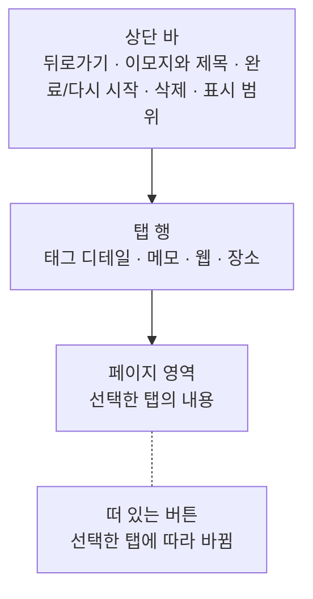
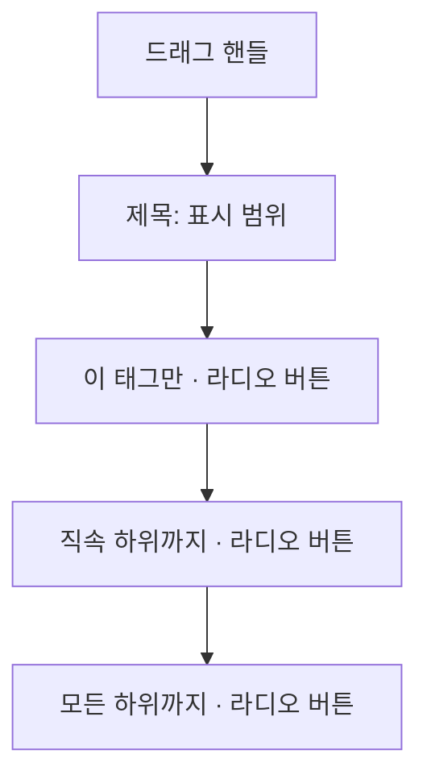

# TagDetail 화면 디자인

기준 스펙: [TagDetail 화면 스펙](../spec/tag-detail.md)

메모·웹·장소 탭 안의 목록, 빈 상태와 추가 동작의 표현은 각각 [TagDetail 메모 탭 디자인](./tag-detail-memo.md), [TagDetail 웹 탭 디자인](./tag-detail-web.md), [TagDetail 장소 탭 디자인](./tag-detail-place.md)이 소유한다.

## 화면 구조와 적응형 배치

TagHome에서 진입하면 넓은 화면에서는 태그 목록과 TagDetail 화면을 함께 표시하고, 좁은 화면에서는 TagDetail 화면만 표시한다. 함께 표시하는 방식은 [Tag 목록·상세 배치 디자인](./tag-list-detail.md)을 따른다.

메모 태그 입력처럼 태그 목록이 아닌 화면에서 진입한 TagDetail 화면은 창 너비와 관계없이 단독으로 표시한다.

화면은 위에서부터 상단 바, 탭 행, 페이지 영역을 세로로 쌓는다. 떠 있는 버튼과 스낵바는 페이지 영역 위에 겹쳐 표시하고 네 탭이 함께 사용한다.

## 상단 바

화면 상단에는 저장된 태그 이모지와 제목을 표시하는 상단 바를 둔다. 표시 형태는 [TagHome 목록 디자인](./tag-home.md)의 `이모지와 제목 표시`를 따른다. 뒤로가기 버튼은 TagDetail 화면을 단독 표시할 때와, 목록과 함께 표시하는 동안 다른 태그의 TagDetail 화면에서 이동해 온 경우에 표시한다. 목록에서 선택해 진입한 TagDetail 화면을 목록과 함께 표시하는 동안에는 표시하지 않는다.

상단 바의 태그 제목은 한 줄을 유지한다. 제목이 사용 가능한 폭을 넘으면 기본 이동 속도와 간격으로 가로 이동을 시작하고, 화면에 표시되는 동안 횟수 제한 없이 반복한다. 접근성에는 생략하지 않은 전체 제목을 제공한다.

조회가 완료되면 상단 바 끝 쪽에 완료 또는 다시 시작 버튼과 삭제 버튼을 순서대로 둔다. 두 버튼은 선택한 탭과 관계없이 같은 자리에 그대로 표시한다.

표시 범위 버튼은 그 뒤 상단 바 액션의 가장 끝에 둔다. 자세한 표현은 `표시 범위 진입`이 정한다.

상단 바에는 한 탭에서만 쓰는 동작을 두지 않는다. 완료된 메모 진입은 [TagDetail 메모 탭 디자인](./tag-detail-memo.md)이, 장소의 보기 모드 전환은 [TagDetail 장소 탭 디자인](./tag-detail-place.md)이 정하는 자리에 두고, 세 목록 탭은 상단 바에 동작을 더하지 않는다. 표시 범위는 세 목록 탭이 하나의 값을 함께 쓰는 화면 전체의 동작이므로 상단 바에 둔다.

단독 화면에서는 상단 바의 뒤로가기 버튼이나 시스템 뒤로가기를 사용하면 선택한 탭과 관계없이 진입하기 전 화면으로 돌아간다.

목록과 상세를 함께 표시하는 동안 목록에서 선택해 진입한 TagDetail 화면에서는 뒤로가기 버튼을 숨기고, 시스템 뒤로가기를 사용하면 상세 대상이 없는 상태로 되돌아간다. 다른 태그의 TagDetail 화면에서 이동해 온 TagDetail 화면에서는 뒤로가기 버튼을 단독 화면과 같은 자리에 같은 아이콘과 접근성 이름으로 표시하고, 버튼이나 시스템 뒤로가기를 사용하면 이전 태그의 상세로 돌아간다. 이때 목록 영역은 그대로 유지된다.

## 표시 범위 진입

표시 범위 버튼은 상단 바 액션의 가장 끝에 둔다. 버튼의 아이콘과 색, Bottom Sheet의 표시, 적응형 배치는 [필터 Bottom Sheet 디자인](./filter-bottom-sheet.md)을 따르므로, [TagHome 목록 디자인](./tag-home.md)과 [MemoHome 목록 디자인](./memo-home.md)의 필터 버튼과 같은 아이콘을 같은 자리에서 찾게 된다.

`이 태그만`을 고른 동안에는 적용되지 않은 상태로, `직속 하위까지`나 `모든 하위까지`를 고른 동안에는 적용된 상태로 본다. 어느 범위를 골랐는지는 아이콘으로 구분하지 않는다.

이 버튼은 선택한 탭과 관계없이 네 탭에서 같은 자리에 같은 모양으로 표시한다. 태그 디테일 탭에서도 감추지 않는 것은, 탭을 좌우로 밀며 오가는 동안 상단 바의 액션이 나타났다 사라져 자리가 흔들리지 않게 하기 위한 것이다.

완료 또는 다시 시작 버튼과 삭제 버튼이 조회가 끝나야 나타나는 것과 달리, 표시 범위 버튼은 태그 조회 상태와 관계없이 항상 표시한다. 세 목록 탭이 태그 조회 결과를 기다리지 않고 표시되기 때문이다.

버튼을 누르면 네 탭과 넓은 화면의 태그 목록 영역을 어둡게 처리한 배경 아래에 그대로 유지한 채 표시 범위 Bottom Sheet를 표시한다.

## 표시 범위 Bottom Sheet 구성

Bottom Sheet의 표시, 드래그 핸들과 제목의 배치, 바깥 영역·뒤로가기·아래 방향 드래그로 닫는 조작, 적응형 배치는 [필터 Bottom Sheet 디자인](./filter-bottom-sheet.md)의 `Bottom Sheet 표시`, `닫는 조작`, `적응형 배치`를 따른다.

제목에는 `표시 범위`를 사용한다. 제목 아래에는 세 범위를 위에서부터 `이 태그만`, `직속 하위까지`, `모든 하위까지` 순서로 한 줄씩 둔다. 좁은 범위부터 넓은 범위 순으로 놓아 처음 상태인 `이 태그만`이 첫 줄에 오게 한다.

각 줄에는 시작 쪽에 범위 이름, 끝 쪽에 선택 여부를 나타내는 라디오 버튼을 둔다. 지금 고른 범위의 줄만 선택 상태로 표시하며, 두 줄 이상이 동시에 선택 상태가 되지 않는다. 줄 앞에 아이콘은 두지 않는다.

각 줄에는 보조 문구를 두지 않는다. 이름만으로 얼마나 넓게 보는지 읽히고, 잘못 골라도 다시 고르면 되돌아오기 때문이다.

줄 전체가 하나의 누를 수 있는 대상이며, 줄을 누르면 그 범위로 바뀌고 Bottom Sheet가 곧바로 닫힌다. 이는 여러 필터를 이어서 바꾸도록 열린 상태를 유지하는 [필터 Bottom Sheet 디자인](./filter-bottom-sheet.md)의 `닫는 조작`과 다르며, 하나만 고르면 끝나는 선택이므로 [목록 정렬 디자인](./list-sort.md)의 `정렬 선택 Bottom Sheet`와 같은 기준을 쓴다.

지금 고른 범위와 같은 줄을 눌러도 Bottom Sheet는 닫히고, 세 목록은 그대로 둔다.

각 줄은 [공통 스타일](./styles.md)의 `Bottom Sheet 선택 줄`을 따른다. 내용은 좌우를 제목과 같은 자리에 맞추고, 누르는 동안 드러나는 배경은 그 여백을 넘어 Bottom Sheet의 좌우 끝까지 채운다.

## 표시 범위와 세 목록

범위를 바꾸면 메모·웹·장소 탭의 목록은 새 범위의 처음부터 다시 표시한다. 항목이 자리를 옮기는 이동 애니메이션은 두지 않고, 목록을 준비하는 동안의 표시는 [페이지 조회 목록의 자리 표시 디자인](./paged-list-placeholder.md)을 따른다.

지금 보고 있지 않은 탭의 목록도 같은 범위로 바뀌므로, 그 탭으로 옮기면 새 범위의 목록이 처음부터 보인다.

장소 탭에서 범위를 바꿔도 보기 모드와 지도가 보고 있던 위치, 확대 수준은 그대로 두고 목록과 핀만 새 범위의 장소로 바꾼다.

세 목록의 빈 상태 아이콘과 문구는 지금 고른 범위와 관계없이 각 탭 디자인이 정한 것을 그대로 쓴다. 표시할 항목이 없다는 사실은 같고, 범위를 넓혀 보라는 안내는 상단 바의 표시 범위 버튼이 이미 알리기 때문이다.

## 탭 행

상단 바 바로 아래에 탭 행을 둔다. 탭 행은 화면의 가로 폭을 모두 차지하고, 네 탭이 왼쪽부터 태그 디테일, 메모, 웹, 장소 순서로 폭을 균등하게 나눠 가진다. 탭 순서는 페이지 순서와 같게 둔다.

각 탭은 아이콘만 표시하고 라벨 문구는 두지 않는다. 탭이 넷으로 늘어도 아이콘만 두므로 좁은 창에서도 네 탭이 한 줄에 들어가며, 탭 행을 가로로 스크롤하게 만들거나 일부 탭을 더보기로 접지 않는다. 선택된 탭의 강조 표시는 Material 기본 탭 표현을 따른다.

각 탭은 그 탭이 다루는 대상을 가리키는 아이콘을 쓰고, 모두 앱의 다른 화면에서 같은 대상을 가리킬 때 쓰는 아이콘과 같다.

| 탭 | 아이콘 | 같은 아이콘을 쓰는 곳 |
| --- | --- | --- |
| 태그 디테일 | 태그 아이콘 | [TagHome 목록 디자인](./tag-home.md)의 주요 목적지 아이콘 |
| 메모 | 메모 아이콘 | [MemoHome 목록 디자인](./memo-home.md)의 메모 아이콘 |
| 웹 | 웹 아이콘 | [WebHome 화면 디자인](./web-home.md)이 웹을 가리킬 때 쓰는 아이콘 |
| 장소 | 장소 아이콘 | [목록 빈 상태 디자인](./list-empty-state.md)의 목록 모드 장소 목록 빈 상태 아이콘 |

탭 행은 태그 조회 상태와 관계없이 항상 같은 모양으로 표시하고, 비활성 표현을 사용하지 않는다.

## 페이지 전환

사용자는 다음 두 가지 방법으로 네 탭을 오간다.

- 탭 행에서 보고 싶은 탭을 선택한다. 페이지 영역이 선택한 탭으로 가로로 미끄러지며 전환된다. 떨어져 있는 탭을 선택해도 사이의 페이지를 하나씩 지나가지 않고 곧바로 그 탭으로 전환한다.
- 페이지 영역 위에서 좌우로 스와이프한다. 왼쪽으로 스와이프하면 오른쪽 탭으로, 오른쪽으로 스와이프하면 왼쪽 탭으로 한 칸 이동한다. 첫 탭에서 오른쪽으로, 마지막 탭에서 왼쪽으로 스와이프해도 반대쪽 끝으로 넘어가지 않는다.

이미 보고 있는 탭을 다시 선택하면 아무 변화도 일어나지 않는다.

선택된 탭 표시는 항상 보고 있는 페이지를 가리킨다. 스와이프하는 동안에는 손을 떼었을 때 도달할 페이지가 정해지는 시점에 선택된 탭 표시가 함께 바뀌고, 전환 애니메이션이 끝날 때까지 기다리지 않는다.

네 탭의 내용은 모두 세로로만 스크롤하므로 목록이나 폼 위에서 좌우로 스와이프해도 탭이 전환된다. 태그 디테일 탭의 태그 연결 입력도 좌우 스와이프를 가져가지 않는다.

## 태그 디테일 탭

본문에는 이모지 입력과 단일 줄 제목 입력을 한 행에 배치한 제목 행, 설명 입력, 컬러 입력과 태그 연결 입력을 순서대로 배치하고 각각 [공통 구성요소 간격](./dimens.md)을 둔다. 제목 행의 배치는 [TagAdd 화면 디자인](./tag-add.md)과 같고, 태그 연결 입력의 구성과 조작은 [태그 연결 입력 컴포넌트 디자인](./tag-link-input.md)을 따른다.

태그 연결 입력의 태그 칩을 선택하면 그 태그의 TagDetail 화면으로 이동한다. 목록과 상세를 함께 표시하는 동안에는 상세 자리를 선택한 태그로 바꾸고 목록은 그대로 두며, 이동한 화면의 상단 바에는 `상단 바`가 정한 뒤로가기 버튼을 표시해 이전 태그의 상세로 돌아올 수 있게 한다. 이동한 화면은 태그 디테일 탭이 선택된 상태로 시작한다.

## 떠 있는 버튼

떠 있는 버튼은 선택한 탭에 따라 하나만 표시한다.

| 선택한 탭 | 떠 있는 버튼 | 표시 조건 |
| --- | --- | --- |
| 태그 디테일 탭 | 수정 버튼 | 입력 내용과 저장 내용이 다를 때만 |
| 메모 탭 | 메모 추가 버튼 | 항상 |
| 웹 탭 | 웹 추가 버튼 | 항상 |
| 장소 탭 | 장소 추가 버튼 | 항상 |

수정 버튼이 나타나고 사라지는 표현은 [나타나고 사라지는 버튼 디자인](./button-visibility.md)을 따른다. 태그 연결과 해제는 저장된 연결에 곧바로 반영되므로 수정 버튼의 표시 여부를 바꾸지 않는다.

탭을 전환할 때도 같은 전환으로 이전 탭의 버튼이 사라지고 새 탭의 버튼이 나타난다. 태그 디테일 탭에서 수정 버튼을 표시하던 중 다른 탭으로 전환하면 수정 버튼이 사라지고 그 탭의 추가 버튼이 나타나며, 돌아오면 수정 버튼이 다시 나타난다.

메모·웹·장소 탭의 추가 버튼은 모두 같은 자리에 같은 플러스 아이콘으로 표시하고 접근성 이름만 다르다. 세 버튼의 모양과 접근성 이름은 [TagDetail 메모 탭 디자인](./tag-detail-memo.md), [TagDetail 웹 탭 디자인](./tag-detail-web.md), [TagDetail 장소 탭 디자인](./tag-detail-place.md)을 따른다. 목록 탭 사이를 오갈 때는 버튼이 사라졌다 나타나지 않고 아이콘을 그대로 둔 채 접근성 이름만 바뀐다.

## 표시 영역과 소프트 키보드

상단 바, 탭 행, 페이지 영역, 떠 있는 버튼과 스낵바는 상태 표시 영역, 시스템 탐색 영역과 카메라 컷아웃 등 기기가 가리는 영역을 침범하지 않게 배치한다.

소프트 키보드가 나타나면 이 요소들을 키보드 위 영역에 맞춰 배치한다. 태그 디테일 탭에서 입력 컴포넌트의 전체 높이가 표시 영역보다 크면 그 탭 안에서 세로로 스크롤할 수 있게 한다. 상단 바와 탭 행은 함께 스크롤되지 않고 자리를 지킨다. 키보드가 닫히면 원래 표시 영역으로 되돌린다.

## 상태 전환과 동작 표시

조회 중에는 태그 디테일 탭 본문에 로딩 진행 표시를 두고 이모지·제목·설명·컬러 입력과 태그 연결 입력, 수정·완료·삭제 버튼을 표시하지 않는다. 상단 바에도 이모지와 제목을 표시하지 않는다.

조회 중 상태와 내용 표시 상태는 서로 겹쳐 바뀌는 교차 전환을 사용한다. 이 전환은 태그 디테일 탭 안에서만 일어나고 상단 바, 탭 행과 메모·웹·장소 탭의 표시는 바꾸지 않는다.

조회 중에도 탭 행, 메모·웹·장소 탭과 상단 바의 표시 범위 버튼은 그대로 표시한다.

수정, 완료·다시 시작 또는 삭제를 처리하는 동안에는 해당 버튼의 아이콘을 진행 표시로 바꾼다.

삭제에 성공하면 TagDetail 화면을 단독 표시하던 경우에는 진입하기 전 화면으로 돌아가고, 목록과 상세를 함께 표시하던 경우에는 상세 대상이 없는 상태로 되돌아간다.

수정 성공 피드백은 스낵바로 표시한다. 스낵바는 네 탭이 함께 사용하므로 메모 탭에서 발생한 완료·삭제 피드백도 같은 자리에 표시한다.

## 키보드 단축키

물리 키보드 환경에서는 선택한 탭에 따라 다음 단축키를 제공한다.

| 선택한 탭 | 단축키 | 동작 |
| --- | --- | --- |
| 태그 디테일 탭 | `Command + Enter` | 수정 반영 |
| 메모 탭 | `Command + A` | 메모 추가 |
| 웹 탭 | `Command + A` | 웹 추가 |
| 장소 탭 | `Command + A` | 장소 추가 |

수정 단축키는 수정 버튼이 표시된 동안에만 처리한다. 세 목록 탭은 같은 `Command + A`를 쓰고 선택한 탭이 무엇을 추가할지 정한다. 한 번에 한 탭만 선택되므로 같은 단축키가 겹쳐 처리되지 않는다. 각 단축키의 처리 조건은 [TagDetail 메모 탭 디자인](./tag-detail-memo.md), [TagDetail 웹 탭 디자인](./tag-detail-web.md), [TagDetail 장소 탭 디자인](./tag-detail-place.md)의 `키보드 단축키`를 따른다.

## 문구와 접근성

탭은 아이콘만 표시하므로 각 탭 아이콘에 접근성 이름을 둔다. 선택된 탭은 선택 상태로 읽히게 한다.

표시 범위 버튼은 아이콘만 표시하므로 접근성 이름을 두고, 범위를 넓혀 둔 동안에는 적용되었음을 알리는 상태 설명을 함께 제공한다. Bottom Sheet의 각 줄은 범위 이름을 하나의 선택 대상으로 읽히게 하고, 지금 고른 범위인지는 라디오 버튼의 선택 상태로 알린다.

한국어 환경과 그 외 기본 환경에서는 다음 문구를 사용한다.

| 문구 | 한국어 | 그 외 기본 |
| --- | --- | --- |
| 태그 디테일 탭 접근성 이름 | `태그 디테일` | `Tag detail` |
| 메모 탭 접근성 이름 | `메모` | `Memo` |
| 웹 탭 접근성 이름 | `웹` | `Web` |
| 장소 탭 접근성 이름 | `장소` | `Place` |
| 뒤로가기 버튼 접근성 이름 | `뒤로가기` | `Navigate up` |
| 수정 버튼 접근성 이름 | `태그 수정` | `Update tag` |
| 완료 버튼 접근성 이름 | `태그 완료` | `Finish tag` |
| 다시 시작 버튼 접근성 이름 | `태그 다시 시작` | `Restart tag` |
| 삭제 버튼 접근성 이름 | `태그 삭제` | `Delete tag` |
| 표시 범위 버튼 접근성 이름 | `표시 범위` | `Display scope` |
| 표시 범위 적용 상태 접근성 설명 | `표시 범위 넓힘` | `Scope widened` |
| Bottom Sheet 제목 | `표시 범위` | `Display scope` |
| 이 태그만 이름 | `이 태그만` | `This tag only` |
| 직속 하위까지 이름 | `직속 하위까지` | `Direct children` |
| 모든 하위까지 이름 | `모든 하위까지` | `All descendants` |
| 수정 성공 안내 | `태그가 수정되었습니다.` | `Tag updated.` |
