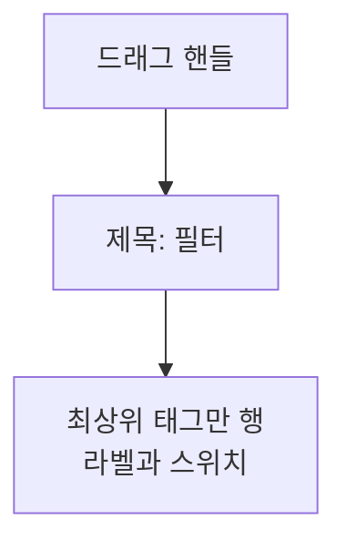

# TagHome 목록 디자인

기준 스펙: [TagHome 목록 스펙](../spec/tag-home.md)

## 이모지와 제목 표시

태그를 이름으로 보여 주는 곳에서는 저장된 이모지와 제목을 하나의 텍스트로 이어서 표시하고, 이모지와 제목 사이에 공백 하나를 둔다. 이모지에는 제목과 같은 글자 크기와 색을 사용하고 별도 배경이나 테두리를 두지 않는다.

이모지가 비어 있으면 앞의 공백 없이 제목만 표시한다.

이 표시는 태그 카드, [메모 태그 입력 컴포넌트 디자인](./memo-tag-input.md)의 태그 칩과 선택 목록 항목, [MemoHome 목록 디자인](./memo-home.md)과 [CalendarHome 디자인](./calendar-home.md)의 태그 필터 칩, [TagDetail 화면 디자인](./tag-detail.md)과 [TagMemoFinishedList 화면 디자인](./tag-memo-finished-list.md)의 상단 바 제목에 같은 형태로 적용한다.

태그 컬러로 채운 작은 원형 표시는 이모지 유무와 관계없이 그대로 유지한다.

## 상단 바 액션 배치

상단 바의 끝 쪽에는 검색 아이콘 버튼과 필터 아이콘 버튼을 이 순서로 나란히 배치한다. 검색 버튼을 액션의 첫 자리에 두고 필터 버튼을 가장 끝에 두는 것은 [MemoHome 목록 디자인](./memo-home.md)과 [PlaceHome 화면 디자인](./place-home.md)도 같으므로, 사용자는 어느 화면에서도 같은 자리에서 검색과 필터를 찾는다.

두 버튼 모두 아이콘만 표시하고 라벨은 표시하지 않는다. 완료된 태그 진입은 상단 바에 두지 않고 `완료된 태그 진입`의 자리에 둔다.

## 검색 진입

검색 아이콘 버튼에는 돋보기 아이콘을 표시하고 기본 상단 바 아이콘 색을 사용한다. 배지나 숫자는 표시하지 않는다.

버튼을 누르면 [SearchHome 화면](./search-home.md)을 창 너비와 관계없이 단독으로 표시하고, 태그 탭이 선택된 상태로 시작한다.

목록이 비어 있어도 버튼은 같은 모양으로 표시하며 비활성 표현을 사용하지 않는다.

## 완료된 태그 진입

목록 위 정렬 줄의 끝 쪽에 완료된 태그 진입 버튼을 둔다. 버튼의 해부구조, 자리와 폭, 상태, 조작과 접근성은 [목록 진입 버튼 디자인](./list-entry-button.md)을 따른다.

버튼의 라벨에는 `문구와 접근성`의 완료된 태그 진입 라벨을 쓴다.

버튼을 누르면 TagFinishedList 화면을 창 너비와 관계없이 단독으로 표시한다. 화면의 구조와 문구는 [TagFinishedList 화면 디자인](./tag-finished-list.md)을 따른다.

## 필터 진입

필터 아이콘 버튼은 상단 바의 가장 끝에 배치한다. 버튼의 아이콘과 색, Bottom Sheet의 표시, 항목 줄의 누름 표현, 닫는 조작, 필터 반영 전환, 적응형 배치는 [필터 Bottom Sheet 디자인](./filter-bottom-sheet.md)을 따른다.

최상위 태그만 보기가 꺼져 있으면 필터가 적용되지 않은 상태로, 켜져 있으면 적용된 상태로 본다.

필터 아이콘 버튼을 누르면 태그 격자와 넓은 화면의 상세 영역을 어둡게 처리한 배경 아래에 그대로 유지한 채 필터 Bottom Sheet를 표시한다.

## 필터 Bottom Sheet 구성

Bottom Sheet 제목에는 `필터`를 사용한다. 제목 아래에는 최상위 태그만 보기 한 항목만 배치하고, 항목을 담는 소제목이나 구분선은 두지 않는다.

항목은 한 행으로 표시한다. 행 왼쪽에 `최상위 태그만` 라벨을 두고, 오른쪽 끝에 켜짐과 꺼짐을 나타내는 스위치를 둔다. 라벨과 스위치 사이에는 남은 폭을 두어 스위치를 행의 끝에 붙인다.

행 전체를 하나의 조작 영역으로 제공해 라벨을 눌러도 켜짐과 꺼짐이 바뀌게 하고, 행은 최소 터치 크기를 유지한다. 스위치는 행과 따로 누르는 대상으로 두지 않는다. 행 안의 내용을 맞추는 좌우 자리와 누르는 동안 드러나는 배경의 범위는 [필터 Bottom Sheet 디자인](./filter-bottom-sheet.md)의 `항목 줄의 누름 표현`을 따른다. 스위치가 바뀌면 표시를 즉시 갱신하고 Bottom Sheet는 열린 상태를 유지한다. 스위치 전환의 시간과 곡선은 Material 기본 모션을 따르고 별도 수치를 정하지 않는다.

항목이 하나뿐이라 내용이 표시 영역을 넘지 않으므로 Bottom Sheet는 내용 높이에 맞춰 표시한다.

## 정렬 줄

정렬 줄은 상단 바 바로 아래, 태그 목록 위에 둔다. 완료된 태그 진입 버튼과 같은 줄을 쓰고 정렬 컨트롤을 시작 쪽에, 완료된 태그 진입 버튼을 끝 쪽에 둔다. 정렬 줄과 정렬 선택 Bottom Sheet의 구조, 조작, 아이콘과 문구는 [목록 정렬 디자인](./list-sort.md)을 따른다.

## 목록

각 태그는 카드로 표시한다. 카드에는 태그 이모지와 제목을 표시하고 그 왼쪽에는 저장된 컬러로 채운 작은 원형 표시를 둔다.

태그 이모지와 제목은 한 줄을 유지한다. 이모지와 제목이 카드에서 사용할 수 있는 폭을 넘으면 기본 이동 속도와 간격으로 가로 이동을 시작하고, 카드가 표시되는 동안 횟수 제한 없이 반복한다. 접근성에는 생략하지 않은 전체 내용을 제공한다.

이 카드는 [TagFinishedList 화면 디자인](./tag-finished-list.md)의 목록과 [SearchHome 화면 디자인](./search-home.md)의 태그 결과에도 같은 형태로 쓴다. 아래의 2열 격자 배치는 이 화면의 결정이므로 함께 가져가지 않는다.

카드는 화면 너비와 관계없이 한 행에 두 개씩 표시되는 2열 고정 그리드로 배치하고, 카드 사이에는 가로와 세로로 각각 [공통 항목 간격](./dimens.md)을 둔다.

아직 준비되지 않은 자리에는 [페이지 조회 목록의 자리 표시 디자인](./paged-list-placeholder.md)에 따라 자리 표시 카드를 표시한다. 이 목록의 자리 표시 카드는 컬러 원형 표시와 이모지·제목을 비워 둔다.

표시할 태그가 하나도 없으면 격자 자리에 [목록 빈 상태 디자인](./list-empty-state.md)의 빈 상태를 표시한다.

빈 상태의 아이콘과 문구는 필터를 적용해 두었는지에 따라 달라진다. 필터 적용 여부의 기준은 `필터 진입`에서 필터 아이콘 버튼을 주요 색으로 표시하는 기준과 같다.

| 상태 | 아이콘 | 제목 문구 |
| --- | --- | --- |
| 필터 아이콘이 기본 색인 상태 | 태그 아이콘 | `아직 태그가 없습니다` |
| 필터 아이콘이 주요 색인 상태 | 필터 아이콘 | `최상위 태그가 없습니다` |

두 빈 상태 사이의 전환과 격자와의 전환, 정확한 문구는 [목록 빈 상태 디자인](./list-empty-state.md)을 따른다.

빈 상태에서도 상단 바의 검색 버튼과 필터 버튼, 정렬 줄의 완료된 태그 진입 버튼, 떠 있는 태그 추가 버튼은 같은 자리에 그대로 표시한다.

## 카드 조작

카드에는 선택 조작만 둔다. 카드를 누르면 [TagDetail 화면 디자인](./tag-detail.md)으로 이동하고, 완료와 삭제는 그 화면의 상단 바 버튼으로 실행한다. 목록에서는 스와이프를 비롯한 별도 제스처를 제공하지 않는다.

## 문구와 접근성

한국어 환경과 그 외 기본 환경에서는 다음 문구를 사용한다.

| 문구 | 한국어 | 그 외 기본 |
| --- | --- | --- |
| 검색 버튼 접근성 이름 | `검색` | `Search` |
| 완료된 태그 진입 라벨 | `완료된 태그` | `Finished tags` |
| 필터 버튼 접근성 이름 | `필터` | `Filter` |
| 필터 적용 상태 접근성 설명 | `필터 적용됨` | `Filter applied` |
| Bottom Sheet 제목 | `필터` | `Filter` |
| 최상위 태그만 라벨 | `최상위 태그만` | `Top-level tags only` |

최상위 태그만 행은 라벨과 스위치를 하나의 묶음으로 읽어 라벨 문구가 스위치의 이름이 되게 하고, 켜짐과 꺼짐은 스위치의 기본 상태 표현으로 전달한다. 라벨 밖에 별도의 설명 문구는 두지 않는다.
