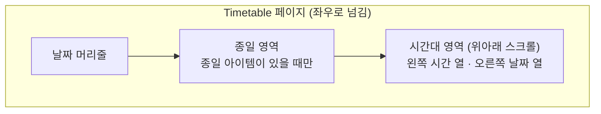

# Timetable 컴포넌트 디자인

기준 스펙: [Timetable 컴포넌트 스펙](../spec/client/timetable.md)

## 구조

Timetable은 배치된 영역 전체를 좌우로 넘기는 페이지로 채운다. 페이지 하나는 위에서부터 날짜 머리줄, 종일 영역, 시간대 영역으로 이루어진다.

날짜 머리줄과 종일 영역의 왼쪽에는 시간 열과 같은 너비의 빈 자리를 두어, 날짜 열이 시간대 영역의 날짜 열과 세로로 정렬되게 한다.

하루 형식은 날짜 열 하나가 시간 열을 뺀 너비를 모두 차지한다. 주간 형식은 일요일부터 토요일까지 일곱 날짜 열이 같은 너비로 나누어 차지한다. 창이 넓어지면 날짜 열이 넓어지고, 한 시간 높이와 시간 열 너비는 바뀌지 않는다.

## 날짜 머리줄

날짜 머리줄은 날짜 열마다 위에서부터 요일과 일을 가운데 정렬해 표시한다.

- 요일은 Material 3의 작은 레이블 강조 글자 스타일로 표시하고, 문구와 색은 [Calendar 컴포넌트 디자인](calendar.md)의 요일 표시와 요일 색상을 따른다.
- 일은 Material 3의 제목 중간 글자 스타일로 표시하고, 색은 요일 색상을 따른다.
- 주요 날짜의 일은 [CalendarWeekOfMonth 컴포넌트 디자인](calendar-week-of-month.md)의 주요 날짜 강조와 같이 주 색상 원형 배경 위에 그 위에서 읽기 좋은 글자색으로 표시한다. 원형 배경은 지름 `32dp`다.

날짜 머리줄 아래에는 가로 구분선을 둔다.

## 종일 영역

종일 영역은 날짜 머리줄 아래에 두고, 스펙의 종일 영역 배치에 따라 아이템을 줄마다 놓는다. 각 아이템은 차지하는 날짜 열에 걸쳐 가로로 이어지고, 아이템의 모양은 배치하는 화면이 정한다.

영역의 네 가장자리 안쪽 여백과 아이템 사이 가로세로 간격에는 [공통 여백과 간격](dimens.md)의 `캘린더 아이템 간격`을 쓴다. 날짜 열 사이의 간격은 양쪽 아이템이 절반씩 나누어 가져 날짜 열 경계가 시간대 영역의 날짜 열과 맞는다.

종일 영역은 아이템 줄 수만큼 늘어나되 최대 `72dp`까지 늘어난다. 이는 한 줄짜리 글 아이템 세 줄이 들어가는 높이다. 줄이 더 많으면 영역 높이를 `72dp`로 고정하고 영역 안에서 세로로 스크롤한다.

종일 아이템이 없는 페이지에서는 영역을 두지 않고, 날짜 머리줄 바로 아래 구분선에 이어 시간대 영역을 둔다. 종일 영역 아래에도 가로 구분선을 둔다.

## 시간대 영역

시간대 영역은 한 시간 높이를 `48dp`로 하는 24시간을 위아래로 스크롤해 보여 준다. 시간 열과 날짜 열은 함께 스크롤한다.

Timetable이 처음 표시되면 오전 8시 위치가 시간대 영역 맨 위에 오도록 스크롤해 둔다. 좌우로 넘길 때 새로 보이는 페이지는 넘기기 직전 페이지의 스크롤 위치에서 시작한다.

### 시간 열

시간 열은 너비 `56dp`다. 1시부터 23시까지 각 시각의 안내를 그 시각의 가로 구분선 높이에 세로 가운데를 맞추어 오른쪽 정렬로 표시하고, 오른쪽 끝과 날짜 열 사이에 `8dp`를 둔다. 0시 안내는 영역 맨 위에 걸려 잘리므로 표시하지 않는다.

시각 안내는 Material 3의 작은 레이블 글자 스타일과 보조 글자색으로 표시한다. 문구는 `문구`를 따른다.

### 시간 구분선

날짜 열 영역에는 한 시간마다 가로 구분선을 긋고, 시간 열과 첫 날짜 열 사이와 날짜 열 사이에는 세로 구분선을 긋는다. 구분선은 화면 테마의 옅은 외곽선 색을 쓴다.

### 시각 아이템

시각 아이템은 날짜 열 안에서 차지하는 시간대의 시작 높이부터 끝 높이까지를 채운다. 스펙의 최소 길이 30분은 `24dp`에 해당한다. 아이템 안의 모양은 배치하는 화면이 정한다.

스펙의 시각 아이템 배치에 따라 나란히 놓인 아이템 사이와 아이템의 오른쪽 끝에는 `2dp` 간격을 두어 이웃 아이템과 날짜 열 경계를 구분한다. 아이템의 위아래에는 `1dp` 간격을 두어 이어지는 아이템끼리 붙어 보이지 않게 한다.

### 현재 시각 표시

현재 시각이 속한 날짜 열에는 현재 시각 높이에 주 색상의 `2dp` 가로선을 날짜 열 너비 전체에 긋고, 선의 왼쪽 끝에 지름 `8dp`의 주 색상 원을 둔다. 현재 시각 표시는 시각 아이템 위에 그린다.

## 날짜 이동 조작

페이지를 좌우로 스와이프하면 스펙의 날짜 이동을 실행한다. 페이지는 스와이프를 따라 움직이며, 손을 떼면 이웃 페이지로 넘어가거나 제자리로 돌아간다. 날짜 머리줄, 종일 영역, 시간대 영역은 한 페이지로 함께 움직인다.

이동 범위의 처음 페이지에서 이전 방향으로 스와이프하면 페이지가 넘어가지 않는다.

배치하는 화면이 이동을 요청하면 스와이프와 같은 페이지 전환으로 이동한다.

## 빈 시간표

아이템이 없을 때는 진행 표시나 안내 문구 없이 날짜 머리줄과 빈 시간대 영역을 그대로 보여 준다.

## 문구

시간 열의 시각 안내는 사용자의 언어에 맞게 다음과 같이 표시한다.

| 시각 | 한국어 | 그 외 기본 |
| --- | --- | --- |
| 1시부터 11시 | `오전 {시}시` | `{시} AM` |
| 12시 | `오후 12시` | `12 PM` |
| 13시부터 23시 | `오후 {시 - 12}시` | `{시 - 12} PM` |

요일 문구는 [Calendar 컴포넌트 디자인](calendar.md)의 요일 표시와 같다.
