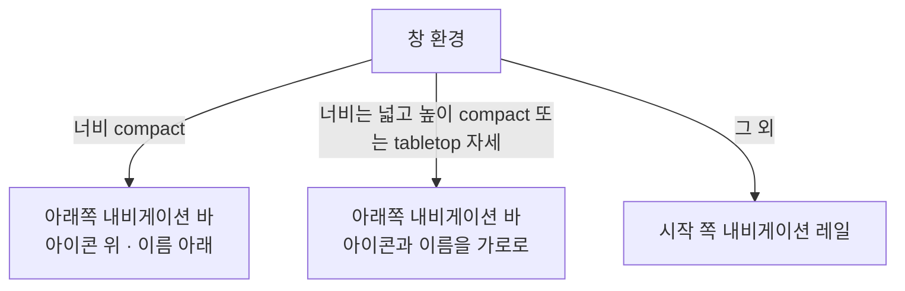

# TopLevelNavigation 디자인

기준 스펙: [TopLevelNavigation 스펙](../spec/top-level-navigation.md)

## 적응형 내비게이션

창 너비가 compact이면 화면 아래쪽에 내비게이션 바를 두고, 각 목적지의 아이콘 위에 이름을 얹는다.

창 너비가 compact보다 넓고 창 높이가 compact이거나 기기가 tabletop 자세이면 같은 자리에 내비게이션 바를 두되 아이콘과 이름을 가로로 나란히 둔다. 세로로 쓸 수 있는 높이가 좁은 환경에서 내비게이션이 본문 높이를 덜 가져가게 한다.

그 외 환경에서는 화면 시작 쪽에 내비게이션 레일을 둔다.

내비게이션 바와 레일의 높이·너비, 선택 표시 모양, 항목 사이 간격은 Material 3 기본값을 그대로 사용하고 별도 수치를 정하지 않는다.

실행 중 창 환경이 바뀌면 내비게이션 형태도 해당 환경에 맞게 바꾼다.

## 세부 화면에서의 노출

`더보기` 목적지의 메뉴에서 진입한 세부 화면을 표시하는 동안에는 공통 내비게이션 영역을 감춘다. 뒤로가기로 `더보기` 화면에 돌아가면 공통 내비게이션 영역을 다시 표시한다.

## 목적지 표시

공통 내비게이션에는 기준 스펙의 주요 목적지를 정해진 순서대로 아이콘과 이름으로 표시한다.

현재 목적지는 아이콘 뒤에 놓이는 선택 표시로 구분한다.

목적지 이름은 선택 여부와 관계없이 모두 표시한다. 아이콘만 놓인 자리를 남기지 않아 사용자가 어디로 가는 목적지인지 아이콘 모양을 익히지 않고도 읽을 수 있게 한다.

각 목적지 아이콘에는 사용자 언어에 맞는 접근성 이름을 제공한다.

## 키보드 단축키

공통 내비게이션이 표시되는 동안 다음 단축키를 제공한다.

주요 목적지 단축키는 공통 내비게이션을 표시하는 동안에만 처리한다.

| 단축키 | 목적지 |
| --- | --- |
| `Command + 1` | `메모` |
| `Command + 2` | `태그` |
| `Command + 3` | `캘린더` |
| `Command + 4` | `루틴` |
| `Command + 5` | `더보기` |

## 문구와 접근성

한국어 환경에서는 목적지 이름과 아이콘의 접근성 이름을 `메모`, `태그`, `캘린더`, `루틴`, `더보기`로 제공한다.

그 외 기본 환경에서는 `Memo`, `Tag`, `Calendar`, `Routine`, `More`로 제공한다.

## 참고

- [Build adaptive navigation](https://developer.android.com/develop/adaptive-apps/guides/build-adaptive-navigation)
- [NavigationSuiteScope](https://developer.android.com/reference/kotlin/androidx/compose/material3/adaptive/navigationsuite/NavigationSuiteScope)
