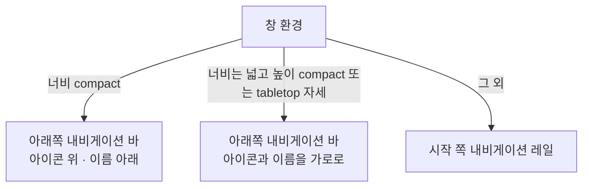
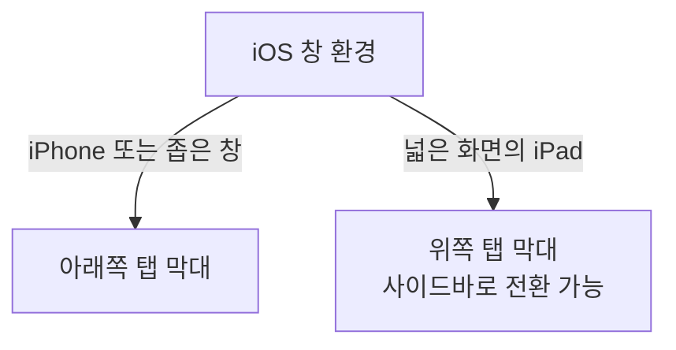

# TopLevelNavigation 디자인

기준 스펙: [TopLevelNavigation 스펙](../spec/client/top-level-navigation.md)

## 적응형 내비게이션

이 절은 Android, 데스크톱, 웹의 형태를 정한다. iOS는 `iOS 내비게이션`을 따른다.

```mermaid
flowchart TD
    start["창 환경"] -- "너비 compact" --> bottomTop["아래쪽 내비게이션 바<br/>아이콘 위 · 이름 아래"]
    start -- "너비는 넓고 높이 compact 또는 tabletop 자세" --> bottomStart["아래쪽 내비게이션 바<br/>아이콘과 이름을 가로로"]
    start -- "그 외" --> rail["시작 쪽 내비게이션 레일"]
```

창 너비가 compact이면 화면 아래쪽에 내비게이션 바를 두고, 각 목적지의 아이콘 위에 이름을 얹는다.

창 너비가 compact보다 넓고 창 높이가 compact이거나 기기가 tabletop 자세이면 같은 자리에 내비게이션 바를 두되 아이콘과 이름을 가로로 나란히 둔다. 세로로 쓸 수 있는 높이가 좁은 환경에서 내비게이션이 본문 높이를 덜 가져가게 한다.

그 외 환경에서는 화면 시작 쪽에 내비게이션 레일을 둔다.

내비게이션 바와 레일의 높이·너비, 선택 표시 모양, 항목 사이 간격은 Material 3 기본값을 그대로 사용하고 별도 수치를 정하지 않는다.

실행 중 창 환경이 바뀌면 내비게이션 형태도 해당 환경에 맞게 바꾼다.

## iOS 내비게이션

iOS에서는 공통 내비게이션을 시스템이 제공하는 탭 표시로 보여 주고, 형태와 표현은 시스템 디자인을 따른다.

```mermaid
flowchart TD
    start["iOS 창 환경"] -- "iPhone 또는 좁은 창" --> tabBar["아래쪽 탭 막대"]
    start -- "넓은 화면의 iPad" --> top["위쪽 탭 막대<br/>사이드바로 전환 가능"]
```

iPhone과 좁은 창에서는 화면 아래쪽에 탭 막대를 둔다. 넓은 화면의 iPad에서는 화면 위쪽에 탭 막대를 두고, 탭 막대의 사이드바 버튼으로 시작 쪽 사이드바와 전환한다. 실행 중 창 환경이 바뀌면 시스템이 형태를 바꾼다.

탭 막대와 사이드바의 크기, 모양, 재질, 선택 표시, 이름의 글꼴, 항목 사이 간격은 시스템 기본값을 따르고 별도 수치를 정하지 않는다. 대비 증가, 투명도 줄이기처럼 사용자가 기기에서 고른 표시 설정도 시스템이 반영한다.

앱이 정하는 것은 다음 두 가지다.

| 요소 | 표현 |
| --- | --- |
| 선택 색 | 현재 목적지의 아이콘과 이름을 앱 테마의 주 색으로 칠한다. 어두운 테마에서는 어두운 테마의 주 색을 쓴다. |
| 목적지 아이콘 | 다른 플랫폼과 같은 목적지 아이콘을 24pt 크기로 쓴다. 아이콘 색은 선택 여부와 표시 설정에 따라 시스템이 칠한다. |

넓은 화면 iPad의 위쪽 탭 막대는 시스템 기본대로 목적지 이름만 표시하고, 사이드바는 아이콘과 이름을 함께 표시한다.

화면 내용은 탭 막대가 차지하는 자리를 피해 배치한다. 아래쪽 탭 막대 위로 화면의 버튼과 목록 끝이 놓이고, 위쪽 탭 막대 아래부터 화면 내용이 시작한다.

`세부 화면에서의 노출`에서 공통 내비게이션 영역을 감출 때는 탭 막대를 시스템 기본 움직임으로 감추고, 다시 표시할 때도 시스템 기본 움직임을 쓴다.

기준 스펙의 `공통 내비게이션 편집`은 사이드바의 편집 버튼으로 시작한다. 편집 중에는 탭 막대 안에서 목적지를 끌어 놓아 순서를 바꾼다. 목적지를 탭 막대 밖으로 끌어내도 빠지지 않고 제자리로 돌아간다. 편집 화면의 안내 문구와 버튼은 시스템 기본을 쓴다. 시스템이 편집 버튼을 두지 않는 iPhone과 좁은 창에서는 편집을 제공하지 않는다. 순서를 바꾼 뒤 창 크기가 바뀔 때 탭 막대와 사이드바에 놓이는 순서도 시스템 기본을 따른다.

## 세부 화면에서의 노출

`더보기` 목적지의 메뉴에서 진입한 세부 화면을 표시하는 동안에는 공통 내비게이션 영역을 감춘다. 뒤로가기로 `더보기` 화면에 돌아가면 공통 내비게이션 영역을 다시 표시한다.

## 목적지 표시

공통 내비게이션에는 기준 스펙의 주요 목적지를 정해진 순서대로 아이콘과 이름으로 표시한다. 넓은 화면 iPad의 위쪽 탭 막대는 `iOS 내비게이션`대로 이름만 표시한다.

현재 목적지는 아이콘 뒤에 놓이는 선택 표시로 구분한다. iOS는 시스템 기본 선택 표시를 쓴다.

목적지 이름은 선택 여부와 관계없이 모두 표시한다. 아이콘만 놓인 자리를 남기지 않아 사용자가 어디로 가는 목적지인지 아이콘 모양을 익히지 않고도 읽을 수 있게 한다.

각 목적지 아이콘에는 사용자 언어에 맞는 접근성 이름을 제공한다.

## 현재 목적지 다시 선택

기준 스펙의 `현재 목적지 다시 선택`을 실행하는 조작은 선택 표시가 놓인 목적지 항목을 다시 누르는 것이다. 내비게이션 바와 레일, iOS의 탭 막대와 사이드바에서 같으며, 다시 누를 수 있다는 것을 알리는 별도 표시는 두지 않는다. `키보드 단축키`로 현재 목적지를 다시 부르는 것도 같은 조작으로 본다.

다시 선택해도 목적지 항목의 선택 표시, 아이콘, 이름과 접근성 이름은 바뀌지 않는다. 돌아간 결과를 알리는 스낵바나 별도 안내도 두지 않는다. 사용자는 화면이 돌아가는 움직임으로 결과를 확인한다.

### 목록이 돌아가는 움직임

`메모`, `태그`, `루틴`의 목록은 첫 항목까지 스크롤 애니메이션으로 이동해 어디에서 올라왔는지 보여 준다. 사용자가 보던 목록이 그대로 있고 보는 자리만 옮기는 것이므로, 움직임을 보여 주어야 방금 누른 조작의 결과임을 알 수 있다.

정렬이나 필터를 바꿨을 때 목록이 애니메이션 없이 첫 항목에 놓이는 것과는 기준이 다르다. 그때는 목록 자체가 새 결과로 바뀌어 따라갈 이전 자리가 없다. 그 기준은 [목록 정렬 디자인](./list-sort.md)의 `전환`과 [필터 Bottom Sheet 디자인](./filter-bottom-sheet.md)의 `필터 반영 전환`이 소유한다.

이미 첫 항목을 보고 있으면 아무 움직임도 일어나지 않는다.

### 캘린더가 돌아가는 움직임

`캘린더`는 오늘 버튼을 눌렀을 때와 같은 달 이동 움직임을 쓴다. 그 움직임은 [CalendarHome 디자인](./calendar-home.md)의 `달 이동 조작`을 따른다.

### 이어진 화면을 닫을 때

목적지 화면 위에 열려 있던 화면을 닫는 전환은 그 화면에서 뒤로갈 때와 같은 전환을 쓴다. 닫기와 돌아가기를 한 번에 보여 주지 않으므로 이때 목록이나 달이 움직이지는 않는다.

## 키보드 단축키

공통 내비게이션이 표시되는 동안 다음 단축키를 제공한다.

주요 목적지 단축키는 공통 내비게이션을 표시하는 동안에만 처리한다.

단축키는 목적지에 고정되어 있어, iOS에서 사용자가 목적지 순서를 바꿔도 같은 목적지를 부른다.

| 단축키 | 목적지 |
| --- | --- |
| `Command + 1` | `메모` |
| `Command + 2` | `태그` |
| `Command + 3` | `캘린더` |
| `Command + 4` | `루틴` |
| `Command + 5` | `더보기` |

## 문구와 접근성

한국어 환경에서는 목적지 이름과 아이콘의 접근성 이름을 `메모`, `태그`, `캘린더`, `루틴`, `더보기`로 제공한다.

그 외 기본 환경에서는 `Memo`, `Tag`, `Calendar`, `Routine`, `More`로 제공한다.

## 참고

- [Build adaptive navigation](https://developer.android.com/develop/adaptive-apps/guides/build-adaptive-navigation)
- [NavigationSuiteScope](https://developer.android.com/reference/kotlin/androidx/compose/material3/adaptive/navigationsuite/NavigationSuiteScope)
- [Human Interface Guidelines: Tab bars](https://developer.apple.com/design/human-interface-guidelines/tab-bars)
- [Elevating your iPad app with a tab bar and sidebar](https://developer.apple.com/documentation/uikit/elevating-your-ipad-app-with-a-tab-bar-and-sidebar)
