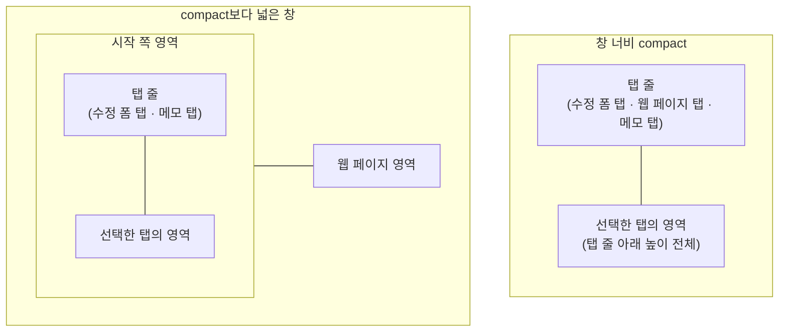
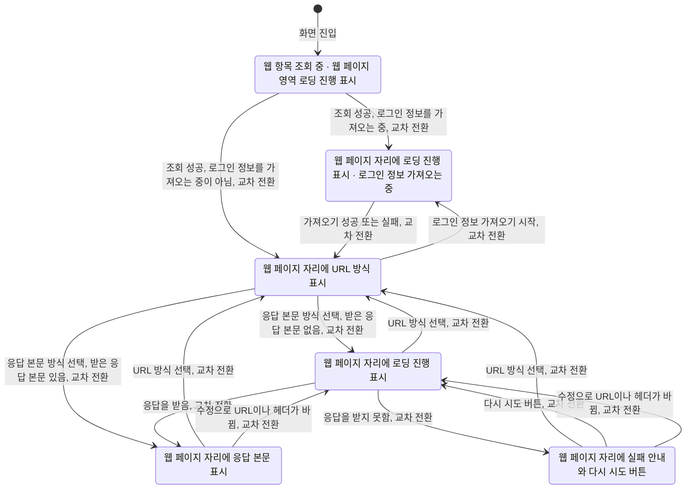

# WebDetail 화면 디자인

기준 스펙: [WebDetail 화면 스펙](../spec/client/web-detail.md)

## 화면 구조

WebDetail 화면은 WebHome, [SearchHome 화면](./search-home.md), [TagDetail 웹 탭](./tag-detail-web.md), 메모의 웹 입력에서 이어지는 세부 화면으로 단독 표시하며, 공통 내비게이션 영역은 [TopLevelNavigation 디자인](./top-level-navigation.md)에 따라 숨긴다. WebDetail은 [Web 목록·상세 배치 디자인](./web-list-detail.md)의 상세 영역에 두지 않으므로 창 너비와 관계없이 진입한 화면과 함께 표시하지 않는다. 어느 화면에서 들어와도 화면 구조와 표현은 같다.

화면 상단에는 저장된 웹 제목과 뒤로가기 동작이 있는 상단 바를 둔다. 조회가 완료되면 상단 바 끝 쪽에 외부로 열기 버튼과 삭제 버튼을 이 순서로 둔다. 두 버튼은 선택한 탭과 관계없이 같은 자리에 그대로 표시하며, 상단 바에는 한 탭에서만 쓰는 동작을 두지 않는다. 되돌릴 수 없는 삭제를 모서리에 고정해 두어 다른 액션이 늘어도 삭제 버튼의 자리가 바뀌지 않게 한다. 이는 [PlaceDetail 화면 디자인](./place-detail.md)의 상단 바 액션 배치와 같은 기준이다.

상단 바에는 수정 동작을 실행하는 컨트롤을 두지 않는다. 수정은 `수정 버튼`에 따라 수정 폼 영역 안에 떠 있는 버튼으로 제공해 웹 페이지 영역을 가리지 않게 한다.

상단 바의 웹 제목은 한 줄을 유지한다. 제목이 사용할 수 있는 폭을 넘으면 기본 이동 속도와 간격으로 가로 이동을 시작하고, 화면에 표시되는 동안 횟수 제한 없이 반복한다. 접근성에는 생략하지 않은 전체 제목을 제공한다. 이는 [WebHome 화면 디자인](./web-home.md)의 웹 카드 제목과 같은 기준이다.

본문은 수정 폼 영역, 웹 페이지 영역, 메모 영역 셋으로 나눈다. 세 영역의 배치는 `적응형 배치`를 따른다. 웹 페이지 영역 안에는 `표시 방식 줄`을 맨 위에 두고 그 아래에 웹 페이지를 둔다. 메모 영역 안의 정렬 줄, 목록, 빈 상태, 완료·삭제 제스처와 피드백, 새로고침의 표현은 [항목 상세 메모 탭 공통 디자인](./entity-detail-memo.md)을 따르고, 이 문서는 메모 영역이 놓이는 자리와 `메모 추가 버튼`만 정한다. 이 목록의 빈 상태 문구는 [목록 빈 상태 디자인](./list-empty-state.md)의 문구 표가 `WebDetail 메모 탭의 웹 항목별 메모 목록`으로 정한다.

메모 영역에서 이동한 MemoAdd 화면과 MemoDetail 화면은 창 너비와 관계없이 단독으로 표시한다.

## 적응형 배치

창 너비가 compact이면 상단 바 바로 아래에 세 탭이 있는 탭 줄을 두고, 선택한 탭의 영역 하나만 탭 줄 아래 본문을 모두 차지한다. 영역을 위아래로 함께 두지 않는다. 좁은 폭에서 영역을 나눠 쓰면 요청 헤더 입력과 응답 본문, 메모 목록 어느 쪽도 충분한 높이를 갖지 못하기 때문이다.

창 너비가 compact보다 넓으면 본문을 좌우로 나눠 시작 쪽 영역과 웹 페이지 영역을 둔다. 시작 쪽 영역에는 수정 폼 탭과 메모 탭 두 탭이 있는 탭 줄을 맨 위에 두고 그 아래에 선택한 탭의 영역을 둔다. 웹 페이지 영역은 끝 쪽에 탭 줄 없이 둔다. 웹 페이지를 항상 보이는 자리에 두는 것은, 웹 표시 수단이 화면에서 빠지면 `탭 줄`이 정한 대로 문서를 처음부터 다시 그리기 때문이다. 시작 쪽 영역과 웹 페이지 영역의 너비 비율은 1:1이며 사용자가 비율을 바꾸는 핸들은 두지 않는다. 두 영역 모두 본문 높이 전체를 채운다.

배치를 가르는 기준은 창 너비 하나이며, 창 높이는 배치를 바꾸지 않는다.

배치가 바뀌어도 수정 폼 영역의 입력 내용과 보고 있던 자리, 메모 영역의 목록 위치는 그대로 둔다. compact보다 넓은 창에서 좁아지면 마지막으로 선택했던 탭을 보여 주고, 아직 탭을 고른 적이 없으면 `탭 줄`의 처음 선택을 따른다. compact에서 넓어질 때 메모 탭을 보고 있었으면 시작 쪽 영역에 메모 탭을, 그 밖의 탭을 보고 있었으면 수정 폼 탭을 보여 준다.

## 탭 줄

탭 줄은 탭들이 가로 폭을 균등하게 나눠 갖는 한 줄로 둔다. 창 너비가 compact이면 시작 쪽부터 수정 폼 탭, 웹 페이지 탭, 메모 탭 순서로 세 탭을, compact보다 넓으면 시작 쪽 영역 안에 수정 폼 탭, 메모 탭 순서로 두 탭을 둔다. 탭 줄은 상단 바 바로 아래에 고정하며 영역 안의 내용을 스크롤해도 사라지지 않는다.

각 탭에는 아이콘만 두고 글자 라벨은 두지 않는다. 아이콘만으로 구분되므로 탭 줄이 본문 높이를 적게 가져가게 한다. 어느 탭인지는 `문구와 접근성`의 접근성 이름으로 구분한다.

수정 폼 탭에는 연필 모양의 편집 아이콘을, 웹 페이지 탭에는 지구본 모양의 웹 아이콘을, 메모 탭에는 메모 아이콘을 쓴다. 웹 아이콘은 [WebHome 화면 디자인](./web-home.md)이 웹을 가리킬 때 쓰는 아이콘과 같고, 메모 아이콘은 [MemoHome 목록 디자인](./memo-home.md)의 메모 아이콘과 같다.

선택한 탭은 선택 표시로 구분하고, 선택이 바뀔 때 선택 표시가 새 탭 자리로 이동한다. 탭을 바꿀 때 영역 사이는 교차 전환을 쓴다. 영역 위에서 좌우로 스와이프해도 탭은 바뀌지 않는다. 웹 페이지 영역은 가로 스크롤을 자체로 받기 때문이다.

화면에 처음 들어오면 compact에서는 웹 페이지 탭을 선택한 상태로 시작해 사용자가 저장한 주소의 결과를 먼저 보게 하고, compact보다 넓은 창에서는 시작 쪽 영역에 수정 폼 탭을 선택한 상태로 시작한다. 메모 탭은 어느 창 너비에서도 처음 선택되지 않는다.

탭을 바꿔도 수정 폼 영역은 입력 내용과 보고 있던 자리를 유지하고, 웹 페이지 영역은 이미 받은 응답 본문을 유지해 탭을 다시 선택해도 웹 페이지를 다시 불러오지 않으며, 메모 영역은 목록의 스크롤 위치를 유지한다.

다만 웹 페이지 영역이 화면에서 빠졌다가 돌아오면 문서 안에서 보고 있던 자리와 문서 안에서 이동한 결과는 유지하지 않고 처음부터 다시 그린다. 웹 표시 수단이 Compose 바깥의 표시 계층이어서 화면에서 빼지 않고 감춰 두면 수정 폼 위에 그대로 남기 때문이다. 이는 탭을 바꿀 때와 `적응형 배치`가 바뀔 때 모두 적용한다.

웹 항목 조회 중에도 탭 줄은 같은 모양으로 표시한다. 메모 영역은 웹 항목의 조회 결과를 기다리지 않고 표시되기 때문이며, 조회 중 각 영역이 무엇을 보이는지는 `상태 전환과 표시`가 정한다.

## 수정 폼 영역

수정 폼 영역에는 단일 줄 제목 입력, 설명 입력, 단일 줄 URL 입력, 요청 헤더 입력, 태그 입력을 위에서부터 이 순서로 둔다. 입력의 순서와 그 이유, 입력 사이 간격, URL 입력의 구성과 소프트 키보드, 요청 헤더 입력의 구성과 조작, 태그 입력의 자리는 모두 [WebAdd 화면 디자인](./web-add.md)의 `화면 구조`, `URL 입력`, `요청 헤더 입력`을 따른다. 두 화면이 같은 자리에 같은 입력을 두어 사용자가 웹 항목을 추가할 때와 고칠 때 같은 방식으로 조작한다.

조회가 완료되면 제목, 설명, URL 입력에 저장된 값을 채우고 요청 헤더 입력에는 저장된 헤더를 저장된 순서대로 채우며, 태그 입력에는 저장된 연결을 채운다. 저장된 값이 이미 채워져 있어도 입력을 읽기 전용으로 바꾸지 않으며, 값을 지우는 지우기 버튼도 그대로 제공한다.

제목이나 URL이 비어 있는 상태에 오류 색이나 필수 표시를 상시로 두지 않는다. 두 값을 비운 채 수정하면 저장된 기존 값이 쓰이므로 사용자가 고쳐야 하는 상태가 아니다.

수정 폼 영역 바깥에는 [공통 화면 가로 여백과 세로 여백](./dimens.md)을 둔다. 영역의 내용이 영역 높이를 넘으면 수정 폼 영역 안에서 세로로 스크롤하며, 웹 페이지 영역을 밀어내지 않는다. 두 영역은 각각 독립적으로 스크롤한다.

## 태그 입력

태그 입력의 구성과 조작은 [항목 태그 입력 컴포넌트 디자인](./entity-tag-input.md)을 따른다.

칩 영역에는 저장된 연결을 그대로 표시하고, 사용자가 항목을 누르면 저장된 연결이 곧바로 바뀌어 칩 영역에 이어서 나타난다. 반영에는 진행 표시를 두지 않으므로 수정 버튼과 삭제 버튼의 진행 표시와 섞이지 않는다.

태그를 연결하거나 해제해도 수정 버튼의 표시 여부는 바뀌지 않고, 웹 페이지 영역의 표시도 바뀌지 않는다. 웹 페이지를 다시 불러오는 계기는 `상태 전환과 표시`가 정한 것뿐이다.

태그 칩을 누르면 그 태그의 TagDetail 화면으로 이동하고, 뒤로가면 이 웹 항목의 상세로 돌아온다. 이동한 화면은 태그 디테일 탭이 선택된 상태로 시작한다. 창 너비가 compact여서 수정 폼 탭을 보고 있던 경우, 돌아오면 수정 폼 탭이 선택된 상태로 돌아온다.

웹 항목 조회 중에는 태그 입력을 표시하지 않는다.

## 수정 버튼

수정 버튼은 수정 폼 영역의 끝 쪽 아래 모서리에 떠 있는 버튼으로 두고 체크 아이콘을 쓴다. 이는 [PlaceDetail 화면 디자인](./place-detail.md)과 [MemoDetail 화면 디자인](./memo-detail.md)의 수정 버튼과 같은 표현이다.

수정 버튼은 화면 전체가 아니라 수정 폼 영역 안에만 떠 있다. 수정 폼 탭을 보고 있을 때만 나타나고 웹 페이지 탭과 메모 탭에서는 나타나지 않으며, compact보다 넓은 창에서는 시작 쪽 영역 위에만 떠서 끝 쪽 웹 페이지 영역을 가리지 않는다.

수정 버튼은 입력 내용이 저장 내용과 다를 때만 표시하며, 나타나고 사라지는 표현은 [나타나고 사라지는 버튼 디자인](./button-visibility.md)을 따른다. 이름이 비어 있는 헤더 항목이 있어도 저장 내용과 다르므로 버튼을 표시하고, 헤더 이름이 필요하다는 안내는 수정을 실행한 시점에만 제공한다.

수정을 처리하는 동안에는 수정 버튼의 체크 아이콘을 진행 표시로 바꾼다. 처리 중에도 입력을 잠그거나 흐리게 바꾸지 않으며, 삭제 버튼과 서로를 비활성으로 만들지 않는다.

물리 키보드 환경에서는 수정 버튼이 표시된 동안 `Cmd` 또는 `Meta`와 `Enter`를 함께 눌러 수정 반영을 실행할 수 있다. 이는 [WebAdd 화면 디자인](./web-add.md)의 추가 실행 단축키와 같은 기준이다.

## 메모 추가 버튼

메모 추가 버튼은 메모 탭을 보고 있는 동안 메모 영역의 끝 쪽 아래 모서리에 떠 있는 버튼으로 두며, 수정 버튼과 같은 자리를 쓴다. 아이콘과 접근성 이름은 [항목 상세 메모 탭 공통 디자인](./entity-detail-memo.md)의 `메모 추가`를 따른다. 버튼은 메모 탭을 선택한 동안 항상 표시하고, 웹 항목의 조회 상태와 삭제 여부는 노출을 바꾸지 않는다.

수정 폼 탭과 메모 탭을 오갈 때는 [나타나고 사라지는 버튼 디자인](./button-visibility.md)의 전환으로 이전 탭의 버튼이 사라지고 새 탭의 버튼이 나타난다. 웹 페이지 탭에서는 어느 버튼도 두지 않는다.

물리 키보드 환경에서는 메모 탭을 보고 있는 동안 `Command + A`를 눌러 메모를 추가한다. 다른 탭을 보고 있는 동안에는 이 단축키를 처리하지 않는다.

## 웹 페이지 영역

웹 페이지 영역은 맨 위의 `표시 방식 줄`과 그 아래의 웹 페이지 두 부분으로 나눈다. 표시 방식 줄은 영역 위쪽에 고정하고, 웹 페이지가 영역의 남은 높이를 모두 차지한다.

웹 페이지는 [WebDetail 화면 스펙](../spec/client/web-detail.md)의 `웹 페이지 표시 방식`이 정한 현재 방식에 따라, URL 방식이면 웹 표시 수단이 저장된 URL을 직접 연 결과를, 응답 본문 방식이면 받은 응답 본문을 그대로 그려 보여 준다. 사용자는 이 안에서 세로와 가로로 스크롤하고 확대·축소할 수 있으며, 문서 안의 링크를 누를 수 있다.

웹 페이지는 자체 스크롤을 가지므로 화면 본문 전체를 스크롤하지 않는다.

이 영역에는 주소 입력줄, 뒤로·앞으로 이동 컨트롤, 새로고침 컨트롤을 두지 않는다. 사용자가 이 영역에서 바꿀 수 있는 것은 표시 방식 하나뿐이다.

표시 방식을 바꾸면 그 방식의 웹 표시 수단으로 새로 그리므로, 문서 안에서 보고 있던 자리와 문서 안에서 이동한 결과는 `탭 줄`이 정한 것과 같은 기준으로 유지하지 않는다.

URL 방식에서 저장된 URL이 바뀌면 이 화면의 수정이든 다른 경로의 변경이든 같은 웹 표시 수단이 새 주소를 곧바로 다시 연다. 이때 앱은 로딩 진행 표시나 교차 전환을 두지 않고, 문서 안에서 보고 있던 자리와 문서 안에서 이동한 결과는 유지하지 않는다.

## 표시 방식 줄

표시 방식 줄은 웹 페이지 영역 맨 위에 높이가 고정된 한 줄로 두고, 영역 안의 웹 페이지를 스크롤해도 사라지지 않는다. 웹 페이지 위에 겹쳐 띄우지 않고 자리를 차지하는 줄로 두어 문서의 시작 부분을 가리지 않게 한다.

줄의 시작 쪽에는 현재 표시 방식을 나타내는 컨트롤 하나만 두고, 끝 쪽은 비워 둔다. 컨트롤에는 현재 방식의 아이콘, 현재 방식의 라벨, 선택 목록을 열 수 있음을 뜻하는 아래 방향 화살표 아이콘을 시작 쪽에서부터 이 순서로 두고, 세 요소 사이에는 각각 `4dp` 간격을 둔다. 라벨을 함께 두는 것은 아이콘만으로는 두 방식의 차이를 알기 어렵기 때문이며, 이는 아이콘만 두는 `탭 줄`과 다른 기준이다.

라벨에는 `문구와 접근성`의 방식 이름을 그대로 쓰고 줄바꿈하지 않는다. 컨트롤 전체가 하나의 누를 수 있는 대상이며, 누르면 `표시 방식 선택 Bottom Sheet`를 연다.

컨트롤은 배경을 채우지 않는 글자 버튼으로 두고, 모양은 [목록 정렬 디자인](./list-sort.md)의 `정렬 줄`이 정한 정렬 컨트롤과 같은 완전히 둥근 모양으로 한다. 같은 해부구조로 같은 Bottom Sheet를 여는 컨트롤이므로 눌렀을 때 드러나는 모양도 같아야 하기 때문이다.

줄의 좌우 바깥에는 별도 여백을 두지 않고 컨트롤 자체의 여백만 둔다. 아래에 두는 웹 페이지가 영역의 좌우를 모두 쓰므로 줄만 안쪽으로 들여쓸 기준이 없기 때문이며, 이는 목록 항목의 좌우 끝에 맞추는 [목록 정렬 디자인](./list-sort.md)의 `정렬 줄`과 다른 기준이다.

URL 방식 아이콘에는 고리 두 개가 이어진 링크 아이콘을, 응답 본문 방식 아이콘에는 꺾쇠 두 개를 마주 둔 코드 아이콘을 쓴다. 링크는 주소를 그대로 여는 것을, 코드는 받은 응답 본문 자체를 표시하는 것을 뜻한다.

표시 방식 줄은 웹 페이지가 어떤 상태이든 같은 자리에 같은 모양으로 표시하며, 응답 본문 방식에서 불러오는 중이거나 불러오지 못했어도 비활성으로 표시하지 않는다. 사용자가 실패한 방식에서 다른 방식으로 언제든 빠져나갈 수 있게 하기 위한 것이다.

웹 항목 조회 중에는 웹 페이지 영역을 표시하지 않으므로 표시 방식 줄도 표시하지 않는다.

## 표시 방식 선택 Bottom Sheet

표시 방식 컨트롤을 누르면 현재 화면 위에 표시 방식 선택 Bottom Sheet를 표시한다. Bottom Sheet의 표시, 드래그 핸들과 제목의 배치, 닫는 조작, 적응형 배치는 [필터 Bottom Sheet 디자인](./filter-bottom-sheet.md)의 `Bottom Sheet 표시`, `닫는 조작`, `적응형 배치`와 같은 기준을 쓴다.

제목 아래에는 두 방식을 위에서부터 URL 방식, 응답 본문 방식 순서로 한 줄씩 둔다. 기본 방식을 먼저 두어 목록 순서와 처음 상태를 맞춘다.

각 줄에는 시작 쪽에 그 방식의 아이콘, 가운데에 방식 이름, 끝 쪽에 선택 여부를 나타내는 라디오 버튼을 두고, 아이콘과 방식 이름 사이에는 `16dp` 간격을 둔다. 현재 방식의 줄만 선택 상태로 표시하며, 두 줄이 동시에 선택 상태가 되지 않는다.

URL 방식 줄에는 방식 이름 아래에 저장한 요청 헤더가 적용되지 않는다는 보조 문구를 방식 이름보다 작은 글자와 낮은 강조 색으로 둔다. 응답 본문 방식 줄에는 보조 문구를 두지 않는다. 두 방식의 차이 중 사용자가 모르고 고르면 결과를 오해할 수 있는 것은 요청 헤더가 빠지는 것 하나뿐이기 때문이다.

줄 전체가 하나의 누를 수 있는 대상이며, 아이콘과 보조 문구를 눌러도 그 방식이 선택된다. 줄을 누르면 그 방식으로 바뀌고 Bottom Sheet가 곧바로 닫힌다. 이는 여러 필터를 이어서 바꾸도록 열린 상태를 유지하는 [필터 Bottom Sheet 디자인](./filter-bottom-sheet.md)의 `닫는 조작`과 다른 기준이며, 하나만 고르면 끝나는 선택이기 때문이다.

각 줄은 [공통 스타일](./styles.md)의 `Bottom Sheet 선택 줄`을 따른다. 내용은 좌우를 제목과 같은 자리에 맞추고, 누르는 동안 드러나는 배경은 그 여백을 넘어 Bottom Sheet의 좌우 끝까지 채운다. 누를 수 있는 자리가 줄 전체인데 배경이 여백만큼 안쪽에서 끝나면, 여백 위를 눌렀을 때 아무 반응이 없는 것처럼 보이기 때문이다. 이는 [목록 정렬 디자인](./list-sort.md)의 `정렬 선택 Bottom Sheet`와 같은 기준이다.

현재 방식과 같은 줄을 눌러도 Bottom Sheet는 닫히고, 웹 페이지는 다시 그리지 않는다.

## 상태 전환과 표시

이 다이어그램의 상태는 웹 페이지 영역 안에서 `표시 방식 줄` 아래에 있는 웹 페이지 자리의 상태다. 표시 방식 줄 자체는 웹 항목 조회가 끝난 뒤 모든 상태에서 같게 표시한다.

웹 항목 조회 중에는 수정 폼 영역과 웹 페이지 영역 각각의 가운데에 로딩 진행 표시를 두고 입력, 태그 입력, 표시 방식 줄과 웹 페이지를 표시하지 않는다. 탭 줄과 메모 영역은 그대로 표시하고, 메모 탭을 보고 있으면 메모 추가 버튼도 표시한다. 상단 바에는 웹 제목과 외부로 열기 버튼, 삭제 버튼을 표시하지 않는다. 이는 [PlaceDetail 화면 디자인](./place-detail.md)의 조회 중 표현과 같은 기준이다.

URL 방식에서는 웹 페이지 자리를 웹 표시 수단이 모두 채우고 앱은 로딩 진행 표시, 실패 안내, 다시 시도 버튼 중 어느 것도 두지 않는다. 주소를 여는 동안과 열지 못했을 때 무엇이 보이는지는 웹 표시 수단이 정한다.

[WebDetail 화면 스펙](../spec/client/web-detail.md)의 `로그인 정보 가져오기`에 따라 로그인 정보를 가져오는 동안에는 웹 표시 수단을 두지 않고 웹 페이지 자리 가운데에 응답 본문 방식의 불러오는 중과 같은 로딩 진행 표시를 둔다. 웹 표시 수단이 이미 주소를 연 뒤에 가져오기가 시작되어도 같은 로딩 진행 표시로 교차 전환한다. 가져오기가 끝나면 그 자리를 웹 표시 수단으로 교차 전환하고 웹 표시 수단이 저장된 URL을 새로 연다. 표시 방식 줄과 탭 줄과 수정 폼 영역과 상단 바는 그대로 표시하고 어떤 요소도 비활성으로 표시하지 않는다.

로그인 정보를 가져오지 못하면 그 사실을 스낵바로 알리고 웹 표시 수단은 그대로 주소를 연다. 화면에 들어왔을 때 마지막 결과가 이미 실패였으면 들어온 직후에 같은 스낵바를 한 번 표시한다. 스낵바는 수정 성공 안내와 같은 자리에 같은 방식으로 표시한다.

응답 본문 방식에서 웹 페이지를 불러오는 동안에는 웹 페이지 자리 가운데에 로딩 진행 표시를 두고, 표시 방식 줄과 탭 줄과 수정 폼 영역과 상단 바는 그대로 표시한다. 입력과 탭 전환, 표시 방식 변경, 수정 실행과 뒤로가기도 그대로 할 수 있으며, 어떤 요소도 비활성으로 표시하지 않는다.

수정에 성공한 뒤 최신 저장 URL이나 요청 헤더가 마지막으로 불러온 것과 달라 다시 불러올 때도 같은 로딩 진행 표시를 쓴다. 창 너비가 compact여서 사용자가 수정 폼 탭이나 메모 탭을 보고 있으면 웹 페이지 탭으로 자동으로 옮기지 않고, 사용자가 웹 페이지 탭을 고를 때 그 시점의 상태를 보여 준다.

불러오지 못하면 웹 페이지 자리 가운데에 실패 아이콘, 실패 제목 문구, 실패 보조 문구와 다시 시도 버튼을 위에서부터 이 순서로 세로로 둔다. 실패 아이콘은 [WebHome 화면 디자인](./web-home.md)과 같은 지구본 모양의 웹 아이콘을 [목록 빈 상태 디자인](./list-empty-state.md)의 아이콘 크기로 쓰고, 아이콘과 두 문구는 낮은 강조 색으로 표시하며, 제목 문구는 보조 문구보다 한 단계 큰 글자로 둔다. 실패 안내 전체의 바깥에는 [공통 화면 가로 여백과 세로 여백](./dimens.md)을 두고, 아이콘과 문구, 문구와 버튼 사이에는 [공통 구성요소 간격](./dimens.md)을 둔다.

다시 시도 버튼은 채워진 버튼으로 두고, 웹 페이지를 불러오는 동안에는 실패 안내가 로딩 진행 표시로 바뀌므로 버튼을 비활성 상태로 남겨 두지 않는다.

응답 본문 표시 상태에서는 다시 시도 버튼을 두지 않는다.

각 상태 사이의 전환에는 모두 교차 전환을 쓰며, 표시 방식을 바꿔 웹 페이지 자리가 바뀔 때도 같은 교차 전환을 쓴다.

## 상단 바 액션

외부로 열기 버튼에는 앱 밖으로 나가는 것을 뜻하는 바깥쪽 화살표가 있는 사각형 아이콘을 쓴다. 누르면 곧바로 앱 밖에서 열리므로 진행 표시나 눌린 상태를 남기지 않고, 앱 밖에서 열지 못했을 때도 화면을 그대로 둔다.

삭제 버튼에는 휴지통 아이콘을 쓰고, 삭제를 처리하는 동안 아이콘을 진행 표시로 바꾼다. 표현과 크기는 [PlaceDetail 화면 디자인](./place-detail.md)의 삭제 버튼과 같다.

삭제 전에 확인 대화상자를 두지 않으며, 이는 [PlaceDetail 화면 디자인](./place-detail.md)과 [TagDetail 화면 디자인](./tag-detail.md)의 삭제와 같은 기준이다.

삭제를 처리하는 동안에도 외부로 열기 버튼과 뒤로가기 버튼, 탭 전환, 수정 폼의 입력과 수정 버튼, 웹 페이지 영역의 표시 방식 변경과 다시 시도는 그대로 누를 수 있고 어떤 요소도 비활성으로 표시하지 않는다. 삭제에 실패하면 삭제 버튼의 진행 표시만 아이콘으로 되돌리고 별도의 안내는 표시하지 않는다.

삭제에 성공하면 진입하기 전 화면으로 돌아간다.

## 진행과 피드백

수정 성공과 헤더 이름 미입력 피드백은 모두 스낵바로 표시하며, 스낵바는 창 너비와 선택한 탭에 관계없이 화면 아래쪽 같은 자리에 둔다. 메모 영역에서 발생한 완료·삭제 피드백도 같은 자리에 표시한다.

새 피드백을 표시할 때 이미 보이는 스낵바가 있으면 표시 시간이 지나기를 기다리지 않고 즉시 새 피드백으로 바꾼다. 이는 [WebAdd 화면 디자인](./web-add.md)의 피드백과 같은 기준이다.

헤더 이름 미입력도 수정을 실행한 결과로 판단하므로 수정 처리와 같은 진행 표시를 거친 뒤 피드백을 표시한다. 어느 헤더 항목의 이름이 비어 있는지는 문구에 담지 않는다.

제목이나 URL을 비운 채 수정해 저장된 기존 값이 유지되는 경우에는 별도의 안내를 표시하지 않고 수정 성공 피드백만 표시한다.

수정에 성공해도 입력 내용을 비우거나 되돌리지 않으며, 수정 버튼은 입력이 저장 내용과 같아졌으므로 사라진다.

## 표시 영역과 소프트 키보드

본문, 수정 버튼과 스낵바는 상태 표시 영역, 시스템 탐색 영역과 카메라 컷아웃 등 기기가 가리는 영역을 침범하지 않게 배치한다. 웹 페이지 영역도 같은 기준으로 배치해 응답 본문이 가려지지 않게 한다.

소프트 키보드가 나타나면 본문 전체를 키보드 위 영역에 맞춰 배치한다. 창 너비가 compact보다 넓어 두 영역이 좌우로 있으면 웹 페이지 영역도 함께 줄어든 높이에 맞춘다.

초점을 옮길 때의 스크롤과 키보드 표현은 [항목 추가 화면 공통 디자인](./entity-add.md)의 `초점과 키보드 단축키`를 따른다. 진입할 때는 어느 입력에도 초점을 두지 않으므로 소프트 키보드도 열지 않는다.

## 플랫폼 차이

웹 페이지 영역의 웹 페이지는 플랫폼마다 그 플랫폼의 기본 웹 표시 수단을 사용하며, 스크롤과 확대·축소, 글꼴은 그 수단의 기본 동작을 따른다. 두 표시 방식은 같은 수단을 쓰고 주소를 넘기는지 응답 본문을 넘기는지만 다르다.

표시 방식 줄과 표시 방식 선택 Bottom Sheet는 Compose가 그리므로 모든 플랫폼에서 같게 표시한다.

[WebDetail 화면 스펙](../spec/client/web-detail.md)의 `표시하는 웹 페이지`가 정한 스크립트 실행은 모든 플랫폼의 웹 표시 수단에서 켜서 응답 본문이 어느 플랫폼에서나 같게 동작하게 한다. 스크립트가 그리는 내용이 나타나는 시점은 문서와 기기 성능이 정하므로 화면에서 따로 진행 표시를 두지 않는다.

[WebDetail 화면 스펙](../spec/client/web-detail.md)의 `표시하는 웹 페이지`가 정한 기준 주소는 응답 본문 방식에만 해당하며, 웹 표시 수단이 본문을 주입할 때 기준 주소를 받을 수 있는 플랫폼에서만 적용한다. Android, iOS와 macOS 데스크톱은 기준 주소를 함께 넘겨 상대 경로가 응답을 받은 주소 기준으로 해석되지만, wasmJs의 웹 표시 수단은 본문만 받으므로 상대 경로 리소스가 해석되지 않고 본문의 글과 절대 경로 리소스만 표시된다. 이 차이는 사용자가 고칠 수 없으므로 화면에 별도 안내를 두지 않는다.

URL 방식에서는 웹 표시 수단이 주소를 직접 열므로 기준 주소 차이가 없다. 다만 wasmJs의 웹 표시 수단은 브라우저 안의 문서 안에 다른 문서를 끼워 넣는 방식이므로, 그렇게 열리는 것을 막는 사이트는 표시되지 않고 그 사이트가 정한 거절 결과가 보인다. 이 차이도 사용자가 고칠 수 없으므로 화면에 별도 안내를 두지 않으며, 사용자는 응답 본문 방식이나 외부로 열기로 같은 주소를 확인할 수 있다.

wasmJs에서는 응답 본문 방식의 요청도 브라우저 안에서 보내므로, 다른 사이트의 응답을 앱에 넘기는 것을 허용하지 않는 사이트는 응답을 받지 못해 `상태 전환과 표시`의 실패 안내가 표시된다. 이 차이도 사용자가 고칠 수 없으므로 화면에 별도 안내를 두지 않는다.

탭 줄, 수정 폼 영역, 메모 영역, 수정 버튼, 메모 추가 버튼, 상단 바, 로딩 진행 표시와 실패 안내는 모든 플랫폼에서 같게 표시한다.

물리 키보드 환경에서는 웹 페이지 영역에 초점이 있을 때 방향키와 `Page Up`·`Page Down`으로 스크롤할 수 있다. 이는 웹 표시 수단의 기본 동작이며 이 화면에서 따로 정의하지 않는다.

외부로 열기는 플랫폼마다 그 플랫폼이 웹 주소를 여는 기본 방법을 사용한다. 어느 앱이나 창에서 열리는지는 플랫폼과 사용자 설정이 정하며 이 화면에서 정하지 않는다.

## 문구와 접근성

한국어 환경과 그 외 기본 환경에서 다음 문구를 사용한다.

| 항목 | 한국어 | 그 외 기본 |
| --- | --- | --- |
| 상단 바 제목 | 저장된 웹 제목 | 저장된 웹 제목 |
| 뒤로가기 버튼 접근성 이름 | `뒤로가기` | `Navigate up` |
| 외부로 열기 버튼 접근성 이름 | `외부로 열기` | `Open externally` |
| 삭제 버튼 접근성 이름 | `웹 삭제` | `Delete web` |
| 수정 버튼 접근성 이름 | `웹 수정` | `Update web` |
| 수정 폼 탭 접근성 이름 | `웹 정보 수정` | `Edit web information` |
| 웹 페이지 탭 접근성 이름 | `웹 페이지 보기` | `View web page` |
| 메모 탭 접근성 이름 | `메모` | `Memo` |
| 웹 페이지 영역 접근성 이름 | `웹 페이지` | `Web page` |
| 표시 방식 컨트롤 접근성 이름 | `웹 페이지 표시 방식` | `Web page view mode` |
| URL 방식 이름 | `URL 방식` | `URL mode` |
| 응답 본문 방식 이름 | `응답 본문 방식` | `Response body mode` |
| 표시 방식 Bottom Sheet 제목 | `웹 페이지 표시 방식` | `Web page view mode` |
| URL 방식 보조 문구 | `저장한 요청 헤더가 적용되지 않습니다` | `Saved request headers are not applied.` |
| 불러오기 실패 제목 문구 | `웹 페이지를 불러오지 못했습니다` | `Unable to load the web page` |
| 불러오기 실패 보조 문구 | `네트워크 상태를 확인한 뒤 다시 시도해 주세요` | `Check your network and try again.` |
| 다시 시도 버튼 문구 | `다시 시도` | `Retry` |
| 수정 성공 안내 | `웹이 수정되었습니다.` | `Web updated.` |
| Chrome 로그인 정보 가져오기 실패 안내 | `Chrome 로그인 정보를 가져오지 못했습니다.` | `Couldn't get Chrome logins.` |

탭에는 글자 라벨이 없으므로 접근성 이름으로 어느 영역으로 가는지 알린다. 웹 페이지 탭의 접근성 이름은 웹 페이지 영역의 접근성 이름과 겹치지 않게 두어 탭과 영역을 구분한다.

표시 방식 컨트롤은 라벨에 현재 방식 이름을 표시하므로 접근성 이름에는 이 컨트롤이 무엇을 고르는 것인지만 두고, 현재 값은 라벨이 알린다. 컨트롤 안의 아이콘에는 접근성 이름을 따로 두지 않아 라벨과 두 번 읽히지 않게 한다.

Bottom Sheet의 각 줄은 방식 이름과 보조 문구를 함께 하나의 선택 대상으로 읽히게 하고, 현재 방식인지는 라디오 버튼의 선택 상태로 알린다. 줄 안의 아이콘에도 접근성 이름을 따로 두지 않는다.

제목 입력의 이름과 표현은 [제목 입력 디자인](./title-input.md)을, 설명 입력은 [설명 입력 컴포넌트 디자인](./description-input.md)을 따른다. URL 입력, 요청 헤더 영역과 헤더 항목의 이름·접근성 이름, 지우기 버튼의 접근성 이름, 헤더 이름 미입력 안내 문구는 [WebAdd 화면 디자인](./web-add.md)의 문구를 그대로 쓴다. 같은 입력과 같은 판단 기준을 두 화면에서 다른 문구로 안내하지 않는다.

태그 입력의 칩 라벨과 태그 선택 목록의 문구는 [항목 태그 입력 컴포넌트 디자인](./entity-tag-input.md)을 따른다.

웹 페이지 안의 내용은 표시 방식과 관계없이 웹 표시 수단이 제공하는 접근성을 그대로 따르며, 이 화면에서 별도의 접근성 이름을 덮어쓰지 않는다.
