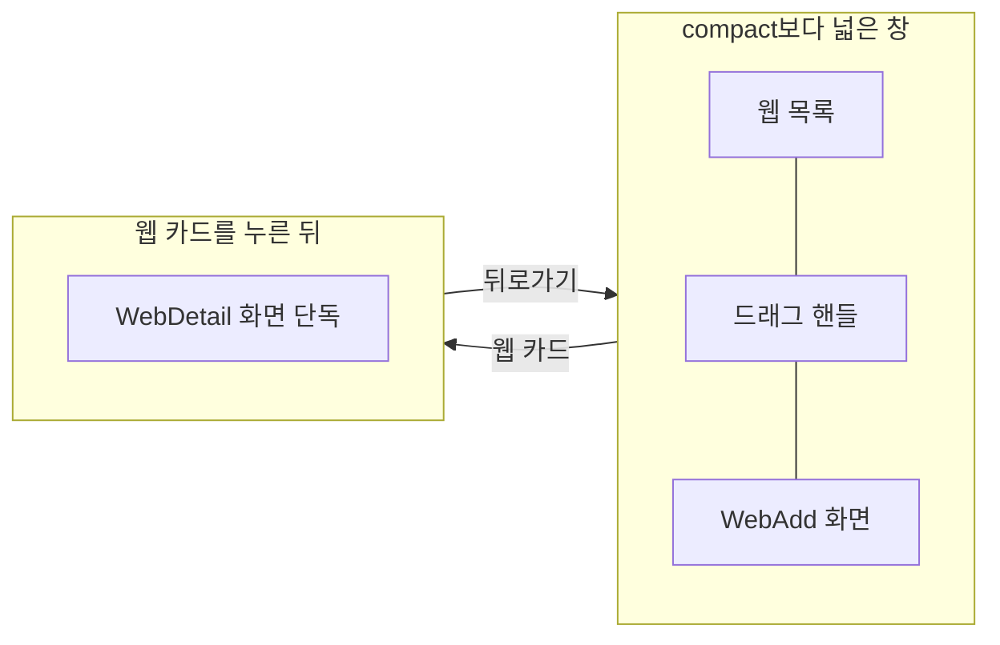

# Web 목록·상세 배치 디자인

기준 스펙: [Web 목록·상세 배치 스펙](../spec/web-list-detail.md)

배치, 크기 조절, 버튼 노출, 진행과 피드백, 조절 상태 표시의 공통 표현은 [목록·상세 배치 공통 디자인](./list-detail-pane.md)을 따른다.

## 두 영역에 두는 화면

목록 영역에는 [WebHome 화면](./web-home.md)의 웹 목록을, 상세 영역에는 [WebAdd 화면](./web-add.md)을 표시한다. 두 영역은 각각 자기 상단 바를 갖는다.

[WebDetail 화면](./web-detail.md)은 상세 영역에 두지 않는다. 목록에서 웹 카드를 누르면 창 너비와 관계없이 WebDetail만 표시하고, 뒤로가면 웹 목록과 WebAdd를 함께 표시하는 배치로 돌아온다. 상세 영역의 WebAdd를 WebDetail로 바꾸지 않으므로 배치 안에서 두 화면이 번갈아 나타나지 않는다.

웹 목록의 격자는 상세 영역과 자리를 나눠 좁아져도 [WebHome 화면 디자인](./web-home.md)의 2열 고정 격자를 유지하며, WebAdd의 입력도 상세 영역 폭에 맞춰 함께 좁아진다.

## 버튼 노출

목록과 상세 영역을 함께 표시하는 동안에도 웹 목록 상단 바의 검색 버튼은 그대로 표시한다.
