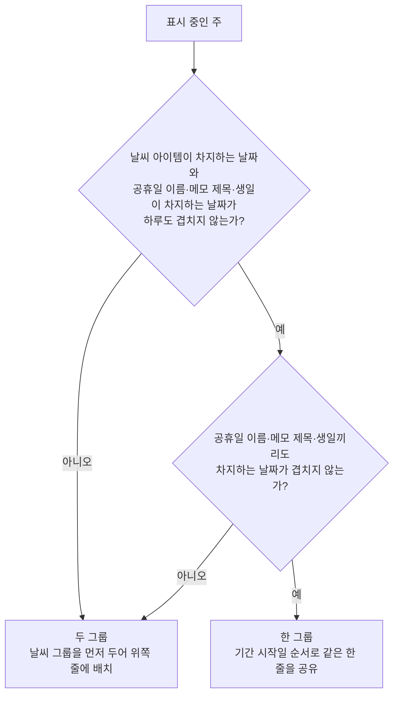

# CalendarHome 스펙

이 문서는 캘린더 홈 화면의 달 표시와 이동, 오늘 강조, 공휴일 동기화와 표시, 공휴일 이름 선택, 메모 표시와 선택, 메모 태그 필터, 연락처 생일 표시와 선택, 날씨 동기화와 표시, 날씨 선택, 위치 권한 요청, 날짜 기간 선택을 통한 메모 추가 시작을 다룬다. 캘린더에 표시된 메모를 길게 누른 뒤 드래그해 기간을 옮기는 행동은 [캘린더 메모 이동 스펙](./calendar-memo-move.md)에서 다룬다. 캘린더에 표시할 생일을 정하는 기준은 [캘린더 연락처 생일 표시 스펙](./calendar-contact-birthday.md)에서 다룬다. 사용자가 화면을 당겨 새로고침하는 행동과 동기화 진행 표시는 [새로고침 스펙](./sync-refresh.md)에서 다룬다. 태그 필터의 공통 행동과 정책은 [태그 필터 스펙](./tag-filter.md)을 따르며, 이 문서는 캘린더에 적용되는 부분만 다룬다.

디자인: [CalendarHome 디자인](../design/calendar-home.md)

## feature

### 캘린더 표시

캘린더 홈 화면에는 오늘이 속한 달의 캘린더가 표시된다.

표시하는 달의 날짜, 주요 날짜와 기간 아이템은 [Calendar 컴포넌트 스펙](calendar.md)을 따른다.

### 공휴일 날짜 강조

캘린더 홈 화면에서 공휴일에 해당하는 날짜는 일반 날짜와 구분해 강조한다.

아직 표시할 공휴일이 없으면 공휴일 강조 없이 표시하고, 공휴일이 준비되면 사용자가 별도 조작을 하지 않아도 반영한다.

사용자가 다른 달로 이동하면 이동한 달에 필요한 공휴일을 반영한다.

### 공휴일 이름 표시

캘린더 홈 화면에는 공휴일 이름을 해당 기간에 걸친 아이템으로 표시한다.

여러 날에 걸친 공휴일은 기간 전체를 나타내며, 기간이 주 경계를 넘으면 겹치는 각 주에 나누어 표시한다.

아직 표시할 공휴일이 없으면 이름 아이템도 표시하지 않고, 공휴일이 준비되면 사용자가 별도 조작을 하지 않아도 이름을 표시한다.

### 공휴일 이름 선택

사용자가 표시된 공휴일 이름을 선택하면 그 이름으로 검색한 결과가 앱 밖의 브라우저에서 열린다.

공휴일 여부와 관계없이 표시된 모든 공휴일 이름을 선택할 수 있다. 여러 날에 걸친 이름이 여러 주에 나뉘어 표시되면 어느 조각을 선택해도 같은 검색 결과가 열린다.

검색 결과가 열려도 캘린더 홈 화면은 보던 달을 그대로 유지한다. 사용자가 앱으로 돌아오면 선택 전과 같은 달과 공휴일 표시를 계속 본다.

브라우저를 열지 못해도 화면은 그대로 유지하고 사용자에게 별도로 알리지 않는다.

### 메모 표시

캘린더 홈 화면에는 사용자의 메모 제목을 해당 기간에 걸친 아이템으로 표시한다.

어떤 메모가 표시되는지, 어떤 기간을 차지하는지, 어떤 색상을 사용하는지는 [캘린더 메모 표시 스펙](calendar-memo.md)을 따른다. 삭제된 메모는 표시하지 않고 완료된 메모는 표시한다.

사용자는 시각이 있는 기간이 하루 안에 들어오는 메모와 그 밖의 메모를 캘린더에서 서로 구분할 수 있다.

여러 날에 걸친 메모는 기간 전체를 나타내며, 기간이 주 경계를 넘으면 겹치는 각 주에 나누어 표시한다.

아직 표시할 메모가 없으면 메모 아이템 없이 캘린더를 표시하고, 메모가 준비되거나 바뀌면 사용자가 별도 조작을 하지 않아도 반영한다.

사용자가 다른 달로 이동하면 이동한 달을 기준으로 표시할 메모를 다시 정한다.

### 메모 선택

사용자가 표시된 메모 제목을 선택하면 해당 메모의 MemoDetail 화면으로 이동한다. MemoDetail 화면의 내용과 행동은 [MemoDetail 화면 스펙](memo-detail.md)을 따른다.

여러 날에 걸친 메모 제목이 여러 주에 나뉘어 표시되면 어느 조각을 선택해도 같은 메모의 MemoDetail 화면으로 이동한다.

사용자가 MemoDetail 화면에서 뒤로 가면 캘린더 홈 화면으로 돌아오고, 캘린더는 보던 달을 그대로 유지한다.

### 태그 필터

사용자는 캘린더 홈 화면에서 태그 필터를 열어 태그를 선택하거나 선택을 해제할 수 있고, 선택한 태그를 한 번에 모두 해제할 수 있다. 필터를 열고 선택하고 전체 해제하고 닫는 행동은 [태그 필터 스펙](./tag-filter.md)의 `feature`를 따른다.

선택과 해제, 전체 해제는 즉시 캘린더의 메모 표시에 반영된다.

선택한 태그가 없으면 태그와 관계없이 캘린더의 메모 노출 기준을 만족하는 메모를 모두 표시하고, 태그를 하나 이상 선택하면 선택한 태그 중 하나 이상과 연결된 메모만 표시한다.

필터는 메모 표시에만 적용되며 공휴일, 생일과 날씨 표시에는 영향을 주지 않는다.

### 생일 표시

캘린더 홈 화면에는 연락처의 생일을 그 생일 하루에 걸친 아이템으로 표시한다.

어떤 연락처의 생일이 표시되는지, 어떤 날짜를 차지하는지는 [캘린더 연락처 생일 표시 스펙](calendar-contact-birthday.md)을 따른다. 사용자는 각 아이템에서 생일인 연락처의 이름을 확인한다.

생일은 해마다 반복되므로 사용자가 다른 연도의 달로 이동해도 같은 연락처의 생일을 다시 본다. 음력 생일은 저장된 월·일에 그대로 표시된다.

아직 표시할 생일이 없으면 생일 아이템 없이 캘린더를 표시하고, 연락처가 준비되거나 바뀌면 사용자가 별도 조작을 하지 않아도 반영한다.

사용자가 다른 달로 이동하면 이동한 달을 기준으로 표시할 생일을 다시 정한다.

### 생일 선택

사용자가 표시된 생일을 선택하면 그 연락처의 ContactDetail 화면으로 이동한다. ContactDetail 화면의 내용과 행동은 [ContactDetail 화면 스펙](contact-detail.md)을 따른다.

캘린더 홈 화면에서 이동한 ContactDetail 화면은 연락처 목록과 함께 표시하지 않는다.

사용자가 ContactDetail 화면에서 뒤로 가거나 그 연락처를 삭제하면 캘린더 홈 화면으로 돌아오고, 캘린더는 보던 달을 그대로 유지한다. 삭제한 연락처의 생일은 사용자가 별도 조작을 하지 않아도 캘린더에서 사라진다.

### 날씨 표시

캘린더 홈 화면에는 현재 위치의 날짜별 날씨를 해당 날짜 하루에 걸친 아이템으로 표시한다.

날짜별 날씨는 해당 날짜에 속한 모든 날씨의 대표 상태 아이콘을 보여 주고, 온도 표시가 있으면 온도도 함께 보여 준다. 아이콘은 시각 순서대로 한 줄에 표시하며, 한 번에 모두 보이지 않으면 사용자가 가로로 스크롤해 나머지를 확인할 수 있다.

오늘은 현재 시각과 가장 가까운 날씨의 기온 하나를, 오늘이 아닌 날짜는 최저 기온과 최고 기온을 보여 준다. 예보가 하루 전체에 닿지 않아 온도 표시가 없는 날짜는 아이콘만 보여 주고 온도를 보여 주지 않는다. 날짜별 묶음, 아이콘과 온도 기준은 [현재 날씨 동기화 스펙](weather-fetch.md)의 캘린더 날짜별 날씨를 따른다.

아직 표시할 날씨가 없으면 날씨 아이템 없이 캘린더를 표시하고, 날씨가 준비되거나 바뀌면 사용자가 별도 조작을 하지 않아도 반영한다.

한 주에서 날씨가 차지하는 날짜와 공휴일 이름·메모 제목·생일이 차지하는 날짜가 겹치지 않으면, 사용자는 날씨와 그 주의 공휴일 이름·메모 제목·생일을 같은 줄에서 나란히 본다. 하루라도 겹치면 날씨를 공휴일 이름과 메모 제목, 생일보다 위쪽 줄에서 본다.

날씨가 처음 표시되는 시점에는 사용자가 별도 조작을 하지 않아도 그 주의 날씨를 바로 본다. 이미 표시 중인 공휴일 이름이나 메모 제목, 생일이 많아 아이템을 모두 볼 수 없는 주에서도, 사용자는 날씨를 포함한 첫 아이템 줄부터 다시 본다. 이때 사용자가 그 전에 아이템을 스크롤해 둔 위치는 유지되지 않는다. 되돌리는 시점과 범위는 `domain`의 날씨 첫 표시 시 아이템 스크롤 되돌림을 따른다.

### 날씨 선택

사용자가 표시된 날씨를 선택하면 현재 위치의 날씨를 검색한 결과가 앱 밖의 브라우저에서 열린다.

표시된 모든 날짜의 날씨를 선택할 수 있다. 어느 날짜의 날씨를 선택해도 같은 검색 결과가 열린다.

검색 결과가 열려도 캘린더 홈 화면은 보던 달을 그대로 유지한다. 사용자가 앱으로 돌아오면 선택 전과 같은 달과 날씨 표시를 계속 본다.

브라우저를 열지 못해도 화면은 그대로 유지하고 사용자에게 별도로 알리지 않는다.

### 위치 권한 요청

캘린더 홈 화면에 진입할 때 위치 권한이 아직 허용되어 있지 않으면 시스템 위치 권한 요청이 표시된다.

요청 조건은 화면 진입 시 한 번만 확인하며, 화면을 벗어났다가 복귀해도 다시 요청하지 않는다. 화면이 재생성되어 다시 진입하면 요청 조건을 다시 확인한다.

사용자가 요청을 허용하면 사용자가 별도 조작을 하지 않아도 현재 위치의 날씨를 다시 동기화해 캘린더에 반영한다.

사용자가 요청을 거부하면 화면은 그대로 유지되고 별도로 알리지 않는다. 날씨는 [현재 위치 확인 스펙](current-location.md)을 따라 공인 IP 기준 위치로 계속 제공된다.

### 날짜 기간 선택으로 메모 추가 시작

사용자는 캘린더에 표시된 하나 이상의 연속 날짜를 선택해 새 메모 작성을 시작할 수 있다. 선택 가능한 날짜와 기간 선택의 행동은 [Calendar 날짜 선택 스펙](calendar-select.md)을 따른다. 메모 제목 위에서 길게 누르면 날짜 선택 대신 [캘린더 메모 이동 스펙](./calendar-memo-move.md)의 메모 이동이 시작된다.

사용자가 선택을 완료하면 MemoAdd 화면으로 이동한다. MemoAdd 화면은 선택한 기간이 종일 기간으로 입력된 상태로 시작하며, 화면의 내용과 행동은 [MemoAdd 화면 스펙](memo-add.md)을 따른다.

캘린더 홈 화면에서 이동한 MemoAdd 화면은 메모 목록과 함께 표시하지 않는다.

MemoAdd 화면으로 이동하면 캘린더의 날짜 선택은 해제된다. 사용자가 MemoAdd 화면에서 뒤로 가면 캘린더 홈 화면으로 돌아오고, 캘린더는 선택된 날짜 없이 보던 달을 그대로 유지한다.

### 오늘 강조

캘린더 홈 화면에서 오늘에 해당하는 날짜는 주요 날짜로 강조한다.

오늘은 캘린더 홈 화면이 다시 활성화될 때 정한 날짜를 기준으로 한다. 오늘이 속하지 않은 달을 보고 있으면 강조되는 날짜가 없다. 오늘이 이웃 달 날짜로 함께 표시되면 해당 날짜도 강조한다.

### 표시 중인 달 안내

사용자는 현재 표시 중인 달의 년도와 월을 확인할 수 있다. 다른 달로 이동하면 안내도 이동한 달로 갱신된다.

### 달 선택

사용자는 날짜를 골라 그 날짜가 속한 달로 이동할 수 있다. 날짜 선택을 시작할 때는 현재 표시 중인 달의 1일이 선택된 상태다.

선택을 확인하면 고른 날짜가 속한 달로 이동하고, 취소하면 보던 달을 그대로 유지한다.

### 오늘이 속한 달로 이동

사용자는 현재 표시 중인 달과 관계없이 오늘이 속한 달로 이동할 수 있다.

이미 오늘이 속한 달을 보고 있으면 보던 달을 그대로 유지한다.

## domain

### 오늘 기준

오늘 날짜와 오늘이 속한 달은 [Calendar 컴포넌트 스펙](calendar.md)의 오늘 기준을 따른다.

오늘은 캘린더 홈 화면이 다시 활성화될 때마다 다시 정한다. 예를 들어 자정 이전에 화면을 벗어났다가 자정 이후에 복귀하면 바뀐 오늘을 표시하고 이동 목적지도 바뀐 오늘이 속한 달이 된다.

### 이동 범위

사용자가 이동할 수 있는 달의 범위는 [Calendar 컴포넌트 스펙](calendar.md)의 이동 범위를 따른다. 이동 범위를 벗어난 요청은 무시하고 보던 달을 그대로 유지한다.

### 달 선택 진행 유지

달 선택이 열려 있는 동안 화면이 회전하거나 시스템에 의해 화면이 재생성되어도 달 선택은 열린 상태를 유지한다. 재생성 전에 선택을 확인하지 않았다면 표시 중인 달은 아직 이동하지 않은 상태다.

### 공휴일 동기화 대상

표시 중인 달의 연도를 기본 동기화 대상으로 정한다.

달을 이동하는 동안에는 이전 달과 다음 달도 함께 보일 수 있으므로 이웃한 달에 표시되는 연도까지 동기화 대상에 포함한다.

1월과 2월은 이전 연도의 날짜가 함께 표시될 수 있으므로 이전 연도도 동기화 대상에 포함한다.

11월과 12월은 다음 연도의 날짜가 함께 표시될 수 있으므로 다음 연도도 동기화 대상에 포함한다.

### 중복 동기화 방지

공휴일 동기화가 진행 중이면 화면 표시나 달 이동으로 새 동기화 조건이 발생해도 새 동기화를 시작하지 않는다.

진행 중에 무시된 동기화는 기존 동기화가 끝난 뒤 자동으로 다시 요청하지 않는다. 기존 동기화가 끝난 뒤 달이 다시 바뀌는 등 새로운 동기화 조건이 발생하면 해당 시점의 표시 중인 달을 기준으로 동기화할 수 있다.

### 공휴일 표시 대상

공휴일 표시 대상 연도는 공휴일 동기화 대상 연도와 같다.

표시 대상 연도의 공휴일 중 사용자가 숨김으로 고른 공휴일은 캘린더에서 다루지 않는다. 노출 설정은 [공휴일 노출 설정 스펙](holiday-visibility.md)을 따른다.

숨기지 않은 공휴일은 공휴일 여부와 관계없이 모두 이름 표시 대상으로 삼는다. 이름만 있고 공휴일이 아닌 날의 이름도 표시한다.

날짜를 공휴일로 강조하는 대상은 숨기지 않은 공휴일 중 공휴일 여부가 참인 항목만이다. 이름만 있고 공휴일이 아닌 날은 날짜를 강조하지 않는다.

공휴일이 여러 날에 걸치면 시작일부터 종료일까지 모든 날을 날짜 강조 대상으로 삼는다.

표시 대상은 중복 동기화 방지와 무관하게 항상 마지막으로 표시된 달을 기준으로 정한다. 동기화가 진행 중이어서 새 동기화를 시작하지 않은 경우에도 표시 대상은 이동한 달을 기준으로 바뀐다.

### 공휴일 이름 구분

공휴일 여부가 참인 항목과 거짓인 항목은 사용자가 쉬는 날 여부를 구분할 수 있게 서로 다른 의미 표현을 사용한다.

### 메모 조회 기간

메모 조회 기간은 표시 중인 달을 기준으로 두 달 전의 1일부터 두 달 후의 마지막 날까지다. 예를 들어 2026년 7월을 표시 중이면 2026년 5월 1일부터 2026년 9월 30일까지가 조회 기간이다.

이 기간은 캘린더가 사용자에게 보여 주는 날짜 범위를 항상 포함하므로 [캘린더 메모 표시 스펙](calendar-memo.md)의 표시 대상 기간에 해당하는 메모는 모두 조회 기간에 들어온다. 달을 이동하는 동안 함께 보이는 이전 달과 다음 달의 날짜도 조회 기간이 감싼다.

조회 기간에 겹치더라도 캘린더에 보이는 주와 하루도 겹치지 않는 메모는 화면에 나타나지 않는다.

### 메모 기간 형태 구분

메모는 [캘린더 메모 표시 스펙](calendar-memo.md)의 기간에 따라 하루 일정과 그 밖의 메모로 나누어 구분해 표시한다.

하루 일정은 시각이 있는 기간이면서 시작 날짜와 종료 날짜가 같은 메모다. 종일 기간인 메모와, 시각이 있지만 시작 날짜와 종료 날짜가 다른 메모는 모두 그 밖의 메모로 다룬다.

기간에 시각이 있으면 그 시각이 하루 전체를 차지하지 않더라도 시각이 있는 기간으로 다룬다. 하루 안에 들어오는지는 시각을 뺀 날짜만 비교해 판단하므로, 시작과 종료의 시각이 달라도 날짜가 같으면 하루 일정이다.

구분은 표현에서만 이루어진다. 두 갈래의 메모는 노출 기준, 차지하는 기간, 표시 색상, 아이템 줄 배치, 선택했을 때의 이동이 모두 같다.

사용자가 메모의 기간을 바꾸어 속하는 갈래가 달라지면 사용자가 별도 조작을 하지 않아도 바뀐 표현으로 갱신된다.

### 메모 표시 색상

메모는 [캘린더 메모 표시 스펙](calendar-memo.md)에서 정한 표시 색상을 사용한다. 기간 형태에 따라 색상을 다르게 정하지 않으며, 정해진 색상을 어떤 방식으로 드러낼지는 [CalendarHome 디자인](../design/calendar-home.md)을 따른다.

### 메모 조회 실패

메모를 조회하지 못하면 메모 없이 캘린더를 표시하고 사용자에게 별도로 알리지 않는다. 조회 실패는 공휴일 표시 같은 캘린더의 다른 표시를 막지 않는다.

### 생일 조회 기간

생일 조회 기간은 캘린더가 보여 주는 여섯 주의 첫날부터 마지막 날까지다. 표시 중인 달에 속하지 않더라도 함께 보이는 이웃 달의 날짜를 포함한다.

메모 조회 기간과 달리 여섯 주 밖으로 넓히지 않는다. 생일은 하루만 차지하므로 보이는 주 밖의 날짜를 미리 조회해도 화면에 나타날 생일이 늘지 않는다.

달을 이동하면 이동한 달의 여섯 주를 기준으로 조회 기간을 다시 정한다. 조회 기간이 연도 경계를 넘으면 넘어간 각 연도의 반복 생일을 함께 조회한다.

화면이 재생성되거나 화면을 벗어났다가 복귀하면 그 시점의 표시 중인 달을 기준으로 조회 기간을 다시 정한다. 보던 달은 `이동 범위`가 참조하는 [Calendar 컴포넌트 스펙](calendar.md)의 보던 달 유지를 따르므로, 사용자는 재생성 뒤에도 같은 달의 생일을 이어서 본다.

### 생일 표시 대상

표시 대상 생일은 생일 조회 기간을 표시 대상 기간으로 삼아 [캘린더 연락처 생일 표시 스펙](./calendar-contact-birthday.md)의 노출 기준, 반복 연도와 달력에 없는 날짜를 적용한 결과다.

태그 필터는 생일 표시 대상에 영향을 주지 않는다. 연락처는 태그와 연결되지 않으므로 필터 선택과 관계없이 노출 기준을 만족하는 생일을 모두 표시한다.

### 생일 조회 실패

생일을 조회하지 못하면 생일 없이 캘린더를 표시하고 사용자에게 별도로 알리지 않는다. 조회 실패는 공휴일, 메모, 날씨 표시 같은 캘린더의 다른 표시를 막지 않는다.

### 태그 필터 기준

선택할 수 있는 태그, 필터 판정 기준, 선택할 수 없게 된 태그의 처리는 [태그 필터 스펙](./tag-filter.md)의 `domain`을 따른다.

필터 선택은 [캘린더 메모 표시 스펙](./calendar-memo.md)의 노출 기준을 대체하지 않는다. 선택한 태그와 연결되어 있어도 삭제되었거나 기간이 없는 메모는 표시하지 않으며, 완료된 메모는 필터와 일치하면 그대로 표시한다.

### 필터 선택 유지

캘린더의 태그 필터 선택은 [태그 필터 스펙](./tag-filter.md)의 `필터 선택 유지`를 따라 현재 사용자 계정별로 유지한다.

캘린더의 필터 선택은 메모 목록의 필터 선택과 독립이다. 캘린더에서 고른 선택은 메모 목록에 적용하지 않으며, 메모 목록에서 고른 선택도 캘린더에 적용하지 않는다.

### 날씨 표시 대상

날씨 표시 대상은 [현재 날씨 동기화 스펙](weather-fetch.md)의 캘린더 날짜별 날씨 전체다. 표시 중인 달과 관계없이 날짜별 날씨가 있는 모든 날짜를 대상으로 삼고, 캘린더에 보이는 주와 겹치지 않는 날짜는 화면에 나타나지 않는다.

날씨 표시 대상은 달 이동과 무관하게 저장된 날씨만으로 정하므로, 달을 이동해도 날씨를 다시 조회하지 않는다.

### 날씨 첫 표시 시 아이템 스크롤 되돌림

표시할 날씨가 없다가 처음으로 하나 이상 생기는 시점에 보고 있는 달의 각 주 아이템 영역 스크롤을 맨 위로 되돌린다. 되돌림은 날씨가 차지하는 날짜가 있는 주에만 적용하지 않고 보고 있는 달의 모든 주에 적용한다.

되돌림은 화면 진입 후 한 번만 한다. 그 뒤 날씨가 갱신되거나 사용자가 새로고침해 날씨를 다시 받아도 되돌리지 않으며, 날씨가 다시 사라졌다가 채워져도 되돌리지 않는다.

화면 진입 시점에 이미 표시할 날씨가 있으면 처음부터 날씨가 첫 아이템 줄에 보이므로 되돌리지 않는다.

되돌림 시점에 사용자가 아이템을 스크롤해 둔 상태여도 되돌린다. 되돌린 뒤에는 사용자가 다시 스크롤할 수 있다.

화면이 재생성되면 같은 기준을 처음부터 다시 적용한다.

### 날씨 아이템 그룹 구성

주마다 다음 기준으로 그룹 구성을 정한다.

날씨 아이템을 공휴일 이름과 메모 제목, 생일 아이템과 같은 그룹으로 다룰지는 주마다 정한다.

표시 중인 주의 모든 아이템이 한 줄에 들어갈 때만 네 아이템을 한 그룹으로 다룬다. 다음 두 조건을 모두 만족해야 한다.

- 날씨 아이템이 차지하는 날짜와 공휴일 이름·메모 제목·생일 아이템이 차지하는 날짜가 하루도 겹치지 않는다.
- 공휴일 이름·메모 제목·생일 아이템끼리도 서로 차지하는 날짜가 하루도 겹치지 않는다.

한 그룹으로 다루면 줄 위치는 [CalendarWeekOfMonth 컴포넌트 스펙](calendar-week-of-month.md)의 아이템 그룹을 따라 기간 시작일 순서로 정해지므로, 그 주의 아이템이 모두 같은 한 줄을 공유한다.

두 조건 중 하나라도 만족하지 않으면 날씨 아이템을 공휴일 이름과 메모 제목, 생일 아이템과 다른 그룹으로 다루고 날씨 그룹을 먼저 둔다. 따라서 이 경우 날씨 아이템은 항상 공휴일 이름과 메모 제목, 생일 아이템보다 위쪽 줄에 온다.

날씨와의 겹침 판단에는 공휴일 이름과 메모 제목, 생일 아이템을 모두 포함한다. 그중 하나만 날씨 날짜와 겹쳐도 그 주는 두 그룹으로 다룬다.

공휴일 이름·메모 제목·생일 아이템끼리 겹치는 주를 한 그룹으로 다루지 않는 것은, 그 주의 아이템이 여러 줄로 나뉘어 날씨 높이에 맞춘 줄과 그렇지 않은 줄이 함께 보이기 때문이다.

겹침 판단은 각 아이템이 그 주에서 실제로 차지하는 날짜만 대상으로 하며, 주 밖으로 벗어난 기간은 판단에 넣지 않는다. 판단을 주마다 따로 하므로 같은 달 안에서도 한 주는 한 그룹, 다른 주는 두 그룹으로 다룰 수 있다.

표시 대상이 바뀌어 겹침 여부가 달라지면 사용자가 별도 조작을 하지 않아도 그 주의 그룹 구성을 다시 정한다.

### 날씨 아이콘 순서

날씨 아이템 안의 아이콘은 해당 날씨의 시각이 이른 순서로 표시한다.

이 순서에서 같은 이미지 주소의 아이콘이 연속되면 첫 번째 아이콘만 표시한다. 같은 이미지 주소라도 그 사이에 다른 이미지 주소의 아이콘이 있으면 다시 표시한다.

### 날씨 검색 주소

날씨를 선택해 여는 주소는 Naver 통합검색 주소에 날씨 검색어를 붙인 주소다. 검색어를 웹 주소에 담는 방식은 `공휴일 이름 검색 주소`와 같다.

날씨 검색어는 현재 위치의 지역명 뒤에 공백 하나와 `날씨`를 붙여 만든다. 지역명은 [현재 날씨 동기화 스펙](weather-fetch.md)의 `현재 위치 지역명`을 따른다. 예를 들어 지역명이 `성남시`이면 검색어는 `성남시 날씨`이고, `https://search.naver.com/search.naver?query=%EC%84%B1%EB%82%A8%EC%8B%9C%20%EB%82%A0%EC%94%A8`로 연다.

지역명이 없으면 검색어는 `날씨`만 사용해 `https://search.naver.com/search.naver?query=%EB%82%A0%EC%94%A8`로 연다. 이때 브라우저가 판단한 위치를 기준으로 한 검색 결과가 열리므로, 앱이 날씨를 조회한 위치와 다른 지역의 결과가 나올 수 있다.

검색어는 선택한 날짜와 무관하다. 날짜, 기온, 날씨 상태는 검색어에 넣지 않는다.

지역명이 바뀌면 사용자가 별도 조작을 하지 않아도 다음 선택부터 바뀐 지역명으로 검색한다.

### 날씨 중복 동기화 방지

날씨 동기화가 진행 중이면 화면 표시로 새 동기화 조건이 발생해도 새 동기화를 시작하지 않는다.

진행 중인 동기화가 없어 시작한 동기화도 [현재 날씨 동기화 스펙](weather-fetch.md)의 `동기화 간격`에 따라 조회 없이 끝날 수 있다.

### 날씨 표시 실패

날씨를 동기화하지 못하거나 조회하지 못하면 날씨 없이 캘린더를 표시하고 사용자에게 별도로 알리지 않는다. 이전에 표시하던 날씨가 있으면 그대로 유지한다. 날씨 실패는 공휴일이나 메모 표시 같은 캘린더의 다른 표시를 막지 않는다.

지역명을 확인하지 못한 것은 날씨 표시를 막지 않는다. 지역명이 없어도 날씨는 그대로 표시하고 선택할 수 있으며, 이때 열리는 검색 주소는 `날씨 검색 주소`를 따른다.

### 위치 권한 요청 기준

위치 권한 요청은 Android, iOS와 웹에서 제공한다. 그 외 환경에서는 요청하지 않고 화면을 그대로 표시한다. 이 문서에서 시스템 위치 권한 요청은 웹에서 브라우저가 표시하는 위치 권한 요청을 함께 가리킨다.

지도처럼 정밀한 위치가 필요한 기능을 대비해 플랫폼이 제공하는 가장 정확한 위치 사용 권한을 요청한다. 시스템이 대략적인 위치만 허용하는 선택지를 제공해 사용자가 그렇게 허용한 경우에도 허용으로 본다. 웹은 위치 권한을 정확도별로 나누지 않으므로 하나의 위치 권한을 요청한다.

위치 권한이 이미 허용되어 있으면 요청하지 않으며, 허용을 계기로 한 날씨 재동기화도 하지 않는다. 이미 허용되어 있는지 확인할 수 없는 환경에서는 요청하지 않는다.

사용자가 이전에 요청을 거부해 시스템이 더 이상 요청을 표시하지 않으면 거부와 같이 처리한다. 시스템 요청 표시 여부는 각 플랫폼의 권한 정책을 따르며 앱이 별도의 안내 화면으로 대신하지 않는다. 웹에서 브라우저가 위치 기능을 제공하지 않으면 요청하지 않고 화면을 그대로 표시한다. 어느 경우인지는 [현재 위치 확인 스펙](current-location.md)의 `디바이스 위치`를 따른다.

### 공휴일 이름 검색 주소

공휴일 이름을 선택해 여는 주소는 Naver 통합검색 주소에 그 이름을 검색어로 붙인 주소다.

검색어는 웹 주소에 담을 수 있는 형태로 바꿔 붙인다. 예를 들어 `제헌절`은 `https://search.naver.com/search.naver?query=%EC%A0%9C%ED%97%8C%EC%A0%88`로 연다.

검색어는 캘린더에 표시된 이름을 그대로 사용하며, 공휴일 여부나 기간에 따라 다르게 만들지 않는다.

### 공휴일 표시 유지

공휴일 강조는 표시 대상 연도가 바뀌지 않는 한 유지된다. 표시 중인 달이 같은 연도 안에서 바뀌면 이미 표시하던 공휴일을 그대로 유지한다.

화면이 재생성되거나 화면을 벗어났다가 복귀하면 그 시점의 표시 중인 달을 기준으로 공휴일을 다시 표시한다.

## data

### 표시 중인 달의 공휴일 동기화

캘린더 홈 화면이 표시되거나 표시 중인 달이 바뀌면 공휴일 동기화 대상에 해당하는 각 연도의 최신 공휴일을 원격에서 받아 로컬 캐시에 저장한다.

각 연도의 동기화, 이미 성공한 연도의 재조회 생략, 실패 시 기존 캐시 유지 규칙은 [공휴일 동기화 스펙](holiday-fetch.md)을 따른다. 앱 실행 중 이미 동기화에 성공한 연도는 다시 표시되거나 다시 이동해도 원격에서 받지 않고 이미 저장된 공휴일을 그대로 표시한다.

동기화 실패는 화면에 별도로 알리지 않으며 다른 대상 연도의 동기화를 막지 않는다.

모든 대상 연도의 동기화 요청이 성공 또는 실패로 끝나면 진행 중인 동기화가 끝난 것으로 본다.

### 표시 중인 달의 공휴일 조회

캘린더에 표시하는 공휴일은 로컬 캐시에서 표시 대상 연도별로 조회한 공휴일에 노출 설정을 반영한 결과를 합쳐 사용한다. 조회 규칙은 [공휴일 노출 설정 스펙](holiday-visibility.md)의 캘린더 공휴일 조회를 따른다.

원격 동기화 결과로 대상 연도의 캐시가 바뀌거나 사용자가 노출 설정을 바꾸면, 사용자가 별도 조작을 하지 않아도 바뀐 공휴일을 캘린더에 반영한다.

대상 연도에 저장된 공휴일이 없거나 조회에 실패하면 공휴일 없이 표시하고 사용자에게 별도로 알리지 않는다. 한 연도의 조회 실패는 다른 대상 연도의 공휴일 표시를 막지 않는다.

### 현재 위치의 날씨 동기화

캘린더 홈 화면이 표시되면 현재 위치의 날씨와 지역명을 동기화한다. 위치 확인, 조회, 저장, 실패 시 기존 날씨 유지 규칙은 [현재 날씨 동기화 스펙](weather-fetch.md)을 따른다. 화면 표시를 계기로 하는 동기화는 그 스펙의 `동기화 간격`을 따르므로, 마지막 동기화 성공 후 1시간이 지나지 않았으면 조회 없이 끝나고 이미 표시하던 날씨가 그대로 유지된다.

사용자가 위치 권한 요청을 허용하면 현재 위치의 날씨를 다시 동기화한다. 이 계기의 동기화는 `동기화 간격`의 예외이므로 마지막 동기화로부터 지난 시간과 관계없이 조회한다. 다만 날씨 중복 동기화 방지는 그대로 따르므로, 진행 중인 동기화가 있으면 새 동기화를 시작하지 않는다.

동기화 실패는 화면에 별도로 알리지 않으며 공휴일 동기화나 메모 조회를 막지 않는다.

### 날짜별 날씨 조회

캘린더에 표시하는 날씨는 저장된 날씨에서 만든 캘린더 날짜별 날씨를 사용한다. 동기화 결과로 저장된 날씨가 바뀌면 사용자가 별도 조작을 하지 않아도 바뀐 날씨를 캘린더에 반영한다.

저장된 날씨가 없거나 조회에 실패하면 `domain`의 날씨 표시 실패를 따라 날씨 없이 표시한다.

### 지역명 조회

날씨 검색어에 사용하는 지역명은 저장된 현재 위치 지역명을 사용한다. 동기화 결과로 저장된 지역명이 바뀌면 사용자가 별도 조작을 하지 않아도 다음 선택부터 바뀐 지역명을 사용한다.

지역명은 화면 진입 시점에 한 번만 확인하지 않는다. 날씨 동기화가 끝나 지역명이 준비되면 사용자가 화면을 다시 열지 않아도 그때부터 지역명을 포함한 검색어를 사용한다.

### 표시 중인 달의 메모 조회

캘린더에 표시하는 메모는 메모 조회 기간을 기준으로 기기에 저장된 메모에서 조회한다. 조회 대상, 표시 색상, 데이터 정렬은 [캘린더 메모 표시 스펙](calendar-memo.md)의 `data` 영역을 따른다.

캘린더 필터에 선택한 태그가 있으면 그중 하나 이상과 해제되지 않은 연결을 가진 메모만 함께 조회한다. 필터 선택 변경이 반영되면 조회 결과도 자동으로 갱신된다.

같은 달을 계속 보고 있는 동안 기기에 저장된 메모나 대표 태그가 바뀌면, 사용자가 별도 조작을 하지 않아도 바뀐 내용을 캘린더에 반영한다. 로그인이나 로그아웃으로 현재 사용자 계정이 바뀌면 바뀐 계정을 기준으로 메모를 다시 조회한다.

메모 조회가 실패하면 `domain`의 메모 조회 실패를 따라 메모 없이 표시한다.

### 표시 중인 달의 생일 조회

캘린더에 표시하는 생일은 생일 조회 기간을 기준으로 기기에 저장된 연락처에서 조회한다. 조회 대상과 데이터 정렬은 [캘린더 연락처 생일 표시 스펙](calendar-contact-birthday.md)의 `data` 영역을 따른다.

캘린더 홈 화면에 진입하는 것만으로는 서버에서 연락처를 다시 가져오지 않는다. 서버와 맞추는 조회는 [데이터 동기화 스펙](data-sync.md)이 정한 계기에서만 일어나며, 사용자가 화면을 당겨 새로고침하면 그 동기화로 내려받은 연락처의 생일이 별도 조작 없이 캘린더에 반영된다.

같은 달을 계속 보고 있는 동안 기기에 저장된 연락처가 바뀌면, 사용자가 별도 조작을 하지 않아도 바뀐 내용을 캘린더에 반영한다. 로그인이나 로그아웃으로 현재 사용자 계정이 바뀌면 바뀐 계정을 기준으로 생일을 다시 조회한다.

생일 조회가 실패하면 `domain`의 생일 조회 실패를 따라 생일 없이 표시한다.

### 필터 선택 저장

캘린더의 필터 선택 저장은 [태그 필터 스펙](./tag-filter.md)의 `필터 선택 저장`을 따르며, 메모 목록의 필터 선택과 다른 위치에 저장한다.

### 태그 필터 조회

캘린더의 태그 필터 조회는 [태그 필터 스펙](./tag-filter.md)의 `태그 필터 조회`를 따른다.
