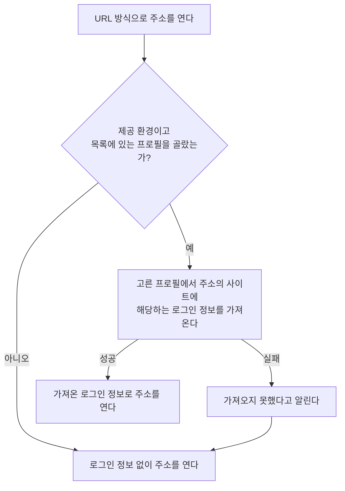

# Chrome 로그인 이어받기 스펙

이 문서는 사용자가 고른 Chrome 프로필에 따라 앱 안 웹 페이지가 이 기기의 Chrome 로그인 정보를 이어받는 규칙을 다룬다. 프로필을 고르는 화면과 조작은 [SettingBrowser 화면 스펙](./setting-browser.md)에서, 이어받은 로그인 정보로 웹 페이지를 표시하는 화면의 행동은 [WebDetail 화면 스펙](./web-detail.md)에서 다룬다.

이번 범위는 어떤 환경에서 무엇을 언제 가져오고, 가져오지 못했을 때 어떻게 다루는지까지다. 화면에서의 행동과 반응은 두 화면 스펙이 다루므로 이 문서에서는 `feature` 영역을 생략한다.

## domain

### 로그인 정보

이어받는 로그인 정보는 Chrome이 사이트별로 보관하는 쿠키다. 사이트가 로그인 상태를 쿠키로 유지하면 그 쿠키를 앱 안 웹 페이지에 넘겨 같은 사이트를 로그인된 상태로 열 수 있다.

쿠키가 아닌 방식으로 로그인 상태를 유지하는 사이트와 로그인 세션을 특정 브라우저에 묶는 사이트는 쿠키를 넘겨도 로그인 상태가 이어지지 않을 수 있다. 앱은 이를 미리 판별하지 않고, 로그인 상태가 이어지지 않아도 오류로 다루지 않는다.

### Chrome 프로필

Chrome은 프로필마다 로그인 정보를 따로 보관하므로, 이어받을 로그인 정보는 사용자가 고른 프로필 하나의 것이다. 프로필 목록은 이 기기의 Chrome이 기록해 둔 프로필 목록을 그대로 따르며, 각 프로필은 Chrome에서 사용자가 정한 프로필 이름으로 구분한다. 이름이 없는 프로필은 Chrome이 쓰는 폴더 이름으로 구분한다.

프로필의 순서는 Chrome이 기록한 순서를 그대로 따른다.

Chrome이 설치되어 있지 않거나 프로필 목록을 읽을 수 없으면 프로필 목록 조회는 실패다. 이때 사용자가 프로필을 골라 두었으면 로그인 정보 가져오기도 `가져오기 실패`로 끝난다. 프로필을 고르지 않았으면 목록을 읽지 않으므로 실패가 없다.

사용자가 프로필을 고르지 않았거나 고른 프로필이 목록에 없으면 로그인 정보를 가져오지 않는다. 고른 프로필을 저장하고 되살리는 규칙은 [SettingBrowser 화면 스펙](./setting-browser.md)의 `목록에 없는 프로필`을 따른다.

### 제공 환경

Chrome 로그인 이어받기는 macOS에서 실행하는 JVM 데스크톱 앱에서만 제공한다. 앱 안 웹 표시 수단의 쿠키 저장소와 Chrome의 쿠키 저장소를 모두 다룰 수 있는 환경이 이곳뿐이기 때문이다.

Android, iOS, 웹과 macOS가 아닌 JVM 데스크톱에서는 제공하지 않는다. 제공하지 않는 환경에서는 설정 항목을 두지 않고 로그인 정보를 가져오지 않는다.

### 가져오는 시점

사용자가 프로필을 골라 두었으면 앱 안 웹 페이지가 URL 방식으로 주소를 열기 전에 그 프로필에서 그 주소의 사이트에 해당하는 로그인 정보를 가져오고, 가져오기가 끝난 뒤에 주소를 연다.

같은 화면에서 저장된 URL이 바뀌어 새 주소를 열 때도 같은 규칙으로 새 주소의 로그인 정보를 다시 가져온다.

가져오기는 주소를 열 때마다 수행하므로 사용자가 Chrome에서 새로 로그인하거나 로그아웃한 결과는 다음에 주소를 열 때 반영된다. 이미 열려 있는 웹 페이지에는 반영하지 않는다.

`선택 안 함`이면 아무것도 가져오지 않고 곧바로 주소를 연다. 프로필을 바꾸거나 `선택 안 함`으로 되돌려도 이전에 가져온 로그인 정보를 앱 안 웹 표시 수단에서 지우지는 않는다.

프로필을 고르는 것 자체는 가져오기를 일으키지 않는다.

### 가져오는 대상

고른 프로필의 쿠키 중 여는 주소의 호스트와 그 상위 도메인에 해당하는 쿠키만 가져온다. 예를 들어 `https://mail.example.com/inbox`를 열 때는 `mail.example.com`, `.example.com`, `example.com`에 해당하는 쿠키를 가져오고, `other.example.com`에만 해당하는 쿠키는 가져오지 않는다.

다음 쿠키는 가져오지 않는다.

- 만료 시각이 이미 지난 쿠키
- Google 계정 도메인(`google.com`과 그 하위 도메인)의 쿠키. Google 계정은 로그인 세션을 그 브라우저에 묶으므로 다른 웹 표시 수단으로 옮기면 Chrome 쪽 로그인까지 풀릴 수 있다.
- 특정 상위 사이트 안에서만 쓰도록 나뉜 쿠키. 앱 안 웹 표시 수단이 같은 구분을 표현하지 못한다.

가져오는 쿠키는 이름, 값, 도메인, 경로, 만료 시각, 보안 연결 전용 여부, 스크립트 접근 금지 여부, 사이트 간 전송 정책을 그대로 옮긴다.

여는 주소에서 호스트를 알 수 없으면 가져올 대상이 없으므로 아무것도 가져오지 않고 주소를 그대로 연다. 이는 실패가 아니다.

### 가져오기 실패

Chrome이 설치되어 있지 않거나, 쿠키 저장소를 읽을 수 없거나, 쿠키를 풀 암호화 키를 얻지 못하거나, 앱 안 웹 표시 수단에 넘기지 못하면 가져오기 실패다.

실패해도 웹 페이지는 로그인 정보 없이 그대로 열고, 사용자에게 가져오지 못했다는 것을 알린다. 다시 시도는 따로 두지 않으며 다음에 주소를 열 때 다시 가져온다.

여는 주소의 사이트에 해당하는 쿠키가 하나도 없는 것은 실패가 아니다. 아무것도 넘기지 않고 주소를 연다.

## data

### Chrome 쿠키 읽기

고른 프로필의 쿠키 저장소를 읽는다. Chrome이 실행 중이어도 읽을 수 있도록 저장소를 직접 열지 않고 복사본을 만들어 읽고, 읽은 뒤 복사본은 지운다. Chrome의 쿠키 저장소는 바꾸지 않는다.

쿠키 값은 Chrome이 시스템 키체인의 `Chrome Safe Storage` 항목으로 암호화해 두므로, 그 항목을 읽어 복호화한다. 여는 주소의 사이트에 암호화된 쿠키가 하나도 없으면 키체인을 읽지 않는다. 시스템이 키체인 접근 허용을 물으면 사용자가 허용해야 읽을 수 있고, 사용자가 거부하거나 일정 시간 안에 응답하지 않으면 가져오기 실패로 다룬다. 키체인에서 얻은 키는 앱이 실행되는 동안만 기억하고 기기에 저장하지 않는다.

Chrome이 아직 저장소에 쓰지 않은 쿠키는 가져올 수 없다. Chrome은 쿠키를 곧바로 저장소에 쓰지 않으므로 방금 로그인한 결과는 잠시 뒤에야 가져올 수 있다.

### Chrome 프로필 목록 읽기

프로필 목록은 Chrome이 프로필 정보를 기록해 두는 파일에서 읽는다. 파일이 없거나 읽을 수 없거나 형식을 해석할 수 없으면 조회 실패로 알린다. Chrome의 파일은 바꾸지 않는다.

프로필 목록은 SettingBrowser 화면에 들어올 때와 로그인 정보를 가져올 때마다 다시 읽는다. 사용자가 Chrome에서 프로필을 추가하거나 지운 결과는 그다음 읽을 때 반영된다.

### 앱 안 웹 표시 수단에 넘기기

가져온 쿠키는 앱 안 웹 표시 수단의 쿠키 저장소에 넣는다. 같은 이름, 도메인, 경로의 쿠키가 이미 있으면 가져온 값으로 바꾼다.

웹 표시 수단의 쿠키 저장소는 앱을 종료하고 다시 시작해도 유지되므로 가져온 로그인 정보는 다음 실행에서도 남아 있다.

앱은 가져온 쿠키를 자체 저장 영역에 따로 보관하지 않고 서버로 보내지 않는다. 로그인 정보는 [데이터 동기화 스펙](./data-sync.md)의 동기화 대상이 아니다.
