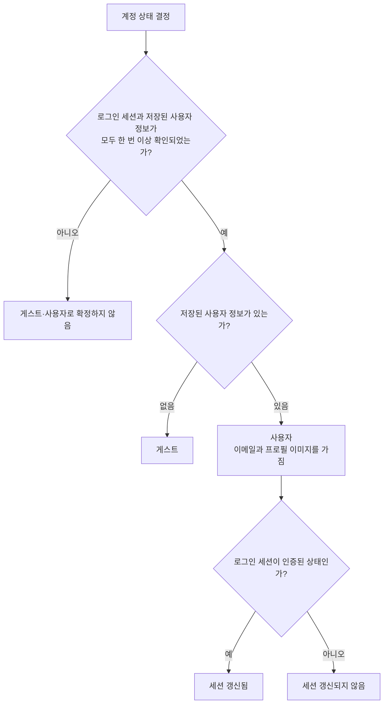

# 계정 조회 스펙

이 문서는 앱이 현재 사용자의 계정 상태를 결정하는 규칙만 다룬다. 계정 상태를 화면에 어떻게 보여 주는지는 [MoreHome 화면 스펙](./more-home.md)에서, 로그인 흐름과 로그인 세션 상태 자체는 [Login 화면 스펙](./login.md)에서 다룬다.

## domain

계정 상태는 로그인 세션과 저장된 사용자 정보를 함께 반영해 결정한다.

확인 중 오류가 발생하면 상태를 확정하지 않고 조회 실패를 알린다.

### 계정 상태

앱의 현재 계정은 게스트와 사용자 두 상태 중 하나다.

게스트는 로그인한 사용자 정보가 없는 상태다.

사용자는 로그인한 사용자 정보가 있는 상태이며, 해당 정보의 이메일과 프로필 이미지를 가진다. 프로필 이미지는 없을 수 있다.

### 계정 상태 결정 기준

계정이 게스트인지 사용자인지는 저장된 사용자 정보의 유무만으로 결정한다.

저장된 사용자 정보가 없으면 게스트다.

저장된 사용자 정보가 있으면 사용자이며, 로그인 세션의 인증 여부와 관계없이 사용자로 결정한다.

### 세션 갱신 여부

사용자 상태에서는 현재 로그인 세션이 인증된 상태인지 함께 나타낸다.

로그인 세션이 인증된 상태이면 세션이 갱신되어 서버 요청에 사용할 수 있는 상태로 본다.

로그인 세션이 인증되지 않은 상태이면 세션이 갱신되지 않은 것으로 본다.

세션 갱신 여부는 사용자 정보가 있을 때만 의미를 가지며, 게스트 상태에는 적용하지 않는다.

### 계정 정보 조합

계정 상태는 현재 로그인 세션과 저장된 사용자 정보를 함께 반영해 결정한다.

두 정보 중 하나라도 아직 처음 확인되지 않은 동안에는 계정 상태를 게스트나 사용자로 확정하지 않는다.

### 계정 정보 변화 반영

로그인 세션이나 저장된 사용자 정보가 바뀌면 계정 상태를 다시 결정해 최신 상태로 반영한다.

로그인이 완료되어 사용자 정보가 저장되면 게스트에서 사용자로 바뀐다.

로그아웃 등으로 저장된 사용자 정보가 사라지면 사용자에서 게스트로 바뀐다.

사용자 정보는 그대로인 채 로그인 세션의 인증 여부만 바뀌면, 계정은 사용자로 유지되고 세션 갱신 여부만 바뀐다.

### 조회 실패 처리

로그인 세션이나 저장된 사용자 정보를 확인하는 중 오류가 발생하면 계정 상태를 확정하지 않고 조회가 실패했음을 알린다.

## data

### 저장된 사용자 정보의 출처

저장된 사용자 정보는 인증 제공자가 알리는 사용자 정보에서 도출된다.

인증 제공자에 사용자 정보가 없으면 저장된 사용자 정보도 없다.

인증 제공자에 사용자 정보가 있으면 그 계정 구분 값, 이메일, 프로필 이미지를 그대로 사용한다. 프로필 이미지는 없을 수 있다.

사용자가 프로필 이미지를 바꾸면 인증 제공자의 사용자 정보가 갱신되므로 저장된 사용자 정보의 프로필 이미지도 함께 바뀐다. 반영 흐름은 [프로필 이미지 변경 스펙](./profile-image.md)이 소유한다.
