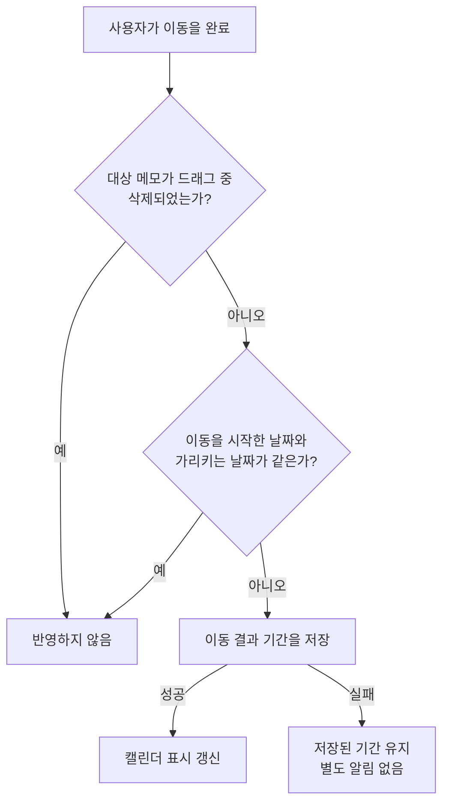

# 캘린더 메모 이동 스펙

이 문서는 캘린더 홈 화면에서 사용자가 캘린더에 표시된 메모 제목을 길게 누른 뒤 드래그해 메모의 기간을 다른 날짜로 옮기는 행동과 정책을 다룬다. 어떤 메모가 캘린더에 표시되는지는 [캘린더 메모 표시 스펙](./calendar-memo.md)을, 메모의 기간 개념은 [MemoAdd 화면 스펙](./memo-add.md)의 `메모의 기간`을 따른다.

이동은 기간을 다른 날짜로 옮기는 수정만 제공한다. 기간의 길이를 늘리거나 줄이는 수정과 시각의 수정은 이 문서의 범위가 아니며 MemoDetail 화면에서 한다.

디자인: [캘린더 메모 이동 디자인](../../design/calendar-memo-move.md)

## feature

### 이동 시작

사용자가 캘린더에 표시된 메모 제목을 길게 누르면 그 메모의 이동이 시작된다.

여러 날에 걸친 메모 제목이 여러 주에 나뉘어 표시되면 어느 조각에서 시작해도 같은 메모의 이동이 시작된다.

메모 제목 위에서 길게 누르면 메모 이동만 시작되고 [Calendar 날짜 선택 스펙](./calendar-select.md)의 날짜 기간 선택은 시작되지 않는다. 공휴일 이름, 생일, 날씨, 아이템이 없는 날짜 칸에서 길게 누르면 기존과 같이 날짜 기간 선택이 시작되고, 공휴일 이름·생일·날씨를 눌렀을 때의 선택 결과는 실행되지 않는다.

### 드래그로 목적지 확인

사용자는 이동을 완료하기 전에 드래그로 현재 가리키는 날짜를 바꿔 메모가 옮겨질 기간을 확인할 수 있다.

옮겨질 기간은 이동을 시작한 날짜와 현재 가리키는 날짜의 차이만큼 메모의 기간 전체를 옮긴 기간이다. 현재 가리키는 날짜가 바뀌면 옮겨질 기간의 표시도 즉시 갱신된다. 옮겨질 기간은 주 경계를 넘어 여러 주에 걸칠 수 있다.

### 이동 피드백

기기와 시스템 설정에서 촉각 피드백을 제공하는 경우, 사용자가 메모 이동을 시작하면 시작 시점에 한 번 촉각 피드백을 받는다.

이동이 시작된 뒤 옮겨질 기간이 다른 범위로 갱신될 때마다 추가 촉각 피드백을 한 번 받는다. 드래그로 갱신되든 달 이동으로 갱신되든 같다. 옮겨질 기간이 그대로이면 추가 촉각 피드백을 받지 않는다.

### 이동 중 달 이동

사용자는 이동을 유지한 채 다음 두 가지 방법으로 이전 달이나 다음 달로 이동할 수 있다.

- 캘린더의 좌우 가장자리 영역으로 현재 가리키는 위치를 옮긴다. 가장자리 영역에 머무는 동안 달 이동은 반복된다.
- 메모를 누른 손을 그대로 둔 채 다른 손으로 캘린더를 좌우로 스와이프한다. 한 번 스와이프하면 한 달을 이동하고, 이어서 이동하려면 다시 스와이프한다.

달이 이동해도 메모 이동은 중단되지 않는다. 이동을 시작한 날짜는 그대로 유지되고, 이동한 달에서 가리키는 날짜를 기준으로 옮겨질 기간이 갱신된다.

스와이프는 메모 이동을 완료하지 않는다. 스와이프하던 손을 떼도 사용자는 메모를 누른 손으로 이동을 계속한다.

### 이동 완료

사용자가 이동을 완료하면 그 시점의 옮겨질 기간이 메모의 기간으로 반영된다.

이동을 시작한 날짜와 같은 날짜에서 완료하면 메모는 바뀌지 않는다.

반영되면 캘린더의 메모 표시가 바뀐 기간으로 갱신되며, 성공을 별도로 안내하지 않는다.

### 이동 중단

사용자가 손을 떼지 않고 이동이 끝나는 경우에도 그 시점의 옮겨질 기간을 `이동 완료`와 같게 반영한다. 시스템이 제스처를 끊는 것, 화면을 벗어나는 것, 화면이 재생성되는 것이 여기에 해당한다.

이동을 되돌리는 별도의 조작은 두지 않는다. 옮기지 않기로 했으면 사용자는 이동을 시작한 날짜로 되돌린 뒤 완료한다.

## domain

### 이동 대상 메모

캘린더에 표시된 메모는 모두 이동할 수 있다. 완료된 메모도 이동할 수 있으며, 이동해도 완료 상태는 바뀌지 않는다.

공휴일 이름, 생일과 날씨는 이동 대상이 아니다.

### 이동 결과 기간

이동 결과 기간은 이동을 시작한 시점에 저장되어 있던 기간에, 이동을 시작한 날짜와 완료 시점에 가리키는 날짜의 차이를 일 단위로 더한 기간이다. 시작일과 종료일을 같은 날수만큼 옮기므로 기간의 길이는 유지된다.

종일 기간인 메모는 종일 기간으로 유지되고, 시각이 있는 기간인 메모는 시각을 그대로 유지한 채 날짜만 바뀐다.

드래그하는 동안 다른 경로로 같은 메모의 기간이 바뀌어도 이동 결과 기간은 이동을 시작한 시점의 기간을 기준으로 한다.

### 가리키는 날짜 해석

드래그 위치를 날짜로 해석하는 기준은 [Calendar 날짜 선택 스펙](./calendar-select.md)의 `선택 가능한 날짜`와 같다. 캘린더에 보이는 모든 날짜 칸을 가리킬 수 있고, 이웃 달에 속한 날짜 칸도 실제 날짜 그대로 해석하며, 캘린더 밖의 위치는 캘린더 안에서 가장 가까운 날짜 칸을 가리키는 것으로 본다.

### 이동 중 달 이동 기준

이동 중 달 이동은 가장자리 머무름과 스와이프로만 일어나고, 그 밖의 조작으로는 달이 이동하지 않는다. 이동할 수 있는 달의 범위는 [Calendar 컴포넌트 스펙](./calendar.md)의 이동 범위를 따르며, 범위를 벗어나는 방향으로는 이동하지 않고 메모 이동은 그대로 유지된다.

가장자리 머무름은 [Calendar 날짜 선택 스펙](./calendar-select.md)의 `선택 중 달 이동 기준`과 같은 규칙을 따른다.

스와이프는 메모 이동이 진행되는 동안에만 인식하고, 한 번의 스와이프는 한 달만 이동한다. 오른쪽에서 왼쪽으로 스와이프하면 다음 달로, 왼쪽에서 오른쪽으로 스와이프하면 이전 달로 이동한다. 세로 방향의 스와이프로는 달이 이동하지 않는다.

스와이프하는 손을 떼거나 그 스와이프가 중단되어도 메모 이동은 유지되며, 이동 완료와 중단은 메모를 누른 손을 기준으로 판정한다. 메모 이동이 진행되지 않는 동안의 스와이프는 [Calendar 컴포넌트 스펙](./calendar.md)의 달 이동과 같고, 날짜 기간 선택 중에는 스와이프로 달이 이동하지 않는다.

### 완료 시 판정

사용자가 이동을 완료하면 다음 기준으로 반영 여부를 정한다.

날짜 차이가 없으면 메모를 수정하지 않으므로 수정 시각도 바뀌지 않는다. 드래그하는 동안 대상 메모가 삭제되면 완료해도 반영하지 않는다.

### 이동으로 바뀌는 내용

이동은 대상 메모의 기간만 이동 결과 기간으로 바꾸고, 반영 시점이 메모의 수정 시각으로 기록된다.

제목, 설명, 컬러, 완료 여부, 삭제 여부, 생성 시각, 태그 연결과 대표 태그, 장소 연결은 바뀌지 않는다.

### 이동 반영 실패

이동 결과를 저장하지 못하면 메모는 저장된 기간 그대로 캘린더에 표시되고 사용자에게 별도로 알리지 않는다.

### 유지 경계

이동은 진행 중인 상호작용이므로 화면이 재생성되거나 화면을 벗어나거나 앱이 백그라운드로 이동하면 이동 중이라는 표시가 남지 않는다.

이때 이동은 사용자가 손을 떼지 않아도 그 시점의 옮겨질 기간으로 반영되며, 판정과 결과는 `완료 시 판정`을 따른다.

## data

### 이동 결과의 저장

사용자가 이동을 완료하면 대상 메모의 바뀐 기간과 수정 시각이 공유되는 메모에 저장되어 기존 값을 덮어쓴다. 저장은 [MemoDetail 화면 스펙](./memo-detail.md)의 `메모 수정과 저장`과 같이 대상 메모의 다른 내용을 바꾸지 않는다.

저장된 기간은 캘린더, 메모 목록, MemoDetail 화면처럼 해당 메모를 조회해 표시하는 곳에 반영된다. 기간이 바뀌어 [캘린더 메모 표시 스펙](./calendar-memo.md)의 표시 대상 기간과 겹치지 않게 되면 캘린더에서 사라진다.

### 동기화

이동을 반영하면 그 변경을 서버와 맞추기 위한 동기화가 시작된다. 동기화의 대기 상태, 업로드 순서, 실패 처리는 [데이터 동기화 스펙](../common/data-sync.md)을 따른다.

동기화는 백그라운드에서 진행되므로 화면은 기기에 저장된 내용을 기준으로 표시되고, 동기화가 진행 중이거나 실패해도 사용자가 옮긴 기간은 되돌아가지 않는다.

### 저장 실패

기기 저장에 실패하면 저장된 기간은 바뀌지 않고, 캘린더는 `domain`의 이동 반영 실패를 따라 저장된 기간을 그대로 표시한다.
