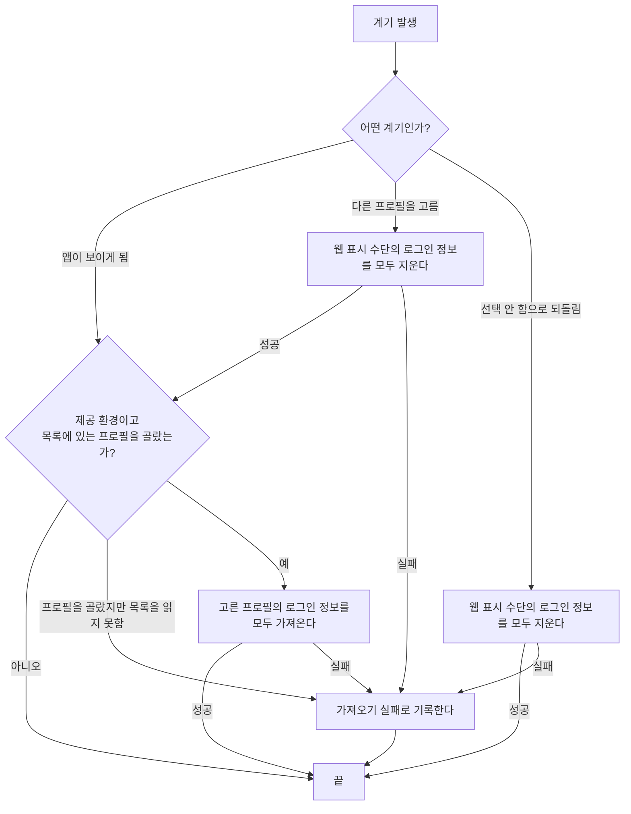
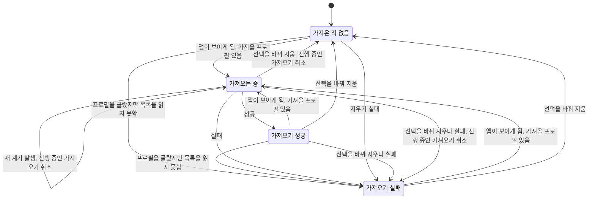

# Chrome 로그인 이어받기 스펙

이 문서는 사용자가 고른 Chrome 프로필의 로그인 정보를 앱 안 웹 표시 수단이 통째로 이어받아, 사용자가 웹 페이지 안에서 어느 사이트로 옮겨 가도 로그인 상태가 이어지는 규칙을 다룬다. 프로필을 고르는 화면과 조작은 [SettingBrowser 화면 스펙](./setting-browser.md)에서, 가져오는 동안과 가져온 뒤의 웹 페이지 표시는 [WebDetail 화면 스펙](./web-detail.md)에서 다룬다.

이번 범위는 어떤 환경에서 무엇을 언제 가져오고 지우는지, 가져오지 못했을 때 어떻게 다루는지까지다. 화면에서의 행동과 반응은 두 화면 스펙이 다루므로 이 문서에서는 `feature` 영역을 생략한다.

## domain

### 로그인 정보

이어받는 로그인 정보는 Chrome이 사이트별로 보관하는 쿠키다. 사이트가 로그인 상태를 쿠키로 유지하면 그 쿠키를 앱 안 웹 표시 수단에 넘겨 같은 사이트를 로그인된 상태로 열 수 있다.

앱 안 웹 표시 수단의 쿠키 보관 공간은 화면마다 따로 있지 않고 앱 전체에 하나다. 한 번 가져온 로그인 정보는 어느 화면의 웹 표시 수단에서든 함께 쓰이고, 사용자가 웹 페이지 안에서 링크를 따라 다른 사이트로 옮겨 가도 그 사이트의 로그인 정보가 이미 있으므로 로그인 상태가 이어진다.

쿠키가 아닌 방식으로 로그인 상태를 유지하는 사이트와 로그인 세션을 특정 브라우저에 묶는 사이트는 쿠키를 넘겨도 로그인 상태가 이어지지 않을 수 있다. 앱은 이를 미리 판별하지 않고, 로그인 상태가 이어지지 않아도 오류로 다루지 않는다.

### Chrome 프로필

Chrome은 프로필마다 로그인 정보를 따로 보관하므로, 이어받을 로그인 정보는 사용자가 고른 프로필 하나의 것이다. 프로필 목록은 이 기기의 Chrome이 기록해 둔 프로필 목록을 그대로 따르며, 각 프로필은 Chrome에서 사용자가 정한 프로필 이름으로 구분한다. 이름이 없는 프로필은 Chrome이 쓰는 폴더 이름으로 구분한다.

프로필의 순서는 Chrome이 기록한 순서를 그대로 따른다.

Chrome이 설치되어 있지 않거나 프로필 목록을 읽을 수 없으면 프로필 목록 조회는 실패다. 이때 사용자가 프로필을 골라 두었으면 로그인 정보 가져오기도 `가져오기 실패`로 끝난다. 프로필을 고르지 않았으면 목록을 읽지 않으므로 실패가 없다.

사용자가 프로필을 고르지 않았거나 고른 프로필이 목록에 없으면 로그인 정보를 가져오지 않는다. 고른 프로필을 저장하고 되살리는 규칙은 [SettingBrowser 화면 스펙](./setting-browser.md)의 `목록에 없는 프로필`을 따른다.

### 제공 환경

Chrome 로그인 이어받기는 macOS 데스크톱 앱에서만 제공한다. 앱 안 웹 표시 수단의 쿠키 보관 공간과 Chrome의 쿠키 보관 공간을 모두 다룰 수 있는 환경이 이곳뿐이기 때문이다.

Android, iOS, 웹과 macOS가 아닌 데스크톱에서는 제공하지 않는다. 제공하지 않는 환경에서는 설정 항목을 두지 않고 로그인 정보를 가져오거나 지우지 않는다.

### 가져오는 계기

로그인 정보는 웹 페이지를 열 때가 아니라 다음 계기에 가져온다. 어느 계기든 사용자가 목록에 있는 프로필을 골라 둔 상태여야 가져오고, 그렇지 않으면 그 계기에는 아무것도 가져오지 않는다.

| 계기 | 하는 일 |
| --- | --- |
| 앱이 보이게 됨 | 고른 프로필의 로그인 정보를 가져온다 |
| 사용자가 다른 프로필을 고름 | 앱 안 웹 표시 수단의 로그인 정보를 모두 지운 뒤 새로 고른 프로필의 로그인 정보를 가져온다 |
| 사용자가 `선택 안 함`으로 되돌림 | 앱 안 웹 표시 수단의 로그인 정보를 모두 지운다. 가져오지는 않는다 |

앱이 보이게 되는 것은 앱을 시작해 창이 처음 나타날 때와, 최소화하거나 숨겨 두었던 창이 다시 나타날 때다. 창이 보이는 채로 다른 창과 앱을 오가며 포커스만 바뀌는 것은 계기가 아니다. 사용자가 Chrome에서 새로 로그인하거나 로그아웃한 결과는 다음에 앱이 보이게 될 때 반영된다.

프로필을 고르는 계기는 SettingBrowser 화면에서 현재 선택과 다른 항목을 골라 저장이 이루어진 때다. 이미 선택한 항목을 다시 고르는 것은 계기가 아니다. 다만 저장된 프로필이 있는데 화면에 `선택 안 함`이 선택된 것으로 표시되는 경우(프로필 목록을 읽지 못했거나 저장된 프로필이 목록에 없는 경우)에 `선택 안 함`을 고르면 저장된 프로필이 지워지므로 `선택 안 함`으로 되돌림 계기다. 이 경우의 저장 기준은 [SettingBrowser 화면 스펙](./setting-browser.md)을 따른다. 앱이 보이게 되는 계기에는 지우지 않으며, 지우는 것은 사용자가 선택을 바꾼 때뿐이다.

가져오기가 진행 중일 때 새 계기가 발생하면 진행 중인 가져오기를 취소하고 새 계기의 일을 시작한다. 취소된 가져오기는 실패로 다루지 않는다.

### 가져오는 상태

로그인 정보 가져오기는 앱 전체에 하나의 상태를 가진다. 웹 페이지를 표시하는 화면은 이 상태를 보고 웹 표시 수단을 언제 열지와 실패를 알릴지를 정한다.

프로필을 골라 두었는데 목록을 읽지 못하면 `가져오는 중`을 거치지 않고 바로 `가져오기 실패`가 된다. 선택을 바꾸는 계기는 지운 뒤 `가져온 적 없음`이 되고, 새로 고른 프로필이 목록에 있으면 이어서 `가져오는 중`으로 넘어간다. 앱이 보이게 되는 계기에 가져올 프로필이 없으면 상태를 바꾸지 않는다. 제공하지 않는 환경에서는 언제나 `가져온 적 없음`이다.

이 상태는 앱을 실행하는 동안만 유지하며 앱을 종료하면 `가져온 적 없음`으로 돌아간다. 앱 안 웹 표시 수단의 쿠키 보관 공간은 앱을 종료해도 유지되므로, 상태가 `가져온 적 없음`이어도 이전 실행에서 가져온 로그인 정보는 남아 있다.

### 가져오는 대상

고른 프로필이 보관한 쿠키 전체를 가져온다. 사이트별로 고르지 않으며, 사용자가 웹 페이지 안에서 어느 사이트로 옮겨 가도 로그인 상태가 이어져야 하기 때문이다. Google 계정을 포함해 도메인으로 제외하는 사이트는 없다.

다음 쿠키는 가져오지 않는다.

- 만료 시각이 이미 지난 쿠키
- 특정 상위 사이트 안에서만 쓰도록 나뉜 쿠키. 앱 안 웹 표시 수단이 같은 구분을 표현하지 못한다.
- 값을 풀었지만 그 쿠키가 속한 사이트의 것인지 확인되지 않는 쿠키. Chrome이 값과 함께 기록해 둔 사이트 정보가 맞지 않으면 다른 사이트의 값일 수 있으므로 넘기지 않으며, 이는 가져오기 실패가 아니다.

가져오는 쿠키는 이름, 값, 도메인, 경로, 만료 시각, 보안 연결 전용 여부, 스크립트 접근 금지 여부, 사이트 간 전송 정책을 그대로 옮긴다.

### 가져오기 실패

Chrome이 설치되어 있지 않거나, 쿠키 보관 공간을 읽을 수 없거나, 쿠키를 풀 암호화 키를 얻지 못하거나, 앱 안 웹 표시 수단에 넘기지 못하면 가져오기 실패다.

실패해도 앱 안 웹 표시 수단은 그대로 쓸 수 있고, 이전에 가져와 남아 있던 로그인 정보도 지우지 않는다. 실패는 웹 페이지를 표시하는 화면이 사용자에게 알리며, 알리는 방식은 [WebDetail 화면 스펙](./web-detail.md)의 `로그인 정보 가져오기`를 따른다. 다시 시도는 따로 두지 않으며 다음 계기에 다시 가져온다.

고른 프로필에 쿠키가 하나도 없는 것은 실패가 아니다. 아무것도 넘기지 않고 성공으로 끝난다.

프로필을 바꾸는 계기에서 지우기에 실패하면 새 프로필의 로그인 정보를 가져오지 않고 가져오기 실패로 끝난다. 이전 프로필의 로그인 정보 위에 새 프로필의 것을 덧쓰면 두 프로필의 로그인 정보가 섞이기 때문이다.

`선택 안 함`으로 되돌리는 계기에서 지우기에 실패해도 가져오기 실패로 끝난다. 이때 지우지 못한 이전 프로필의 로그인 정보는 남아 있다.

## data

### Chrome 쿠키 읽기

고른 프로필의 쿠키 보관 공간을 읽는다. Chrome이 실행 중이어도 읽을 수 있도록 보관 공간을 직접 열지 않고 복사본을 만들어 읽고, 읽은 뒤 복사본은 지운다. Chrome의 쿠키 보관 공간은 바꾸지 않는다.

쿠키 값은 Chrome이 시스템 키체인의 `Chrome Safe Storage` 항목으로 암호화해 두므로, 그 항목을 읽어 복호화한다. 암호화된 쿠키가 하나도 없으면 키체인을 읽지 않는다. 시스템이 키체인 접근 허용을 물으면 사용자가 허용해야 읽을 수 있고, 사용자가 거부하거나 30초 안에 응답하지 않으면 가져오기 실패로 다룬다. 키체인에서 얻은 키는 앱이 실행되는 동안만 기억하고 기기에 저장하지 않는다.

Chrome이 아직 보관 공간에 쓰지 않은 쿠키는 가져올 수 없다. Chrome은 쿠키를 곧바로 보관 공간에 쓰지 않으므로 방금 로그인한 결과는 잠시 뒤에야 가져올 수 있다.

### Chrome 프로필 목록 읽기

프로필 목록은 Chrome이 프로필 정보를 기록해 두는 파일에서 읽는다. 파일이 없거나 읽을 수 없거나 형식을 해석할 수 없으면 조회 실패로 알린다. Chrome의 파일은 바꾸지 않는다.

프로필 목록은 SettingBrowser 화면에 들어올 때와 로그인 정보를 가져오는 계기마다 다시 읽는다. 사용자가 Chrome에서 프로필을 추가하거나 지운 결과는 그다음 읽을 때 반영된다.

### 앱 안 웹 표시 수단에 넘기기

가져온 쿠키는 앱 안 웹 표시 수단의 쿠키 보관 공간에 넣는다. 같은 이름, 도메인, 경로의 쿠키가 이미 있으면 가져온 값으로 바꾼다.

지울 때는 앱 안 웹 표시 수단의 쿠키 보관 공간에 있는 쿠키를 모두 지운다. 앱이 가져온 쿠키와 사용자가 웹 페이지 안에서 직접 로그인해 생긴 쿠키를 구분하지 않으며, 지운 뒤에는 어느 사이트도 로그인되지 않은 상태가 된다. 앱 안 웹 표시 수단은 고른 프로필을 비추는 창이므로 프로필을 바꾸면 이전 프로필의 흔적을 남기지 않는다.

웹 표시 수단의 쿠키 보관 공간은 앱을 종료하고 다시 시작해도 유지되므로 가져온 로그인 정보는 다음 실행에서도 남아 있다.

앱은 가져온 쿠키를 자체 저장 영역에 따로 보관하지 않고 서버로 보내지 않는다. 로그인 정보는 [데이터 동기화 스펙](../common/data-sync.md)의 동기화 대상이 아니다.
