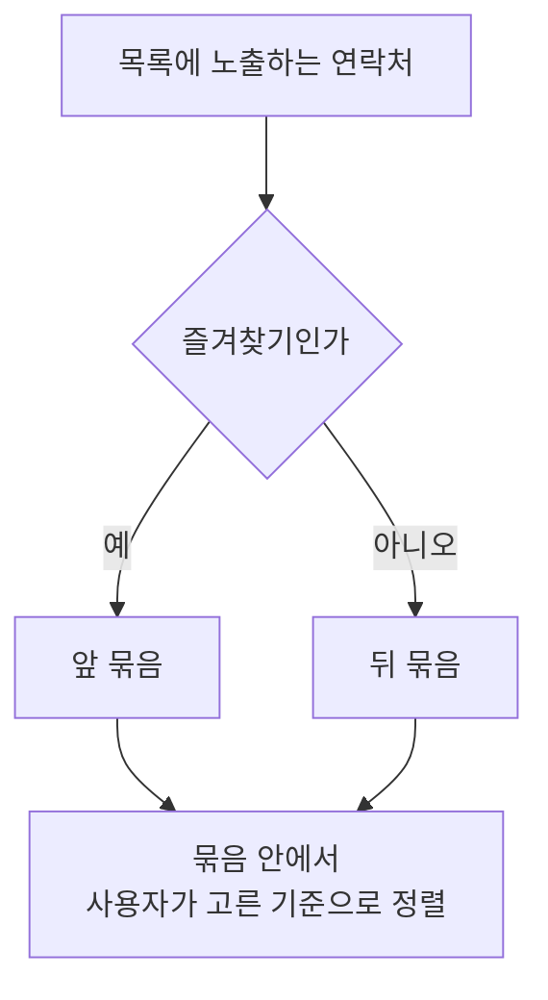

# ContactHome 화면 스펙

이 문서는 사용자가 `더보기`의 `연락처` 메뉴에서 진입하는 ContactHome 화면의 내용과 행동을 다룬다. `더보기` 메뉴 영역의 표시와 선택은 [MoreHome 화면 스펙](./more-home.md)에서, 세부 화면에서의 공통 내비게이션 노출 규칙은 [TopLevelNavigation 스펙](./top-level-navigation.md)에서, 연락처를 작성해 추가하는 흐름과 연락처가 갖는 정보는 [ContactAdd 화면 스펙](./contact-add.md)에서, 선택한 연락처를 확인하고 수정하고 삭제하는 흐름은 [ContactDetail 화면 스펙](./contact-detail.md)에서, 연락처 목록과 상세를 함께 사용하는 배치는 [Contact 목록·상세 배치 스펙](./contact-list-detail.md)에서, 나누어 불러오는 목록이 나타나는 순서와 아직 준비되지 않은 자리의 처리는 [페이지 조회 목록의 자리 표시 스펙](./paged-list-placeholder.md)에서, 목록이 비어 있을 때의 안내는 [목록 빈 상태 스펙](./list-empty-state.md)에서, 정렬 기준의 선택과 반영은 [목록 정렬 스펙](./list-sort.md)에서, 목록을 당겨 서버와 맞추는 조작은 [새로고침 스펙](./sync-refresh.md)에서, 연락처를 서버와 맞추는 규칙은 [데이터 동기화 스펙](../common/data-sync.md)에서 다룬다.

디자인: [ContactHome 화면 디자인](../../design/contact-home.md)

이번 범위는 `더보기`에서 ContactHome으로 이동하고, 계정에 저장된 연락처를 기기에서 불러와 즐겨찾기를 앞세운 목록으로 표시하고, 목록의 정렬 기준을 바꾸고, 목록을 당겨 서버와 다시 맞추고, ContactHome에서 연락처 추가와 연락처 상세로 이동하는 것까지다. 연락처의 즐겨찾기 여부와 생일이 무엇인지는 [ContactAdd 화면 스펙](./contact-add.md)이, 즐겨찾기를 바꾸는 조작은 [ContactDetail 화면 스펙](./contact-detail.md)이 소유한다.

연락처 검색은 이번 범위에서 정하지 않는다.

## feature

### 진입

사용자는 `더보기` 화면의 메뉴 영역에서 `연락처` 항목을 선택해 ContactHome 화면으로 이동한다.

### 연락처 목록

사용자는 ContactHome에서 계정에 저장된 연락처 전체를 목록으로 볼 수 있다. 사용자는 각 항목의 이름과 전화번호, 생일을 확인하고 그 연락처가 즐겨찾기인지 확인한다.

전화번호를 여러 개 가진 연락처는 첫 번째 전화번호만 목록에 표시한다. 전화번호가 하나도 없는 연락처는 그 자리를 비운다. 전화번호의 순서 기준은 [ContactAdd 화면 스펙](./contact-add.md)의 `전화번호`를 따른다.

생일이 있는 연락처는 저장된 생일을 목록에 표시하고, 저장된 달력 구분도 함께 알아볼 수 있게 표시한다. 생일이 없는 연락처는 그 자리를 비운다. 생일과 달력 구분의 규칙은 [ContactAdd 화면 스펙](./contact-add.md)의 `생일`을 따르며, 음력 생일도 저장된 연·월·일을 그대로 표시하고 양력으로 환산하지 않는다.

즐겨찾기인 연락처는 목록에서 즐겨찾기임을 알아볼 수 있게 표시한다. 목록에서는 즐겨찾기를 바꿀 수 없으며, 즐겨찾기를 바꾸는 조작은 [ContactDetail 화면 스펙](./contact-detail.md)의 `즐겨찾기`가 소유한다.

연락처의 설명, 키, 신발 사이즈, 고향은 목록에 표시하지 않는다. 이 값들은 [ContactAdd 화면 스펙](./contact-add.md)의 `연락처의 정보`가 정의한 대로 연락처에 기록되지만, 목록에서는 어떤 연락처인지 알아보는 데 필요한 이름, 전화번호, 생일만 보여 준다.

목록이 나타나는 순서와 아직 준비되지 않은 자리의 처리는 [페이지 조회 목록의 자리 표시 스펙](./paged-list-placeholder.md)을 따른다. 사용자는 목록을 계속 내려 계정의 연락처를 모두 확인할 수 있다.

연락처를 추가하면 그 연락처가 목록에 나타난다.

### 빈 상태

표시할 연락처가 하나도 없으면 목록 자리에 아직 연락처가 없으며 새로 추가할 수 있음을 알린다. 판정 시점, 빈 상태에서 할 수 있는 행동, 목록과의 전환은 [목록 빈 상태 스펙](./list-empty-state.md)을 따른다.

빈 상태에서도 사용자는 연락처 추가를 그대로 실행할 수 있다. 빈 상태에서 정렬을 고를 수 없는 것은 [목록 정렬 스펙](./list-sort.md)의 `준비 중과 빈 상태에서의 정렬`을 따른다.

### 새로고침

사용자는 목록을 아래로 당겨 계정 데이터를 서버와 다시 맞추도록 요청할 수 있다. 당기는 조작이 시작하는 동기화, 진행 표시 기준과 실패 처리는 [새로고침 스펙](./sync-refresh.md)을 따른다.

새로고침으로 내려받은 연락처는 사용자가 별도 조작을 하지 않아도 목록에 반영된다.

### 연락처 추가로 이동

사용자는 ContactHome에서 연락처 추가를 선택해 [ContactAdd 화면](./contact-add.md)으로 이동한다.

연락처 추가는 목록의 내용과 무관하게 언제나 실행할 수 있다. 노출할 연락처가 없어 목록이 비어 있는 상태에서도 사용자는 연락처 추가로 이동할 수 있다.

목록과 상세를 함께 사용할 수 있는 환경에서는 상세 영역에 이미 연락처 추가가 놓여 있으면 목록에서 추가를 실행하는 수단을 제공하지 않고, 선택한 연락처의 상세가 놓여 있으면 추가를 실행해 상세 영역을 연락처 추가로 바꾼다. 판단 기준은 [목록·상세 배치 공통 스펙](./list-detail-pane.md)의 `추가 진입 수단`을 따른다.

연락처 추가에서 뒤로 돌아오면 ContactHome으로 돌아오고, 추가한 연락처가 반영된 목록을 본다.

### 정렬 선택

사용자는 목록 위에서 현재 정렬을 확인하고 다른 기준으로 바꿀 수 있다. 고를 수 있는 기준과 정렬 선택·반영·유지의 결과는 [목록 정렬 스펙](./list-sort.md)을 따른다.

### 연락처 상세로 이동

사용자는 목록의 연락처를 선택해 그 연락처의 [ContactDetail 화면](./contact-detail.md)으로 이동한다.

연락처 상세에서 뒤로 돌아오면 ContactHome으로 돌아오고, 사용자가 보고 있던 목록을 그대로 본다.

목록과 상세를 함께 사용할 수 있는 환경에서는 이동하지 않고 상세 영역이 선택한 연락처의 상세로 바뀐다. 그 기준은 [Contact 목록·상세 배치 스펙](./contact-list-detail.md)의 `상세 영역의 구성`을 따른다.

아직 준비되지 않은 자리는 선택할 수 없다. 자리 표시 상태의 자리를 다루는 규칙은 [페이지 조회 목록의 자리 표시 스펙](./paged-list-placeholder.md)의 `자리 표시`를 따른다.

### 뒤로가기

사용자가 ContactHome의 뒤로가기 동작을 실행하면 ContactHome이 단독으로 표시되는지 상세 영역과 함께 표시되는지, 상세 영역에 어떤 화면이 놓여 있는지와 관계없이 연락처 화면 전체를 떠나 [TopLevelNavigation 스펙](./top-level-navigation.md)의 `더보기 하위 화면의 뒤로가기`에 따라 `더보기`로 돌아간다.

상세 영역과 함께 표시되는 상태에서 시스템 뒤로가기를 사용한 결과는 [Contact 목록·상세 배치 스펙](./contact-list-detail.md)의 `뒤로가기`를 따른다.

## domain

### 목록에 노출하는 연락처

목록에는 현재 사용자 계정과 연결되어 있고 삭제되지 않은 연락처를 모두 노출한다. 계정 조회 규칙은 [계정 조회 스펙](./account.md)을 따르며, 현재 계정을 확인할 수 없으면 노출하는 연락처는 없다.

목록은 사용자가 확인하는 만큼 이어서 준비한다. 아직 준비되지 않은 구간의 연락처도 노출 기준을 만족하는 항목에 포함되며, 사용자가 목록을 얼마나 확인했는지는 노출 기준과 정렬 기준을 바꾸지 않는다.

### 목록 정렬

목록은 즐겨찾기인 연락처를 모두 앞에 놓고, 즐겨찾기가 아닌 연락처를 그 뒤에 놓는다. 즐겨찾기 여부의 정의는 [ContactAdd 화면 스펙](./contact-add.md)의 `즐겨찾기`를 따른다.

두 묶음 안에서는 사용자가 고른 기준의 순서를 그대로 적용한다. 사용자가 정렬을 고르지 않았으면 이름 오름차순이고, 고를 수 있는 다른 기준과 그 순서는 [목록 정렬 스펙](./list-sort.md)이 정한다. 최근 수정순에서 같은 묶음 안의 수정 시각이 같은 연락처끼리는 이름 오름차순으로 놓는다. 같은 묶음 안에서 이름까지 같은 연락처끼리의 순서는 정하지 않는다.

즐겨찾기 우선은 사용자가 고른 기준과 무관하게 언제나 적용한다. 사용자가 이름순을 골랐든 최근 수정순을 골랐든 즐겨찾기인 연락처가 먼저 나타난다. 자주 찾는 연락처를 앞에 두려고 즐겨찾기를 표시했는데 정렬을 바꾸면 그 연락처가 목록 뒤로 밀리는 일이 없게 하기 위한 것이다.

즐겨찾기 우선은 목록에 노출하는 연락처를 바꾸지 않는다. 즐겨찾기가 하나도 없으면 목록은 고른 기준의 순서 하나로만 놓인다.

### 목록 갱신

연락처가 추가되거나 저장 상태가 바뀌면 목록을 노출 기준과 정렬 기준에 따라 자동 갱신한다.

연락처의 즐겨찾기 여부가 바뀌면 그 연락처는 즐겨찾기 묶음의 안팎으로 옮겨지고, 함께 갱신된 수정 시각이 최근 수정순의 자리도 바꾼다. 갱신 기준은 [ContactDetail 화면 스펙](./contact-detail.md)의 `즐겨찾기 변경`을 따른다.

### 화면 유지

화면이 회전하거나 다른 앱에 다녀와도, 연락처 추가·연락처 상세에서 돌아와도 사용자가 보던 목록 위치를 그대로 유지한다. `더보기`로 나갔다가 다시 들어오거나 앱을 다시 실행하면 목록의 맨 위부터 보여 준다. 정렬 선택의 유지 기준은 [목록 정렬 스펙](./list-sort.md)의 `정렬 선택 유지`를 따른다.

## data

### 목록 조회

목록에 표시할 연락처는 현재 사용자 계정을 기준으로 기기에 저장된 연락처에서 `domain`의 노출 기준과 정렬 순서로 사용자가 목록을 내리는 만큼 나누어 불러온다. 페이지를 이어서 조회하는 기준은 [페이지 조회 목록의 자리 표시 스펙](./paged-list-placeholder.md)의 `페이지 조회`를 따른다.

즐겨찾기 우선도 이 조회의 정렬 조건에 함께 넘긴다. 조회한 뒤 기기에서 즐겨찾기를 앞으로 다시 옮기지 않으므로, 아직 조회하지 않은 구간에 있는 즐겨찾기 연락처가 목록 뒤쪽에 나타나지 않는다. 정렬을 조회 조건으로 넘기는 기준은 [목록 정렬 스펙](./list-sort.md)의 `정렬된 목록 조회`를 따른다.

각 연락처의 전화번호 목록은 연락처와 함께 저장한 순서 그대로 조회하고, 생일과 달력 구분, 즐겨찾기 여부는 연락처가 가지는 값으로 함께 조회한다.

저장된 연락처가 바뀌면 조회 결과도 그에 맞게 갱신되어 목록에 반영된다. 다른 화면에서 추가·수정·삭제하거나 즐겨찾기를 바꾼 연락처와, 다른 기기에서 바뀌어 동기화로 내려받은 연락처도 사용자가 목록을 당기지 않아도 바로 보인다.

목록을 조회하지 못하면 연락처가 없는 것과 같게 다루고 별도의 오류 안내는 제공하지 않는다. 이때의 표시는 [목록 빈 상태 스펙](./list-empty-state.md)의 `빈 상태 판정 기준`을 따른다.

ContactHome에 진입하는 것만으로는 서버에서 연락처를 다시 가져오지 않는다. 서버와 맞추는 조회는 [데이터 동기화 스펙](../common/data-sync.md)이 정한 계기에서만 일어나며, 사용자가 목록을 당겨 요청하는 것도 그 계기 중 하나다.
