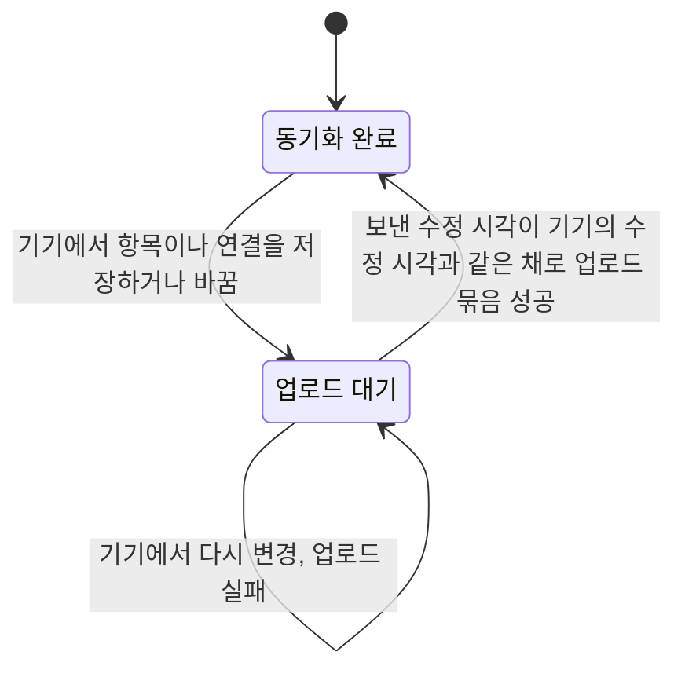
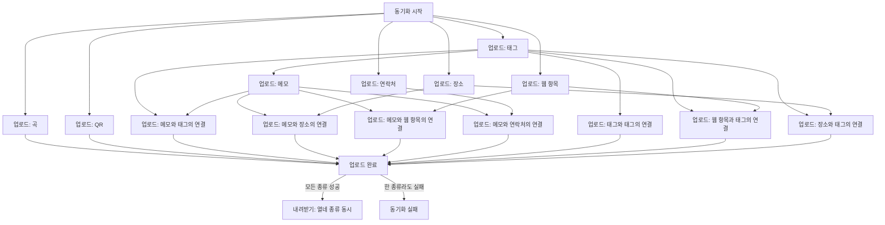
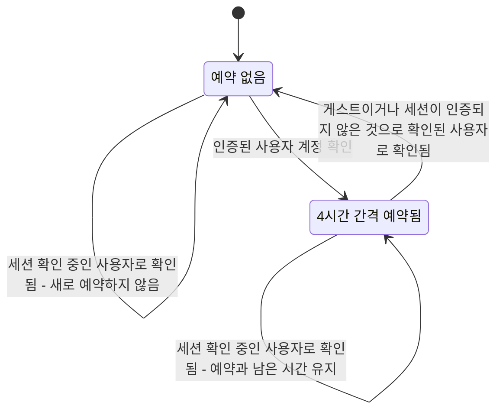

# 데이터 동기화 앱 스펙

이 문서는 앱이 계정 데이터를 서버와 맞추는 흐름을 다룬다. 앱이 언제 동기화하는지, 기기에 남겨 둔 변경을 어떤 순서로 올리는지, 내려받은 내용을 어떻게 반영하는지, 실패와 재시도, 로그인·로그아웃과 오랫동안 동기화하지 못한 기기의 자료 처리를 이 문서가 소유한다.

동기화 대상, 항목과 연결의 상태와 시각의 의미, 충돌 기준, 삭제의 의미, 주고받는 정보는 [데이터 동기화 스펙](../common/data-sync.md)을, 서버가 요청을 확인하고 저장하고 내려줄 범위를 정하는 규칙은 [데이터 동기화 서버 스펙](../server/data-sync.md)을 따른다.

동기화 자체는 화면 없이 백그라운드에서 진행되므로 이 문서에서는 `feature` 영역을 생략한다. 사용자가 화면에서 동기화를 요청하는 조작과 진행을 알리는 기준은 [새로고침 스펙](./sync-refresh.md)에서, 로그아웃 전에 업로드 대기 항목을 확인하는 흐름은 [MoreHome 화면 스펙](./more-home.md)에서 다룬다.

## domain

### 로컬 우선 원칙

메모, 태그, 장소, 웹 항목, 연락처, 곡, QR과 일곱 종류의 연결에 생기는 모든 변경은 항상 기기에 먼저 저장되고, 화면은 기기에 저장된 내용을 기준으로 표시된다.

동기화는 기기 반영이 끝난 뒤 백그라운드에서 진행되며, 진행 여부나 결과가 사용자의 화면 사용과 다음 행동을 막지 않는다.

동기화가 실패하거나 서버에 닿지 못해도 기기에 저장된 사용자 데이터는 사라지거나 되돌아가지 않는다. 이 원칙의 예외는 아래 `강제 전체 재동기화` 하나뿐이다.

### 동기화 상태

계정과 연결된 열네 종류의 항목은 모두 계정과 항목의 연결 단위로 동기화 상태를 가진다.

동기화 상태는 다음 중 하나다.

- 업로드 대기: 기기에서 바뀐 내용이 아직 서버에 반영되지 않은 상태
- 동기화 완료: 현재 기기에 서버로 보낼 대기 항목이 없는 상태. 서버가 현재 기기의 내용을 최신으로 받아들였다는 뜻은 아니다.

사용자의 행동으로 동기화 대상 항목이나 연결이 기기에 저장되거나 바뀌면 그 항목은 업로드 대기 상태가 된다. 이미 업로드 대기 상태였다면 별도의 항목이 추가로 쌓이지 않는다.

업로드에 실패해도 항목은 업로드 대기 상태를 유지하며 별도의 실패 상태나 시도 횟수를 기록하지 않는다.

동기화 상태는 계정과 항목에 대한 부가 정보이며, 항목의 내용, 완료 여부, 삭제 여부, 시각에는 영향을 주지 않는다.

업로드 대기 여부와 내려받기 위치는 서로 독립적으로 기록한다. 내려받기가 진행되어도 업로드 대기 여부는 바뀌지 않고, 항목이 업로드 대기가 되어도 내려받기 위치는 되돌아가지 않는다.

### 업로드 대기 해제 기준

업로드 묶음이 성공하면, 그 묶음에 담아 보낸 수정 시각이 현재 기기의 수정 시각과 같은 항목만 동기화 완료 상태가 된다. 서버가 항목별 반영 결과를 알려 주지 않아도 기기는 보낸 수정 시각과 현재 수정 시각만 비교해 판단한다.

업로드가 진행되는 동안 기기에서 다시 변경된 항목은 수정 시각이 달라지므로 업로드 대기 상태를 유지하고 다음 동기화 계기에서 다시 시도된다.

보낸 항목의 수정 시각이 서버의 같은 항목보다 이르러 서버가 내용을 반영하지 않았더라도, 그 항목은 동기화 완료 상태가 된다. 서버의 최신 변경 순번이 그 기기의 내려받기 위치보다 뒤에 있으면 이어지는 내려받기가 서버 내용을 기기에 반영한다. 내려받기 위치가 이미 그 순번을 지난 경우에는 같은 서버 변경을 다시 받지 않으며, [데이터 동기화 스펙](../common/data-sync.md)의 `충돌 기준`이 전제하는 시각 순서를 벗어난 변경을 따로 복구하지 않는다.

업로드 묶음이 실패하면 그 묶음의 어떤 항목도 동기화 완료 상태가 되지 않는다.

### 동기화 단계와 처리 순서

한 번의 동기화는 기기의 변경을 서버로 보내는 업로드, 서버의 변경을 기기로 가져오는 내려받기 순서로 진행한다.

업로드는 종류 사이의 참조 관계가 요구하는 선후 관계만 지키고, 서로 참조하지 않는 종류는 동시에 진행한다. 서버는 연결이 가리키는 두 항목과 메모의 대표 태그가 모두 계정과 연결되어 있을 때만 반영하므로, 각 종류는 자신이 참조하는 종류의 업로드가 모두 끝난 뒤에 시작한다.

| 종류 | 먼저 끝나야 하는 종류 |
| --- | --- |
| 태그 | 없음 |
| 장소 | 없음 |
| 웹 항목 | 없음 |
| 연락처 | 없음 |
| 곡 | 없음 |
| QR | 없음 |
| 메모 | 태그 |
| 메모와 태그의 연결 | 태그, 메모 |
| 메모와 장소의 연결 | 장소, 메모 |
| 메모와 웹 항목의 연결 | 웹 항목, 메모 |
| 메모와 연락처의 연결 | 연락처, 메모 |
| 태그와 태그의 연결 | 태그 |
| 웹 항목과 태그의 연결 | 태그, 웹 항목 |
| 장소와 태그의 연결 | 태그, 장소 |

각 종류는 그 계정의 업로드 대기 항목 전체를 기기에서 한 번에 모은 뒤, 한 번의 서버 요청에 최대 100개씩 담아 차례로 보낸다. 업로드할 항목이 없는 종류는 서버 요청 없이 끝난 것으로 보므로, 그 종류를 기다리던 종류가 곧바로 시작한다.

한 종류의 업로드는 그 종류의 모든 묶음이 성공했을 때 끝난 것으로 본다. 한 묶음의 업로드가 실패하면 그 종류의 남은 묶음을 보내지 않고 그 종류를 실패로 끝낸다. 앞서 성공한 묶음의 업로드 대기 해제는 그대로 유지된다.

실패한 종류를 먼저 끝나야 하는 종류로 두는 종류는 시작하지 않으며, 그 종류를 기다리던 종류도 같은 기준으로 시작하지 않는다. 예를 들어 태그 업로드가 실패하면 메모와, 메모와 태그의 연결, 태그와 태그의 연결, 웹 항목과 태그의 연결, 장소와 태그의 연결은 시작하지 않고, 메모를 기다리는 메모와 장소의 연결, 메모와 웹 항목의 연결, 메모와 연락처의 연결도 시작하지 않는다.

실패한 종류를 기다리지 않는 종류는 영향을 받지 않고 끝까지 진행한다. 예를 들어 태그 업로드가 실패해도 장소와 웹 항목과 연락처와 곡과 QR의 업로드는 남은 묶음을 모두 보내고, 메모 업로드가 실패해도 태그와 태그의 연결, 웹 항목과 태그의 연결, 장소와 태그의 연결은 그대로 진행한다. 곡과 QR은 어떤 종류도 참조하지 않고 어떤 연결 종류도 곡과 QR을 참조하지 않으므로 다른 종류의 성패에 영향을 주거나 받지 않는다. 한 번의 동기화에서 올릴 수 있는 항목을 최대한 올려 두면 다음 계기에 다시 보낼 항목이 줄어든다.

한 종류라도 업로드에 실패하면 모든 종류의 업로드가 끝나기를 기다린 뒤 그 동기화를 실패로 보고 내려받기를 진행하지 않는다. 실패한 항목은 업로드 대기 상태로 남아 다음 동기화 계기에 다시 시도한다.

종류마다 따로 반영되므로 관련 종류의 동기화가 모두 끝나기 전에는 서버나 다른 기기에 중간 상태가 보일 수 있다. 허용하는 중간 상태와 복구 범위는 [데이터 동기화 스펙](../common/data-sync.md)의 `종류 사이의 중간 상태`를 따른다.

### 내려받기 병렬 처리

내려받기는 열네 종류를 동시에 진행하며 종류 사이에 순서를 두지 않는다. 어느 종류가 먼저 끝나는지는 정해지지 않는다.

한 종류가 먼저 기기에 반영되어도 다른 종류의 데이터가 불완전하게 보이지 않는다. 대표 태그가 가리키는 태그가 아직 기기에 없으면 그 메모는 사라지거나 잘못 보이지 않고 표시 색상만 메모 자신의 컬러로 대신 표시되며, 가리키는 항목이 아직 기기에 없는 연결은 어느 화면에도 나타나지 않는다. 자세한 규칙은 [메모 대표 태그 스펙](../common/memo-primary-tag.md)의 `내려받기 순서와 표시`와 [항목 연결 공통 스펙](../common/entity-link.md)의 `내려받기 순서와 표시`를 따른다.

장소, 웹 항목, 연락처, 곡, QR은 다른 종류를 참조하지 않으므로 먼저 내려받아져도 그대로 [PlaceHome 화면 스펙](./place-home.md), [WebHome 화면 스펙](./web-home.md), [ContactHome 화면 스펙](./contact-home.md), [PlaylistHome 화면 스펙](./playlist-home.md), [QrHome 화면 스펙](./qr-home.md)의 노출 기준에 따라 목록에 나타난다. 장소는 지도 핀에도 나타난다.

한 종류의 내려받기가 실패해도 다른 종류의 내려받기는 중단되지 않고 끝까지 진행한다. 실패한 종류의 내려받기 위치는 마지막으로 저장에 성공한 위치에 머물고, 성공한 종류의 내려받기 위치는 그대로 전진한다.

열네 종류의 내려받기가 모두 끝나야 그 동기화의 내려받기 단계가 끝난 것으로 보고, 하나라도 실패하면 그 동기화는 실패로 본다.

### 동기화 계기

다음 계기에 계정의 업로드 대기 항목을 모아 업로드하고 서버의 변경을 내려받는다.

- 사용자의 행동으로 동기화 대상 항목이나 연결이 기기에 저장되거나 바뀌었을 때. 메모의 추가·수정·복사·이동·완료·다시 시작·삭제·실행 취소와 대표 태그 지정·해제, 태그의 추가·수정·완료·다시 시작·삭제·실행 취소, 장소·웹 항목·곡의 추가·수정·삭제·실행 취소, QR의 추가·삭제·실행 취소, 연락처의 추가·수정·삭제·실행 취소와 즐겨찾기 변경, 일곱 종류의 연결을 만들거나 해제한 것이 모두 포함된다.
- 앱이 시작되어 인증된 계정이 확인되었을 때
- 앱이 다시 활성 상태가 되어 인증된 계정이 확인되었을 때. 활성 상태의 기준은 플랫폼마다 다르며 아래 표를 따른다.
- 확인된 계정이 다른 계정으로 바뀌었거나, 같은 계정의 이메일이나 프로필 이미지나 로그인 세션의 인증 여부가 바뀌었을 때. 같은 계정의 정보만 바뀐 경우의 진행 표시 여부는 [새로고침 스펙](./sync-refresh.md)의 `새로고침 계기`를 따른다.
- 앱 화면이 다시 만들어졌을 때. 계정이 그대로여도 계기가 된다.
- 사용자가 화면에서 새로고침을 요청했을 때. 대상 화면과 진행 표시 기준은 [새로고침 스펙](./sync-refresh.md)을 따른다.
- 4시간이 지나 주기 동기화가 돌아왔을 때. 예약과 실행 기준은 아래 `주기 동기화`를 따른다.

어느 계기든 동기화를 시작하기 전에 그 계정이 아래 `강제 전체 재동기화`의 조건에 해당하는지 먼저 판단한다. 해당하면 일반 동기화 대신 강제 전체 재동기화를 시작한다.

계기가 생긴 시점에 계정이 인증된 사용자가 아니면 동기화를 요청하지 않는다. 게스트이거나, 사용자 정보는 있지만 로그인 세션이 인증되지 않은 상태가 여기에 해당한다. 이때 항목은 업로드 대기 상태로 남는다.

앱이 시작된 직후에는 로그인 세션의 인증 여부가 아직 확인되지 않을 수 있다. 이때는 동기화를 시도하지 않고 인증된 계정이 확인될 때까지 기다린 뒤 동기화를 시작한다. 앱을 사용하는 동안 로그인이 완료되어 인증된 계정이 확인되는 것도 같은 계기로 본다.

앱이 활성 상태가 아닌 동안에는 계정 변화를 계기로 판단하지 않는다. 앱이 다시 활성 상태가 되면 그 시점에 확인된 계정으로 동기화를 시작한다.

| 플랫폼 | 활성 상태 |
| --- | --- |
| Android, iOS | 앱이 화면에 보이는 동안 |
| 데스크톱 앱 | 앱 창이 최소화되지 않고 포커스를 가진 동안 |
| 웹 | 브라우저 탭이 보이고 페이지가 포커스를 가진 동안 |

Android와 iOS에서는 앱이 화면에 다시 보이게 되는 것이 계기다. 데스크톱 앱과 웹에서는 앱 창이나 브라우저 탭이 보이기만 하는 것은 계기가 아니며, 사용자가 다른 창이나 탭에서 앱으로 돌아와 포커스를 얻었을 때 계기가 된다. 데스크톱과 웹에서는 앱이 보이는 채로 다른 창을 함께 쓰는 일이 흔하므로, 사용자가 실제로 앱으로 돌아온 시점을 계기로 삼는다.

앱이 활성 상태로 머무는 동안 같은 계정이 같은 내용으로 다시 확인되기만 한 경우에는 동기화를 다시 시작하지 않는다. 앱 화면이 다시 만들어진 경우는 예외로, 위 목록과 같이 계기가 된다. 로그인 세션이 자동으로 갱신되어도 계정 정보와 인증 여부가 바뀌지 않으므로 새 계기가 되지 않는다.

로그아웃되어 계정이 게스트가 되는 것은 동기화 계기가 아니다.

동기화가 진행 중일 때 새 계기가 발생하면 진행 중인 동기화를 취소하고 새 동기화를 시작한다. 취소로 반영되지 못한 항목과 진행 중에 새로 대기 상태가 된 항목은 새로 시작된 동기화에서 함께 시도된다.

주기 동기화는 이 취소 후 재시작 규칙의 예외다. 주기 동기화는 다른 계기로 진행 중인 동기화를 취소하지 않고, 다른 계기도 진행 중인 주기 동기화를 취소하지 않는다.

실패한 항목을 같은 계기 안에서 곧바로 다시 시도하지 않는다. 실패 항목은 다음 계기에서 다시 시도한다.

### 주기 동기화

앱을 열지 않아도 다른 기기에서 바뀐 내용이 기기에 반영되도록, 인증된 사용자 계정이 확인되면 4시간 간격의 주기 동기화를 예약한다.

예약한 시점부터 4시간이 지난 뒤 첫 주기 동기화가 실행되고, 이후 4시간 간격으로 반복한다. 계정을 확인한 직후에는 계정 확인 계기의 동기화가 이미 실행되므로 주기 동기화를 곧바로 실행하지 않는다.

이미 예약되어 있는 상태에서 계정이 다시 확인되면, 같은 계정이든 다른 계정이든 다음 주기까지 남은 시간을 그대로 유지한다. 사용자가 앱을 4시간보다 자주 열어도 주기 동기화가 계속 미뤄지지 않는다.

예약에는 대상 계정을 담지 않는다. 주기 동기화가 돌아오면 그 시점에 확인된 계정의 항목을 동기화하므로, 확인된 계정이 다른 계정으로 바뀌어도 예약을 다시 잡지 않는다. 실행 시점의 판단은 아래 `실행 시점의 계정 확인`을 따른다.

계정이 게스트로 확인되거나 로그인 세션이 인증되지 않은 것으로 확인된 사용자로 확인되면 예약을 해제하고, 해제된 뒤에는 주기 동기화가 실행되지 않는다. 다시 인증된 사용자 계정이 확인되면 그 시점부터 4시간을 새로 센다. 이 규칙은 앞으로의 예약을 정할 때만 적용하며, 이미 실행을 시작한 동기화 작업이 같은 상태의 계정을 만났을 때는 아래 `실행 시점의 계정 확인`에 따라 세션이 갱신될 때까지 기다린다.

사용자 정보는 있지만 로그인 세션을 아직 확인하는 중이면 예약을 해제하지도 새로 잡지도 않고 그대로 둔다. 앱이 시작되어 저장된 로그인 세션을 갱신하는 동안과, 오프라인 같은 네트워크 문제나 서버의 일시적인 오류로 세션 갱신을 마치지 못한 동안이 여기에 해당한다. 따라서 앱을 열 때마다 예약이 해제되었다가 다시 잡혀 4시간이 새로 시작되지 않고, 오프라인으로 앱을 열어도 예약이 유지된다. 세션 확인 중과 인증되지 않은 것으로 확인됨의 구분은 [계정 조회 스펙](./account.md)의 `세션 갱신 여부`를 따른다.

예약을 정하려고 계정을 확인하다가 계정 조회 자체가 실패하면 예약을 바꾸지 않는다. 이미 있던 예약은 해제하지 않고, 예약이 없었으면 새로 잡지 않는다.

4시간은 실행 간격의 기준이며 정확한 실행 시각을 보장하지 않는다. 시스템 사정으로 실행이 늦어질 수 있고, 늦어진 경우에도 실행한 시점을 기준으로 다음 주기를 센다.

주기 동기화가 실패해도 예약은 해제되지 않고 다음 주기에 다시 시도한다. 실패 보고는 아래 `동기화 실패 보고`를 따른다.

주기 동기화는 진행 표시 대상이 아니다. 사용자가 앱을 보고 있는 동안 주기 동기화가 실행되어도 진행 중임을 표시하지 않는다. 표시 기준은 [새로고침 스펙](./sync-refresh.md)의 `새로고침 계기`를 따른다.

예약을 어디까지 유지하고 언제 실행하는지는 플랫폼마다 다르다.

| 플랫폼 | 예약 유지 | 실행 조건 |
| --- | --- | --- |
| Android | 앱을 종료해도 유지 | 네트워크에 연결되어 있을 때 |
| iOS | 앱을 종료해도 유지 | 앱이 화면에 보이지 않고 네트워크에 연결되어 있을 때 |
| 데스크톱 앱, 웹 | 앱이 실행되는 동안만 유지 | 네트워크 연결을 확인하지 않고 실행 |

Android와 iOS에서는 주기 동기화가 운영체제의 백그라운드 작업으로 예약되어 앱이 종료되어도 예약이 남고, 시스템이 앱을 깨워 동기화를 실행한다. 실행 시점에 기기가 네트워크에 연결되어 있지 않으면 실행하지 않고 연결된 뒤에 실행한다. 아래 `즉시 실행 요청`은 주기 동기화에 적용하지 않는다.

iOS에서는 운영체제가 앱이 화면에 보이지 않는 동안에만 주기 동기화를 실행한다. 사용자가 앱을 4시간 넘게 계속 보고 있어도 그동안에는 주기 동기화가 실행되지 않고, 앱이 화면에서 벗어난 뒤 운영체제가 정한 시점에 실행된다. iOS에서 4시간은 그 전에는 실행하지 않는 최소 간격이며, 운영체제는 기기 상태와 사용 이력에 따라 실행을 더 늦출 수 있다. 주기 동기화가 실행되면 이번 실행의 성패와 관계없이 다음 주기를 먼저 예약한다. 운영체제가 정한 실행 시간이 끝나면 진행 중인 주기 동기화는 중단되고, 반영되지 못한 항목은 업로드 대기 상태로 남는다. 이 중단은 취소와 같이 `동기화 실패 보고`의 대상이 아니다. 시뮬레이터처럼 백그라운드 작업을 허용하지 않는 환경에서는 예약이 받아들여지지 않으며, 다음 계정 확인 때 다시 예약을 시도한다.

데스크톱 앱과 웹에서는 앱이 실행되는 동안에만 예약이 유지된다. 앱이 종료되면 예약이 사라지고, 앱을 다시 실행해 인증된 계정이 확인되면 그 시점부터 4시간을 새로 센다. 네트워크 연결 여부는 확인하지 않으므로 연결이 없으면 그 주기의 동기화는 실패하고 항목은 업로드 대기 상태로 남는다.

### 동기화 실패 보고

한 번의 동기화가 실패하면 그 동기화마다 오류 보고 하나를 남긴다. 오류 보고 기록 수단의 동작과 플랫폼 제약은 [앱 로깅](./app-logging.md)의 오류 보고 기록을 따른다.

업로드 묶음 실패와 내려받기 실패를 모두 보고하며, 오프라인이나 통신 오류로 인한 실패도 보고에서 제외하지 않는다. 계정 상태를 확인하지 못해 끝난 동기화도 실패로 보고한다. 따라서 네트워크 연결을 확인하지 않고 동기화를 시작하는 플랫폼에서는 오프라인 상태가 이어지는 동안 동기화 계기마다 보고가 남는다.

어느 단계와 어느 종류에서 실패했는지는 보고에 담긴 실패 원인으로 구분한다.

취소 후 재시작 규칙에 따라 진행 중인 동기화가 취소된 것은 실패가 아니므로 보고하지 않는다.

### 실행 시점의 계정 확인

동기화 요청에는 대상 계정을 담지 않는다. 백그라운드 작업이 실행을 시작할 때 현재 계정을 직접 확인하고, 그 계정의 항목만 동기화한다. 요청한 시점과 실행하는 시점 사이에 로그인한 계정이 바뀌어도 기기에 남아 있는 다른 계정의 항목이 잘못 올라가지 않는다.

작업은 계정이 다음 둘 중 하나로 확정될 때까지 기다린 뒤 동기화 여부를 판단한다. 계정 상태와 세션 갱신 여부의 결정 기준은 [계정 조회 스펙](./account.md)을 따른다.

| 확정된 계정 | 결과 |
| --- | --- |
| 게스트 | 동기화할 계정 데이터가 없으므로 아무것도 동기화하지 않고 정상적으로 끝낸다 |
| 세션이 갱신된 사용자 | 그 계정의 업로드 대기 항목을 올리고 서버의 변경을 내려받는다 |

세션이 갱신되지 않은 사용자는 위 둘 중 어느 쪽으로도 확정된 것으로 보지 않고 계속 기다린다. 이 절은 이미 실행을 시작한 동기화 작업을 다루며, 앞으로의 주기 동기화 예약을 해제할지는 위 `주기 동기화`가 정한다.

| 확인된 계정 | 결과 |
| --- | --- |
| 세션 확인 중인 사용자 | 판단하지 않고 세션이 갱신될 때까지 기다린다 |
| 세션이 인증되지 않은 것으로 확인된 사용자 | 판단하지 않고 세션이 갱신될 때까지 기다린다 |

게스트로 끝낸 작업은 실패가 아니므로 `동기화 실패 보고`의 대상이 아니다.

사용자 정보는 있지만 로그인 세션이 아직 갱신되지 않은 동안에는 어느 쪽으로도 판단하지 않고 계속 기다린다. 세션 확인 중인 사용자뿐 아니라 세션이 인증되지 않은 것으로 확인된 사용자도 같게 다루며, 이 경우 작업은 아무것도 동기화하지 않은 채 끝나지도 실패로 끝나지도 않는다. 두 상태의 구분은 [계정 조회 스펙](./account.md)의 `세션 갱신 여부`를 따른다. 앱이 종료된 상태에서 시스템이 작업을 깨우면 저장된 사용자 정보가 먼저 확인되고 로그인 세션은 그보다 늦게 확인되므로, 기다리지 않으면 깨어난 작업이 매번 아무것도 동기화하지 못하고 끝난다.

기다리는 시간에는 상한을 두지 않는다. 대기가 길어져 운영체제가 정한 백그라운드 작업 실행 시간을 넘기면 시스템이 작업을 중단하며, 반영되지 못한 항목은 업로드 대기 상태로 남아 다음 동기화 계기에서 다시 시도된다.

### 강제 전체 재동기화

삭제된 항목은 서버에서 일정 기간이 지나면 영구히 제거되므로, 오랫동안 동기화하지 못한 기기는 그 사이에 다른 기기에서 삭제된 항목을 전달받지 못할 수 있다. 그런 기기에는 이미 삭제된 항목이 계속 남는다. 영구 제거 기준은 [데이터 동기화 서버 스펙](../server/data-sync.md)의 `삭제된 항목의 영구 제거`를 따른다.

이를 막기 위해, 동기화 계기가 발생했을 때 그 계정을 마지막으로 동기화한 시각에서 30일이 지났으면 일반 동기화 대신 강제 전체 재동기화를 시작한다.

30일은 서버가 삭제된 항목을 보존하는 60일보다 짧다. 마지막 동기화 이후에 생긴 삭제는 30일을 넘지 않아 아직 서버에 남아 있고, 그보다 이전의 삭제는 이미 내려받았다.

마지막 동기화 시각은 계정별로 기기에 기록하며, 한 번의 동기화에서 업로드와 내려받기가 모두 성공했을 때만 갱신한다. 동기화가 실패하면 갱신하지 않으므로, 오프라인이 이어져 동기화에 계속 실패하는 기기도 마지막 성공에서 30일이 지나면 판정에 걸린다.

기록이 없는 계정은 경과하지 않은 것으로 본다. 한 번도 동기화에 성공하지 못한 계정은 내려받기 위치도 없어 이미 처음부터 받는 상태이기 때문이다.

여러 계정을 번갈아 쓰는 기기에서도 각 계정이 자신의 마지막 동기화 시각으로 판단된다.

강제 전체 재동기화는 다음 순서로 진행한다.

1. 그 계정의 기기 데이터를 한 번에 모두 지운다. 열네 종류의 항목과 연결, 계정과 항목의 연결, 계정별 동기화 상태와 내려받기 위치, 계정별로 유지하는 필터 선택이 모두 포함된다. 같은 기기의 다른 계정과도 연결된 항목과 연결은 지우지 않고 이 계정과의 연결만 지운다.
2. 기기 데이터를 지운 시각을 그 계정의 마지막 동기화 시각으로 기록한다.
3. 내려받기 위치가 없는 상태에서 일반 동기화를 시작해 계정이 접근할 수 있는 모든 항목을 처음부터 내려받는다.

로그인 세션은 유지한다. 사용자는 다시 로그인하지 않으며 계정 상태도 게스트로 바뀌지 않는다.

업로드 대기 항목도 함께 지워진다. 그 기기에서만 바뀌고 서버에 반영되지 못한 내용은 복구되지 않는다. 이는 `로컬 우선 원칙`의 예외다. 기기에서 항목을 바꾼 것이 계기였다면 그 변경도 함께 지워진다.

게스트 상태의 데이터는 지우지 않는다. 게스트 데이터는 계정과 연결되지 않고 서버에 사본도 없기 때문이다.

계정이 아니라 기기에 유지하는 설정은 지우지 않는다. 어떤 설정을 기기에 유지하는지는 각 설정 스펙을 따른다.

진행 표시는 그 동기화를 시작한 계기의 기준을 그대로 따른다. 기준은 [새로고침 스펙](./sync-refresh.md)의 `진행 표시 기준`을 따른다.

지운 시각이 마지막 동기화 시각으로 기록되므로 이어지는 내려받기가 실패해도 다음 계기에 다시 지우지 않는다. 지워진 뒤에는 내려받기 위치가 없어 남은 항목을 처음부터 다시 받으며, 내려받기 도중 앱이 종료되면 다음 동기화 계기에 마지막으로 저장에 성공한 위치부터 이어서 받는다.

### 실행 경계

동기화 상태, 내려받기 위치와 마지막 동기화 시각은 앱을 종료하고 다시 실행해도 유지되며, 남아 있는 업로드 대기 항목은 다음 동기화 계기에서 다시 시도한다.

앱 화면이 다시 만들어지면 계정이 그대로여도 인증된 계정이 다시 확인된 것으로 보아 동기화를 한 번 다시 시작한다. 계정 확인을 계기로 한 동기화이므로 [새로고침 스펙](./sync-refresh.md)의 `진행 표시 기준`에 따라 진행을 표시한다. 이때 진행 중이던 동기화는 취소 후 재시작 규칙을 따르며, 기기에 저장된 사용자 데이터와 내려받기 위치는 영향을 받지 않는다.

### 로그인과 로그아웃

로그인해도 게스트 상태에서 만든 데이터는 계정의 데이터로 옮겨지지 않고 서버에 올라가지 않는다. 게스트 데이터는 기기 안에만 남는다.

로그아웃해도 해당 계정의 기기 데이터, 동기화 상태, 내려받기 위치와 마지막 동기화 시각은 지워지지 않는다. 같은 계정으로 다시 로그인하면 남아 있던 업로드 대기 항목을 다시 시도하고 이어지는 서버 변경만 내려받는다. 다시 로그인한 시점에 마지막 동기화에서 30일이 지났으면 `강제 전체 재동기화`를 따른다.

로그아웃하면 주기 동기화 예약이 해제된다. 로그아웃 자체는 동기화 계기가 아니므로 남은 업로드 대기 항목을 로그아웃 직전에 올리지 않는다.

### 백그라운드 실행

동기화 작업은 화면과 분리되어 백그라운드에서 실행된다.

Android에서는 운영체제가 제공하는 백그라운드 작업 방식으로 실행되어, 동기화 도중 사용자가 앱을 벗어나거나 앱이 종료되어도 시스템이 남은 동기화 작업을 이어서 실행한다.

Android 이외의 플랫폼에서는 앱이 실행되는 동안에만 백그라운드에서 실행된다. 동기화 도중 앱이 종료되면 작업은 중단되고, 반영되지 못한 항목은 업로드 대기 상태로 남아 다음 동기화 계기에서 다시 시도된다. iOS의 주기 동기화는 예외로, 시스템이 앱을 깨워 실행하므로 앱이 실행되고 있지 않아도 진행된다. 실행 환경은 위 `주기 동기화`를 따른다.

플랫폼과 무관하게 같은 동기화 작업이 진행 중일 때 새 요청이 발생하면 진행 중인 작업을 취소하고 새 작업을 시작하며, `동기화 계기`의 취소 후 재시작 규칙을 따른다.

주기 동기화는 다른 계기의 동기화와 별개의 작업으로 실행된다. 두 작업은 서로를 취소하지 않으므로 같은 계정의 동기화가 동시에 실행될 수 있다. 동시에 실행되어도 각 작업은 같은 업로드·내려받기 규칙을 따르고 기기에 저장된 사용자 데이터는 같은 결과로 수렴한다.

### 네트워크 조건

Android에서는 동기화 계기가 발생했을 때 기기가 네트워크에 연결되어 있지 않으면 동기화 작업을 실행하지 않고 대기시킨다. 이후 기기가 네트워크에 연결되면 시스템이 대기 중인 동기화 작업을 실행하며, 이때 사용자가 앱을 다시 열거나 별도로 조치할 필요가 없다.

네트워크에 연결되지 않은 동안 새 동기화 계기가 여러 번 발생해도 대기 중인 동기화 작업은 하나로 유지된다. 연결된 뒤 한 번 실행되는 동기화에서 그때까지 쌓인 업로드 대기 항목을 함께 시도한다.

네트워크 연결을 기다리는 동안에는 서버 요청이 시도되지 않으므로, 오프라인으로 인한 실패가 반복되지 않고 항목은 업로드 대기 상태로 유지된다.

Android 이외의 플랫폼에서는 네트워크 연결 여부를 확인하지 않고 동기화를 시작한다. 연결이 없으면 서버 요청이 실패해 항목은 업로드 대기 상태로 남고, 다음 동기화 계기에서 다시 시도된다. iOS의 주기 동기화는 예외로, 위 `주기 동기화`의 실행 조건에 따라 네트워크에 연결된 뒤에 실행된다.

### 즉시 실행 요청

Android에서는 동기화 계기가 발생하면 네트워크 조건을 만족하는 즉시 동기화 작업을 실행하도록 시스템에 요청한다. 앱이 화면에 보이지 않거나 기기가 절전 상태에 들어가 있어도 시스템이 허용하는 범위에서 지체 없이 실행된다.

시스템이 즉시 실행을 허용하는 한도를 넘어서면 동기화 작업을 취소하지 않고 일반 백그라운드 작업으로 전환해, 시스템이 정한 시점에 실행되도록 한다. 즉시 실행이 허용되지 않아 동기화 요청이 사라지는 경우는 없다.

즉시 실행 요청은 실행 시점만 앞당기며, 네트워크 조건, 취소 후 재시작, 업로드와 내려받기 처리 순서는 그대로 적용된다.

Android 이외의 플랫폼에서는 앱이 실행되는 동안 요청 즉시 동기화를 시작하므로 별도의 즉시 실행 요청을 두지 않는다.

## data

### 업로드 흐름

사용자의 행동으로 동기화 대상 항목이나 연결이 기기에 저장되면, 해당 항목이 업로드 대기로 기록되고 백그라운드 동기화가 요청된다.

업로드는 작업이 실행 시점에 확인한 계정에서 종류별로 대기 항목 전체를 한 번 모아 최대 100개 단위로 보낸다. 각 요청에는 대기 항목마다 기기에 저장된 최신 전체 상태를 담는다. 담기는 정보는 [데이터 동기화 스펙](../common/data-sync.md)의 `주고받는 정보`를 따른다.

한 묶음이 성공하면 `업로드 대기 해제 기준`에 따라 그 묶음의 항목별로 대기 상태를 해제한다. 묶음이 실패하면 기기의 동기화 상태를 바꾸지 않고 그 종류의 남은 업로드를 중단한다. 서버는 한 묶음을 전부 반영하거나 전혀 반영하지 않으므로, 실패한 묶음의 항목은 다음 계기에 다시 보내도 같은 결과로 반영된다. 서버의 반영 기준은 [데이터 동기화 서버 스펙](../server/data-sync.md)의 `업로드 반영`을 따른다.

### 내려받기 흐름

기기는 계정과 종류별로 기억한 내려받기 위치를 서버에 보내고, 돌려받은 묶음을 저장한 뒤 그 묶음에서 가장 큰 순번을 새 내려받기 위치로 삼아 다음 묶음을 요청한다. 서버가 빈 목록을 돌려주면 그 종류의 내려받기를 끝낸다. 기록된 위치가 없으면 처음부터 받는다.

기기는 한 묶음의 항목 저장과 내려받기 위치 기록을 하나의 저장 작업으로 처리해, 항목만 저장되고 위치가 밀리지 않거나 위치만 밀리고 항목이 빠지는 상태가 남지 않게 한다.

각 항목은 [데이터 동기화 스펙](../common/data-sync.md)의 `충돌 기준`에 따라 저장한다. 받은 항목의 수정 시각이 기기의 수정 시각보다 늦거나 같으면 서버 내용으로 기기 내용을 바꾸고, 기기의 수정 시각이 더 늦으면 기기 내용을 유지한다. 어느 경우에도 그 항목의 업로드 대기 여부는 바뀌지 않는다.

기기에 없던 항목은 새로 저장하고 계정과의 연결을 만들며, 이 연결은 보낼 것이 없으므로 동기화 완료 상태로 기록한다.

업로드로 기기가 올린 변경도 서버에서 새 순번을 받으므로 이어지는 내려받기에 다시 포함될 수 있다. 이때 기기의 내용과 서버의 내용이 같으므로 사용자에게 보이는 데이터는 바뀌지 않는다.

열네 종류는 각각 다른 서버 요청을 쓰고 각각의 내려받기 위치를 따로 기록하므로, 열네 종류가 동시에 오가더라도 서로의 저장 결과나 내려받기 위치를 덮어쓰지 않는다.

내려받은 내용은 그 내용을 보여 주는 화면에 새로고침 없이 바로 반영된다. 화면에서 입력 중인 내용을 덮어쓸지는 각 화면 스펙의 `외부 변경` 기준을 따른다.

### 오프라인과 실패

기기가 오프라인이거나 서버 반영에 실패하면 항목은 업로드 대기 상태로 기기에 남는다.

남은 항목은 다음 동기화 계기에서 자동으로 다시 시도되며, 사용자가 따로 조치할 필요가 없다. Android에서는 `네트워크 조건`에 따라 연결이 회복되는 시점에 대기 중인 동기화 작업이 실행되어 남은 항목을 다시 시도한다.

내려받기 요청이 실패하거나 저장에 실패하면 해당 묶음의 항목과 내려받기 위치를 기기에 반영하지 않는다. 다음 동기화 계기에는 마지막으로 저장에 성공한 위치부터 다시 요청한다.
