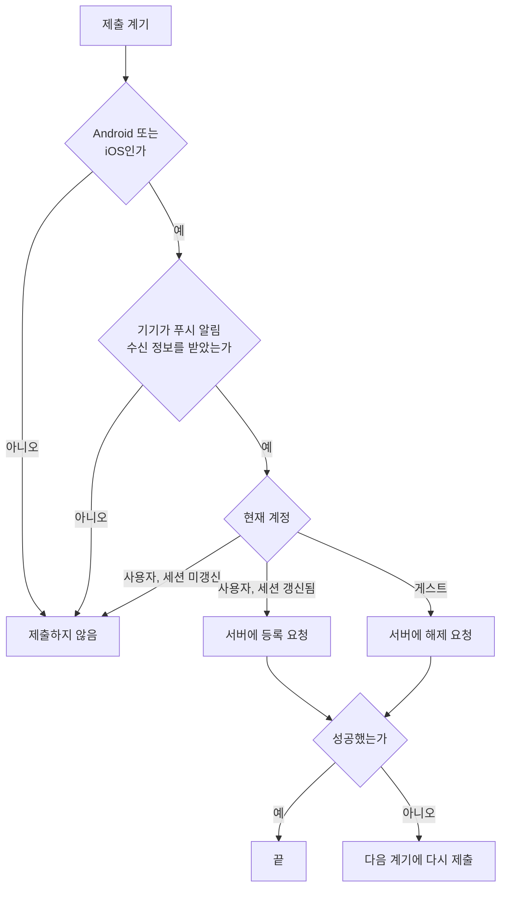

# 푸시 알림 수신 등록 스펙

이 문서는 로그인한 사용자의 기기가 서버에서 푸시 알림을 받을 수 있도록 앱이 기기의 푸시 알림 수신 정보를 서버에 등록하고, 로그인하지 않은 기기의 등록을 해제하는 시점과 조건을 다룬다.

등록과 해제 때 주고받는 정보와 그 의미는 [푸시 알림 수신 등록 스펙(common)](../common/fcm-token.md)이, 서버가 받은 정보를 검증하고 저장하는 방식과 한 기기를 한 계정에 묶는 규칙은 [푸시 알림 수신 등록 스펙(server)](../server/fcm-token.md)이 소유한다. 등록된 기기로 서버가 어떤 알림을 언제 보내는지는 알림마다 그 알림의 스펙이 소유하며, 현재 보내는 알림은 [일일 메모 알림 스펙](./daily-memo-notification.md)이 소유한다.

등록과 해제는 화면 없이 앱 내부에서 진행되고 사용자가 직접 조작하는 수단이 없으므로 `feature` 영역을 생략한다.

현재 사용자 계정과 세션 갱신 여부는 [계정 조회 스펙](./account.md)을, 로그인 완료 기준은 [Login 화면 스펙](./login.md)을, 로그아웃 절차는 [MoreHome 화면 스펙](./more-home.md)을 따른다.

## domain

### 제출

기기는 정해진 계기마다 자기 상태를 서버에 한 번 제출한다. 제출은 현재 계정 상태에 따라 등록과 해제 중 하나다.

- 등록: 현재 계정이 사용자이고 세션이 갱신된 상태면 이 기기를 그 계정에 연결한다.
- 해제: 현재 계정이 게스트면 서버에서 이 기기의 등록을 지운다. 로그아웃한 기기에 이전 계정의 알림이 도착하지 않게 하기 위해서다.

사용자 정보는 있지만 세션이 아직 갱신되지 않은 동안에는 등록도 해제도 하지 않는다. 등록은 인증된 세션이 있어야 요청할 수 있고, 로그인한 사용자의 등록을 지워서는 안 되기 때문이다. 세션이 갱신되면 다음 계기에 등록한다.

기기는 마지막으로 제출한 내용을 기억하지 않고 계기마다 현재 값을 그대로 다시 제출한다. 같은 제출을 반복해도 결과가 달라지지 않는다는 약속은 [푸시 알림 수신 등록 스펙(common)](../common/fcm-token.md)의 `같은 제출의 반복`을 따른다.

계정 상태와 세션 갱신 여부의 기준은 [계정 조회 스펙](./account.md)을 따른다.

### 등록하는 기기

제출은 Android와 iOS에서만 한다.

데스크톱 앱과 웹에서는 제출하지 않는다. 데스크톱 앱에는 서버 푸시 알림을 받을 수단이 없고, 웹은 서버 푸시 알림을 제공하지 않는다. 두 환경에서 알림을 제공하지 않는다는 결정은 [일일 메모 알림 스펙](./daily-memo-notification.md)의 `알림을 받는 기기`가 소유한다.

제출하지 않는 환경에서도 앱의 다른 기능은 그대로 사용할 수 있고, 제출하지 않는다는 안내는 표시하지 않는다.

### 등록 정보

등록에 담는 세 값의 뜻은 [푸시 알림 수신 등록 스펙(common)](../common/fcm-token.md)의 `등록 정보`를 따른다. 앱은 제출하는 순간의 값을 다음에서 가져온다.

| 값 | 가져오는 곳 |
| --- | --- |
| 푸시 알림 수신 정보 | 기기가 Firebase에서 받아 둔 값 |
| 시간대 | 기기 설정의 현재 시간대 |
| 언어 | 기기 설정의 현재 언어 |

시간대와 언어는 사용자가 앱 안에서 고르는 값이 아니라 기기 설정에서 오는 값이다. 앱은 이 값을 바꾸는 수단을 제공하지 않는다. 기기의 시간대나 언어가 바뀐 것은 그 자체로 계기가 아니며, 바뀐 뒤 처음 오는 계기의 등록에 새 값이 담긴다. 따라서 앱을 열지 않은 채 시간대를 바꾸면 다음에 앱을 열기 전까지 서버는 이전 시간대를 가진다.

Firebase가 수신 정보를 새로 발급하면 새 값은 다음 계기의 제출에 담긴다. 해제에는 수신 정보만 담는다.

제출 시점에 기기가 아직 수신 정보를 받지 못했으면 그 계기에는 제출하지 않고 다음 계기에 제출한다. 수신 정보를 받아 오는 데 실패한 것은 제출 실패이며 `실패 처리`를 따른다.

알림 권한은 제출과 무관하다. 알림 권한이 거부되어 있어도 등록한다. 권한이 거부된 기기에 서버가 알림을 보내면 사용자에게 보이지 않을 뿐이며, 그 판정은 각 알림의 스펙이 소유한다. 권한 요청 자체는 [알림 권한 요청 스펙](./notification-permission.md)을 따른다.

### 제출 계기

다음 계기에 제출한다.

- 앱이 시작되어 계정이 확인되었을 때
- 앱이 다시 활성 상태가 되어 계정이 확인되었을 때. 활성 상태의 기준은 [데이터 동기화 앱 스펙](./data-sync.md)의 `동기화 계기`에 있는 플랫폼별 기준과 같다.
- 앱을 사용하는 동안 로그인이 완료되어 인증된 계정이 확인되었을 때
- 확인된 계정이 다른 계정으로 바뀌었을 때. 로그아웃되어 게스트로 바뀐 것도 여기에 든다.
- 같은 계정이라도 확인된 계정 정보가 바뀌었을 때. 세션이 인증된 상태로 바뀌거나, 이메일이나 프로필 이미지가 바뀐 것이 여기에 든다.
- 화면이 재생성되었을 때. 계정이 그대로여도 계기가 된다.

같은 계정이 같은 정보로 다시 확인되기만 한 것은 계기가 아니다. 다만 앱이 다시 활성 상태가 되거나 화면이 재생성되면 계정이 그대로여도 계기가 된다. Firebase가 수신 정보를 새로 발급한 것도 그 자체로는 계기가 아니며, 바뀐 값은 다음 계기에 제출된다.

계기가 겹쳐 같은 제출이 여러 번 나가도 결과는 한 번 제출한 것과 같으므로, 앱은 겹친 계기를 하나로 줄이지 않는다. 이 전제는 [푸시 알림 수신 등록 스펙(common)](../common/fcm-token.md)의 `같은 제출의 반복`을 따른다.

### 로그아웃과 해제

로그아웃은 해제를 기다리지 않는다. 로그아웃하면 세션이 제거되어 계정이 게스트로 바뀌고, 그 변화가 `제출 계기`가 되어 해제를 제출한다. 네트워크 연결이 없어도 로그아웃은 그대로 끝난다.

해제 제출이 실패하면 다음 계기에 다시 제출한다. 해제가 서버에 반영되기 전까지 서버는 이 기기를 이전 계정의 기기로 보므로, 로그아웃한 뒤 다음 계기까지 그 계정의 알림이 이 기기에 도착할 수 있다. 서버가 오래 남은 등록을 정리하는 기준은 [일일 메모 알림 스펙(server)](../server/daily-memo-notification.md)의 `오래 남은 수신 정보의 정리`가 소유한다.

로그아웃 확인 다이얼로그에서 취소를 고르면 계정이 바뀌지 않으므로 해제하지 않는다. 다이얼로그 규칙은 [MoreHome 화면 스펙](./more-home.md)의 `로그아웃 확인`을 따른다.

### 실패 처리

제출에 실패해도 사용자에게 알리지 않고 앱의 다른 기능은 그대로 진행된다. 실패한 제출은 다음 계기에 다시 시도하며, 같은 계기 안에서 곧바로 다시 시도하지 않는다.

제출 실패는 오류 보고 대상이다. 오프라인이나 통신 오류로 인한 실패도 보고에서 제외하지 않는다. 보고 방식은 [기능 실패 로깅](./usecase-failure-logging.md)의 오류 보고를 따르고, 등록과 해제 중 무엇이 실패했는지는 보고에 담긴 실패 원인으로 구분한다.

앱 종료나 화면 이탈로 진행 중인 제출이 중단된 것은 실패가 아니며 보고하지 않는다. 중단된 제출은 다음 계기에 다시 시도된다.

### 실행 경계

화면이 재생성되면 계정이 그대로여도 다시 제출한다. 앱이 백그라운드에 갔다가 돌아와 다시 활성 상태가 되어도 다시 제출한다. 두 경우 모두 `제출 계기`에 든다. 백그라운드에 머무는 동안에는 계정이 바뀌어도 제출하지 않고, 다시 활성 상태가 될 때 그때의 계정으로 한 번 제출한다.

앱을 삭제하고 다시 설치하면 수신 정보가 새로 발급되므로 로그인 뒤 첫 계기에 새 값을 등록한다. 삭제 전 등록은 서버에 남을 수 있으며, 그 정리는 [일일 메모 알림 스펙(server)](../server/daily-memo-notification.md)의 `오래 남은 수신 정보의 정리`를 따른다.

## data

### 기기에 남기는 정보

기기에는 제출 내용이나 제출 결과를 저장하지 않는다. 푸시 알림 수신 정보는 제출할 때마다 기기에서 새로 가져온다.

## 참고

- [Firebase Cloud Messaging: Android 등록 토큰 관리](https://firebase.google.com/docs/cloud-messaging/manage-tokens)
- [Firebase Cloud Messaging: Apple 플랫폼에서 등록 토큰 액세스](https://firebase.google.com/docs/cloud-messaging/ios/client#access_the_registration_token)
