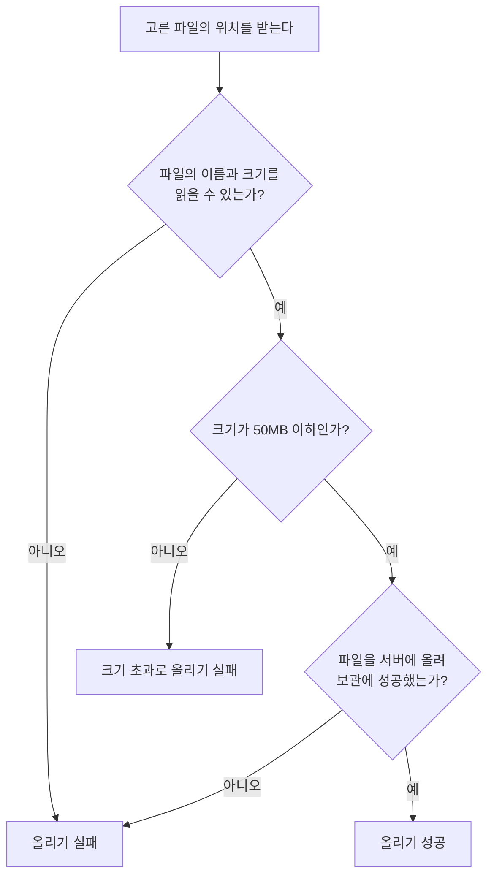

# 파일 보관 스펙

이 문서는 사용자가 고른 파일을 앱이 서버에 올리는 규칙과, 올린 파일의 목록을 서버에서 불러오는 규칙을 다룬다. 파일을 고르고 목록을 확인하는 화면은 [FileHome 화면 스펙](./file-home.md)에서 다룬다.

앱과 서버가 주고받는 파일과 목록의 약속은 [파일 보관 스펙(common)](../common/file-storage.md)이, 서버가 파일을 검증하고 보관하는 처리는 [파일 보관 스펙(server)](../server/file-storage.md)이 소유한다.

파일은 서버에만 보관한다. 기기에는 올린 파일이나 목록을 저장해 두지 않으므로, 목록은 서버에 연결할 수 있을 때만 볼 수 있다.

## domain

### 올릴 수 있는 파일

사용자는 기기가 제공하는 파일 선택 도구에서 고를 수 있는 파일을 형식에 관계없이 올릴 수 있다. 앱은 파일의 내용을 바꾸지 않고 그대로 올린다.

파일 하나의 크기는 50MB 이하여야 한다. 크기 약속은 [파일 보관 스펙(common)](../common/file-storage.md)의 `올리는 파일`을 따른다.

앱은 고른 파일의 크기를 올리기 전에 확인한다. 50MB를 넘으면 서버에 올리지 않고 크기 초과로 실패한다. 크기가 0인 빈 파일도 올릴 수 있다.

파일을 올릴 때는 기기가 알려 주는 파일 이름과 형식을 함께 보낸다. 기기가 형식을 알려 주지 않으면 형식을 알 수 없는 일반 파일로 보낸다. 앱이 파일 이름이나 크기를 알 수 없거나 내용을 읽을 수 없는 파일은 올리기에 실패한다.

같은 이름의 파일을 다시 올려도 별개의 파일로 보관되어 목록에 각각 나타난다. 보관 규칙은 [파일 보관 스펙(server)](../server/file-storage.md)의 `domain > 보관하는 파일`을 따른다.

### 목록에 노출하는 파일

목록에는 현재 로그인한 계정이 올린 파일을 서버가 돌려준 순서 그대로 노출한다. 어느 파일을 어떤 순서로 돌려주는지는 [파일 보관 스펙(common)](../common/file-storage.md)의 `목록 요청`을 따른다.

## data

### 목록 불러오기

목록은 서버에 요청해 한 번에 20개씩 불러온다. 사용자가 목록의 끝에 다가가면 이미 불러온 마지막 파일의 다음부터 20개를 이어서 요청한다. 서버가 돌려준 파일이 20개보다 적으면 더 불러올 파일이 없는 것으로 본다.

이어서 불러올 때는 이미 불러온 마지막 파일을 함께 보내므로, 그 사이에 새 파일이 올라와도 목록에 중복이나 누락이 생기지 않는다. 그 약속은 [파일 보관 스펙(common)](../common/file-storage.md)의 `목록 요청`을 따른다. 새로 올라온 파일은 목록을 처음부터 다시 불러올 때 나타난다.

불러오기에 실패하면 그 요청만 실패로 끝나고, 이미 불러온 파일은 그대로 남는다. 앱은 실패한 요청을 스스로 다시 보내지 않는다.

### 올리기 흐름

파일 올리기는 고른 파일의 위치를 받아 다음 순서로 진행한다.

서버가 파일을 받아 보관하는 순서와 보관하지 못한 파일을 남기지 않는 규칙은 [파일 보관 스펙(server)](../server/file-storage.md)의 `보관 순서`를 따른다.

### 올리기 중단

올리는 동안 사용자가 FileHome 화면을 떠나거나 계정이 바뀌면 앱은 올리기를 중단하고 결과를 기다리지 않는다. 중단하기 전에 서버가 파일을 끝까지 받았으면 파일은 보관되어 다음에 목록을 불러올 때 나타나고, 끝까지 받지 못했으면 보관되지 않는다.
