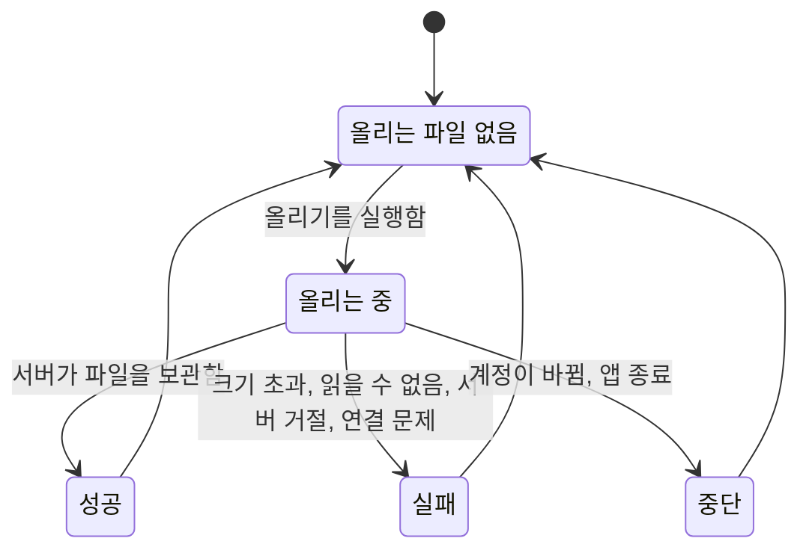
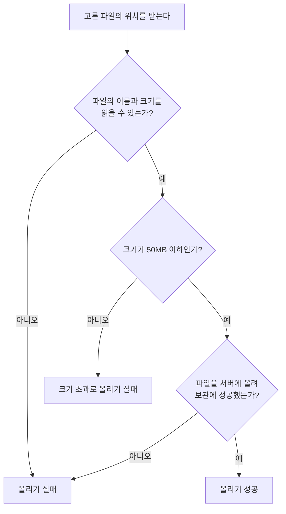

# 파일 보관 스펙

이 문서는 사용자가 고른 파일을 앱이 서버에 올리는 규칙과, 올린 파일의 목록을 서버에서 불러오는 규칙을 다룬다. 제목과 설명을 적고 파일을 골라 올리기를 시작하는 화면은 [FileAdd 화면 스펙](./file-add.md)에서, 목록을 확인하는 화면은 [FileHome 화면 스펙](./file-home.md)에서, 올리는 동안과 끝난 뒤에 보내는 알림은 [파일 올리기 알림 스펙](./file-upload-notification.md)에서 다룬다.

앱과 서버가 주고받는 파일과 목록의 약속은 [파일 보관 스펙(common)](../common/file-storage.md)이, 서버가 파일을 검증하고 보관하는 처리는 [파일 보관 스펙(server)](../server/file-storage.md)이 소유한다.

파일은 서버에만 보관한다. 기기에 남기는 것과 남기지 않는 것은 `data > 기기에 두는 것`을 따른다.

## domain

### 올릴 수 있는 파일

사용자는 기기가 제공하는 파일 선택 도구에서 고를 수 있는 파일을 형식에 관계없이 올릴 수 있다. 앱은 파일의 내용을 바꾸지 않고 그대로 올린다.

파일 하나의 크기는 50MB 이하여야 한다. 크기 약속은 [파일 보관 스펙(common)](../common/file-storage.md)의 `올리는 파일`을 따른다.

앱은 고른 파일의 크기를 올리기 전에 확인한다. 50MB를 넘으면 서버에 올리지 않고 크기 초과로 실패한다. 크기가 0인 빈 파일도 올릴 수 있다.

파일을 올릴 때는 기기가 알려 주는 파일 이름과 형식을 함께 보낸다. 기기가 형식을 알려 주지 않으면 형식을 알 수 없는 일반 파일로 보낸다. 앱이 파일 이름이나 크기를 알 수 없거나 내용을 읽을 수 없는 파일은 올리기에 실패한다.

앱은 파일 이름을 미리 검사하지 않고 기기가 알려 준 이름 그대로 보낸다. 이름이 [파일 보관 스펙(common)](../common/file-storage.md)의 `올리는 파일`에 맞지 않아 서버가 거절하면 크기 초과가 아닌 실패로 끝난다.

파일을 올릴 때는 사용자가 적은 제목과 설명을 함께 보낸다. 앱은 제목이 있는지만 올리기 전에 확인하며, 그 기준은 [FileAdd 화면 스펙](./file-add.md)의 `domain > 올리기 성립 조건`을 따른다. 같은 파일과 같은 제목을 다시 올려도 별개의 파일로 보관된다.

같은 이름의 파일을 다시 올려도 별개의 파일로 보관되어 목록에 각각 나타난다. 보관 규칙은 [파일 보관 스펙(server)](../server/file-storage.md)의 `domain > 보관하는 파일`을 따른다.

### 한 번에 올리는 파일

앱은 한 번에 파일 하나만 올린다. 올리는 중인 파일이 있는 동안에는 새 파일을 올리기 시작하지 않으며, 올리기가 끝나야 다음 파일을 올릴 수 있다.

### 올리기 상태

올리기는 사용자가 FileAdd 화면에서 올리기를 실행하면 시작되고, 성공, 실패, 중단 중 하나로 끝난다.

```mermaid
stateDiagram-v2
    Idle: 올리는 파일 없음
    Uploading: 올리는 중
    Succeeded: 성공
    Failed: 실패
    Stopped: 중단

    [*] --> Idle
    Idle --> Uploading: 올리기를 실행함
    Uploading --> Succeeded: 서버가 파일을 보관함
    Uploading --> Failed: 크기 초과, 읽을 수 없음, 서버 거절, 연결 문제
    Uploading --> Stopped: 계정이 바뀜, 앱 종료
    Succeeded --> Idle
    Failed --> Idle
    Stopped --> Idle
```

올리는 중에는 전체 크기 중 서버에 보낸 양을 백분율로 알 수 있다. 아직 보낸 양이 없으면 백분율이 없다. 크기가 0인 빈 파일은 보낼 내용이 없으므로 끝날 때까지 백분율 없이 올리는 중으로 보인다. 백분율은 줄어들지 않는다. 다만 `data > 올리기 진행 유지 범위`에 따라 같은 파일을 처음부터 다시 올리면 백분율 없이 다시 시작한다.

중단은 실패가 아니다. 중단된 올리기는 결과를 알리지 않는다.

### 올리기를 중단하는 계기

올리기를 시작한 계정이 게스트가 되거나 다른 계정으로 바뀌면 앱은 올리기를 중단하고 결과를 기다리지 않는다. 같은 계정의 세션 갱신 여부만 바뀌거나, 계정을 잠시 확인하지 못하는 것은 계정이 바뀐 것으로 보지 않는다.

사용자가 로그아웃해 계정이 게스트가 되면, 모든 플랫폼에서 올리는 중인 파일과 다시 올릴 예정인 파일의 올리기를 모두 취소한다. 시스템이 앱을 정리한 뒤 다시 올리려고 기다리는 파일과, 시스템이 앞선 실행에서 이어 올리는 파일도 포함한다. 취소된 올리기는 중단으로 끝나 결과를 알리지 않는다.

앱을 종료했을 때 중단하는지는 `data > 올리기 진행 유지 범위`를 따른다. FileHome이나 FileAdd 화면을 떠나는 것만으로는 중단하지 않는다.

중단하기 전에 서버가 파일을 끝까지 받았으면 파일은 보관되어 다음에 목록을 불러올 때 나타나고, 끝까지 받지 못했으면 보관되지 않는다.

### 목록에 노출하는 파일

목록에는 현재 로그인한 계정이 올린 파일을 서버가 돌려준 순서 그대로 노출한다. 어느 파일을 어떤 순서로 돌려주는지는 [파일 보관 스펙(common)](../common/file-storage.md)의 `목록 요청`을 따른다.

## data

### 목록 불러오기

목록은 서버에 요청해 한 번에 20개씩 불러온다. 사용자가 목록의 끝에 다가가면 이미 불러온 마지막 파일의 다음부터 20개를 이어서 요청한다. 서버가 돌려준 파일이 20개보다 적으면 더 불러올 파일이 없는 것으로 본다.

이어서 불러올 때는 이미 불러온 마지막 파일을 함께 보내므로, 그 사이에 새 파일이 올라와도 목록에 중복이나 누락이 생기지 않는다. 그 약속은 [파일 보관 스펙(common)](../common/file-storage.md)의 `목록 요청`을 따른다. 새로 올라온 파일은 목록을 처음부터 다시 불러올 때 나타난다.

불러오기에 실패하면 그 요청만 실패로 끝나고, 이미 불러온 파일은 그대로 남는다. 앱은 실패한 요청을 스스로 다시 보내지 않는다.

### 올리기 흐름

파일 올리기는 고른 파일의 위치와 제목, 설명을 받아 다음 순서로 진행한다.

```mermaid
flowchart TD
    start["고른 파일의 위치를 받는다"] --> read{"파일의 이름과 크기를<br/>읽을 수 있는가?"}
    read -- 아니오 --> fail["올리기 실패"]
    read -- 예 --> size{"크기가 50MB 이하인가?"}
    size -- 아니오 --> tooLarge["크기 초과로 올리기 실패"]
    size -- 예 --> upload{"파일을 서버에 올려<br/>보관에 성공했는가?"}
    upload -- 아니오 --> fail
    upload -- 예 --> success["올리기 성공"]
```

서버가 파일을 받아 보관하는 순서와 보관하지 못한 파일을 남기지 않는 규칙은 [파일 보관 스펙(server)](../server/file-storage.md)의 `보관 순서`를 따른다.

앱은 올리기에 걸리는 시간을 제한하지 않는다. 연결이 느려도 전송이 이어지는 동안에는 끝날 때까지 기다린다. 서버가 한 요청을 처리할 수 있는 시간에는 한도가 있어, 그 안에 파일을 모두 받지 못하면 서버가 보관하지 않고 요청을 끝내며 앱은 크기 초과가 아닌 실패로 다룬다. 그 한도는 [파일 보관 스펙(server)](../server/file-storage.md)의 `받는 파일`을 따른다.

### 연결이 없을 때

| 플랫폼 | 올리기를 시작할 때 연결이 없음 | 올리는 도중 연결이 끊김 |
| --- | --- | --- |
| Android | 실패로 끝난다 | 실패로 끝난다 |
| iOS | 연결될 때까지 올리는 중으로 기다렸다가 올린다 | 다시 이어 올릴지는 시스템이 정하고, 시스템이 포기하면 실패로 끝난다 |
| 데스크톱 앱, 웹 | 실패로 끝난다 | 실패로 끝난다 |

Android, 데스크톱 앱, 웹은 올리기를 요청하면 곧바로 시작하고, 연결 문제로 보내지 못하면 다시 시도하지 않고 실패로 알린다. 사용자는 연결된 뒤 FileAdd 화면에서 올리기를 다시 실행한다. iOS는 올리기를 기기의 시스템에 맡기며, 시스템이 연결을 기다리거나 다시 이어 올릴 수 있다.

### 올리기 진행 유지 범위

| 플랫폼 | FileHome이나 FileAdd를 떠남 | 앱이 화면 뒤로 감 | 시스템이 앱을 정리함 | 사용자가 앱을 종료함 |
| --- | --- | --- | --- | --- |
| Android | 계속 진행 | 계속 진행 | 계속 진행 | 최근 앱 목록에서 지워도 계속 진행. 시스템 설정에서 강제로 멈추면 중단 |
| iOS | 계속 진행 | 계속 진행 | 계속 진행 | 앱 전환기에서 앱을 종료하면 중단 |
| 데스크톱 앱 | 계속 진행 | 계속 진행 | 해당 없음 | 중단 |
| 웹 | 계속 진행 | 계속 진행 | 해당 없음 | 탭을 닫거나 페이지를 다시 불러오면 중단 |

Android에서 시스템이 앱을 정리해 전송이 끊기면 앱이 다시 살아날 때 같은 파일을 같은 제목과 설명으로 처음부터 다시 올린다. 시스템 설정에서 강제로 멈춘 경우에도 사용자가 앱을 다시 실행하면 같은 파일을 처음부터 다시 올린다. 이때 끊기기 전에 서버가 파일을 끝까지 받아 두었으면 같은 파일이 두 번 보관될 수 있다.

iOS는 앱이 화면 뒤에 있거나 시스템이 앱을 정리해도 시스템이 전송을 이어 가고, 끝나면 그 결과를 [파일 올리기 알림 스펙](./file-upload-notification.md)에 따라 알린다.

앱이 다시 시작되었을 때 이어서 올리는 중인 파일이 있으면, 그 파일은 `domain > 한 번에 올리는 파일`의 올리는 중인 파일로 본다.

### 기기에 두는 것

기기에는 올린 파일이나 목록을 저장해 두지 않으므로, 목록은 서버에 연결할 수 있을 때만 볼 수 있다.

올리기가 끝날 때까지 앱은 고른 파일을 다시 읽을 수 있어야 하므로, 올리는 동안에는 그 파일을 읽을 수 있는 상태로 붙들어 둔다. 플랫폼에 따라 올리려고 기기에 임시 사본을 두기도 한다. 올리기가 성공, 실패, 중단 중 무엇으로 끝나든 붙들어 둔 상태와 임시 사본은 남기지 않는다. 사용자가 고른 원본 파일은 지우거나 바꾸지 않는다.

`data > 올리기 진행 유지 범위`에 따라 같은 파일을 다시 올릴 예정이면, 그때까지는 고른 파일을 붙들어 둔다.

Android에서 고른 파일을 제공하는 앱이 그 파일을 계속 읽을 수 있게 붙들어 두는 것을 허용하지 않으면, 앱은 그 파일을 올리지 않고 크기 초과가 아닌 실패로 끝낸다. 앱이 다시 시작된 뒤에는 그 파일을 다시 읽을 수 없어 `data > 올리기 진행 유지 범위`를 지킬 수 없기 때문이다.
