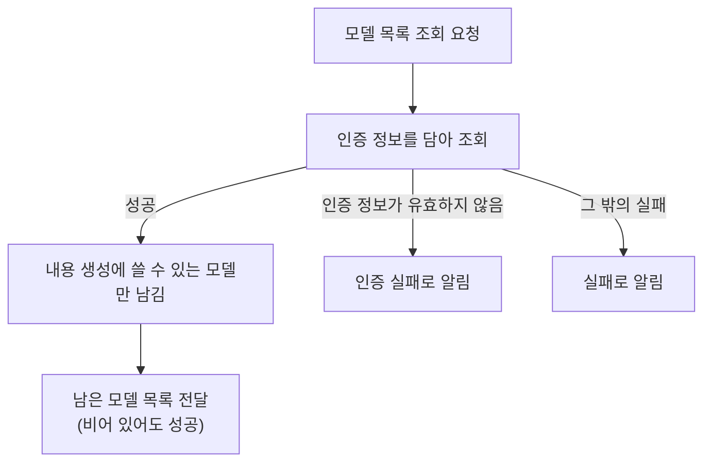

# Gemini 모델 목록 조회 스펙

이 문서는 인증 정보로 Gemini에서 사용할 수 있는 모델 목록을 받아 오는 원격 조회 규칙을 다룬다. 사용자에게 직접 노출되는 화면이나 사용자 행동은 없으므로 `feature` 영역은 생략하며, 받아 온 목록을 사용자에게 어떻게 보여주고 그중 하나를 어떻게 고르는지는 [SettingGemini 화면 스펙](./setting-gemini.md)에서 다룬다.

## domain

### 모델 목록 조회

모델 목록 조회는 인증 정보 하나를 대상으로 수행한다. 인증 정보가 비어 있지 않은지는 조회를 요청하는 곳에서 확인한다.

조회 결과는 Gemini가 제공하는 모델 목록이며, 정렬은 따로 지정하지 않고 Gemini가 돌려준 순서를 그대로 사용한다.

한 번의 조회로 받을 수 있는 모델은 Gemini 정책에 따라 최대 `1000`개이며, 조회는 항상 최대 개수를 요청한다. 최대 개수를 넘는 결과를 이어서 받는 기능은 이번 범위에 포함하지 않는다.

이 조회는 모델의 정보만 받아 오며 모델로 내용을 생성하지 않는다.

### 모델 정보

조회된 모델 하나는 다음 정보를 갖는다.

- 모델 구분 이름: 그 모델로 생성을 요청할 때 사용하는 값이며 모델마다 다르다.
- 표시 이름: 사용자가 모델을 알아보는 이름.
- 설명: 모델이 어떤 모델인지 알려 주는 문장으로, 없을 수 있다.

### 포함 기준

Gemini는 내용을 생성하는 모델뿐 아니라 임베딩, 이미지, 영상처럼 다른 목적의 모델도 함께 돌려준다. 모델은 각자 어떤 기능에 쓸 수 있는지를 함께 알려 준다.

조회 결과에는 내용 생성에 쓸 수 있다고 알려 온 모델만 포함한다. 내용 생성에 쓸 수 없는 모델은 목록에서 제외하므로, 조회 결과의 모델은 모두 고르면 실제로 생성에 사용할 수 있다.

기준에 맞는 모델이 하나도 없으면 빈 목록이며, 이는 실패가 아니다.

### 인증

모델 목록 조회는 Google이 발급한 인증 정보가 있어야 수행된다. 모델의 정보만 받아 오는 경우에도 인증 정보가 필요하며, 인증 정보가 없거나 유효하지 않으면 조회는 실패한다.

인증 정보가 유효하지 않아 실패한 경우는 다른 실패와 구분해 알린다. 사용자가 인증 정보를 고쳐 다시 시도할 수 있어야 하기 때문이다.

## data

### 원격 조회

조회를 요청하면 받은 인증 정보를 담아 Gemini에서 모델 목록을 조회한다.

조회가 성공하면 받은 모델 중 `포함 기준`에 맞는 모델만 남겨 전달한다. 남은 모델이 없으면 빈 목록을 그대로 전달한다.

모델 목록은 저장하지 않고 조회할 때마다 새로 조회한다. 그래서 Gemini가 제공하는 모델이 바뀌면 다음 조회부터 바뀐 목록을 받는다.

### 실패 처리

원격 조회에 실패하면 실패를 그대로 알린다. 실패를 빈 목록 같은 정상 결과로 바꾸지 않는다.

인증 정보가 유효하지 않은 실패와 그 밖의 실패를 구분해 전달하며, 각각을 사용자에게 어떻게 보여줄지는 조회를 사용하는 화면의 스펙에서 다룬다.

## 참고

- [Gemini 모델 목록 안내](https://ai.google.dev/api/models)
- [Gemini 모델 안내](https://ai.google.dev/gemini-api/docs/models)
