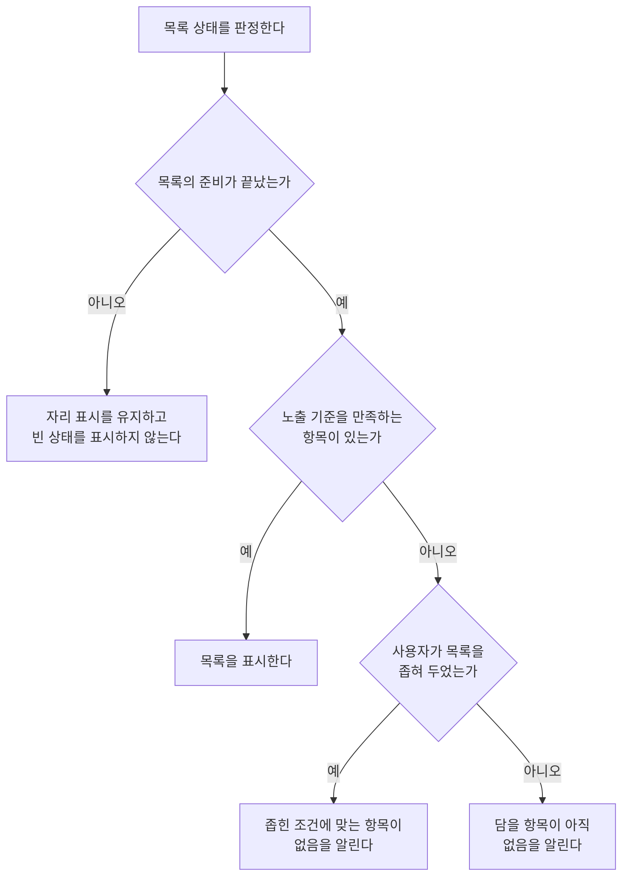

# 목록 빈 상태 스펙

이 문서는 화면 본문을 차지하는 목록에 표시할 항목이 하나도 없을 때 사용자에게 무엇을 보장하는지를 다룬다. 목록이 무엇을 노출하고 어떤 순서로 정렬하는지는 각 화면 스펙이 다루고, 아직 준비되지 않은 자리의 처리는 [페이지 조회 목록의 자리 표시 스펙](./paged-list-placeholder.md)이 다룬다.

디자인: [목록 빈 상태 디자인](../../design/list-empty-state.md)

## 적용 대상

| 스펙 | 목록 |
| --- | --- |
| [TagHome 목록](./tag-home.md) | 태그 목록 |
| [TagFinishedList 화면](./tag-finished-list.md) | 완료된 태그 목록 |
| [TagDetail 메모 탭](./tag-detail-memo.md) | 태그별 메모 목록 |
| [TagDetail 웹 탭](./tag-detail-web.md) | 태그별 웹 목록 |
| [TagDetail 장소 탭](./tag-detail-place.md) | 지도 모드의 태그별 장소 목록, 목록 모드의 태그별 장소 목록 |
| [TagMemoFinishedList 화면](./tag-memo-finished-list.md) | 태그별 완료된 메모 목록 |
| [ContactDetail 메모 탭](./contact-detail-memo.md) | 연락처별 메모 목록 |
| [PlaceDetail 메모 탭](./place-detail-memo.md) | 장소별 메모 목록 |
| [WebDetail 메모 탭](./web-detail-memo.md) | 웹 항목별 메모 목록 |
| [MemoHome 목록](./memo-home.md) | 메모 목록 |
| [MemoFinishedList 화면](./memo-finished-list.md) | 완료된 메모 목록 |
| [RoutineHome 화면](./routine-home.md) | 루틴 목록 |
| [PlaceHome 화면](./place-home.md) | 지도 모드의 장소 목록, 목록 모드의 장소 목록 |
| [WebHome 화면](./web-home.md) | 웹 목록 |
| [ContactHome 화면](./contact-home.md) | 연락처 목록 |
| [PlaylistHome 화면](./playlist-home.md) | 곡 목록 |
| [QrHome 화면](./qr-home.md) | QR 목록 |
| [SearchHome 화면](./search-home.md) | 메모 검색 결과 목록, 태그 검색 결과 목록, 장소 검색 결과 목록, 웹 검색 결과 목록 |

SearchHome의 결과 목록은 질의가 비어 있는 동안 빈 상태를 표시하지 않는다. 이 조건은 [SearchHome 화면 스펙](./search-home.md)의 `결과 없음 판정`이 소유하며, 그 조건을 만족한 뒤의 표시와 행동만 이 문서를 따른다.

항목을 고르기 위해 화면 안에서 여는 선택 목록에는 적용하지 않는다. [메모 태그 입력 컴포넌트 스펙](./memo-tag-input.md)의 태그 선택 목록, [메모 장소 카드 컴포넌트 스펙](./memo-place-card.md)의 장소 선택 목록, [태그 연결 입력 컴포넌트 스펙](./tag-link-input.md)의 태그 선택 목록, [항목 태그 입력 컴포넌트 스펙](./entity-tag-input.md)의 태그 선택 목록은 각 문서가 정한 대로 빈 상태 안내를 두지 않는다. 선택 목록은 사용자가 고르려고 잠시 여는 목록이기 때문이다.

다만 네 선택 목록에서 사용자가 검색어를 입력해 결과가 비는 경우는 예외이며, 그때 알리는 내용은 각 문서의 `태그 검색`과 `장소 검색`이 소유한다. 검색어로 비는 것은 목록을 열기 전에 알려 줄 수 없기 때문이다.

[태그 필터 스펙](./tag-filter.md)의 태그 목록에도 적용하지 않는다. 태그 필터는 빈 상태 안내를 두지 않고 그 문서의 `태그 추가`에 따라 태그 추가 동작을 항상 제공한다.

## feature

### 빈 상태 표시

목록에 표시할 항목이 하나도 없는 것이 확정되면 목록 자리에 비어 있음을 알린다. 안내에는 그 목록이 무엇을 담는 목록인지와 왜 지금 비어 있는지를 사용자가 알 수 있는 내용을 담는다.

목록마다 무엇을 알리는지는 `domain`의 `빈 상태에서 알리는 내용`을 따른다.

### 판정 시점

빈 상태는 목록이 준비된 뒤에만 표시한다. 목록을 준비하는 동안에는 항목이 하나도 나타나지 않아도 빈 상태를 표시하지 않는다. 나누어 불러오는 목록의 준비 여부는 [페이지 조회 목록의 자리 표시 스펙](./paged-list-placeholder.md)의 `빈 상태 판정`을 따른다. 지도 모드의 장소 목록처럼 한 번에 조회하는 목록은 첫 조회 결과가 도착했을 때 준비된 것으로 본다.

따라서 사용자는 화면을 열자마자 잘못된 빈 상태 안내를 보지 않는다.

### 빈 상태에서 할 수 있는 행동

빈 상태에서도 사용자는 그 화면이 목록 밖에서 제공하는 행동을 그대로 사용할 수 있다. 항목 추가, 필터 열기, 보기 모드 전환, 완료된 항목 확인, 검색, 질의 수정, 검색 결과 유형 바꾸기, 뒤로가기는 목록이 비어 있다는 이유로 막히지 않는다. 정렬 선택은 예외이며, 그 기준은 [목록 정렬 스펙](./list-sort.md)의 `준비 중과 빈 상태에서의 정렬`을 따른다.

빈 상태는 조작 요소를 새로 제공하지 않는다. 항목을 추가하려는 사용자는 화면이 이미 제공하는 추가 동작을 사용한다.

목록을 당겨 새로고침할 수 있는 화면에서는 빈 상태에서도 당겨 새로고침할 수 있다. 당기는 조작과 진행 표시는 [새로고침 스펙](./sync-refresh.md)을 따르며, 새로고침이 진행되는 동안에도 빈 상태 안내는 그대로 유지된다.

새로고침을 제공하지 않는 화면에서는 빈 상태에서도 제공하지 않는다. SearchHome의 결과 목록이 여기에 해당하며, 그 기준은 [SearchHome 화면 스펙](./search-home.md)의 `서버 요청`을 따른다.

### 빈 상태와 목록의 전환

목록에 항목이 하나라도 나타나면 빈 상태 안내는 사라지고 목록이 나타난다. 반대로 목록의 마지막 항목이 사라지면 빈 상태 안내가 나타난다.

두 상태는 같은 자리를 차지하며 동시에 보이지 않는다. 전환 중에도 사용자는 화면의 다른 행동을 계속 사용할 수 있다.

전환은 사용자의 조작 없이도 일어난다. 항목을 완료하거나 삭제해 마지막 항목이 사라지면 빈 상태가 되고, 그 동작을 실행 취소하면 항목이 다시 나타나 빈 상태가 사라진다. 서버에서 내려받은 항목이 기기에 반영되어도 같은 기준으로 전환한다.

## domain

### 빈 상태 판정 기준

목록은 다음을 모두 만족할 때만 빈 상태로 판정한다.

- 목록의 노출 기준을 만족하는 항목이 하나도 없다.
- 목록의 준비가 끝나 더 나타날 항목이 없는 것이 확정되었다.

준비가 끝나지 않았으면 지금 보이는 항목이 하나도 없어도 빈 상태로 판정하지 않는다.

새로고침이 진행 중인 것은 판정에 영향을 주지 않는다. 새로고침은 이미 준비된 목록을 서버 내용으로 맞추는 동작이므로, 새로고침 전에 비어 있던 목록은 새로고침이 끝나 새 항목이 반영될 때까지 빈 상태를 유지한다.

목록을 조회하지 못한 것과 노출할 항목이 없는 것은 사용자에게 같은 결과다. 조회에 실패해도 준비가 끝난 것으로 보고, 별도의 오류 안내를 두지 않고 빈 상태로 다룬다. 현재 계정을 확인할 수 없어 보여 줄 항목이 없는 경우도 같다. 이 기준은 적용 대상의 모든 목록에 같으며, 조회 실패를 빈 상태에서 빼는 목록은 없다.

### 빈 이유의 구분

사용자가 목록의 범위를 좁힐 수 있는 목록은 좁힌 결과로 비었는지와 담을 항목이 애초에 없는지를 구분해 알린다. 두 경우에 사용자가 해야 할 다음 행동이 다르기 때문이다.

| 목록 | 좁히는 수단 | 구분 |
| --- | --- | --- |
| MemoHome 메모 목록 | 유무 필터, 태그 필터 | 구분한다 |
| TagHome 태그 목록 | 최상위 태그 필터 | 구분한다 |
| TagDetail 장소 탭 지도 모드의 태그별 장소 목록 | 지도의 보이는 영역 | 구분하지 않고 언제나 영역 기준으로 알린다 |
| PlaceHome 지도 모드의 장소 목록 | 지도의 보이는 영역 | 구분하지 않고 언제나 영역 기준으로 알린다 |
| SearchHome 네 유형의 검색 결과 목록 | 질의 | 구분하지 않고 언제나 질의 기준으로 알린다 |
| 그 밖의 적용 대상 목록 | 없음 | 구분하지 않는다 |

MemoHome의 메모 목록은 [목록 필터 반영 스펙](./list-filter.md)의 `필터 적용 상태`에서 필터가 적용되지 않은 상태를 좁히지 않은 상태로, 적용된 상태를 좁힌 상태로 본다. 선택할 수 없게 되어 판정에서 무시되는 태그 선택은 좁힌 상태로 세지 않는다. 각 필터의 기준은 [MemoHome 목록 스펙](./memo-home.md)의 `유무 필터 기준`과 `태그 필터 기준`을 따른다.

TagHome의 태그 목록은 최상위 태그 필터가 꺼져 있을 때를 좁히지 않은 상태로 보고, 켜져 있으면 좁힌 상태로 본다. 필터의 기준은 [TagHome 목록 스펙](./tag-home.md)의 `최상위 태그 판정 기준`을 따른다.

PlaceHome과 TagDetail 장소 탭의 지도 모드 목록은 언제나 지도의 보이는 영역으로 좁혀진 목록이므로 두 경우를 구분하지 않는다. 좁히는 기준은 [장소 보기 모드 스펙](./place-view-mode.md)의 `지도 모드에 노출하는 장소`를 따른다. 노출 기준을 만족하는 장소가 하나도 없어도 사용자가 보고 있는 영역에 없다는 사실은 같기 때문이다.

SearchHome의 결과 목록도 빈 상태를 표시하는 시점에는 언제나 질의로 좁혀진 목록이므로 두 경우를 구분하지 않는다. 좁히지 않은 상태인 빈 질의에서는 빈 상태 자체를 표시하지 않는다.

### 빈 상태에서 알리는 내용

각 목록이 빈 상태에서 사용자에게 알리는 내용은 다음과 같다. 사용자에게 보이는 정확한 문구와 표현은 [목록 빈 상태 디자인](../../design/list-empty-state.md)이 정한다.

| 목록 | 알리는 내용 |
| --- | --- |
| TagHome 태그 목록, 좁히지 않은 상태 | 아직 태그가 없으며 새로 추가할 수 있다 |
| TagHome 태그 목록, 좁힌 상태 | 최상위 태그가 없으며 필터를 끄면 모든 태그를 볼 수 있다 |
| TagFinishedList 완료된 태그 목록 | 완료한 태그가 아직 없다 |
| TagDetail 메모 탭의 태그별 메모 목록 | 이 태그에 연결된 메모가 아직 없으며 새로 추가할 수 있다 |
| TagDetail 웹 탭의 태그별 웹 목록 | 이 태그에 연결된 웹 항목이 아직 없으며 새로 추가할 수 있다 |
| TagDetail 장소 탭 목록 모드의 태그별 장소 목록 | 이 태그에 연결된 장소가 아직 없으며 새로 추가할 수 있다 |
| TagDetail 장소 탭 지도 모드의 태그별 장소 목록 | 지금 보고 있는 지도 영역 안에 이 태그에 연결된 장소가 없다 |
| TagMemoFinishedList 태그별 완료된 메모 목록 | 이 태그에서 완료한 메모가 아직 없다 |
| ContactDetail 메모 탭의 연락처별 메모 목록 | 이 연락처에 연결된 메모가 아직 없으며 새로 추가할 수 있다 |
| PlaceDetail 메모 탭의 장소별 메모 목록 | 이 장소에 연결된 메모가 아직 없으며 새로 추가할 수 있다 |
| WebDetail 메모 탭의 웹 항목별 메모 목록 | 이 웹 항목에 연결된 메모가 아직 없으며 새로 추가할 수 있다 |
| MemoHome 메모 목록, 좁히지 않은 상태 | 아직 메모가 없으며 새로 추가할 수 있다 |
| MemoHome 메모 목록, 좁힌 상태 | 고른 조건에 맞는 메모가 없으며 필터를 바꾸면 다른 메모를 볼 수 있다 |
| MemoFinishedList 완료된 메모 목록 | 완료한 메모가 아직 없다 |
| RoutineHome 루틴 목록 | 아직 루틴이 없으며 새로 추가할 수 있다 |
| PlaceHome 지도 모드의 장소 목록 | 지금 보고 있는 지도 영역 안에 장소가 없다 |
| PlaceHome 목록 모드의 장소 목록 | 아직 장소가 없으며 새로 추가할 수 있다 |
| WebHome 웹 목록 | 아직 웹 항목이 없으며 새로 추가할 수 있다 |
| ContactHome 연락처 목록 | 아직 연락처가 없으며 새로 추가할 수 있다 |
| PlaylistHome 곡 목록 | 아직 곡이 없으며 새로 추가할 수 있다 |
| QrHome QR 목록 | 아직 QR이 없으며 새로 추가할 수 있다 |
| SearchHome 메모 검색 결과 목록 | 질의에 맞는 메모가 없으며 다른 질의로 다시 찾을 수 있다 |
| SearchHome 태그 검색 결과 목록 | 질의에 맞는 태그가 없으며 다른 질의로 다시 찾을 수 있다 |
| SearchHome 장소 검색 결과 목록 | 질의에 맞는 장소가 없으며 다른 질의로 다시 찾을 수 있다 |
| SearchHome 웹 검색 결과 목록 | 질의에 맞는 웹 항목이 없으며 다른 질의로 다시 찾을 수 있다 |

빈 상태 안내는 사용자가 지금 할 수 있는 일을 벗어난 내용을 담지 않는다. 예를 들어 TagFinishedList, MemoFinishedList와 TagMemoFinishedList는 그 화면에서 항목을 새로 만들 수 없으므로 추가를 권하지 않는다. SearchHome에서는 항목을 새로 만들 수 없으므로 추가를 권하지 않고 질의를 고치는 것만 권한다.

### 실행 경계

빈 상태는 목록의 현재 내용에서 그때그때 판정하는 결과이며 사용자가 이어서 작성하는 진행 상태가 아니다.

화면이 재생성되거나 앱이 백그라운드에 다녀오거나 앱을 다시 실행하면, 그 시점의 목록을 다시 준비해 같은 기준으로 판정한다. 이전에 빈 상태였는지는 기억하지 않는다.
