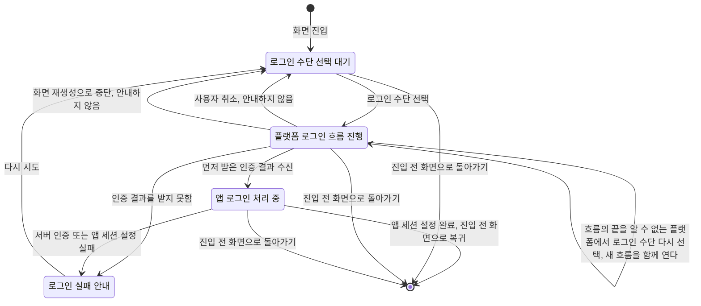

# Login 화면 스펙

디자인: [Login 화면 디자인](../../design/login.md)

## feature

로그인 한 번의 진행 흐름은 다음과 같다. 각 단계의 조건과 결과는 아래 절에서 정의한다.

`앱 로그인 처리 중` 상태에서는 새 로그인 요청을 받지 않는다. `플랫폼 로그인 흐름 진행` 상태에서 새 로그인 요청을 받는지는 앱이 그 흐름의 끝을 알 수 있는 플랫폼인지에 따라 다르며, `domain > 로그인 요청 제한`이 정한다.

### 진입과 종료

사용자는 `더보기` 화면에서 로그인 행동을 선택해 Login 화면으로 이동할 수 있다.

Login 화면은 주요 목적지가 아닌 별도 로그인 흐름으로 제공된다.

사용자는 로그인 전이나 진행 중에도 Login 화면에 진입하기 전 화면으로 돌아갈 수 있다. 플랫폼 로그인 흐름이 진행되는 중에 돌아가면 그 흐름은 중단되고, 그 뒤 돌아오는 결과는 받지 않는다. 앱 로그인 처리 중에 돌아가면 그 시도는 중단된다. 중단되기 전에 앱 세션 설정까지 끝났으면 로그인된 상태가 되고, 그렇지 않으면 로그인되지 않은 상태로 남으며 따로 안내하지 않는다.

### 로그인 수단

사용자는 Google 로그인과 Apple 로그인 중 하나를 선택할 수 있다.

### 로그인 진행과 완료

사용자가 로그인 수단을 선택하면 앱은 현재 플랫폼에서 제공하는 해당 수단의 로그인 흐름을 시작한다.

플랫폼 로그인 흐름이 진행되는 동안 화면이 보여 주는 것과 로그인 수단을 다시 선택할 수 있는지는, 앱이 그 흐름이 끝났음(성공, 취소, 실패, 로그인 창 닫힘)을 알 수 있는 플랫폼인지에 따라 다르다. 어느 플랫폼이 어디에 해당하는지는 `domain > 로그인 요청 제한`이 정한다.

- 흐름의 끝을 알 수 있으면, 흐름이 진행되는 동안 앱 로그인 처리 중과 같이 로그인 수단 대신 진행 중인 상태를 표시하며 다른 수단을 고를 수 없다. 흐름이 끝나면 인증 결과를 받은 경우 진행 중인 상태가 끊기지 않고 앱 로그인 처리로 이어지고, 그 밖에는 로그인 수단이 다시 보인다.
- 흐름의 끝을 알 수 없으면, 진행 중인 상태를 표시하지 않고 로그인 수단을 그대로 보여 준다. 사용자는 같은 수단이든 다른 수단이든 다시 선택해 새 흐름을 열 수 있고, 이전에 연 흐름도 함께 남는다. 이 가운데 먼저 인증 결과를 받은 흐름으로 앱 로그인 처리를 시작하고, 나머지 흐름에서 그 뒤에 돌아오는 결과는 무시한다.

진행 중인 흐름이 끝나면 다시 선택할 수 있으며, 실패 안내가 보이는 동안에도 다시 선택할 수 있다.

사용자가 계정 선택과 동의를 완료하면 앱은 받은 인증 결과로 앱 로그인을 요청한다.

앱 로그인 요청을 처리하는 동안에는 진행 중인 상태를 표시하며, 새 로그인 요청을 받을 수 없다.

앱 로그인과 세션 설정이 모두 완료되면 Login 화면을 닫고 진입하기 전 화면으로 돌아간다.

### 취소와 오류

사용자가 플랫폼의 로그인 흐름을 취소하면 앱은 오류를 안내하지 않고 Login 화면에 머무르며, 사용자는 다시 시도할 수 있다.

브라우저에서 진행하는 로그인 흐름은 사용자가 로그인 페이지에서 취소를 선택한 경우뿐 아니라 다음도 취소로 본다.

- Android에서 사용자가 로그인 브라우저 탭을 응답 없이 닫고 앱으로 돌아온 경우
- 웹에서 사용자가 로그인 창을 응답 없이 닫은 경우

데스크톱에서 사용자가 로그인 진행 중이던 브라우저 창을 응답 없이 닫으면 앱은 이를 알 수 없어 취소로 처리하지 못한다. 이 경우 별도 안내 없이 Login 화면에 머무르며, 로그인 수단이 그대로 보이므로 사용자는 다시 선택해 새 흐름을 시작할 수 있다.

인증 결과를 받지 못하거나, 서버 인증 또는 앱 세션 설정에 실패하면 로그인 실패를 안내한다. 웹에서 브라우저가 로그인 창을 열지 못하게 막은 경우도 인증 결과를 받지 못한 것으로 본다.

실패 후 앱은 진행 상태를 종료하고, 사용자는 로그인 수단을 다시 선택해 시도할 수 있다.

## domain

### 로그인 완료 기준

인증 결과를 받는 것만으로 앱 로그인이 완료되지는 않는다.

서버가 인증 결과를 검증해 로그인 세션을 발급하고, 앱이 그 세션을 사용할 수 있는 상태가 되어야 로그인이 완료된다. 서버의 검증 기준은 [로그인 스펙(server)](../server/login.md)의 `인증 결과 검증`을 따른다.

이 과정 중 하나라도 실패하면 앱은 로그인 완료로 판단하지 않는다.

### 제공하는 로그인 수단

앱이 제공하는 로그인 수단은 Google 로그인과 Apple 로그인이며, 두 수단 모두 앱이 지원하는 모든 플랫폼에서 완료할 수 있다.

| 플랫폼 | Google 로그인 흐름 | Apple 로그인 흐름 |
| --- | --- | --- |
| iOS | 기기의 Google 로그인 | 기기의 Apple 계정 로그인 |
| Android | 기기의 Google 계정 선택 | 앱 안에서 여는 브라우저 탭의 Apple 웹 로그인 |
| 데스크톱 | 시스템 브라우저의 Google 로그인 | 시스템 브라우저의 Apple 웹 로그인 |
| 웹 | 별도 창에서 여는 Google 로그인 | 별도 창에서 여는 Apple 웹 로그인 |

Apple 웹 로그인 흐름의 응답은 서버를 거쳐 앱으로 돌아온다. 그 중계는 [로그인 스펙(server)](../server/login.md)의 `Apple 웹 로그인 중계`가 정한다.

로그인 수단마다 앱 로그인 요청은 서로 독립적이며, 한 수단의 실패가 다른 수단의 사용을 막지 않는다.

### 허용되는 Google 인증 결과

앱 로그인에는 현재 플랫폼이 제공하는 한 가지 Google 인증 결과를 사용한다. 인증 결과의 뜻은 [로그인 스펙(common)](../common/login.md)의 `인증 결과`를 따른다.

| 플랫폼 | 사용하는 인증 결과 |
| --- | --- |
| Android, iOS | Google 신원 증명 |
| 데스크톱, 웹 | Google 인가 코드 |

같은 로그인 시도에서 두 결과를 모두 요구하지 않는다.

Google 로그인은 기본 인증에 필요한 범위(사용자 식별, 기본 프로필, 이메일)로 시작한다.

추가 Google 서비스 접근 권한이 필요한 기능은 사용자가 해당 기능을 사용하기 시작할 때 별도 동의 흐름으로 요청한다.

### 허용되는 Apple 인증 결과

앱 로그인에는 Apple이 발급한 신원 증명과 로그인 시도에 사용한 시도 확인 값을 사용한다.

Apple 로그인은 앱 계정에 필요한 이메일 범위로 시작하며, 사용자 이름 등 추가 정보는 요청하지 않는다.

웹 로그인 흐름에서는 로그인 시도마다 새로운 시도 확인 값과 상태 값을 만들고, 이전 시도의 값을 재사용하지 않는다. 앱으로 돌아온 응답은 그 시도의 상태 값을 함께 가져와야 하며, 상태 값이 없거나 다른 응답은 인증 결과로 받지 않고 인증 결과를 받지 못한 것으로 본다. 상태 값의 뜻은 [로그인 스펙(common)](../common/login.md)의 `상태 값`을 따른다.

상태 값이 이번 시도의 것이고 Apple이 사용자의 취소를 알린 응답은 인증 결과를 받지 못한 것이 아니라 사용자 취소로 본다. 상태 값이 맞는데 신원 증명이 없는 그 밖의 응답은 인증 결과를 받지 못한 것으로 본다.

### 인증 수단과 계정 동일성

같은 이메일을 제공하는 Google 로그인과 Apple 로그인은 같은 앱 계정으로 들어온다. 사용자가 Apple 로그인에서 이메일 가리기를 선택하면 별개 계정이 된다. 판단 기준은 [로그인 스펙(server)](../server/login.md)의 `인증 수단과 계정 동일성`이 소유한다.

### 앱 로그인 실패 보고

앱 로그인 실패는 Google 로그인과 Apple 로그인 모두 오류 보고 대상이다. 보고 방식은 [기능 실패 로깅](./usecase-failure-logging.md)의 오류 보고를 따른다.

어느 수단의 앱 로그인이 실패했는지는 보고 메시지로 구분하고, 서버 인증과 앱 세션 설정 중 무엇이 실패했는지는 보고에 담긴 실패 원인으로 구분한다.

사용자 취소와 인증 결과를 받지 못한 실패는 앱 로그인을 요청하기 전에 끝나므로 오류 보고를 남기지 않는다.

### 로그인 요청 제한

플랫폼 로그인 흐름이 진행되는 동안 새 로그인 흐름을 시작할 수 있는지는, 앱이 그 흐름의 끝(성공, 취소, 실패, 로그인 창 닫힘)을 알 수 있는지에 따라 다르다.

| 플랫폼 | Google 로그인 흐름의 끝 | Apple 로그인 흐름의 끝 |
| --- | --- | --- |
| iOS | 알 수 있다. 기기의 로그인 창을 닫으면 취소로 본다. | 알 수 있다. 기기의 로그인 창을 닫으면 취소로 본다. |
| Android | 알 수 있다. 계정 선택 창을 닫으면 취소로 본다. | 알 수 있다. 브라우저 탭을 닫고 앱으로 돌아오면 취소로 본다. |
| 웹 | 알 수 있다. 로그인 창을 닫으면 취소로 본다. | 알 수 있다. 로그인 창을 닫으면 취소로 본다. |
| 데스크톱 | 알 수 없다. 시스템 브라우저 창을 닫아도 앱이 알지 못한다. | 알 수 없다. 시스템 브라우저 창을 닫아도 앱이 알지 못한다. |

- 끝을 알 수 있는 흐름이 진행되는 동안에는 Login 화면에서 새 로그인 흐름을 시작할 수 없다. 흐름이 성공, 취소, 실패 중 하나로 끝나야 다시 시작할 수 있다.
- 끝을 알 수 없는 흐름이 진행되는 동안에는 새 로그인 흐름을 시작할 수 있어 여러 흐름이 함께 진행될 수 있다. 그중 한 흐름이 인증 결과를 받아 앱 로그인 처리를 시작하면, 그때까지 열려 있던 나머지 흐름에서 나중에 돌아오는 결과는 인증 결과든 취소든 실패든 무시한다. 앱 로그인 처리가 실패로 끝난 뒤에도 그 흐름들의 결과는 무시하고, 그 뒤에 새로 시작한 흐름의 결과만 받는다. 앱 로그인 처리를 시작하기 전에 한 흐름이 취소나 실패로 끝나면, 그 결과는 다른 흐름과 관계없이 `feature > 취소와 오류`대로 처리하고 나머지 흐름은 계속 진행된다.

서버 인증과 앱 세션 설정을 처리하는 동안 사용자는 Login 화면에서 새 로그인 흐름이나 로그인 요청을 시작할 수 없다.

화면이 앱 로그인 처리 진행 상태로 전환된 뒤 같은 화면에서 전달된 추가 로그인 요청은 처리하지 않는다.

이 제한들은 로그인 수단을 구분하지 않는다. 한 수단의 끝을 알 수 있는 플랫폼 로그인 흐름이나 앱 로그인 처리가 진행 중이면 다른 수단의 로그인 요청도 처리하지 않는다.

사용자는 로그인 전, 진행 중, 완료 전 어느 시점에도 Login 화면에서 이전 화면으로 돌아갈 수 있다.

### 실행 경계

앱 로그인 처리 중 상태는 화면이 다시 만들어져도 유지되고, 처리가 끝날 때까지 진행 표시가 이어진다.

플랫폼 로그인 흐름이 진행되는 중에 화면이 다시 만들어지거나 앱이 다시 시작되면 그 흐름은 중단된다. 끝을 알 수 없는 플랫폼에서 함께 열려 있던 흐름도 모두 중단되며, 그 뒤 돌아오는 결과는 받지 않는다. 중단은 실패로 안내하지 않고, 화면은 진행 중인 상태 없이 로그인 수단 선택 대기 상태로 돌아가 사용자가 다시 로그인 수단을 선택할 수 있다.

Login 화면을 떠났다가 다시 들어오면 로그인 수단 선택 대기 상태에서 시작한다. 이전 시도의 실패 안내나 진행 상태는 이어지지 않는다.

## data

### Google 인증 결과 전달

앱은 인증 결과의 종류에 따라 [로그인 스펙(common)](../common/login.md)의 `세션 요청`에 정한 정보를 서버에 전달한다.

- 신원 증명을 받는 플랫폼은 로그인 시도마다 새 시도 확인 값을 만들어 Google에 알리고, 받은 신원 증명과 함께 같은 값을 서버에 전달한다.
- 인가 코드를 받는 플랫폼은 인가 코드와 이 앱의 식별 값, 복귀 주소를 서버에 전달한다.
- 데스크톱은 인가 코드를 요청할 때 로그인 시도마다 새 코드 확인 값을 만들고, 그 값에서 SHA-256 방식으로 만든 대조 값을 Google에 알린다. 인가 코드를 받으면 같은 로그인 시도의 코드 확인 값도 서버에 전달한다. 코드 확인 값은 다른 로그인 시도에 재사용하지 않는다.

### Apple 인증 결과 전달

앱은 Apple이 발급한 신원 증명과 로그인 시도에 사용한 시도 확인 값을 서버에 전달한다.

웹 로그인 흐름에서 앱은 Apple에 서버의 Apple 응답 수신 주소, 이번 시도의 시도 확인 값, 이번 시도의 상태 값을 담아 로그인을 요청한다. 상태 값에는 응답이 돌아올 앱 복귀 주소를 함께 담는다. 플랫폼별 앱 복귀 주소는 [로그인 스펙(server)](../server/login.md)의 `Apple 웹 로그인 중계`가 허용하는 주소 중 하나다.

| 플랫폼 | 앱이 응답을 받는 방법 |
| --- | --- |
| Android | 브라우저 탭이 앱 복귀 주소로 돌아오면 앱이 응답을 받는다. |
| 데스크톱 | 로그인 시도 동안만 기기 안의 로컬 주소에서 응답을 기다리고, 응답을 받으면 닫는다. |
| 웹 | 로그인 창이 앱 창에 넘긴 응답을 받는다. 앱은 서버의 Apple 응답 수신 주소 출처에서 온 응답만 받는다. |

사용자가 Apple 로그인에서 이메일 가리기를 선택하면 앱에 전달되는 이메일은 Apple의 비공개 중계 주소다. 앱은 가리기 여부와 관계없이 전달받은 이메일을 그대로 계정 이메일로 사용한다.

### 인증 결과 노출 제한

인증 결과와 로그인 세션 정보는 Login 화면에 표시하지 않는다.

### 계정과 세션

앱은 서버가 돌려준 로그인 세션 정보를 현재 사용자의 인증 세션으로 설정하고, 설정하면서 인증 제공자에서 현재 사용자 정보를 받아 온다. 이후 세션이 만료되기 전에 스스로 갱신할 수 있는 상태로 유지한다.

로그인으로 계정의 프로필 이미지가 정해지는 규칙은 [프로필 이미지 변경 스펙(server)](../server/profile-image.md)의 `로그인 시 프로필 이미지`를 따른다.

앱 세션 설정까지 완료된 경우에만 Login 화면의 로그인 성공으로 처리한다.

### 로그인 세션 상태 확인

앱은 인증 제공자가 알리는 세션 상태로 현재 로그인 세션의 인증 여부를 판단한다.

인증 제공자가 인증된 세션을 알리면 인증된 상태로 본다.

인증 제공자가 세션을 아직 준비하는 중이거나, 세션 갱신에 실패했거나, 인증되지 않았음을 알리면 인증되지 않은 상태로 본다. 이 가운데 앱이 시작되어 세션을 준비하는 중이거나, 네트워크 문제나 서버의 일시적인 오류로 세션 갱신에 실패한 경우는 인증되지 않은 것으로 결론 난 상태가 아니라 세션을 아직 확인하는 중으로 구분한다. 세션을 갱신하는 데 쓰는 정보가 서버에서 폐기되어 인증 제공자가 세션을 지운 경우는 인증되지 않았음을 알린 것으로 보고, 인증되지 않은 것으로 확인된 상태로 판단한다. 구분 기준은 [계정 조회 스펙](./account.md)의 `세션 갱신 여부`를 따른다.

### 실패 시 데이터 처리

사용자가 로그인 흐름을 취소하거나 인증 결과를 받지 못하면 이번 시도에 대한 서버 로그인 요청과 앱 세션 설정을 수행하지 않는다.

서버 검증에 실패하면 새 앱 세션을 설정하지 않는다.

서버가 세션을 발급한 뒤 앱의 세션 설정에 실패하면 앱에서는 로그인 완료로 처리하지 않는다. 이 시점에는 서버의 계정이 이미 만들어져 있을 수 있으며, 앱은 이를 자동으로 삭제하지 않는다.

## 참고

- [About Sign in with Google](https://developer.android.com/identity/sign-in/credential-manager-siwg)
- [Implementing User Authentication with Sign in with Apple](https://developer.apple.com/documentation/sign_in_with_apple/implementing-user-authentication-with-sign-in-with-apple)
- [Incorporating Sign in with Apple into Other Platforms](https://developer.apple.com/documentation/signinwithapplerestapi/incorporating-sign-in-with-apple-into-other-platforms)
