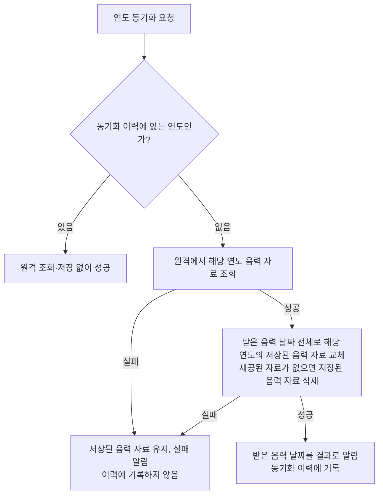

# 음력 자료 동기화 스펙

이 문서는 양력 날짜마다 대응하는 음력 날짜를 원격에서 받아 기기에 저장해 두고 조회하는 규칙을 다룬다. 사용자에게 직접 노출되는 화면이나 사용자 행동은 없으므로 `feature` 영역은 생략한다. 음력 자료로 음력 생일을 양력 날짜에 놓는 기준은 [캘린더 연락처 생일 표시 스펙](./calendar-contact-birthday.md)이, 동기화를 요청하는 계기와 대상 연도는 [CalendarHome 스펙](./calendar-home.md)이 소유한다.

## domain

### 음력 날짜

음력 자료는 양력 날짜 하나마다 그 날의 음력 연·월·일과 윤달 여부를 담은 음력 날짜로 이루어진다. 양력 날짜 하나는 음력 날짜 하나에만 대응한다.

음력은 한국 음력을 기준으로 한다. 어느 국가의 공휴일을 보는지와 무관하게 같은 음력 자료를 쓴다.

### 연도별 동기화

음력 자료 동기화는 요청한 양력 연도 하나를 대상으로 수행한다.

동기화가 성공하면 그 양력 연도에 속한 모든 날짜의 음력 날짜가 해당 연도의 최신 음력 자료로 간주된다. 동기화 결과에는 그 연도의 음력 날짜가 담긴다.

### 자료를 제공하지 않는 연도

원격은 요청한 연도의 음력 자료를 제공하지 않을 수 있다. 그 연도의 자료 자체가 없어 조회 결과가 없는 경우와 자료는 받았지만 음력 날짜가 하나도 없는 경우를 구분하지 않고, 둘 다 자료를 제공하지 않는 연도로 본다.

자료를 제공하지 않는 연도의 동기화도 성공으로 끝나며, 동기화 결과에는 빈 음력 날짜가 담긴다. 따라서 동기화를 요청한 쪽은 원격에서 받아오지 못한 실패와 원격이 그 연도의 자료를 제공하지 않은 성공을 결과로 구분할 수 있다.

### 동기화 이력

음력 자료는 바뀌지 않으므로, 앱을 실행한 동안 동기화에 성공한 연도는 더 이상 동기화가 필요하지 않은 것으로 본다.

이력은 연도 단위로 기록하고, 동기화에 성공한 연도만 기록한다. 자료를 제공하지 않는 연도도 동기화에 성공한 것이므로 함께 기록한다. 동기화에 실패한 연도는 기록하지 않으므로 다음 동기화 계기에 다시 시도한다.

동기화 이력은 앱을 실행한 동안만 유지한다. 앱을 다시 실행하면 이력이 비워지고 모든 연도를 다시 동기화할 수 있다.

한 연도의 이력은 다른 연도의 동기화 여부에 영향을 주지 않는다.

### 동기화 실패 보고

음력 자료 동기화 실패는 오류 보고 대상이다. 보고 방식은 [기능 실패 로깅 스펙](./usecase-failure-logging.md)의 오류 보고를 따른다.

원격 조회 실패와 기기 저장 실패 중 무엇이 실패했는지는 보고에 담긴 실패 원인으로 구분한다.

자료를 제공하지 않는 연도로 끝난 동기화는 성공이므로 오류 보고 대상이 아니다.

## data

### 원격 제공처

음력 자료는 [CalendarApi](https://github.com/taetae98coding/CalendarApi)가 제공하는 연도별 한국 음력 자료를 받아온다. 제공 범위는 1998년부터 2050년까지이고, 제공 범위를 벗어난 연도는 원격에 자료가 없는 연도로 다룬다.

### 연도별 동기화 처리

연도의 동기화 요청은 이력 여부에 따라 다음과 같이 처리된다.

### 성공한 연도 재조회 생략

연도가 이미 동기화 이력에 있으면 원격 조회와 저장 없이 성공으로 끝낸다. 이때 동기화 결과로는 그 연도의 기기에 저장된 음력 날짜를 알린다.

### 원격 자료 저장

동기화 이력에 없는 연도는 그 연도의 음력 자료를 원격에서 조회한다.

원격 조회가 성공하면 받은 음력 날짜 전체로 그 연도의 저장된 음력 자료를 교체한다. 지우기와 새로 저장하기는 한 번에 이루어진다. 원격이 해당 연도의 자료를 제공하지 않으면 그 연도의 저장된 음력 자료를 지운다.

저장까지 성공하면 해당 연도를 동기화 이력에 기록하고, 받은 음력 날짜를 동기화 결과로 알린다.

한 연도의 동기화는 다른 연도의 저장된 음력 자료에 영향을 주지 않는다.

### 실패 처리

원격 조회에 실패하면 그 연도의 저장된 음력 자료를 바꾸지 않고 실패로 끝낸다.

원격 조회 후 저장에 실패하면 실패로 끝내고, 해당 연도의 기존에 저장된 음력 자료는 유지한다.

실패한 연도는 동기화 이력에 기록하지 않으므로, 다음 동기화 요청에서 다시 원격 조회한다.

### 기기 보관

음력 자료는 [기기에 저장한 공휴일 스펙](./holiday-database.md)의 `보관 기간` 가운데 플랫폼별 보관 방식과 계정 무관 기준만 같게 따른다. Android, iOS, 데스크톱 앱에서는 앱을 다시 실행해도 남아 있고, 웹에서는 페이지를 새로 열면 비워지고 다음 동기화 계기에 다시 받아 온다. 사용자 계정과 무관해 로그인하거나 로그아웃하거나 다른 계정으로 바꿔도 그대로이며, 서버와 동기화하지 않는다.

공휴일의 원격 제공처 전환에 따른 변경은 음력 자료에 적용하지 않는다. 사용자가 저장된 음력 자료를 직접 지우는 수단은 없으며, 저장된 음력 자료는 `원격 자료 저장`에 따라 그 연도를 다시 받아 올 때만 바뀐다.

### 기간별 음력 날짜 조회

시작일과 종료일로 기간을 정해 음력 날짜를 조회하면, 그 기간에 드는 양력 날짜의 음력 날짜를 기기에 저장된 음력 자료에서 합쳐 제공한다.

기간에 드는 양력 날짜 중 기기에 저장되지 않은 날짜는 결과에 들지 않는다. 기간이 연도 경계를 넘으면 저장된 연도의 날짜만 담기고, 아직 저장되지 않은 연도의 날짜는 담기지 않는다. 저장된 날짜가 하나도 없으면 음력 날짜가 하나도 없는 목록을 제공한다.

조회 중인 기간에 드는 연도의 저장된 음력 자료가 바뀌면 바뀐 목록을 별도 요청 없이 다시 제공한다.

목록은 양력 날짜 순으로 정렬한다.
