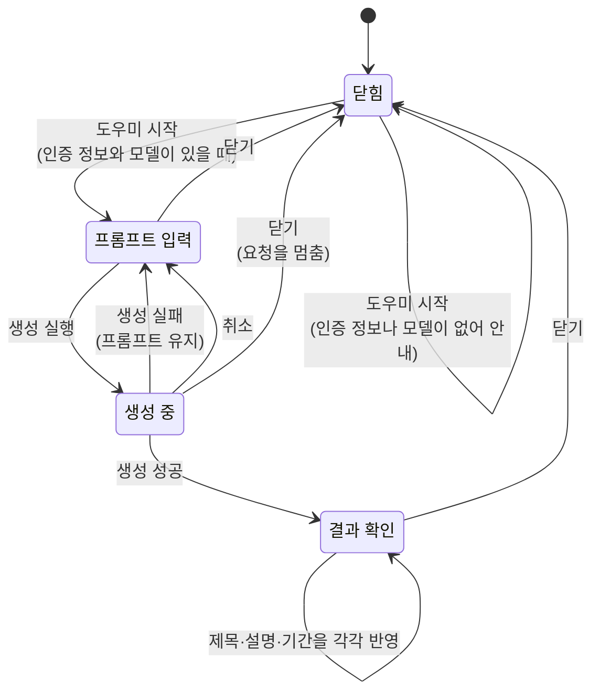

# 메모 Gemini 작성 도우미 스펙

이 문서는 사용자가 MemoAdd 화면과 MemoDetail 화면에서 Gemini로 메모의 제목, 설명, 기간을 생성하고 각각 따로 반영하는 작성 도우미의 행동과 정책을 다룬다. 두 화면이 같은 도우미를 제공하므로 공통 스펙으로 둔다.

도우미가 사용하는 인증 정보, 모델, 시스템 프롬프트는 [SettingGemini 화면 스펙](./setting-gemini.md)이 소유한다. 메모가 가질 수 있는 기간의 개념은 [MemoAdd 화면 스펙](./memo-add.md)의 `메모의 기간`을, 설명 입력과 미리보기의 동작은 [설명 입력 컴포넌트 스펙](./description-input.md)을 따른다. 반영한 내용으로 메모를 추가하거나 수정하는 흐름은 [MemoAdd 화면 스펙](./memo-add.md)과 [MemoDetail 화면 스펙](./memo-detail.md)에서 다룬다.

이 문서를 따르는 화면 스펙은 다음과 같다.

- [MemoAdd 화면 스펙](./memo-add.md)
- [MemoDetail 화면 스펙](./memo-detail.md)

디자인: [메모 Gemini 작성 도우미 디자인](../../design/memo-gemini.md)

## feature

### 도우미 시작

사용자는 MemoAdd 화면과 MemoDetail 화면에서 작성 도우미를 시작할 수 있다. 도우미를 시작하면 무엇을 만들지 적는 프롬프트 입력 상태로 들어간다.

도우미가 열려 있는 동안 사용자는 도우미 안의 동작만 할 수 있다. 메모 입력을 고치거나 메모를 추가·수정하려면 먼저 도우미를 닫는다.

저장된 Gemini 설정에 인증 정보나 모델이 없으면 도우미를 열지 않고 Gemini 설정이 필요하다는 것을 알린다. 이때 설정 화면으로 이동하지 않으므로 사용자가 직접 설정 화면으로 옮겨 값을 채운 뒤 다시 시작한다.

저장된 Gemini 설정을 아직 확인하지 못했으면 도우미 시작 동작을 제공하지 않으며, 별도 로딩 또는 오류 상태로 전환하지 않는다.

사용자가 다른 화면에서 Gemini 설정을 저장하면 이 화면을 다시 열지 않아도 다음 도우미 시작부터 바뀐 설정으로 판정한다.

### 프롬프트 입력

사용자는 어떤 메모를 만들고 싶은지 여러 줄로 적을 수 있다. 길이를 제한하지 않는다.

프롬프트가 비어 있어도 생성을 실행할 수 있다. 사용자는 아무것도 적지 않고 지금 입력 중인 메모 내용만으로 초안을 받을 수 있다.

### 생성 실행

사용자는 적은 프롬프트로 생성을 실행한다.

생성하는 동안에는 진행 상태를 표시하며, 생성이 끝나기 전에는 같은 화면에서 전달된 생성 요청을 처리하지 않는다.

생성하는 동안 사용자는 생성을 기다리거나 취소할 수 있다.

### 생성 취소

사용자는 생성하는 동안 생성을 취소할 수 있다. 취소하면 요청을 멈추고 결과를 받지 않으며 프롬프트 입력 상태로 돌아간다. 적었던 프롬프트는 그대로 남으므로 사용자는 프롬프트를 고쳐 다시 실행할 수 있다.

취소는 메모의 입력 내용을 바꾸지 않는다.

### 결과 확인과 반영

생성에 성공하면 사용자는 생성된 제목, 설명, 기간을 확인한다.

사용자는 세 가지를 각각 따로 반영한다. 하나를 반영하면 그 입력만 생성된 내용으로 바뀌고 나머지 입력과 결과는 그대로 유지되므로, 사용자는 마음에 드는 것만 골라 반영할 수 있다.

반영해도 결과 확인 상태는 유지된다. 사용자는 이어서 다른 것을 반영하거나, 이미 반영한 것을 다시 반영할 수 있다.

사용자는 결과마다 이미 반영했는지 확인할 수 있다. 반영했다는 표시는 도우미를 닫으면 사라진다.

생성된 내용 중 비어 있는 것은 반영할 수 없다. 예를 들어 기간을 정하지 않은 결과에서는 기간 반영 동작을 제공하지 않는다.

결과를 마음에 들어 하지 않으면 사용자는 도우미를 닫고 다시 시작한다. 결과 확인 상태에서 다시 생성하는 동작은 제공하지 않는다.

### 생성 실패

인증 정보가 유효하지 않아 실패하면 인증 정보를 확인해야 한다는 것을 알리고, 그 밖의 이유로 실패하면 생성에 실패했다는 것을 알린다.

두 경우 모두 프롬프트 입력 상태로 돌아가며 적었던 프롬프트와 메모의 입력 내용은 그대로 두므로, 사용자는 그대로 다시 시도하거나 프롬프트를 고쳐 다시 시도할 수 있다.

### 도우미 닫기

사용자는 언제든 도우미를 닫을 수 있다. 도우미가 열려 있는 동안 뒤로가기를 하면 메모 화면을 떠나지 않고 도우미만 닫힌다. 생성하는 동안 닫으면 취소한 것과 같이 요청을 멈추고 결과를 받지 않는다.

도우미를 닫으면 적었던 프롬프트와 받아 둔 결과를 버린다. 다시 시작하면 빈 프롬프트로 새로 시작한다.

이미 반영한 내용은 도우미를 닫아도 입력에 그대로 남는다.

## domain

### 작성 도우미

작성 도우미는 사용자가 적은 프롬프트로 메모의 제목, 설명, 기간을 한 번에 생성해 제안하는 기능이다. 제안일 뿐이므로 사용자가 반영하기 전에는 메모의 입력도 저장된 메모도 바뀌지 않는다.

도우미는 메모의 컬러, 태그 연결, 대표 태그, 웹 연결, 장소 연결, 연락처 연결을 생성하지 않고 바꾸지도 않는다.

### 도우미를 시작할 수 있는 조건

도우미는 저장된 Gemini 설정의 인증 정보와 모델이 모두 비어 있지 않을 때만 시작할 수 있다. 두 값은 Gemini를 호출하는 데 반드시 필요하므로 하나라도 비어 있으면 생성할 수 없다.

시스템 프롬프트는 비어 있어도 된다. 시스템 프롬프트가 없으면 지시문 없이 생성한다.

판정에는 저장된 설정을 사용한다. SettingGemini 화면에서 편집 중인 값은 아직 저장된 설정이 아니므로 판정에 영향을 주지 않는다.

Gemini 설정의 저장과 확인하지 못한 상태의 구분은 [SettingGemini 화면 스펙](./setting-gemini.md)의 `data`를 따른다.

### 생성에 보내는 내용

생성 요청에는 다음을 함께 보낸다.

- 저장된 시스템 프롬프트. 비어 있거나 공백뿐이면 보내지 않는다.
- 사용자가 적은 프롬프트. 비어 있거나 공백뿐이면 보내지 않는다.
- 지금 입력 중인 제목, 설명, 기간. 저장된 메모의 값이 아니라 사용자가 화면에서 보고 있는 값이다. 제목과 설명은 비어 있거나 공백뿐이면 보내지 않고, 기간은 날짜·시간 입력을 사용하고 있을 때만 보낸다.
- 요청 시점의 날짜와 시각, 그리고 기기의 시간대. 사용자가 `내일`이나 `이번 주말`처럼 적은 표현을 지금을 기준으로 해석할 수 있어야 하기 때문이다.

메모의 컬러, 태그, 웹, 장소, 연락처, 그 밖에 메모를 가리키는 정보는 보내지 않는다.

앱은 시스템 프롬프트에 지시문을 더하지 않는다. 사용자가 적은 시스템 프롬프트만 그대로 보내며, 앱이 정하는 것은 결과를 어떤 구조로 받을지뿐이다.

### 생성 결과

생성 결과는 제목, 설명, 기간으로 이루어지며 셋 다 비어 있을 수 있다.

- 제목: 한 줄로 된 메모 제목. 비어 있거나 공백뿐이면 없는 것으로 본다.
- 설명: 여러 줄로 된 메모 설명이며 마크다운으로 해석된다. 비어 있거나 공백뿐이면 없는 것으로 본다.
- 기간: 종일 기간이거나 날짜·시간 기간이며, 없을 수 있다. 기간의 형태와 시작·종료 규칙은 [MemoAdd 화면 스펙](./memo-add.md)의 `메모의 기간`을 따른다.

기간의 시작이 종료보다 늦으면 쓸 수 없는 기간이므로 기간이 없는 결과로 본다.

세 가지가 모두 비어 있어도 생성은 성공이며 실패로 다루지 않는다. 이때는 반영할 수 있는 것이 없다.

### 반영 기준

반영은 생성된 내용으로 해당 입력의 내용을 덮어쓴다. 기존 내용에 이어 붙이지 않는다.

반영 대상은 화면의 입력이며 저장된 메모가 아니다. MemoAdd 화면에서는 추가를 실행해야, MemoDetail 화면에서는 수정을 반영해야 저장된다.

- 제목을 반영하면 제목 입력의 내용이 생성된 제목으로 바뀐다.
- 설명을 반영하면 설명 입력의 내용이 생성된 설명으로 바뀐다. 이는 [설명 입력 컴포넌트 스펙](./description-input.md)의 첫 표시가 아니므로 입력과 미리보기 중 보고 있던 상태는 바뀌지 않는다.
- 기간을 반영하면 날짜·시간 입력이 기간을 사용하는 상태가 되고 생성된 기간이 들어간다. 반영 전에 기간을 사용하지 않고 있었어도 마찬가지다.

같은 것을 여러 번 반영해도 결과는 같다. 사용자가 반영한 뒤 입력을 직접 고쳤다가 다시 반영하면 생성된 내용으로 다시 덮어쓴다.

MemoDetail 화면에서 반영하면 수정 반영 가능 기준에 따라 수정 동작이 나타난다. 기준은 [MemoDetail 화면 스펙](./memo-detail.md)의 `수정 반영 가능 기준`을 따른다.

### 도우미의 상태

도우미의 상태는 다음과 같이 바뀐다.

닫으면 프롬프트와 결과를 버리므로 다시 시작할 때는 언제나 빈 프롬프트에서 출발한다.

### 요청 제한

생성을 처리하는 동안에는 같은 화면에서 전달된 생성 요청을 처리하지 않는다. 한 번의 의도로 같은 생성이 중복 실행되는 것을 막기 위한 것이며, 처리가 끝나면 사용자는 다시 실행할 수 있다.

생성은 메모 추가, 메모 수정, 완료, 복사, 삭제와 다른 종류의 동작이므로 서로의 요청을 제한하지 않는다. 요청 종류별 제한은 [항목 추가 화면 공통 스펙](./entity-add.md)의 `추가 요청 제한`과 [MemoDetail 화면 스펙](./memo-detail.md)의 `요청 제한`을 따른다.

반영은 앱의 데이터를 바꾸지 않으므로 요청 제한 대상이 아니다.

### 진행 상태 유지

화면이 회전하거나 시스템에 의해 화면이 재생성되어도 도우미의 열림 여부, 적고 있던 프롬프트, 진행 중인 생성과 받아 둔 결과는 유지된다.

사용자가 다른 앱에 다녀와도 도우미의 열림 여부, 적고 있던 프롬프트, 진행 중인 생성과 받아 둔 결과는 그대로 유지된다. 다른 앱에 가 있는 동안에도 진행 중인 생성은 멈추지 않고 이어지며, 돌아왔을 때 끝나 있으면 그 결과나 실패가 보인다.

앱이 백그라운드에 있는 동안 시스템이 앱을 종료했다가 되살리면 도우미는 닫힌 상태로 돌아오고 프롬프트와 결과는 남지 않으며, 진행 중이던 생성은 멈춘다. 사용자는 도우미를 다시 시작해 빈 프롬프트에서 새로 시작한다.

사용자가 화면을 떠나 전환 이력에서 사라지거나 앱을 종료하고 다시 실행하면 도우미는 닫힌 상태가 되고 프롬프트와 결과는 남지 않는다. 진행 중이던 생성은 멈춘다.

MemoDetail 화면에서 상세 대상이 다른 메모로 바뀌면 도우미는 닫히고 프롬프트와 결과는 이어지지 않는다.

## data

### 원격 생성

생성을 실행하면 저장된 인증 정보와 모델로 Gemini에 생성을 요청한다. 인증 정보, 모델, 시스템 프롬프트는 생성을 실행하는 시점에 저장되어 있는 값을 쓴다. 보내는 내용은 `domain`의 `생성에 보내는 내용`을 따른다.

결과는 제목, 설명, 기간이 서로 구분된 형태로 받는다. 어떤 구조로 받을지는 앱이 요청에 함께 지정하므로 사용자가 시스템 프롬프트에 형식을 적지 않아도 세 가지를 나누어 받을 수 있다.

모델이 지정한 구조를 지키지 않았거나 결과를 만들지 못하면 생성하지 못한 것으로 다루며, `인증 정보가 유효하지 않은 실패`가 아닌 그 밖의 실패로 알린다.

### 실패 처리

원격 생성에 실패하면 실패를 그대로 알린다. 실패를 빈 결과 같은 정상 결과로 바꾸지 않는다.

인증 정보가 유효하지 않은 실패와 그 밖의 실패를 구분해 전달한다. 구분 기준은 [Gemini 모델 목록 조회 스펙](./gemini-model-list.md)의 `인증`과 같다.

### 저장하지 않는 것

프롬프트, 생성 요청과 결과는 기기에도 서버에도 저장하지 않는다. 도우미를 닫거나 화면을 떠나면 사라진다.

생성은 메모를 만들거나 바꾸지 않으므로 [데이터 동기화 스펙](../common/data-sync.md)의 동기화 대상이 아니다. 사용자가 반영한 뒤 메모를 추가하거나 수정해야 저장과 동기화가 일어난다.

## 참고

- [Gemini 콘텐츠 생성 안내](https://ai.google.dev/api/generate-content)
- [Gemini 구조화된 출력 안내](https://ai.google.dev/gemini-api/docs/structured-output)
