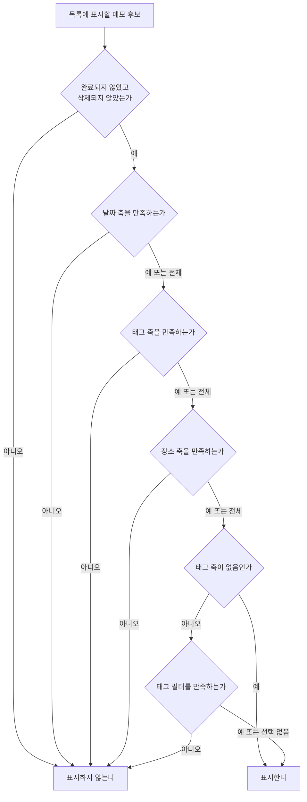

# MemoHome 목록 스펙

이 문서는 메모 목록 화면의 메모 노출 기준과 정렬, 날짜 그룹 표시, 유무 필터와 태그 필터, 목록에서 메모를 완료하거나 삭제하는 행동을 다룬다. 메모 추가 화면으로의 이동과 추가 화면의 행동은 [MemoAdd 화면 스펙](./memo-add.md)에서 다룬다. 메모가 가질 수 있는 기간의 개념은 [MemoAdd 화면 스펙](./memo-add.md)의 `메모의 기간`을 따른다. 완료된 메모를 모아 확인하는 화면은 [MemoFinishedList 화면 스펙](./memo-finished-list.md)에서, 목록에서 검색으로 이동한 뒤의 내용과 행동은 [SearchHome 화면 스펙](./search-home.md)에서 다룬다. 목록을 당겨 새로고침하는 행동과 동기화 진행 표시는 [새로고침 스펙](./sync-refresh.md)에서 다룬다. 태그 필터의 공통 행동과 정책은 [태그 필터 스펙](./tag-filter.md)을 따르며, 이 문서는 메모 목록에 적용되는 부분만 다룬다.

디자인: [MemoHome 목록 디자인](../../design/memo-home.md)

## feature

### 목록 표시

메모 목록 화면에는 완료되지 않았고 삭제되지 않은 메모만 표시된다.

각 메모에는 제목이 표시되고, 기간이 있으면 기간도 함께 표시된다.

메모 제목은 카드에서 한 줄로 표시한다. 제목이 표시할 수 있는 폭보다 길면 전체 제목을 확인할 수 있도록 가로로 반복해서 이동한다.

아직 준비되지 않은 자리의 처리는 [페이지 조회 목록의 자리 표시 스펙](./paged-list-placeholder.md)을 따른다.

### 내용 갱신

목록은 메모를 한 번에 모두 불러오지 않고, 사용자가 목록 끝에 다가가면 이어서 더 보여 준다. 이어서 불러오는 기준은 [페이지 조회 목록의 자리 표시 스펙](./paged-list-placeholder.md)의 `페이지 조회`를 따른다.

이 기기에서 메모를 추가하거나 고치거나 완료·삭제하거나 메모의 태그·장소 연결을 바꾸면, 그 일을 어느 화면에서 했든 목록은 새로고침하지 않아도 바로 바뀐 내용을 보여 준다. 목록과 상세를 함께 보는 동안 상세에서 고친 내용도 목록에 바로 반영된다.

다른 기기에서 바꾼 내용은 이 기기가 서버와 맞춘 뒤 목록에 나타난다. 서버와 맞추는 때는 [데이터 동기화 스펙](./data-sync.md)의 `동기화 계기`를 따르며, 앱으로 돌아오거나 로그인했을 때가 여기에 들어간다. 맞춘 내용이 기기에 반영되면 사용자가 아무것도 하지 않아도 목록이 바뀐다.

### 새로고침

사용자는 목록을 아래로 당겨 새로고침할 수 있다. 새로고침은 서버와 한 번 맞추는 것이며, 진행 표시와 진행 중에 다시 당겼을 때의 결과는 [새로고침 스펙](./sync-refresh.md)을 따른다. 목록이 비어 있어도 당겨서 새로고침할 수 있다.

이 화면에 들어오거나 다른 화면에서 돌아오는 것만으로는 새로고침하지 않는다.

### 불러오기 실패

목록을 불러오지 못해도 별도 오류 안내나 다시 시도 동작은 제공하지 않는다. 이미 보이는 메모는 그대로 두고, 보이는 메모가 하나도 없으면 `빈 상태`의 안내를 보여 준다.

### 빈 상태

표시할 메모가 하나도 없으면 목록 자리에 비어 있음을 알린다. 판정 시점, 빈 상태에서 할 수 있는 행동, 목록과의 전환은 [목록 빈 상태 스펙](./list-empty-state.md)을 따른다.

이 목록은 사용자가 필터로 범위를 좁힐 수 있으므로, 좁힌 결과로 비었는지와 아직 메모가 없는지를 구분해 알린다. 구분 기준은 [목록 빈 상태 스펙](./list-empty-state.md)의 `빈 이유의 구분`을 따른다.

빈 상태에서도 사용자는 메모 추가, 필터 열기, 완료된 메모 확인, 검색을 그대로 실행할 수 있다.

### 날짜 헤더

기간이 있는 메모는 시작 날짜가 같은 것끼리 모여 표시되며, 각 묶음에는 시작 날짜를 나타내는 헤더가 표시된다.

기간이 없는 메모는 목록 맨 위에 날짜 헤더 없이 모여 표시된다.

그룹 날짜가 오늘이면 날짜 대신 오늘임을 알린다.

아직 내용이 준비되지 않은 메모는 시작 날짜를 알 수 없으므로 날짜 그룹에 넣지 않으며, 내용이 준비되면 해당 그룹에 표시한다.

### 유무 필터

사용자는 메모 목록에서 필터를 열어 날짜, 태그, 장소 각각에 대해 `있음`, `없음`, `전체` 중 하나를 고를 수 있다. 세 축은 서로 독립이며, 축마다 하나의 상태만 고를 수 있다.

`있음`을 고르면 그 항목을 가진 메모만, `없음`을 고르면 그 항목을 갖지 않은 메모만 표시하고, `전체`를 고르면 그 항목으로 거르지 않는다.

선택이 반영되는 시점, 필터를 닫고 다시 열 때의 선택, 반영된 목록을 어디서부터 확인하는지는 [목록 필터 반영 스펙](./list-filter.md)의 `필터 열기와 선택`과 `필터 반영`을 따른다.

유무 필터와 태그 필터는 같은 필터 안에서 함께 제공되며, 두 필터의 선택은 함께 적용된다.

사용자가 태그 축을 `없음`으로 고르면 태그 필터는 목록에 적용되지 않는다. 이때 사용자는 태그 필터에서 선택과 해제, 선택 전체 해제, 태그 추가를 실행할 수 없고, 태그 필터가 지금 적용되지 않는다는 것을 확인할 수 있다. 태그 축을 `있음`이나 `전체`로 되돌리면 사용자는 이전 선택을 그대로 확인하고 다시 바꿀 수 있다.

### 태그 필터

사용자는 메모 목록에서 태그 필터를 열어 태그를 선택하거나 선택을 해제할 수 있고, 선택한 태그를 한 번에 모두 해제할 수 있다. 필터를 열고 선택하고 전체 해제하고 닫는 행동은 [태그 필터 스펙](./tag-filter.md)의 `feature`를 따른다.

선택과 해제, 전체 해제가 반영되는 시점과 반영된 목록을 어디서부터 확인하는지는 [목록 필터 반영 스펙](./list-filter.md)의 `필터 열기와 선택`과 `필터 반영`을 따른다.

선택한 태그가 없으면 태그와 관계없이 목록 노출 기준을 만족하는 메모를 모두 표시하고, 태그를 하나 이상 선택하면 선택한 태그 중 하나 이상과 연결된 메모만 표시한다.

전체 해제는 태그 필터 선택만 되돌리며 유무 필터의 세 축 상태는 그대로 둔다.

### 메모 추가로 이동

사용자는 메모 목록에서 메모 추가를 선택해 [MemoAdd 화면](./memo-add.md)으로 이동한다. 목록이 비어 있거나 필터를 걸어 두었어도 이 동작은 제공된다.

목록과 상세를 함께 보는 동안 상세 자리에 이미 메모 추가가 놓여 있으면 목록에서 메모 추가를 제공하지 않는다. 그 기준과 상세 자리의 변화는 [Memo 목록·상세 배치 스펙](./memo-list-detail.md)을 따른다.

### 메모 상세 확인

사용자가 목록의 메모를 선택하면 그 메모의 [MemoDetail 화면](./memo-detail.md)으로 이동한다. 목록과 상세를 함께 보는 동안에는 상세 자리가 그 메모로 바뀌며, 그 결과는 [Memo 목록·상세 배치 스펙](./memo-list-detail.md)을 따른다.

아직 내용이 준비되지 않은 자리는 선택할 수 없다.

### 완료된 메모 확인

사용자는 메모 목록에서 완료된 메모 확인을 선택해 MemoFinishedList 화면으로 이동할 수 있다.

완료된 메모가 하나도 없어도 이 동작은 제공된다.

이동한 화면의 내용과 행동은 [MemoFinishedList 화면 스펙](./memo-finished-list.md)을 따른다. 사용자가 그 화면에서 뒤로 가면 메모 목록으로 돌아온다.

### 검색으로 이동

사용자는 메모 목록에서 검색을 선택해 [SearchHome 화면](./search-home.md)으로 이동한다.

이동한 화면은 메모 검색 결과부터 보여 준다. 시작 유형의 기준은 [SearchHome 화면 스펙](./search-home.md)의 `진입 경로와 시작 유형`을 따른다.

검색은 목록에 표시할 메모가 있는지, 필터를 걸어 두었는지와 무관하게 언제나 실행할 수 있다. 목록에 걸어 둔 유무 필터와 태그 필터는 검색 결과를 좁히지 않는다.

사용자가 검색 화면에서 뒤로 가면 메모 목록으로 돌아오며, 목록의 필터 선택과 보고 있던 위치는 검색으로 떠나기 전 그대로다.

### 완료

사용자는 목록의 메모를 완료할 수 있다.

완료하면 메모가 목록에서 사라지고 완료되었음을 안내하며, 실행 취소 동작을 제공한다.

사용자가 실행 취소를 선택하면 메모는 완료되지 않은 상태로 되돌아가 목록에 다시 나타난다.

### 삭제

사용자는 목록의 메모를 삭제할 수 있다.

삭제하면 메모가 목록에서 사라지고 삭제되었음을 안내하며, 실행 취소 동작을 제공한다.

사용자가 실행 취소를 선택하면 메모는 삭제되지 않은 상태로 되돌아가 목록에 다시 나타난다.

### 안내와 실행 취소

완료나 삭제의 안내는 사용자가 실행 취소를 선택하지 않으면 잠시 뒤 저절로 사라지며, 사라진 뒤에는 그 동작을 목록에서 되돌릴 수 없다.

안내가 보이는 동안 다른 메모를 이어서 완료하거나 삭제하면 앞의 안내는 바로 사라지고 새 동작의 안내만 보인다. 이때 실행 취소는 마지막 동작에만 적용되며, 앞의 동작은 되돌려지지 않는다.

완료나 삭제가 저장되지 못하면 메모의 상태는 바뀌지 않고 안내도 보이지 않는다.

안내가 보이는 동안 사용자가 그 목록을 보여 주는 화면을 떠나거나, 목록이 탭 안에 있어 다른 탭으로 바꾸면 안내는 바로 닫히고 그 동작은 목록에서 되돌릴 수 없다. 돌아와도 안내는 다시 나타나지 않는다. 화면이 회전하거나 시스템이 화면을 재생성해도 안내는 닫히고 그 동작은 목록에서 되돌릴 수 없다. 앱이 백그라운드에 다녀오는 것은 화면을 떠나는 것으로 보지 않으므로, 안내가 표시되는 시간이 남아 있으면 돌아와도 안내가 보이고 실행 취소할 수 있다. 이 절을 따르는 다른 목록도 같다.

### 정렬 선택

사용자는 목록 위에서 현재 정렬을 확인하고 다른 기준으로 바꿀 수 있다. 고를 수 있는 기준과 정렬 선택·반영·유지의 결과는 [목록 정렬 스펙](./list-sort.md)을 따른다.

## domain

### 메모 상태와 노출 기준

메모는 완료 여부와 삭제 여부 상태를 가진다.

메모 목록에는 완료되지 않았고 삭제되지 않은 메모만 노출한다. 완료되었거나 삭제된 메모는 기기에 남아 있지만 목록에는 나타나지 않는다.

이 노출 기준은 메모 목록에만 적용한다. 캘린더의 노출 기준은 [캘린더 메모 표시 스펙](./calendar-memo.md)의 노출 기준을 따르며, 완료된 메모도 캘린더에는 표시된다. 완료된 메모를 모아 보여 주는 목록의 노출 기준은 [MemoFinishedList 화면 스펙](./memo-finished-list.md)의 노출 기준을 따른다.

### 유무 필터 기준

유무 필터의 각 축은 `있음`, `없음`, `전체` 중 하나의 상태를 가지며, 기본 상태는 `전체`다. 어느 축도 고르지 않은 처음 상태에서는 세 축이 모두 `전체`다.

각 축이 무엇을 기준으로 항목의 유무를 판정하는지는 다음과 같다.

| 축 | 있는 메모 | 없는 메모 |
| --- | --- | --- |
| 날짜 | 기간이 있는 메모 | 기간이 없는 메모 |
| 태그 | 표시되는 태그가 하나 이상인 메모 | 표시되는 태그가 하나도 없는 메모 |
| 장소 | 표시되는 장소가 하나 이상인 메모 | 표시되는 장소가 하나도 없는 메모 |

날짜 축이 기준으로 삼는 기간은 [MemoAdd 화면 스펙](./memo-add.md)의 `메모의 기간`을 따른다. 기간의 종일 여부, 시작·종료 시각, 기간이 오늘보다 이전인지 이후인지는 판정에 쓰지 않는다.

태그 축이 세는 태그는 현재 사용자 계정과 연결되고 삭제되지 않은 태그와의 해제되지 않은 연결이다. 완료된 태그와의 연결도 태그가 있는 것으로 센다. 연결의 해제 규칙은 [메모 태그 스펙](../common/memo-tag.md)을 따른다.

장소 축이 세는 장소는 현재 사용자 계정과 연결되고 삭제되지 않은 장소와의 해제되지 않은 연결이다. 연결의 해제 규칙은 [메모 장소 스펙](../common/memo-place.md)을 따른다.

메모의 기간이 바뀌거나 태그·장소 연결이 만들어지거나 해제되면, 그 메모는 바뀐 내용으로 다시 판정되어 목록에 나타나거나 사라진다.

### 태그 필터 기준

선택할 수 있는 태그, 필터 판정 기준, 선택할 수 없게 된 태그의 처리는 [태그 필터 스펙](./tag-filter.md)의 `domain`을 따른다.

### 필터 조합 기준

유무 필터의 세 축과 태그 필터는 모두 함께 적용한다. 메모는 목록의 노출 기준을 만족하면서 `전체`가 아닌 모든 축과 태그 필터를 동시에 만족해야 표시된다.

다만 태그 축이 `없음`이면 태그 필터 선택을 판정에서 무시하고 태그 축만 적용해 태그를 갖지 않은 메모를 표시한다. 태그를 갖지 않은 메모만 보여 달라는 요구와 선택한 태그를 가진 메모만 보여 달라는 요구를 함께 만족하는 메모는 있을 수 없으므로, 두 요구를 함께 적용해 목록을 반드시 비우지 않고 태그 축을 기준으로 삼는다. 무시하는 방식은 [태그 필터 스펙](./tag-filter.md)의 `선택할 수 없게 된 태그`와 같아, 선택 자체는 유지하고 판정에서만 빼놓는다.

태그 축이 `없음`인 동안에는 태그 필터의 선택과 해제, 선택 전체 해제를 실행할 수 없다. 판정에 쓰이지 않는 선택을 바꾸게 두면 사용자가 목록에 반영되지 않는 조작을 하게 되기 때문이다. 태그 추가는 선택을 바꾸지 않지만 태그 필터 안의 동작이므로 함께 막아, 태그 필터 전체가 지금 조작할 수 없다는 것을 한 가지 상태로 알린다. 사용자가 태그 축을 `있음`이나 `전체`로 되돌리면 유지된 선택이 다시 판정에 쓰이고 다시 바꿀 수 있다.

태그 축이 `있음`이면 태그 필터를 함께 적용한다. 선택한 태그 중 하나 이상과 연결된 메모는 태그를 하나 이상 가진 메모이므로 두 조건이 서로 모순되지 않는다.

필터 선택은 메모 목록의 기존 노출 기준을 대체하지 않는다. 모든 필터 조건을 만족해도 완료되었거나 삭제된 메모는 표시하지 않는다.

### 필터 선택 유지

태그 필터 선택은 현재 사용자 계정별로, 유무 필터의 세 축 상태는 사용자 계정과 무관하게 기기 하나에 하나로 유지한다. 유지되는 경계, 계정이 바뀔 때의 적용, 캘린더의 필터 선택과 독립인 기준은 [목록 필터 반영 스펙](./list-filter.md)의 `필터 선택 유지`를 따른다.

유무 필터는 메모 목록에서만 제공하며 다른 화면의 메모 표시에는 적용하지 않는다.

### 실행 경계

화면이 회전하거나 재생성되거나 앱이 백그라운드에 다녀와도 목록의 필터 선택, 정렬 선택과 보고 있던 위치는 그대로다. 메모 상세나 검색, 완료된 메모 확인에 다녀와도 같다.

앱이 백그라운드에 있는 동안 시스템이 앱을 정리했다가 다시 만들면 필터 선택은 이어지고, 열어 둔 필터는 [목록 필터 반영 스펙](./list-filter.md)의 `필터 열림 유지`에 따라 열린 채로 다시 보이며, 정렬은 [목록 정렬 스펙](./list-sort.md)의 `정렬 선택 유지`에 따라 처음 정렬로 돌아가고, 목록 위치는 [페이지 조회 목록의 자리 표시 스펙](./paged-list-placeholder.md)의 `보던 자리 유지`에 따라 떠나기 전 위치로 다시 보인다.

앱을 종료하고 다시 실행하면 필터 선택은 `필터 선택 유지`에 따라 이어지고, 정렬은 [목록 정렬 스펙](./list-sort.md)의 `정렬 선택 유지`에 따라 처음 정렬로 돌아가며, 목록은 맨 위부터 보인다.

공통 내비게이션에서 다른 주요 목적지에 다녀와도 같다. 필터 선택은 이어지고, 정렬은 처음 정렬로 돌아가며, 목록은 맨 위부터 보인다. 그 기준은 [TopLevelNavigation 스펙](./top-level-navigation.md)의 `목적지 이동과 화면 상태`를 따른다.

현재 목적지인 메모를 다시 선택했을 때 돌아가는 자리는 [TopLevelNavigation 스펙](./top-level-navigation.md)의 `다시 선택으로 돌아가는 자리`를 따른다.

### 완료와 삭제의 상태 전이

완료는 메모의 완료 여부를 완료 상태로 바꾸는 것이고, 삭제는 삭제 여부를 삭제 상태로 바꾸는 것이다. 두 동작 모두 메모 자체를 지우지 않는다.

실행 취소는 직전에 바꾼 상태를 원래 상태로 되돌린다. 완료의 실행 취소는 완료 여부를 미완료로, 삭제의 실행 취소는 삭제 여부를 미삭제로 되돌린다.

완료, 삭제, 실행 취소는 모두 메모의 수정 시각을 동작 시점으로 갱신한다.

### 정렬

메모 목록은 기간이 없는 메모를 먼저 놓고, 그 뒤에 기간이 있는 메모를 시작 날짜 오름차순으로 놓는다. 기간이 없는 메모끼리는 제목 오름차순으로 놓는다.

같은 날짜에 시작하는 메모끼리는 종일 메모를 언제나 먼저 놓고, 그 뒤에 종일이 아닌 메모를 놓는다. 자정에 시작하는 종일이 아닌 메모도 같은 날짜의 종일 메모 뒤에 온다.

- 종일 메모끼리는 종료 날짜 오름차순으로 놓는다.
- 종일이 아닌 메모끼리는 시작 시각 오름차순으로 놓고, 시작 시각이 같으면 종료 시점 오름차순으로 놓는다.
- 위 기준이 모두 같으면 제목 오름차순으로 놓는다.

시작 날짜, 종일 여부, 시작 시각, 종료 시점, 제목이 모두 같은 메모끼리의 순서는 정하지 않는다.

메모의 기간이 바뀌면 그 메모는 바뀐 기간에 해당하는 자리로 옮겨진다. 완료나 삭제의 실행 취소로 되돌아온 메모도 자신의 기간에 해당하는 자리에 나타나며, 상태를 바꾼 순서는 목록 순서에 영향을 주지 않는다.

위 순서는 사용자가 정렬을 고르지 않았을 때의 순서이며, 사용자가 고를 수 있는 다른 기준과 그 순서는 [목록 정렬 스펙](./list-sort.md)이 정한다.

### 날짜 그룹과 오늘 기준

날짜 헤더는 기간이 있는 메모를 시작 날짜 기준으로 묶는다. 시작 시각은 묶는 기준에 쓰지 않으므로, 같은 날에 시작하는 메모는 시작 시각이 달라도 하나의 묶음에 들어간다.

기간이 없는 메모는 날짜로 묶을 수 없어 어떤 묶음에도 속하지 않는다.

오늘은 [Calendar 컴포넌트 스펙](./calendar.md)의 `오늘 기준`을 따라 사용자의 현재 시간대를 기준으로 정한다.

오늘은 메모 목록 화면이 다시 활성화될 때마다 다시 정해진다. 예를 들어 자정 이전에 화면을 벗어났다가 자정 이후에 복귀하면 오늘로 표시되는 날짜 헤더가 바뀐 오늘로 옮겨진다.

날짜 헤더를 두는 정렬은 [목록 정렬 스펙](./list-sort.md)의 `정렬과 그룹의 관계`가 정한다.

### 대상 메모

메모 목록에는 현재 사용자 계정과 연결된 메모만 표시된다.

목록에서 실행하는 완료와 삭제는 현재 사용자 계정과 연결된 메모에만 적용된다.

## data

### 상태 변경의 저장

목록에서 메모를 완료하거나 삭제하면 현재 사용자 계정과 연결된 해당 메모의 완료 여부나 삭제 여부가 기기에 즉시 저장된다. 서버에는 [데이터 동기화 스펙](../common/data-sync.md)에 따라 반영되어 같은 계정의 다른 기기에도 같은 상태로 보인다.

실행 취소를 선택하면 되돌린 상태가 같은 방식으로 즉시 저장된다.

### 목록 조회

메모 목록은 기기에 저장된 메모 가운데 완료되지 않았고 삭제되지 않은 메모만 `domain`의 정렬 순서로 조회해 표시한다. 선택한 태그가 있고 태그 축이 `없음`이 아니면 그중 하나 이상과 해제되지 않은 연결을 가진 메모만 함께 조회하고, `전체`가 아닌 유무 필터 축이 있으면 그 축의 기준을 함께 만족하는 메모만 조회한다. 태그 축이 `없음`이면 `domain`의 `필터 조합 기준`에 따라 선택한 태그를 조회 기준에 넣지 않는다. 상태 변경이나 기간 변경, 태그·장소 연결 또는 필터 선택 변경이 반영되면 목록은 조회 기준과 정렬 순서에 따라 자동으로 갱신된다.

날짜 헤더는 조회된 순서에서 시작 날짜가 바뀌는 자리마다 만들어진다. 따라서 화면에 아직 내용이 준비되지 않은 구간의 날짜 헤더는 그 구간의 메모가 준비된 뒤에 나타난다.

### 태그 필터 조회

메모 목록의 태그 필터 조회는 [태그 필터 스펙](./tag-filter.md)의 `태그 필터 조회`를 따른다.

### 유무 필터 조회

유무 필터의 조회는 [목록 필터 반영 스펙](./list-filter.md)의 `필터 선택 조회`를 따르며, 유지된 상태가 없으면 세 축을 모두 `전체`로 본다.

### 필터 선택 저장

메모 목록의 필터 선택 저장은 [태그 필터 스펙](./tag-filter.md)의 `필터 선택 저장`을 따른다.

유무 필터의 축 상태도 [목록 필터 반영 스펙](./list-filter.md)의 `필터 선택 저장`을 따른다. 사용자가 어느 축의 상태를 바꾸면 그 축만 저장하며 다른 축의 상태는 바꾸지 않는다.
