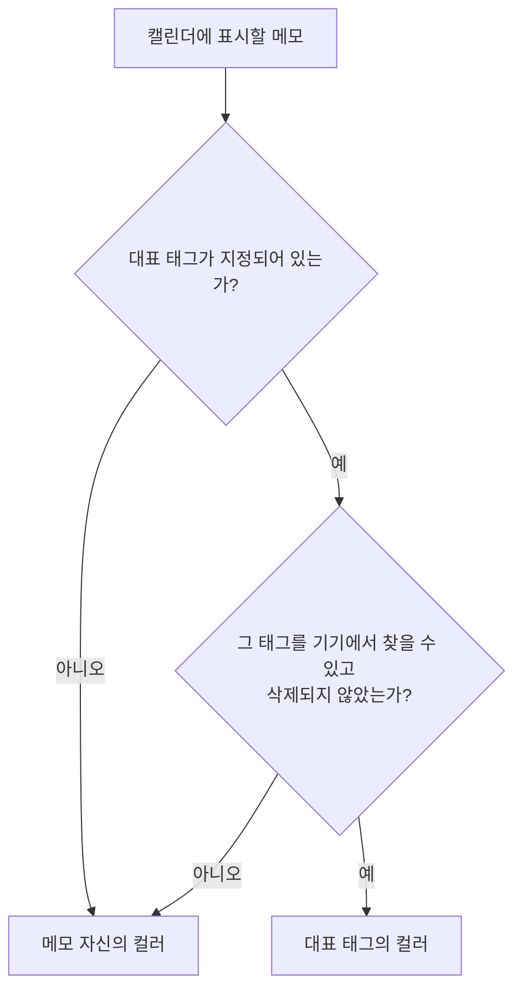

# 메모 대표 태그 앱 스펙

이 문서는 메모의 대표 태그 가운데 사용자가 기기에서 대표 태그를 지정하고 바꾸는 규칙과, 앱이 캘린더에 메모를 표시할 때 대표 태그로 색상을 정하는 규칙을 다룬다. 대표 태그 자체의 규칙과 저장·동기화는 [메모 대표 태그 스펙](../common/memo-primary-tag.md)을 따른다.

캘린더 표시 색상 규칙을 사용하는 앱 스펙은 [캘린더 메모 표시 스펙](./calendar-memo.md)과 [MemoDetail 화면 스펙](./memo-detail.md)이다. 사용자 조작이 없어 이 문서에는 `feature` 영역을 두지 않는다.

## domain

### 기기에서의 대표 태그 변경

사용자는 메모를 추가할 때 대표 태그를 지정할 수 있고, 이미 저장된 메모의 대표 태그도 바꿀 수 있다. 완료되었거나 삭제된 메모의 대표 태그도 바꿀 수 있다.

사용자가 메모의 대표 태그를 지정해 기기에 저장하면 그 태그는 같은 메모의 연결된 태그에도 포함된다. 연결과 대표 태그 지정의 관계는 [메모 태그 앱 스펙](./memo-tag.md)의 `대표 태그와의 관계`를 따른다.

대표 태그 변경이 메모의 다른 값을 바꾸지 않는다는 규칙은 [메모 대표 태그 스펙](../common/memo-primary-tag.md)의 `메모 변경과 대표 태그`를 따른다.

### 캘린더 표시 색상

캘린더에서 메모를 색상으로 표시할 때, 메모에 대표 태그가 있으면 대표 태그의 컬러를 사용하고 없으면 메모 자신의 컬러를 사용한다.

대표 태그로 지정된 태그를 기기에서 찾을 수 없거나 그 태그가 삭제된 상태면, 대표 태그가 없을 때와 같이 메모 자신의 컬러를 사용한다.

메모 자신의 컬러는 대표 태그가 있어도 지워지거나 바뀌지 않는다.

이 규칙은 캘린더의 메모 표시에만 적용한다. 메모 목록의 컬러 표시는 대표 태그와 무관하게 메모 자신의 컬러를 사용하며, 구체적인 표현은 [MemoHome 목록 디자인](../../design/memo-home.md)을 따른다.

캘린더에 표시할 메모를 정하는 기준과 이 색상 규칙이 적용된 결과는 [캘린더 메모 표시 스펙](./calendar-memo.md)에서 다룬다.
