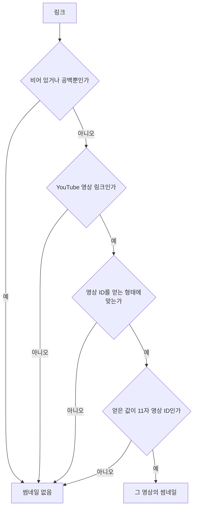
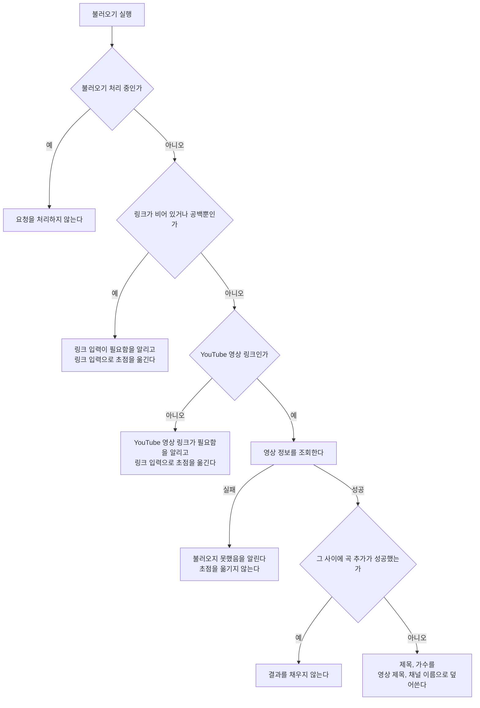
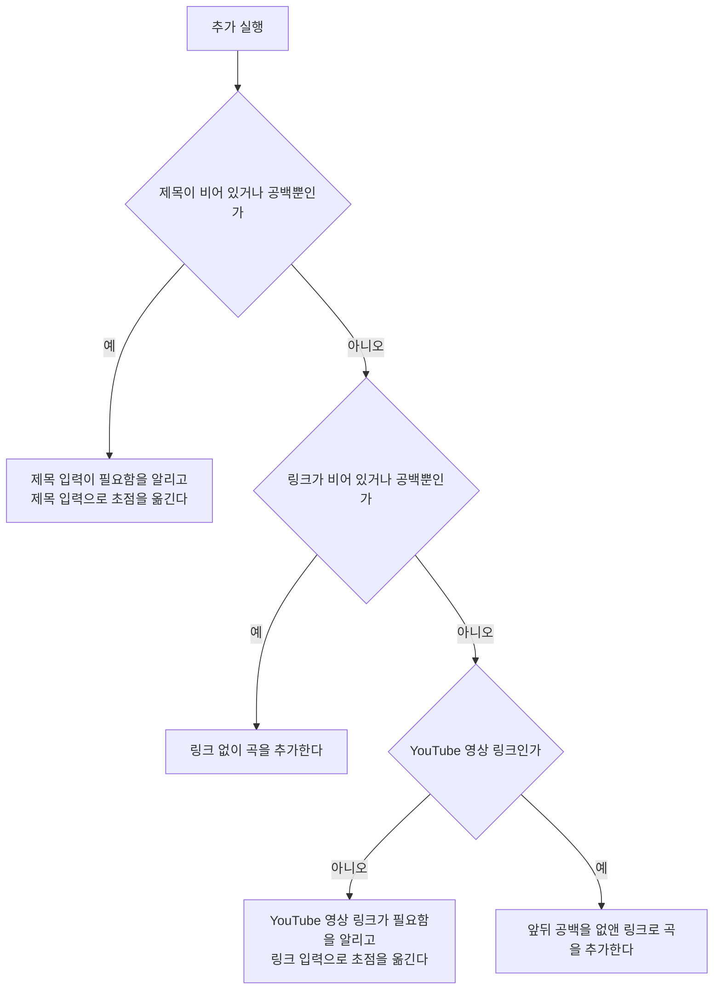

# MusicAdd 화면 스펙

이 문서는 사용자가 새 곡을 작성해 플레이리스트에 추가하는 MusicAdd 화면의 내용과 행동, 그리고 추가되는 곡이 갖는 정보와 정책을 다룬다. MusicAdd로 진입하는 흐름과 저장한 곡의 목록 표시는 [PlaylistHome 화면 스펙](./playlist-home.md)에서, 곡 목록과 함께 표시하는 배치는 [Playlist 목록·상세 배치 스펙](./playlist-list-detail.md)에서, 저장한 곡을 확인하고 수정하고 삭제하는 것은 [MusicDetail 화면 스펙](./music-detail.md)에서 다룬다. 제목 입력 자체의 동작은 [제목 입력 스펙](./title-input.md)을 따른다.

작성 상태 유지, 뒤로가기, 추가 요청 제한, 계정 연결과 저장·동기화 계약은 [항목 추가 화면 공통 스펙](./entity-add.md)을 따른다. 이 문서에서는 MusicAdd 화면에서만 다른 시작 상태와 추가 결과를 다룬다.

목록과 상세를 함께 사용하는 동안에는 곡 추가가 목록과 함께 놓이므로 이 화면만 따로 닫지 않는다. 그 기준은 [목록·상세 배치 공통 스펙](./list-detail-pane.md)의 `함께 사용과 단독 사용`을 따른다.

이번 범위는 사용자가 제목, 가수와 YouTube 영상 링크를 입력해 곡을 추가하고, 입력한 링크로 제목과 가수를 불러오고, 링크가 가리키는 영상의 썸네일을 확인하는 것까지다. 곡에 태그를 연결하는 것은 이번 범위에서 다루지 않는다. 저장한 곡의 상세 확인과 수정과 삭제, 저장한 곡의 링크를 앱 밖에서 여는 것은 [MusicDetail 화면 스펙](./music-detail.md)에서 다룬다.

디자인: [MusicAdd 화면 디자인](../../design/music-add.md)

## feature

### 진입과 입력

사용자는 PlaylistHome 화면에서 곡 추가를 선택해 MusicAdd 화면으로 이동한다. 목록과 상세를 함께 사용할 수 있는 환경에서는 이동하지 않고 곡 목록과 함께 표시된 상세 영역에서 같은 입력을 사용하며, 그 기준은 [Playlist 목록·상세 배치 스펙](./playlist-list-detail.md)의 `상세 영역의 구성`을 따른다.

사용자는 제목, 가수와 링크를 입력하거나 바꿀 수 있다. 세 값은 각각 한 줄 분량을 입력할 수 있다. 제목만 반드시 입력해야 하고, 가수와 링크는 비워 둘 수 있다.

화면에 처음 진입하면 제목, 가수, 링크가 비어 있는 상태로 시작한다. 사용자가 곡 이름부터 바로 적을 수 있도록 입력 초점을 제목 입력에 둔다.

### 링크로 곡 정보 불러오기

사용자는 입력한 링크로 제목과 가수를 불러올 수 있다. 불러오기는 사용자가 실행할 때만 일어나며, 링크를 입력하거나 바꾸는 것만으로는 일어나지 않는다.

불러오기를 처리하는 동안에는 진행 상태를 표시한다.

불러오기에 성공하면 그 링크가 가리키는 영상의 제목과 채널 이름을 화면에 채운다. 채우는 대상은 `domain`의 `불러온 값을 채우는 기준`을 따르므로, 사용자가 이미 적어 둔 제목과 가수도 그 영상의 값으로 바뀐다. 링크 입력은 바꾸지 않고 입력 초점도 옮기지 않는다.

불러오기로 채워진 제목과 가수는 사용자가 그대로 고칠 수 있다. 채워진 값과 사용자가 직접 입력한 값은 이후 구분하지 않는다.

### 썸네일 확인

사용자는 입력한 링크가 가리키는 영상의 썸네일을 추가하기 전에 화면에서 확인할 수 있다. 썸네일은 불러오기의 결과가 아니라 링크에서 정해지므로, 링크를 입력하거나 바꾸는 즉시 그 링크의 썸네일로 바뀐다.

링크가 비어 있거나 `domain`의 `썸네일의 판정`에 따라 영상을 가리키지 않으면 썸네일을 확인할 자리는 비어 있다.

썸네일은 사용자가 직접 입력하거나 고르는 값이 아니므로 썸네일만 따로 바꾸거나 지우는 조작은 제공하지 않는다.

### 불러오기 실패

링크가 비어 있거나 공백만 있는 상태에서 불러오기를 실행하면 링크 입력이 필요하다는 피드백을 제공하고 입력 초점을 링크 입력으로 옮긴다.

링크가 `domain`의 `링크의 판정`을 만족하지 않는 상태에서 불러오기를 실행하면 YouTube 영상 링크가 필요하다는 피드백을 제공하고 입력 초점을 링크 입력으로 옮긴다.

링크는 만족하지만 영상 정보를 가져오지 못하면 불러오지 못했다는 피드백을 제공한다. 이때는 입력 초점을 옮기지 않는다. 사용자는 링크를 고치거나 같은 링크로 다시 시도할 수 있고, 제목과 가수를 직접 입력해 곡을 추가할 수도 있다.

어느 경우에도 제목, 가수와 링크는 지워지거나 바뀌지 않는다.

### 곡 추가

사용자는 입력한 내용으로 곡 추가를 실행할 수 있다.

곡 추가를 처리하는 동안에는 진행 상태를 표시한다.

추가에 성공하면 화면을 유지한 채 제목, 가수, 링크를 비운다. 링크가 비워지므로 썸네일도 함께 사라진다. 사용자가 다음 곡 입력을 바로 이어갈 수 있도록 입력 초점을 제목 입력으로 옮기고 성공 피드백을 제공한다.

### 제목 미입력

제목이 비어 있거나 공백만 있는 상태에서 추가를 실행하면 곡을 추가하지 않고 제목 입력이 필요하다는 피드백을 제공한다.

입력 중이던 가수와 링크는 유지하고 입력 초점을 제목 입력으로 옮기므로, 사용자는 제목을 바로 입력한 뒤 다시 시도할 수 있다.

### 링크 형식 불만족

링크가 비어 있지 않은데 `domain`의 `링크의 판정`을 만족하지 않는 상태에서 추가를 실행하면 곡을 추가하지 않고 YouTube 영상 링크가 필요하다는 피드백을 제공한다.

입력 중이던 제목과 가수는 유지하고 입력 초점을 링크 입력으로 옮기므로, 사용자는 링크를 바로 고치거나 비운 뒤 다시 시도할 수 있다.

### 작성 상태 유지 대상

[항목 추가 화면 공통 스펙](./entity-add.md)의 `작성 상태 유지`가 유지하는 대상은 입력 중이던 제목, 가수와 링크다. 썸네일은 링크에서 정해지므로 따로 유지하지 않아도 같은 링크에서 같은 썸네일이 다시 보인다.

## domain

### 곡의 정보

곡 하나는 다음 정보를 갖는다.

- 제목: 곡을 가리키는 이름. 비어 있을 수 없다.
- 가수: 그 곡을 부른 사람이나 팀의 이름. 비어 있을 수 있다.
- 링크: 그 곡을 들을 수 있는 YouTube 영상의 주소. 비어 있을 수 있으며, 비어 있지 않으면 `링크의 판정`을 만족한다.

썸네일은 곡이 따로 기록하는 정보가 아니다. 곡의 썸네일은 그 곡의 링크가 가리키는 영상의 썸네일이며, 어떤 링크에서 썸네일이 정해지는지는 `썸네일의 판정`을 따른다.

곡은 태그와 연결되지 않는다. 곡을 태그로 묶어 찾는 것은 후속 범위에서 다룬다.

### 링크의 판정

링크는 앞뒤 공백을 없앤 값으로 판정한다. 사용자가 주소를 붙여 넣을 때 앞뒤에 딸려 오는 공백은 주소의 일부가 아니다.

앞뒤 공백을 없앤 값이 다음을 모두 만족하면 YouTube 영상 링크로 본다.

- 주소 형식을 갖추고 있고 방식이 `http` 또는 `https`다.
- 주소의 호스트가 `youtube.com`이거나 `youtube.com`의 하위 도메인이거나 `youtu.be`다.

호스트의 대소문자는 구분하지 않는다.

호스트 뒤의 경로와 질의는 이 판정에서 보지 않는다. `www.youtube.com`의 영상 주소, `m.youtube.com`과 `music.youtube.com`의 영상 주소, `youtu.be`의 짧은 주소, 그리고 재생 목록이나 시작 시각이 함께 붙은 주소를 모두 받는다. 그 주소에 실제로 볼 수 있는 영상이 있는지는 이 판정이 다루지 않으며, 사용자가 불러오기를 실행했을 때 `data`의 `영상 정보 조회`에서 드러난다.

이 판정은 링크에 값이 있을 때만 적용한다. 비어 있거나 공백만 있는 링크는 링크가 없는 것이며, 어디에서 링크 없음을 어떻게 다루는지는 `추가 성립 조건`과 `불러오기 성립 조건`이 각각 정한다.

### 썸네일의 판정

곡의 썸네일은 링크에서 영상 ID를 얻을 수 있을 때만 정해진다. 영상 ID는 `링크의 판정`을 만족하는 링크의 경로와 질의에서 다음 중 하나로 얻는다.

| 링크의 형태 | 영상 ID |
| --- | --- |
| 호스트가 `youtu.be`이고 경로가 `/{id}` | 경로의 첫 부분 |
| 경로가 `/watch`이고 질의에 `v` 값이 있음 | 질의 `v`의 값 |
| 경로가 `/shorts/{id}` | 경로의 둘째 부분 |
| 경로가 `/embed/{id}` | 경로의 둘째 부분 |
| 경로가 `/live/{id}` | 경로의 둘째 부분 |
| 경로가 `/v/{id}` | 경로의 둘째 부분 |

얻은 값이 영어 대소문자, 숫자, `-`, `_`로만 이루어진 11자일 때만 영상 ID로 본다. 그 밖의 값은 영상 ID가 아니다.

위 형태에 맞지 않는 링크는 `링크의 판정`은 만족하더라도 썸네일이 없다. 채널 주소, 재생 목록만 가리키는 주소, YouTube 첫 화면 주소가 여기에 해당한다. 사용자는 이런 링크로도 곡을 추가할 수 있으며, 그 곡은 썸네일 없이 제목과 가수로 확인한다.

썸네일은 링크에서만 정해지므로 링크가 같은 곡은 언제나 같은 썸네일을 갖고, 링크와 썸네일이 서로 다른 영상을 가리키는 상태는 생기지 않는다.

### 불러오기 성립 조건

불러오기는 링크가 `링크의 판정`을 만족해야 실행할 수 있다. 링크가 비어 있거나 공백 문자로만 이루어져 있으면 링크 미입력으로, 그 밖에 판정을 만족하지 않으면 링크 형식 불만족으로 다루고 영상 정보를 조회하지 않는다.

제목과 가수는 불러오기의 성립 조건이 아니다. 두 값이 이미 채워져 있어도 불러오기를 실행할 수 있다.

불러오기를 처리하는 동안에는 같은 화면에서 전달된 불러오기 요청을 처리하지 않는다. 처리가 끝나면 사용자는 다시 불러올 수 있다.

### 불러온 값을 채우는 기준

불러오기에 성공하면 제목과 가수를 영상 제목과 채널 이름으로 덮어쓴다. 두 값에 이미 내용이 있어도 덮어쓴다.

불러오기는 사용자가 지금 입력한 링크의 영상 정보를 화면으로 가져오라는 동작이므로, 두 값은 언제나 마지막으로 불러온 영상의 값이 된다. 사용자가 고쳐 둔 제목과 가수도 다시 불러오면 그 영상의 값으로 바뀌며, 사용자는 그 뒤에 다시 고칠 수 있다.

링크 입력은 덮어쓰지 않는다. 썸네일은 불러오기와 무관하게 `썸네일의 판정`에 따라 링크에서 정해진다.

영상 제목과 채널 이름은 가져온 값을 그대로 채우고, 앞뒤 공백이나 서비스 이름 같은 부분을 덜어 내지 않는다.

곡 추가에 성공해 입력을 비운 뒤에는, 그 전에 시작한 불러오기의 결과를 채우지 않는다. 비워진 입력이 이전 곡의 값으로 다시 채워지지 않게 하기 위한 것이다.

### 추가 성립 조건

곡은 제목을 가져야 추가할 수 있다. 제목이 비어 있거나 공백 문자로만 이루어져 있으면 추가하지 않는다.

가수는 추가 성립 조건이 아니다. 가수가 비어 있어도 곡을 추가할 수 있다. 가수를 모르는 곡이나 가수를 적을 필요가 없는 곡도 제목만으로 담을 수 있게 하기 위한 것이다.

링크는 추가 성립 조건이 아니다. 링크가 비어 있거나 공백 문자로만 이루어져 있어도 곡을 추가할 수 있으며, 그 곡은 링크 없이 기록된다.

링크가 비어 있지 않으면 `링크의 판정`을 만족해야 한다. 만족하지 않으면 추가하지 않는다. 곡의 링크는 들을 수 있는 영상을 가리키는 자리이므로, 영상이 아닌 주소를 곡의 링크로 두지 않는다.

썸네일은 추가 성립 조건이 아니다. 링크가 없거나 링크에서 영상 ID를 얻을 수 없어 썸네일이 없어도 곡을 추가할 수 있다.

같은 제목, 가수와 링크의 곡을 이미 추가했더라도 새 곡으로 추가한다. 같은 곡을 두 번 넣었는지는 사용자가 판단할 일이며, 제품이 막지 않는다.

여러 조건이 함께 성립하지 않으면 제목 미입력, 링크 형식 순으로 판단하고 먼저 성립하지 않은 조건 하나의 결과만 알린다. 이 순서는 사용자가 화면에서 입력을 만나는 순서와 같다.

### 추가되는 곡의 내용

기록되는 공통 값은 [항목 추가 화면 공통 스펙](./entity-add.md)의 `추가되는 항목의 내용`을 따른다.

곡에는 사용자가 입력한 제목, 가수와 링크를 기록한다.

제목과 가수는 앞뒤 공백을 포함해 사용자가 입력한 문자열을 바꾸지 않고 기록한다. 가수를 입력하지 않았으면 빈 값으로 기록한다.

링크는 `링크의 판정`과 같게 앞뒤 공백을 없앤 값을 기록한다. 기록한 링크를 그대로 열 수 있어야 하므로 주소가 아닌 공백을 함께 남기지 않는다. 링크가 비어 있거나 공백 문자로만 이루어져 있으면 빈 값으로 기록한다.

썸네일은 기록하지 않는다. 곡을 표시할 때마다 기록된 링크에서 `썸네일의 판정`에 따라 정한다.

### 링크가 없는 곡

링크가 비어 있는 곡은 그대로 남고 [PlaylistHome 화면 스펙](./playlist-home.md)의 노출 기준을 그대로 만족한다. 링크가 없다는 이유로 목록에서 빠지거나 사용자에게 링크 입력을 요구하지 않는다.

링크가 없는 곡은 썸네일도 없다. 썸네일이 없는 곡을 목록에서 어떻게 보여 주는지는 [PlaylistHome 화면 스펙](./playlist-home.md)의 `곡 목록`을 따른다.

이미 저장된 곡에 링크를 채워 넣거나 비우는 것은 곡 수정에 해당하므로 [MusicDetail 화면 스펙](./music-detail.md)의 `수정 성립 조건`을 따른다.

## data

### 영상 정보 조회

불러오기를 실행하면 사용자가 입력한 링크로 YouTube가 공개하는 영상 정보를 조회해 영상 제목과 채널 이름을 얻는다. 조회는 사용자가 불러오기를 실행할 때만 일어나며, 화면 진입이나 링크 입력만으로는 일어나지 않는다.

조회한 값은 화면을 채우는 데만 쓰고 따로 저장하지 않는다. 곡에 기록되는 제목과 가수는 사용자가 추가를 실행한 시점에 화면에 있는 값이다. 불러온 뒤 영상의 제목이나 채널 이름이 바뀌어도 이미 추가한 곡은 바뀌지 않는다.

조회할 수 없는 링크는 불러오기 실패로 다룬다. 없거나 삭제된 영상, 비공개 영상, 영상이 아닌 YouTube 주소, 네트워크를 사용할 수 없는 상태를 모두 같은 실패로 다루며 서로 다른 안내로 나누지 않는다. 사용자가 할 수 있는 일이 링크를 고치거나 다시 시도하는 것으로 같기 때문이다.

조회에 실패해도 곡 추가는 막지 않는다. 사용자는 제목과 가수를 직접 입력해 그 링크로 곡을 추가할 수 있다.

### 썸네일 이미지 조회

썸네일은 `domain`의 `썸네일의 판정`으로 얻은 영상 ID로 YouTube가 공개하는 썸네일 이미지 주소를 만들어, 화면에 표시할 때 그 주소에서 이미지를 받아온다. 이 조회는 곡을 화면에 표시할 때만 일어나며 영상 정보 조회와 별개다.

썸네일 이미지는 기기나 서버에 복사해 두지 않는다. 영상이 사라져 그 주소를 더 이상 열 수 없게 되면 곡의 썸네일도 보이지 않는다. 이때도 곡은 그대로 남고 제목과 가수로 확인할 수 있다.

### 곡 생성과 저장

저장 흐름은 [항목 추가 화면 공통 스펙](./entity-add.md)의 `생성과 저장`을 따른다. 이때 함께 반영되는 것은 새 곡과 현재 사용자 계정의 연결이다.

곡의 제목, 가수와 링크는 곡의 내용으로 저장되며, 곡을 조회하면 함께 조회된다.

이전 범위에서 곡의 내용으로 기록하던 썸네일 주소는 더 이상 기록하거나 읽지 않는다. 이미 기록된 값은 지우지 않고 그대로 두되 곡의 내용으로 쓰지 않으므로, 그 값이 있더라도 화면의 썸네일은 링크에서만 정해진다.

### 동기화

추가한 곡은 [데이터 동기화 스펙](../common/data-sync.md)의 `곡` 종류로 서버에 반영된다. 제목, 가수와 링크가 곡의 내용으로 반영된다. 반영 시점과 실패 처리는 [항목 추가 화면 공통 스펙](./entity-add.md)의 `동기화`를 따른다.

서버에서 내려받은 곡의 썸네일 주소는 `곡 생성과 저장`과 같은 기준으로 곡의 내용으로 쓰지 않는다.

## 참고

- [YouTube oEmbed](https://oembed.com/) — 링크로 영상 제목과 채널 이름을 알려 주는 공개 주소
- [YouTube 썸네일 이미지 주소](https://developers.google.com/youtube/v3/docs/thumbnails) — 영상 ID로 공개되는 썸네일 이미지의 주소 형식
