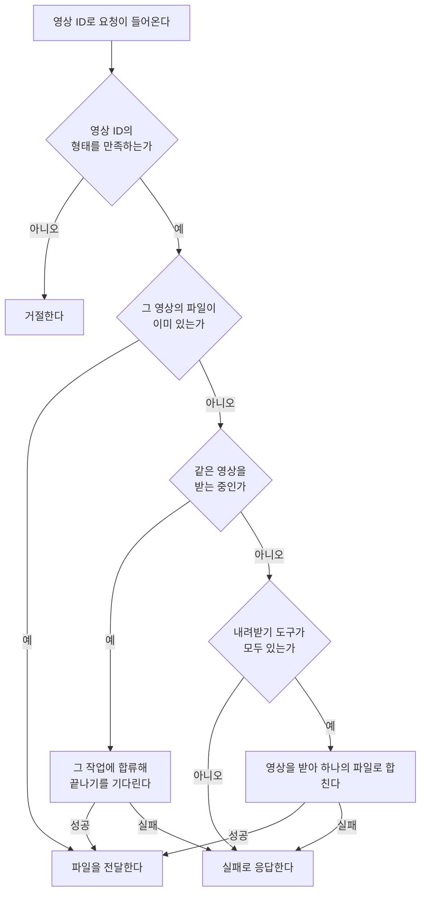

# 곡 다운로드 프록시 스펙

이 문서는 데스크톱 앱이 같은 네트워크의 다른 기기를 대신해 영상을 내려받아 전달하는 프록시의 규칙을 다룬다. 프록시를 통해 곡을 내려받는 사용자 행위와 곡별 상태는 [곡 다운로드 스펙](./music-download.md)에서, 프록시 주소를 확인하고 입력하는 화면은 [SettingDownload 화면 스펙](./setting-download.md)에서, 링크에서 영상 ID를 얻는 판정은 [MusicAdd 화면 스펙](./music-add.md)의 `썸네일의 판정`에서 다룬다.

이번 범위는 데스크톱 앱이 실행되는 동안 프록시를 제공하고, Android와 iOS 앱이 저장해 둔 프록시 주소로 영상을 요청해 받는 것까지다. 프록시를 끄고 켜는 수단, 요청하는 기기를 가려 받는 수단, 프록시가 받아 둔 파일을 정리하는 수단은 이번 범위에서 다루지 않는다.

## feature

### 프록시 제공

데스크톱 앱은 실행되면 사용자의 조작 없이 프록시를 시작하고, 앱이 종료되면 프록시도 함께 멈춘다. 사용자는 프록시를 시작하거나 멈추기 위해 아무것도 하지 않는다.

사용자는 [SettingDownload 화면](./setting-download.md)에서 이 기기의 프록시 주소를 확인해 다른 기기에 옮겨 적는다. 프록시를 제공하지 못하는 상태도 같은 화면에서 확인한다.

프록시는 같은 네트워크에 있는 기기의 요청을 받는다. 요청하는 기기가 어떤 계정으로 로그인했는지는 보지 않으며, 요청한 영상이 그 기기의 곡 목록에 있는지도 확인하지 않는다.

### 프록시 사용

Android와 iOS 앱은 사용자가 [SettingDownload 화면](./setting-download.md)에 저장해 둔 프록시 주소로 영상을 요청한다. 주소가 저장되어 있지 않거나 프록시에 연결할 수 없을 때 사용자에게 무엇을 알리는지는 [곡 다운로드 스펙](./music-download.md)의 `내려받기 준비`를 따른다.

프록시 주소의 포트는 데스크톱 앱을 실행할 때마다 달라질 수 있다. 저장해 둔 주소로 연결할 수 없으면 사용자는 데스크톱 앱의 [SettingDownload 화면](./setting-download.md)에서 지금 주소를 다시 확인해 옮겨 적는다.

프록시가 영상을 다 받아 하나의 파일로 합치기 전까지 요청한 기기는 기다린다. 이 동안 기다리는 기기에서 어떤 진행 표시를 하는지는 [곡 다운로드 스펙](./music-download.md)의 `진행 확인`을 따른다.

## domain

### 제공 환경

프록시는 데스크톱 앱만 제공한다. 영상을 내려받고 합치는 도구를 실행할 수 있는 환경이 이곳뿐이기 때문이다.

프록시를 사용하는 환경은 Android와 iOS다. 웹은 받은 파일을 둘 곳이 없으므로 프록시를 사용하지 않는다.

데스크톱 앱은 자기 곡을 프록시를 거치지 않고 직접 받는다. 다른 기기의 프록시 주소를 입력하는 수단도 두지 않는다.

### 프록시 주소

프록시 주소는 이 기기의 네트워크 주소와 포트로 이루어진 `http://<네트워크 주소>:<포트>` 형태다.

포트는 앱이 정하지 않고 프록시를 시작할 때 운영체제가 비어 있는 포트를 골라 준다. 그래서 다른 프로그램이나 같은 기기에서 함께 실행한 개발용 앱과 배포용 앱끼리도 포트가 겹치지 않는다. 대신 앱을 다시 실행하면 포트가 달라질 수 있으며, 그때 다른 기기에 저장된 주소는 더 쓸 수 없다.

기기는 Wi-Fi, 유선, VPN처럼 여러 네트워크에 동시에 연결되어 있을 수 있어 네트워크 주소가 여럿일 수 있다. 어느 주소로 닿을 수 있는지는 요청하는 기기가 어느 네트워크에 있는지에 따라 다르므로, 앱이 하나를 고르지 않고 후보를 모두 제공한다. 후보는 이 기기가 켜 둔 네트워크에서 같은 네트워크 안의 기기끼리만 쓰는 내부 주소이며, 기기 자신만 가리키는 주소는 후보가 아니다.

후보는 앱을 실행해 프록시를 시작할 때 한 번 정한다. 앱이 실행되는 동안 기기가 다른 네트워크로 옮겨 가거나 새 네트워크에 연결되어도 후보는 바뀌지 않고, [SettingDownload 화면](./setting-download.md)에 다시 들어와도 새로 확인하지 않는다. 앱을 다시 실행해야 새 주소가 후보에 들어간다.

### 프록시 상태

프록시는 앱이 실행되는 동안 다음 중 하나의 상태를 가진다.

| 상태 | 의미 |
| --- | --- |
| 제공 중 | 포트를 열어 요청을 받을 수 있다 |
| 제공하지 못함 | 프록시를 시작하지 못했다 |

포트를 운영체제가 고르므로 포트가 겹쳐 시작하지 못하는 일은 없다. 그 밖의 이유로 시작하지 못하면 제공하지 못함이 되고, 앱이 스스로 다시 시도하지 않는다. 사용자는 앱을 다시 실행해 프록시를 다시 시작한다.

제공 중이지만 내부 주소가 하나도 없으면 다른 기기가 닿을 주소가 없다. 이때 무엇을 보여 주는지는 [SettingDownload 화면 스펙](./setting-download.md)이 정한다.

### 요청의 성립

요청하는 기기는 링크가 아니라 영상 ID로 영상을 요청한다. 영상 ID는 [MusicAdd 화면 스펙](./music-add.md)의 `썸네일의 판정`이 정한 11자 값이다. 같은 영상을 가리키는 여러 형태의 링크가 하나의 요청으로 모이고, 프록시가 받는 요청이 YouTube 영상으로 한정된다.

영상 ID의 형태를 만족하지 않는 요청은 영상을 받지 않고 거절한다.

### 요청의 처리

이미 받아 둔 파일이 있으면 다시 받지 않고 그 파일을 전달한다. 데스크톱 앱이 자기 곡으로 받아 둔 파일과 다른 기기를 대신해 받아 둔 파일을 구분하지 않는다.

같은 영상을 받는 중에 같은 영상의 요청이 더 들어오면 새로 받지 않고 진행 중인 작업에 합류한다. 작업이 끝나면 합류한 모든 요청에 같은 결과를 준다. 서로 다른 영상의 요청은 함께 진행하며 순서를 두지 않는다.

프록시는 내려받기 도구를 설치하지 않는다. 도구를 설치하는 것은 데스크톱 앱 사용자가 자기 기기에서 다운로드를 실행했을 때만 일어나며([곡 다운로드 스펙](./music-download.md)의 `내려받기 준비`), 다른 기기의 요청이 이 기기에 도구를 설치하게 하지 않는다. 도구가 없으면 그 요청은 실패로 끝난다.

영상을 받지 못하면 실패로 응답한다. 없거나 삭제된 영상, 비공개 영상, 도구가 없는 상태, 네트워크를 사용할 수 없는 상태를 모두 같은 실패로 다룬다. 요청한 기기에서 사용자가 할 수 있는 일이 다시 실행하는 것으로 같기 때문이다.

### 요청이 끊긴 뒤의 처리

영상을 받는 도중 요청한 기기와의 연결이 끊겨도 프록시는 받기를 멈추지 않고 끝까지 받아 파일을 남긴다. 요청한 기기가 다시 요청하면 이미 있는 파일을 곧바로 전달한다.

파일을 전달하는 도중 연결이 끊기면 전달만 멈추고, 프록시에 있는 파일은 그대로 남는다.

### 받아 둔 파일의 보관

프록시가 다른 기기를 대신해 받은 파일은 데스크톱 앱이 자기 곡으로 받은 파일과 같은 곳에 같은 이름 규칙으로 남는다. 규칙은 [곡 다운로드 스펙](./music-download.md)의 `파일 저장`을 따른다.

다른 기기가 요청한 영상이 이 기기의 곡 목록에 없어도 파일을 지우지 않는다. 받아 둔 파일을 정리하는 수단은 이번 범위에서 다루지 않는다.

## data

### 요청과 응답

프록시는 다음 두 요청을 받는다.

| 요청 | 성공 응답 | 실패 응답 |
| --- | --- | --- |
| 연결 확인 | 프록시가 제공 중임을 알리는 응답 | — |
| 영상 요청 (영상 ID) | 영상과 소리가 함께 들어 있는 mp4 파일 전체와 그 크기 | 영상 ID의 형태가 잘못되면 잘못된 요청으로, 그 밖의 이유로 받지 못하면 처리 실패로 응답 |

연결 확인은 요청하는 기기가 다운로드를 시작하기 전에 프록시에 닿을 수 있는지 알아보는 데 쓴다. 이 요청은 영상을 받지 않는다. 요청하는 기기는 연결 확인에 10초 안에 성공 응답을 받지 못하면 프록시에 연결할 수 없는 것으로 본다.

영상 요청은 프록시가 영상을 받아 합치는 동안 응답이 없으므로, 요청하는 기기는 응답을 기다리는 시간에 상한을 두지 않는다. 다만 프록시에 10초 안에 연결하지 못하거나, 연결한 뒤 1시간 동안 아무것도 전달받지 못하면 그 곡은 실패로 끝난다.

영상 요청의 성공 응답에는 파일의 크기를 함께 담는다. 요청한 기기가 받은 만큼을 백분율로 표시하는 근거가 된다. 파일이 완성되기 전에는 크기를 알 수 없으므로, 프록시는 파일이 완성된 뒤에만 응답을 시작한다.

### 완성된 파일만 남기기

프록시는 받는 도중의 파일을 완성된 파일과 같은 이름으로 두지 않는다. 받아 합치기가 끝난 뒤에만 완성된 파일의 이름이 된다. 그래서 파일이 있다는 것은 그 영상을 끝까지 받아 두었다는 뜻이며, 다른 요청이 받는 도중의 파일을 완성된 것으로 오해하지 않는다.

받는 도중 실패하면 도중의 파일을 남기지 않는다.
