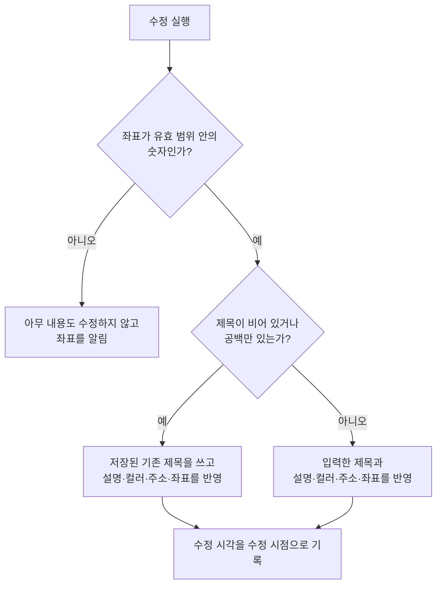
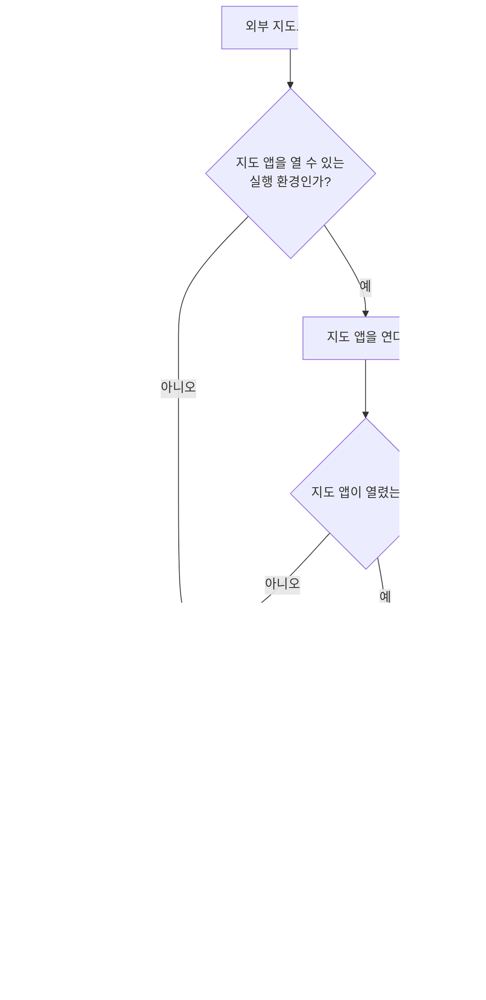

# PlaceDetail 화면 스펙

이 문서는 사용자가 선택한 장소의 상세를 확인하고 제목, 설명, 컬러, 주소와 좌표를 수정하고, 그 장소가 연결한 태그를 바꾸고, 장소를 삭제하는 PlaceDetail 화면의 내용과 행동을 다룬다. PlaceDetail로 진입하는 흐름은 [PlaceHome 화면 스펙](./place-home.md), [메모 장소 카드 컴포넌트 스펙](./memo-place-card.md), [TagDetail 장소 탭 스펙](./tag-detail-place.md)과 [SearchHome 화면 스펙](./search-home.md)에서, 지도의 표시·조작·지점 선택 자체의 동작은 [DiaryMap 컴포넌트 스펙](./diary-map.md)에서, 검색으로 장소를 찾아 제목과 좌표와 주소를 가져오는 행동은 [장소 검색 다이얼로그 컴포넌트 스펙](./place-search-dialog.md)에서, 장소가 갖는 정보와 좌표의 유효 범위는 [PlaceAdd 화면 스펙](./place-add.md)에서, 설명과 컬러 입력의 행동은 [설명 입력 컴포넌트 스펙](./description-input.md)과 [컬러 입력 컴포넌트 스펙](./diary-color-input.md)에서, 기본 지도를 고르고 저장하는 흐름은 [SettingMap 화면 스펙](./setting-map.md)에서 다룬다. 제목 입력 자체의 동작은 [제목 입력 스펙](./title-input.md)을 따른다.

연결할 태그의 선택과 해제, 선택 목록의 행동과 정책은 [항목 태그 입력 컴포넌트 스펙](./entity-tag-input.md)을 따르고, 장소와 태그의 연결 규칙은 [장소 태그 스펙](../common/place-tag.md)을 따른다. 이 문서에서는 PlaceDetail 화면에서만 다른 표시 기준과 반영 시점을 다룬다.

이번 범위는 장소 목록이나 지도 핀에서 장소를 선택해 상세로 이동하고, 저장된 제목·설명·컬러·주소·좌표를 확인하고 수정하고, 연결한 태그를 확인하고 바꾸고, 좌표가 가리키는 위치를 앱 밖의 지도에서 열고, 장소를 삭제하고, 이 장소에 연결된 메모를 확인하는 것까지다.

화면은 장소 디테일, 메모 두 탭으로 나뉜다. 이 문서는 화면 전체와 장소 디테일 탭을 소유하고, 메모 탭의 내용과 행동은 [PlaceDetail 메모 탭 스펙](./place-detail-memo.md)이 소유한다.

PlaceHome, PlaceAdd와 PlaceDetail은 목록과 상세를 한 화면에 함께 배치하지 않고 각각 단독 화면으로 사용하므로, 장소는 [목록·상세 배치 공통 스펙](./list-detail-pane.md)을 따르는 배치 스펙을 두지 않는다.

진입할 때의 입력 초점, 내용 수정의 반영과 성공 결과, 태그 입력의 반영, 요청 제한과 저장 계약은 [항목 상세 화면 공통 스펙](./entity-detail.md)을 따른다.

디자인: [PlaceDetail 화면 디자인](../../design/place-detail.md)

## feature

### 진입과 내용

사용자는 PlaceHome 화면의 장소 목록에서 장소를 선택해 그 장소의 PlaceDetail 화면으로 이동한다. 지도 위에 표시된 핀을 눌러서도 같은 장소의 PlaceDetail 화면으로 이동한다.

MemoAdd 화면과 MemoDetail 화면의 장소 카드에서도 지도 위 핀을 눌러 그 장소의 PlaceDetail 화면으로 이동하며, 그 흐름은 [메모 장소 카드 컴포넌트 스펙](./memo-place-card.md)의 `장소 상세 이동`을 따른다. [TagDetail 장소 탭](./tag-detail-place.md)의 태그별 장소 목록에서 장소를 선택하거나, [SearchHome 화면](./search-home.md)의 장소 결과에서 장소를 선택해서도 이동한다. 어느 경로로 진입해도 화면의 내용과 행동은 같다.

장소 조회에 성공하면 사용자는 저장된 제목, 설명, 컬러, 주소와 좌표를 확인하고 수정할 수 있고, 이 장소가 연결한 태그를 확인하고 바꿀 수 있으며, 좌표가 가리키는 위치를 앱 밖의 지도에서 열거나 장소를 삭제할 수 있다. 화면 제목에는 대상 장소의 최신 저장 제목을 표시한다.

### 탭 전환

화면은 장소 디테일, 메모 두 탭으로 나뉘고 이 순서로 놓인다. 장소 디테일 탭에서는 이 문서의 `내용 수정`, `태그 입력`, `좌표 수정`과 `장소 검색으로 채우기`를, 메모 탭에서는 [PlaceDetail 메모 탭 스펙](./place-detail-memo.md)의 행동을 실행한다.

화면에 처음 진입하면 장소 디테일 탭이 선택된 상태로 시작한다.

사용자는 탭을 직접 선택해 전환한다. 본문을 좌우로 밀어서는 전환하지 않는다. 장소 디테일 탭의 지도 위에서 좌우로 끄는 조작은 지도를 옮기는 조작이어서 탭 전환과 구분할 수 없기 때문이다. 선택한 탭과 표시하는 내용은 항상 일치한다.

장소 조회 중에도 사용자는 탭을 전환할 수 있다. 조회 결과가 탭 전환을 막지 않는다.

탭을 전환해도 다른 탭에서 하던 일은 사라지지 않는다. 장소 디테일 탭에서 수정 중이던 제목, 설명, 컬러, 주소와 좌표, 지도가 보고 있던 위치와 확대 수준은 다른 탭에 다녀와도 그대로 남아 있고, 메모 탭에서 보던 목록 위치도 다른 탭에 다녀오면 그대로 유지된다.

외부 지도로 열기, 장소 검색과 삭제를 제공하는지는 선택한 탭과 관계없다. 각 행동을 제공하는 조건은 이 문서의 `조회 상태`를 따른다. 장소 검색은 여기에 더해 기본 지도를 확인해 지도를 표시할 수 있는 동안 제공하며, 지도가 보이지 않는 메모 탭을 선택한 동안에도 제공한다. 이 기준은 [장소 검색 다이얼로그 컴포넌트 스펙](./place-search-dialog.md)의 `진입`을 따른다. 메모 탭에서 장소 검색 결과를 골라도 `장소 검색으로 채우기`에 따라 입력에 반영되며 선택한 탭은 바뀌지 않는다.

### 조회 상태

처음에는 장소 조회 중 상태를 제공하며 내용 수정, 태그 연결과 해제, 외부 지도로 열기와 삭제를 실행할 수 없다.

조회에 성공하면 내용 표시 상태로 바뀐다. 장소를 조회할 수 없거나 조회에 실패하면 조회 중 상태를 유지하며, 별도의 오류 안내는 제공하지 않는다.

조회 상태는 장소 디테일 탭의 내용과 화면 제목, 외부 지도로 열기, 장소 검색과 삭제에만 적용한다. 메모 탭의 표시 기준은 [PlaceDetail 메모 탭 스펙](./place-detail-memo.md)을 따르므로 장소를 아직 조회하지 못했어도 메모 목록은 그대로 표시한다.

### 내용 수정

사용자가 입력한 제목, 설명, 컬러, 주소 또는 좌표가 저장된 내용과 하나라도 다를 때만 수정 반영 동작을 제공한다.

수정 시점에 제목이 비어 있거나 공백만 있으면 저장된 기존 제목을 유지하고 설명, 컬러, 주소와 좌표만 반영한다.

### 태그 입력

반영 시점과 다른 동작과의 관계는 [항목 상세 화면 공통 스펙](./entity-detail.md)의 `태그 입력`을 따른다. 태그 선택 목록에서의 연결과 해제는 [항목 태그 입력 컴포넌트 스펙](./entity-tag-input.md)을, 태그 입력의 구성과 표현은 [항목 태그 입력 컴포넌트 디자인](../../design/entity-tag-input.md)을 따른다.

태그를 연결하거나 해제해도 장소의 컬러와 지도가 보고 있는 위치, 지점 표시는 바뀌지 않는다.

### 좌표 수정

좌표는 지도에서 위치를 눌러 고르거나, 위도와 경도를 각각 십진수로 입력해 바꾼다. 두 방법 중 무엇을 쓰든 결과로 정해지는 좌표는 같게 다루며, 지점 표시와 지도 반영 시점은 [PlaceAdd 화면 스펙](./place-add.md)의 `지도에서 좌표 선택`과 `좌표 직접 입력과 지도의 반영`을 따른다.

화면에 처음 진입하면 위도와 경도 입력에 저장된 좌표가 채워지고 그 곳에 지점 표시가 나타난다.

지도가 표시되지 않는 상태에서도 좌표 입력과 내용 수정은 그대로 사용할 수 있다.

### 장소 검색으로 채우기

사용자는 화면에서 장소 검색을 열어 검색어로 장소를 찾고, 찾은 장소의 좌표와 주소를 위도 입력과 경도 입력과 주소 입력에 가져올 수 있다. 검색의 동작과 반영 규칙은 [장소 검색 다이얼로그 컴포넌트 스펙](./place-search-dialog.md)을 따른다.

PlaceDetail은 진입할 때 저장된 제목이 채워져 있으므로 찾은 장소의 이름은 반영되지 않는다. 사용자가 제목을 비운 뒤 검색하면 찾은 장소의 이름이 제목에 채워진다.

가져온 좌표와 주소는 지도에서 고르거나 직접 입력한 값과 같게 다루며, 반영만으로 저장되지는 않으므로 사용자는 이어서 수정을 실행해야 한다.

### 좌표 오류

좌표가 성립하지 않는 상태에서 수정을 실행하면 장소를 수정하지 않고 좌표를 어떻게 입력해야 하는지 알리는 피드백을 제공한다. 성립하지 않는 상태의 종류와 피드백에 담는 내용은 [PlaceAdd 화면 스펙](./place-add.md)의 `좌표 오류`를 따른다.

입력 중이던 제목, 설명, 컬러, 주소와 좌표는 유지하므로 사용자는 좌표를 고친 뒤 다시 시도할 수 있다. 지도가 보고 있는 위치도 바뀌지 않는다.

입력 초점을 다루는 기준은 [PlaceAdd 화면 스펙](./place-add.md)의 `좌표 오류`를 따른다.

### 외부 지도로 열기

사용자는 지금 입력된 제목과 주소와 좌표로 앱 밖의 지도를 열 수 있다. 지도는 입력된 좌표를 가리키고, 그 곳이 어디인지 알 수 있도록 입력된 제목과 주소가 함께 전달된다. 열리는 지도는 사용자가 화면의 지도에서 보고 있는 제공자의 지도 하나이며, 사용자가 제공자를 바꾸면 그 뒤로는 바뀐 제공자의 지도가 열린다.

기기에 그 제공자의 지도 앱이 있으면 지도 앱에서 열리고, 없으면 그 제공자의 웹 지도에서 열린다. 어느 쪽에서 열려도 지도가 가리키는 위치와 함께 전달되는 값은 같으므로, 사용자는 무엇이 열릴지 고르지 않고 어느 쪽에서도 같은 장소를 본다.

외부 지도가 열려도 PlaceDetail 화면은 그대로 유지한다. 입력 중이던 제목, 설명, 컬러, 주소와 좌표, 사용자가 보고 있던 지도 위치와 확대 수준, 지도 제공자를 바꾸지 않으므로 사용자가 앱으로 돌아오면 열기 전과 같은 화면을 이어서 본다.

외부 지도로 열기는 장소를 수정하지 않는다. 반영하지 않은 좌표로 지도를 열어도 저장된 좌표는 바뀌지 않으며, 사용자는 돌아와서 수정을 이어서 실행할 수 있다.

좌표가 성립하지 않는 상태에서 외부 지도로 열기를 실행하면 지도를 열지 않고 `좌표 오류`와 같은 피드백을 제공한다. 입력 중이던 내용과 입력 초점도 `좌표 오류`와 같게 다룬다.

지도 앱과 웹 지도 중 어느 것도 열지 못하는 환경에서는 화면을 그대로 유지하고 사용자에게 별도로 알리지 않는다.

### 삭제

사용자는 대상 장소를 삭제할 수 있다. 처리 중에는 진행 상태를 표시한다.

삭제에 성공하면 뒤로가기와 같은 결과로 PlaceDetail 화면에서 빠져나가 진입하기 전 화면으로 돌아간다.

삭제한 장소에서 수정 중이던 내용은 유지하지 않는다.

### 외부 변경

화면이 열려 있는 동안 같은 장소의 저장 내용이 다른 경로에서 바뀌면 화면 제목을 최신 저장 제목으로 갱신한다. 입력 중인 제목, 설명, 컬러, 주소와 좌표는 덮어쓰지 않으며, 지도가 보고 있는 위치와 지점 표시도 바꾸지 않는다.

화면이 열려 있는 동안 같은 장소의 태그 연결이 다른 경로에서 바뀌면 태그 입력에 최신 연결을 반영한다.

다른 기기에서 삭제한 장소가 서버에서 내려받아져 대상 장소가 삭제 상태가 되어도 화면은 내용 표시 상태를 유지한다. 사용자는 입력 중이던 내용을 잃지 않고 수정과 삭제를 그대로 실행할 수 있으며, 화면에서 밀려나거나 조회 중 상태로 되돌아가지 않는다.

### 진행 상태 유지

화면이 회전하거나 시스템에 의해 재생성되어도 입력 중이던 제목, 설명, 주소, 위도, 경도와 선택한 컬러, 그리고 선택한 탭을 유지한다. 유지한 좌표가 성립하면 지점 표시도 같은 곳에 유지되며, 사용자가 보고 있던 지도 위치와 확대 수준, 지도 제공자도 유지한다.

수정이나 삭제를 처리하는 동안, 그리고 저장된 내용이 갱신되어 화면이 다시 그려질 때도 사용자가 보고 있던 화면 위치를 유지한다. 내용 표시 상태에 머무르는 동안에는 화면 위치가 처음으로 돌아가지 않는다.

화면을 떠난 뒤 다시 들어오거나 앱을 종료한 뒤 새로 진입하면 수정 중이던 내용을 복원하지 않고 저장된 내용으로 다시 시작한다.

### 뒤로가기

사용자가 뒤로가면 선택한 탭과 관계없이 PlaceDetail 화면에 진입하기 전 화면으로 돌아간다. 메모 탭을 선택한 상태에서 뒤로간다고 장소 디테일 탭으로 먼저 돌아가지 않는다. TagDetail 장소 탭에서 들어왔으면 장소 탭이 선택된 같은 태그의 TagDetail 화면으로 돌아간다. 반영하지 않은 수정 내용은 저장되지 않으며, 이미 반영된 태그 연결과 해제는 그대로 남는다.

## domain

### 상세 대상과 내용 표시

상세 대상을 정하는 계정 기준은 [항목 상세 화면 공통 스펙](./entity-detail.md)의 `대상 조회`를 따른다.

삭제 여부는 상세 대상을 정하는 기준이 아니다. 삭제 상태인 장소도 상세 대상으로 조회하며, 대상 장소가 삭제 상태로 바뀌어도 화면은 내용 표시 상태를 유지한다. 사용자가 작성 중인 내용을 배경에서 진행되는 동기화가 치우지 않게 하기 위한 것이며, 이때의 화면 동작은 `외부 변경`을 따른다.

사용자가 이 화면에서 삭제를 실행했을 때는 `feature`의 `삭제`에 따라 화면을 떠나므로 이 규칙이 적용되지 않는다.

수정은 삭제 여부를 바꾸지 않으므로, 삭제 상태가 된 장소를 이 화면에서 수정해도 그 장소는 삭제 상태로 남는다.

입력 내용은 대상 장소를 처음 조회한 값으로 한 번만 채운다. 같은 장소의 저장 내용이 바뀌어도 다시 채우지 않는다.

### 선택한 탭

선택한 탭은 화면 표시 상태이며 저장되는 사용자 데이터가 아니다.

화면 재생성과 백그라운드 복귀 후에도 선택한 탭을 유지한다.

사용자가 화면을 떠났다가 다시 진입하거나 앱을 종료하고 다시 실행하면 장소 디테일 탭으로 초기화한다.

장소의 삭제 여부는 선택할 수 있는 탭을 바꾸지 않는다. 삭제 상태인 장소의 PlaceDetail 화면에서도 두 탭을 모두 사용할 수 있다.

### 수정되는 내용

수정은 대상 장소의 제목, 설명, 컬러, 주소와 좌표를 바꾸고 수정 시각을 수정 시점으로 기록한다.

수정 시 제목이 비어 있거나 공백만 있으면 기존 제목을 사용한다. 설명과 주소는 비어 있으면 각각 빈 설명과 빈 주소로 반영한다.

좌표는 성립할 때만 반영한다. 좌표가 성립하지 않으면 제목, 설명, 컬러, 주소를 포함해 어떤 내용도 수정하지 않는다. 좌표의 유효 범위와 성립 여부의 판단 기준은 [PlaceAdd 화면 스펙](./place-add.md)의 `좌표의 유효 범위`를 따르며, 성립 여부는 좌표를 만든 화면이 아니라 장소를 수정하는 규칙이 판단한다.

제목을 비운 상태와 좌표가 성립하지 않는 상태가 함께 있으면 좌표를 알리고 아무 내용도 수정하지 않는다. 제목을 비운 것은 기존 제목을 사용하는 것이므로 수정을 막지 않는다.

### 삭제

삭제는 대상 장소의 삭제 여부를 삭제로 바꾸고 수정 시각을 삭제 시점으로 갱신한다. 제목, 설명, 컬러, 좌표와 주소는 바꾸지 않는다.

삭제한 장소는 [PlaceHome 화면 스펙](./place-home.md)의 노출 기준에 따라 장소 목록과 지도 핀에서 사라진다. 삭제한 장소를 메모에 새로 선택할 수 없고 선택한 것으로도 표시하지 않는 기준은 [메모 장소 카드 컴포넌트 스펙](./memo-place-card.md)의 `선택할 수 있는 장소`와 `선택한 것으로 표시하는 장소`를 따른다. 이미 저장된 메모와 장소의 연결은 [항목 연결 공통 스펙](../common/entity-link.md)의 `항목의 상태 변화와 연결`에 따라 해제되지 않는다.

### 태그 입력에 표시하는 태그

기준은 [항목 상세 화면 공통 스펙](./entity-detail.md)의 `태그 입력에 표시하는 태그`를 따르며, 어떤 태그가 조회되는지는 [항목 태그 연결 앱 스펙](./entity-tag.md)의 `연결된 태그의 조회`를 따른다.

### 태그 연결의 반영

기준은 [항목 상세 화면 공통 스펙](./entity-detail.md)의 `태그 연결의 반영`을 따른다. 연결과 해제는 수정 중이던 입력 내용과 지도 상태도 바꾸지 않는다.

### 수정 동작의 제공 기준

입력한 제목, 설명, 컬러, 주소 또는 좌표가 저장된 내용과 하나라도 다르면 수정 동작을 제공한다. 태그 연결을 기준에 넣지 않는 규칙은 [항목 상세 화면 공통 스펙](./entity-detail.md)의 `수정 동작의 제공 기준`을 따른다.

수정 동작은 장소 디테일 탭을 선택한 동안에만 제공한다. 메모 탭에서는 입력 내용이 저장 내용과 달라도 수정 동작을 제공하지 않고, 장소 디테일 탭으로 돌아오면 다시 제공한다.

### PlaceDetail의 지도

PlaceDetail은 [DiaryMap 컴포넌트](./diary-map.md)를 지점 선택을 사용하는 상태로 배치하고, 핀 선택은 사용하지 않는다.

초기 지도 제공자는 사용자가 [SettingMap 화면](./setting-map.md)에서 고른 기본 지도다. PlaceHome에서 사용자가 잠시 바꿔 보던 제공자는 이어받지 않는다.

PlaceDetail이 표시되어 있는 동안 기본 지도가 바뀌면 바뀐 기본 지도로 지도를 새로 시작한다. 이때 수정 중이던 제목, 설명, 컬러, 주소와 좌표는 유지한다. 새로 시작한 지도는 그 시점의 저장된 좌표에서 시작하고, 입력 중인 좌표가 성립하면 [PlaceAdd 화면 스펙](./place-add.md)의 `좌표와 지도가 서로 반영되는 시점`의 직접 입력과 같이 사용자가 입력을 멈춘 것으로 보는 시간이 지난 뒤 그 곳에 지점 표시를 두고 그 곳을 가운데로 옮긴다.

### 초기 지도 위치

초기 지도 위치는 대상 장소의 저장된 좌표다. PlaceDetail은 현재 위치를 따로 확인하지 않고, PlaceHome이 보고 있던 지도 위치도 이어받지 않는다.

대상 장소를 조회하기 전이거나 기본 지도를 확인하기 전이거나 읽지 못했으면 지도를 표시하지 않으며, 별도의 로딩 안내나 오류 안내도 제공하지 않는다. 이는 PlaceHome과 PlaceAdd가 지도를 표시하는 조건과 같다.

지도가 시작된 뒤에는 저장된 좌표가 바뀌어도 지도가 보고 있는 위치와 확대 수준을 바꾸지 않는다.

### 외부로 여는 지도

외부 지도로 열기의 대상 제공자는 사용자가 화면의 지도에서 선택하고 있는 제공자 하나다. 어느 제공자가 선택된 상태인지는 [DiaryMap 컴포넌트 스펙](./diary-map.md)의 `지도 제공자`를 따르며, PlaceDetail은 사용자에게 제공자를 다시 고르게 하지 않는다.

여는 위치는 지금 입력된 위도와 경도이며 저장된 좌표가 아니다. 사용자가 화면에서 보고 있는 지점 표시와 같은 곳을 열기 위한 것이다.

좌표가 성립하는지는 장소를 수정할 때와 같은 기준으로 판단하며, [PlaceAdd 화면 스펙](./place-add.md)의 `좌표의 유효 범위`를 따른다. 성립하지 않으면 지도를 열지 않는다.

여는 위치와 함께 장소의 제목과 주소를 전달해 사용자가 외부 지도에서도 어느 장소인지 알 수 있게 한다. 전달하는 제목과 주소는 각각 수정을 실행했을 때 저장될 값과 같은 기준으로 정한다. 제목은 입력한 제목이 비어 있거나 공백만 있으면 저장된 제목을 전달하고, 주소는 입력한 주소를 그대로 전달한다.

제목과 주소를 어떻게 쓰는지는 제공자가 지원하는 방식에 따라 다르다.

| 제공자 | 전달하는 값 | 사용자가 보는 결과 |
| --- | --- | --- |
| 네이버 지도 | 좌표와 제목 | 전달한 좌표에 제목을 이름으로 붙여 표시한다 |
| Google 지도 | 좌표와, 제목과 주소를 합친 검색어 | 전달한 좌표를 중심으로 그 검색어를 찾은 결과를 표시한다 |

Google 지도는 좌표만으로 장소를 특정하지 못하므로 검색어로 장소를 찾는다. 제목만으로는 같은 이름의 다른 장소가 찾아질 수 있어 주소를 함께 전달하며, 제목과 주소 중 하나만 있으면 있는 값만 검색어로 쓴다.

제목과 주소가 모두 비어 있으면 어느 제공자에서도 검색어 없이 좌표만 전달한다.

어느 제공자든 전달한 좌표를 지도 가운데에 두므로 사용자는 자신이 입력한 위치를 본다.

Google 지도를 웹 지도로 검색어와 함께 열 때는 확대 레벨 15로 연다. 네이버 지도가 좌표로 열 때 쓰는 확대 수준과 같게 두어, 어느 제공자로 열어도 사용자가 비슷한 범위에서 장소를 보게 한다.

전달하는 값은 지도 앱으로 열 때와 웹 지도로 열 때가 같다. 어느 수단으로 열릴지에 따라 사용자가 보는 장소가 달라지지 않게 하기 위한 것이며, 어느 수단으로 여는지는 `여는 수단`이 정한다.

외부 지도로 열기는 내용 표시 상태이면 제공하며, 화면이 지도를 표시하지 못하는 상태에서도 제공한다. 지도를 볼 수 없는 상태일수록 사용자가 그 위치를 밖에서 확인할 수 있어야 하기 때문이다.

지도를 표시하지 않아 사용자가 제공자를 고를 수 없는 상태에서는 [DiaryMap 컴포넌트 스펙](./diary-map.md)의 `지도 제공자`가 정하는 기본 제공자를 대상으로 한다. 사용자는 어느 제공자의 지도가 열릴지 실행하기 전에 알 수 있다.

### 여는 수단

여는 수단은 그 제공자의 지도 앱을 먼저 쓰고, 열지 못했을 때만 그 제공자의 웹 지도를 쓴다. 지도 앱은 사용자가 이미 로그인해 둔 상태에서 길찾기와 저장 같은 이어지는 행동을 바로 실행할 수 있고, 웹 지도는 지도 앱이 없는 환경에서도 같은 위치를 볼 수 있게 해 준다.

실행 환경에 따라 쓸 수 있는 수단이 다르다.

| 실행 환경 | 여는 수단 |
| --- | --- |
| Android, iOS | 그 제공자의 지도 앱을 먼저 열고, 열지 못하면 그 제공자의 웹 지도 |
| 데스크톱, 웹 | 그 제공자의 웹 지도 |

지도 앱으로 열지 못하는 경우를 기기에 앱이 없는 경우로 한정하지 않는다. 실행 환경이 지도 앱을 여는 데 실패한 모든 경우를 같게 다루며, 이때 같은 위치를 같은 제공자의 웹 지도로 다시 연다. 웹 지도까지 열지 못하면 `feature`의 `외부 지도로 열기`에 따라 화면을 그대로 두고 알리지 않으며 더 시도하지 않는다.

지도 앱이 열린 뒤의 결과는 다시 판단하지 않는다. 전달한 좌표를 앱이 어떻게 표시하는지와 전달한 값을 어디까지 쓰는지는 제공자가 정하며, 앱이 열린 뒤에는 같은 위치를 웹 지도로 다시 열지 않는다.

Android에서 Google 지도는 지도 앱을 따로 부르지 않고 웹 지도 주소로 연다. 기기에 Google 지도 앱이 있으면 기기가 그 주소를 지도 앱으로 열고, 없으면 웹 지도로 열리므로 사용자가 보는 결과는 표의 순서와 같다.

지도 앱으로 열 때는 제공자가 요구하는 호출 앱 식별 값을 함께 전달한다. 이 값은 사용자가 보는 내용이 아니고 사용자가 바꾸지 않는다.

지도 앱을 여는 것도 웹 지도를 여는 것도 앱 밖에서 일어나므로, 사용자가 그곳에서 무엇을 했는지는 앱이 확인하지 않는다.

### 요청 제한

[항목 상세 화면 공통 스펙](./entity-detail.md)의 `요청 제한`에서 같은 종류로 보는 것은 내용 수정과 삭제이며, 두 종류는 서로를 제한하지 않는다.

외부 지도로 열기는 앱의 데이터를 바꾸지 않으므로 제한 대상이 아니다. 내용 수정이나 삭제를 처리하는 동안에도 실행할 수 있다.

메모 탭에서 실행하는 메모의 완료, 삭제와 실행 취소는 이 화면의 요청 제한에 포함하지 않으며, 그 기준은 [PlaceDetail 메모 탭 스펙](./place-detail-memo.md)이 따르는 공통 스펙이 정한다.

## data

### 수정의 저장

수정을 반영하면 대상 장소의 제목, 설명, 컬러, 주소, 좌표와 수정 시각을 기기에 저장해 기존 값을 덮어쓴다. 계정과의 연결, 메모와의 연결, 태그와의 연결은 바꾸지 않는다.

### 삭제의 저장

삭제를 실행하면 대상 장소의 삭제 여부와 수정 시각을 기기에 저장한다. 장소 자체와 계정 연결, 메모와의 연결, 태그와의 연결은 기기에서 지우지 않는다.

### 대상 장소 조회

상세에 표시할 장소는 현재 사용자 계정과 대상 장소를 기준으로 기기에 저장된 장소에서 찾는다. 이 조회는 삭제 여부를 가리지 않으므로 삭제 상태인 장소도 조회된다.

### 결과의 표시

수정 내용은 PlaceHome의 장소 목록과 지도 핀, 메모의 장소 카드처럼 그 장소를 조회하는 모든 곳에 반영된다.

제목이 바뀌면 [장소 보기 모드 스펙](./place-view-mode.md)의 `목록 정렬`에 따라 목록에서 이동하고, 좌표가 바뀌면 같은 문서의 `지도 모드에 노출하는 장소`에 따라 목록과 핀에서 사라지거나 나타난다.

### 동기화

수정과 삭제를 기기에 반영하면 대상 장소는 업로드 대기로 기록되고 백그라운드 동기화가 시작된다. 삭제한 장소도 서버에서 제거하지 않고 삭제 상태로 반영한다.

수정과 삭제의 성공 여부는 기기에 저장한 결과로만 판단하며 서버 반영 결과를 기다리지 않는다. 동기화에 실패해도 기기에 반영된 수정과 삭제는 되돌아가지 않고 다음 동기화 계기에서 다시 시도된다.

같은 장소를 여러 기기에서 다르게 바꾼 경우 어느 내용을 최신으로 볼지는 [데이터 동기화 스펙](../common/data-sync.md)의 `충돌 기준`을 따른다. 내려받기로 서버의 더 늦은 수정 내용이 반영되면 그 결과는 `결과의 표시`와 같은 기준으로 목록과 지도 핀에 나타난다.

### 태그 입력의 조회와 저장

조회와 저장 흐름은 [항목 상세 화면 공통 스펙](./entity-detail.md)의 `태그 입력의 조회`와 `태그 연결의 저장`을 따른다.

### 태그 연결 결과의 표시

연결을 만들면 그 태그의 [TagDetail 장소 탭](./tag-detail-place.md)에 이 장소가 노출 기준에 맞게 나타나고, 연결을 해제하면 그 탭에서 사라진다.

태그 연결이 [PlaceHome 화면 스펙](./place-home.md)의 장소 목록과 지도 핀, [SearchHome 화면 스펙](./search-home.md)의 장소 결과를 바꾸지 않는 기준은 [항목 상세 화면 공통 스펙](./entity-detail.md)의 `태그 연결 결과의 표시`를 따른다.

## 참고

- [Google 지도 주소로 열기 안내](https://developers.google.com/maps/documentation/urls/get-started)
- [iOS에서 Google 지도 앱 열기 안내](https://developers.google.com/maps/documentation/urls/ios-urlscheme)
- [위도와 경도로 네이버 웹 지도 열기](https://www.ncloud-forums.com/topic/242/)
- [네이버 지도 앱 연동 안내](https://guide.ncloud-docs.com/docs/maps-url-scheme)
